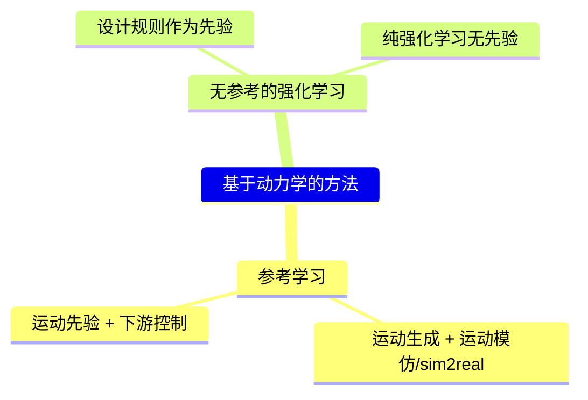

# P3 任务：Application/Locomotion.md 动力学方法章节完善

> **最后更新**: 2026-04-04
>
> 本文档记录 Application/Locomotion.md 中「基于动力学的方法」章节的完善计划。

---

## 问题描述

**位置**: `Application/Locomotion.md` 第 377-384 行

**当前内容**:
```markdown
|ID|Year|Name|解决了什么痛点 | 主要贡献是什么|Tags|Link|
|---|---|---|---|---|---|---|
||2023.10.18|Interactive Locomotion Style Control for a Human Character based on Gait Cycle Features| 没有下载 |
||2023.10.18|Interactive Locomotion Style Control for a Human Character based on Gait Cycle Features|
||2022.5.12|AMP: Adversarial Motion Priors for Stylized Physics-Based Character Control|
||2020.7.26|**Feature-based locomotion controllers**|
||2018.4.8|DeepMimic: Example-Guided Deep Reinforcement Learning of Physics-Based Character Skills|
||2010|Real-time planning and control for simulated bipedal locomotion|
```

**问题**:
1. 表格行大部分是空的，只有论文标题
2. 有重复条目（2023.10.18 那行出现了两次）
3. 第一行标注"没有下载"，说明论文不可用
4. DeepMimic、AMP 等重要论文在 ReadPapers 中有详细笔记，这里应该添加链接

---

## 修改建议

### TODO-1: 清理重复和无效条目

**建议删除**:
- `2023.10.18 Interactive Locomotion Style Control...` (重复且没有下载)

- [ ] 同意修改
- [ ] 需要调整
- [ ] 跳过

---

### TODO-2: 为 DeepMimic/AMP 添加 ReadPapers 链接

**ReadPapers 已有笔记**:
- DeepMimic: [201.md](https://caterpillarstudygroup.github.io/ReadPapers/201.html)
- AMP: [198.md](https://caterpillarstudygroup.github.io/ReadPapers/198.html)
- ASE: [199.md](https://caterpillarstudygroup.github.io/ReadPapers/199.html)

**建议修改为**:
```markdown
|ID|Year|Name|解决了什么痛点 | 主要贡献是什么|Tags|Link|
|---|---|---|---|---|---|---|
|201|2018.4.8|[DeepMimic](https://caterpillarstudygroup.github.io/ReadPapers/201.html)|物理仿真角色跟随机动作|RL+ 模仿学习，第一个端到端的物理角色动画深度 RL 方法|多快好|[link](https://caterpillarstudygroup.github.io/ReadPapers/201.html)|
|198|2020.5.12|[AMP](https://caterpillarstudygroup.github.io/ReadPapers/198.html)|模仿学习目标函数难设定|对抗运动先验，不模仿特定动作而模仿风格|多快好|[link](https://caterpillarstudygroup.github.io/ReadPapers/198.html)|
|199|2021.8.15|[ASE](https://caterpillarstudygroup.github.io/ReadPapers/199.html)|每个任务都要单独训练|预训练技能库 + 下游任务微调|多快省|[link](https://caterpillarstudygroup.github.io/ReadPapers/199.html)|
```

- [ ] 同意修改
- [ ] 需要调整
- [ ] 跳过

---

### TODO-3: 补充「基于动力学的方法」的概述

**建议添加内容**:
```markdown
## 基于动力学的方法

**核心特征**: 输出为**关节力矩或 PD 控制目标**，需要物理仿真器执行。



**与运动学方法的区别**:

| 维度 | 运动学方法 | 动力学方法 |
|------|-----------|-----------|
| **输出** | 关节姿态/速度 | 关节力矩/PD 控制目标 |
| **物理仿真** | 否 | 是 |
| **抗扰动能力** | 无 | 有 |
| **训练成本** | 低 | 高 |
| **实时性** | 高 | 中 |
```

- [ ] 同意修改
- [ ] 需要调整
- [ ] 跳过

---

## 执行顺序建议

```
1. TODO-1: 清理重复和无效条目
2. TODO-2: 为 DeepMimic/AMP/ASE 添加链接
3. TODO-3: 补充概述（可选）
4. Git 提交
```
