P2   
# Outline   

 - Simulating & Actuating Characters   
    - Joint torques   
    
 - PD (Proportional-Derivative) control   

> &#x2705; 在仿真基础之上，如何驱动角色动画，如何动得更好，更真实。   
> &#x2705;（1）控制力如何施加到角色身上   
> &#x2705;（2）如何计算控制力   

P4   
# Recap

## Dynamics of a Point Mass

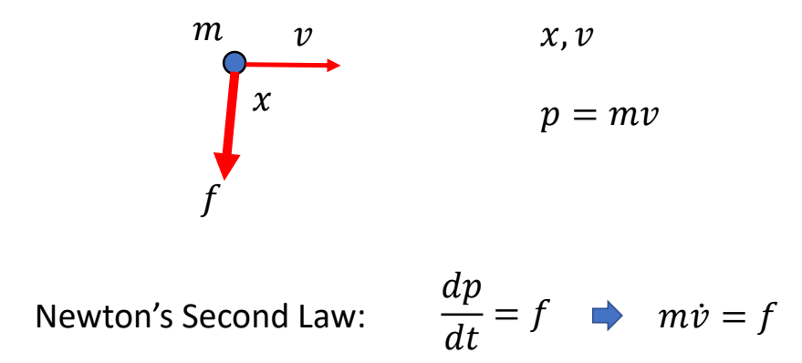

P10  
## Rigid Body Dynamics   

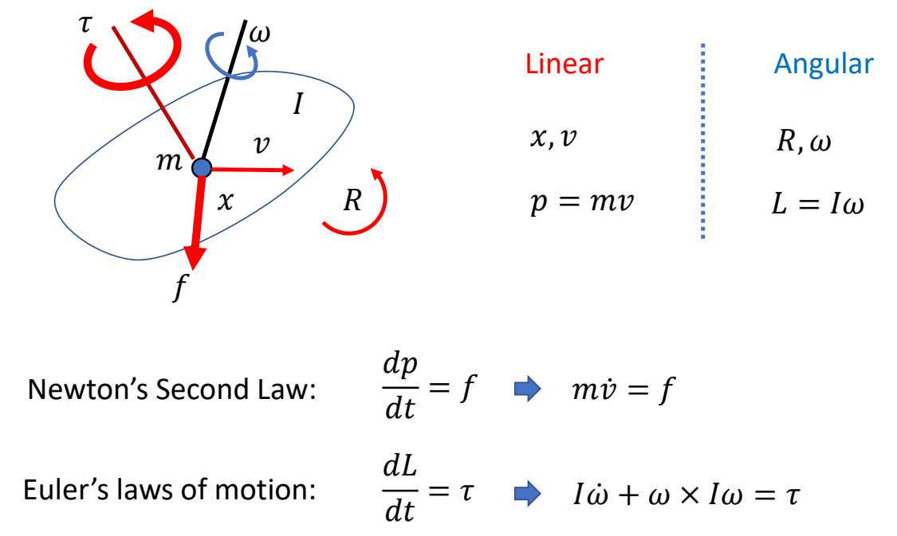   

$$
\begin{bmatrix}
 mI_3 & 0\\\\
 0 & I
\end{bmatrix}\begin{bmatrix}
\dot{v}  \\\\
\dot{\omega }
\end{bmatrix}+\begin{bmatrix}
 0\\\\
\omega \times I\omega 
\end{bmatrix}=\begin{bmatrix}
f \\\\
\tau 
\end{bmatrix}
$$

P12   

Masses: \\(m,I\\)    
Kinematics:  \\(x,v,R,\omega \\)   

Geometry:    
• Box, Sphere, Capsule, Mesh, …    
• Collision detection   
• Compute \\(m,I\\)    

> &#x2705; 在物理引擎里面定义一个刚体，需要提供这些参数。   

P14   
## Dynamics of Articulated Rigid Bodies   

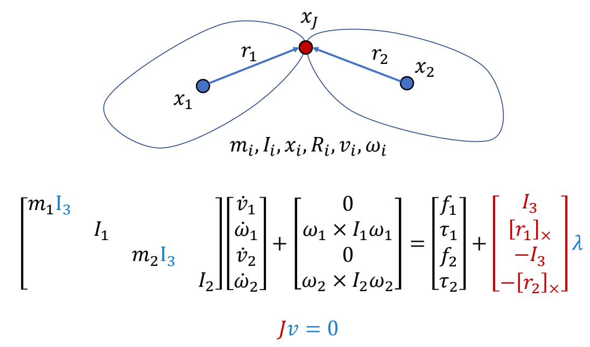  

> &#x2705; 两个独立刚体，和一个不让它们断开的约束。    

P15  

$$
M\dot{v} +C(x,v)  =f+J^T\lambda
$$

P16   
## Simulation of a Rigid Body System

# Simulating & Actuating Characters

P17   
## Defining a Simulated Character  

Rigid bodies:    
 - \\(m_i,I_i,x_i,R_i\\)     
 - Geometries    

Joints:   
 - Position   
 - Type   
> &#x2705; Type指关节的类型，例如 Hint、Universal等。它决定了约束方程。   
 - Bodies   

> &#x2705; 关节的数量比刚体的数量少1  

> &#x2705; 仿真过程中通常使用简单几何体代替 Mesh. 为了便于碰撞检测的计算，以及辨别里外。   

P19   
## Simulating a Character Pipeline  

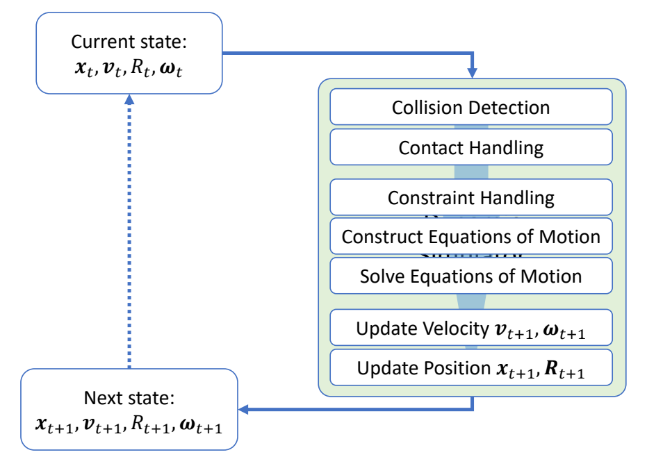

> &#x2705; 这个仿真流程是 ragdoll 效果。   

P22   
## Actuating a Rigid Body

> &#x2705; 想让角色做指定动作，不能直接修改其状态，而是控制力影响状态。  

|||
|---|---|
|力加在质心上|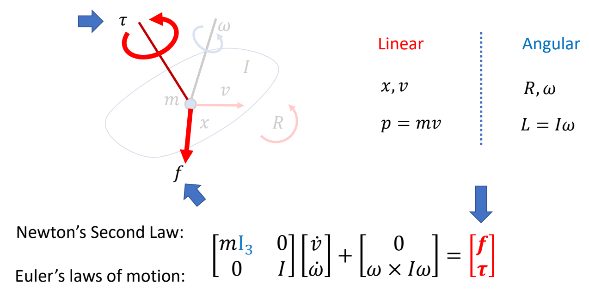|
|&#x2705; 在物体边缘旋加力，等价于在质心旋加力，并旋加一个导致旋转的力矩。  | |
|&#x2705; 在质心上施加一个力矩，等价于施加一对大小相同方向相反的力。在质心处的合力为零，不会产生位移，只会产生旋转。  &#x2705; 力矩只是数学上的概念。||

P26   
## Actuating Articulated Rigid Bodies

|||
|---|---|
|&#x2705; 为了驱动角色，可以单独对每个刚体施加力或力矩。||
|&#x2705; 也可以在关节上施加力矩。|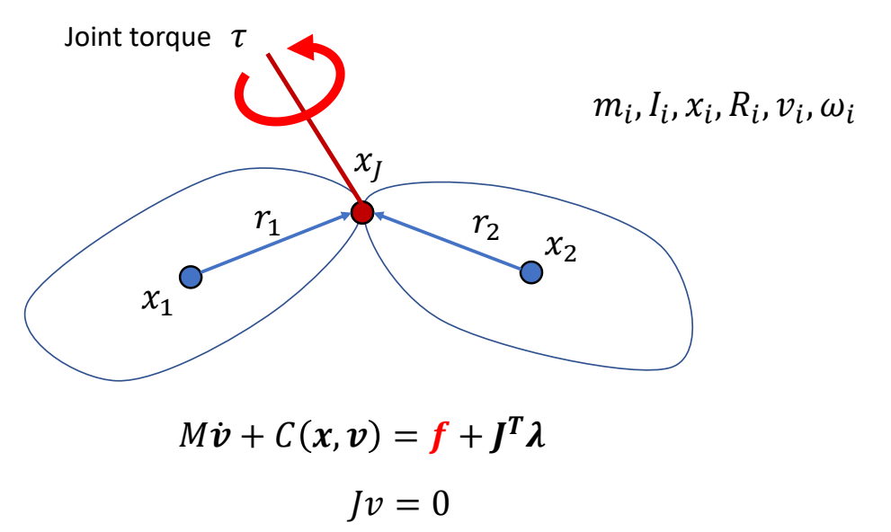|

P29   
## Joint Torques  

What is a joint torque?   
How is a joint torque applied?   

> &#x2705; 回顾前面公式，力和力矩都是施加在刚体上的，如何施加在关节上?   

P33  
### 什么是Joint Torques

> &#x2705; 关节上的力矩，可以看作是一个刚体对另一个刚体在关节处施加的成对的力，其合力为零，但可以转化为对另一刚体的力矩。   

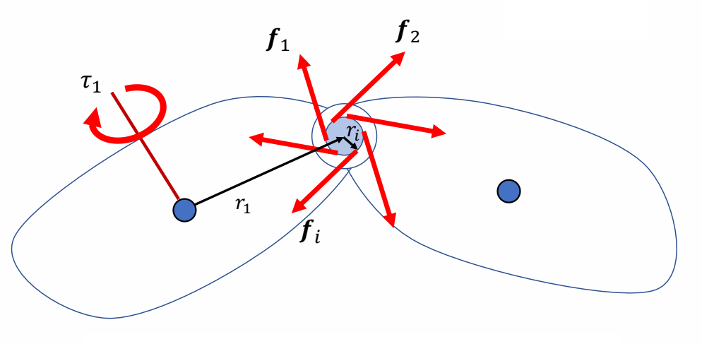

$$
\sum_{i}^{} f_i=0
$$

> &#x2705; 每个力都会对其中一个刚体的质心上产生力矩。  

$$
\tau _1= \sum _ {i}^{} (r_1+r_i) \times f_i=r_1 \times \sum _ {i}^{}f_i + \sum _ {i}^{}r_i \times f_i
$$

P34   
由于

$$
\sum _ {i}^{}  f_i=0
$$

得： 

$$
\tau _1= \sum _ {i}^{} r_i \times f_i \quad \quad \quad \quad \tau _2= -\sum _ {i}^{} r_i \times f_i
$$

> &#x2705; 另一个方向同理。   
> &#x2705; 力矩跟关节的内置没有关系。  

P36   
结论：
 

> &#x2705; 在关节上施加力矩 \\( \tau\\) 等价于在一个刚体上施加 \\( \tau\\)，在另一个刚体上施加 \\(- \tau\\).    

P38  
### 怎样施加Joint Torques

Applying a joint torque \\( \tau\\):   
 - Add \\( \tau\\) to one attached body    
 - Add \\( -\tau\\) to the other attached body    

$$
M\begin{bmatrix}
 \dot{v}_1 \\\\
\dot{\omega }_1 \\\\
\dot{v}_2\\\\
\dot{\omega }_2 
\end{bmatrix} + \begin{bmatrix}
 0\\\\
\omega_1 \times I_1 \omega _1\\\\
0\\\\
\omega_2 \times I_2 \omega _2
\end{bmatrix}=\begin{bmatrix}
0 \\\\
\tau \\\\
0 \\\\
-\tau 
\end{bmatrix}+J^T\lambda 
$$

$$
Jv=0
$$

> &#x2705; 通常在子关节上加 \\(\tau \\)，在父关节上加 \\(-\tau \\)． 

P40   
## Simulating + Controlling a Character

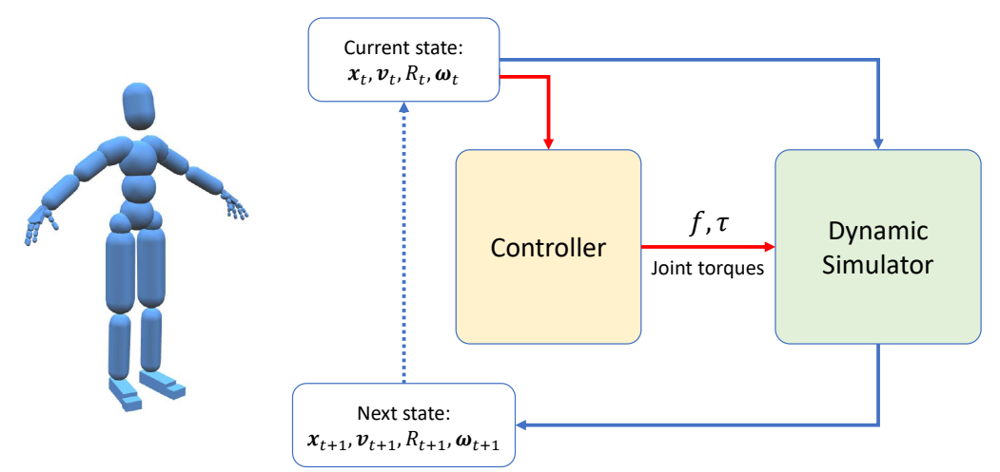

> &#x2705; 控制器，根据当前角色状态，以及额外控制信号实时计算出 \\(f \\) 和 \\(\tau \\)，影响角色动作变化。   

P44   
### Forward Dynamics vs. Inverse Dynamics
  

> &#x2705; 前向与后向，是一个运动方程的两种用法。  
> &#x2705; 仿真器为前向部分，控制后逆向部分。  

P46   

### Fully-Actuated vs. Underactuated

|||
|--|--|
|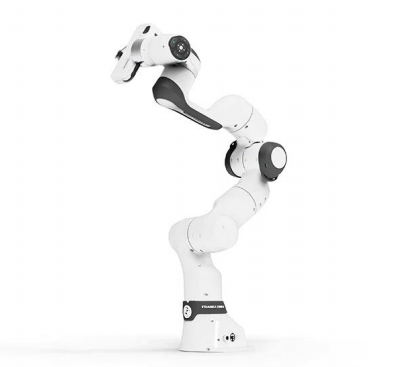 | |
|If #actuators ≥ #dofs, the system is **fully-actuated** | If #actuators < #dofs, the system is **underactuated** |
|For any \\([x,v,\dot{v} ]\\), there exists an \\(f\\) that produces the motion|For many \\([x,v,\dot{v} ]\\) , there is no such \\(f\\) that produces the motion|
|&#x2705; 可以精确控制机械臂到达目标状态。|&#x2705; 不借助外力情况，人无法控制 Hips 的状态（位置）。|

> &#x2705; ＃actuators：\\(f \\) 和 \\(\tau \\) 的自由度。  
> &#x2705; #dofs：角色状态的自由度。   
> &#x2705; 避免让角色掉入无法控制的状态。   

P49   

### Feedforward vs. Feedback   

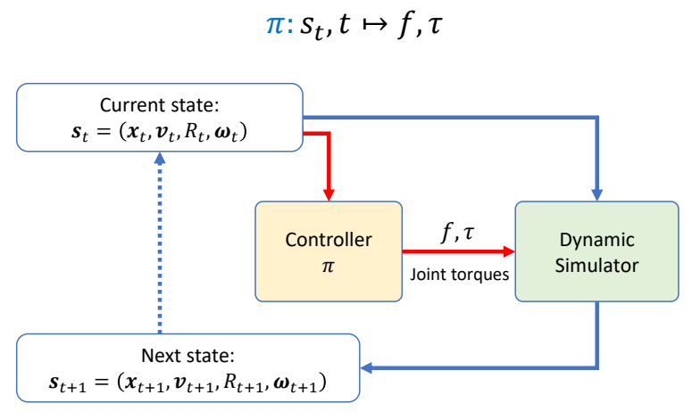

|Feedforward control|Feedback control|
|---|---|
|\\(f,\tau =\pi (t)\\)|\\(f,\tau =\pi (s_t,t)\\)|
|Apply predefined control signals **without considering the current state** of the system|Adjust control signals based on the current state of the system|
|Assuming unchanging system.|Certain perturbations are expected.|
|Perturbations may lead to unpredicted results &#x2705; 如果角色受到挠动而偏离了原计划，无法修正回来。|The feedback signal will be used to improves the performance at the next state.|

P55   
# Proportional-Derivative Control

> &#x2705; 有反馈，但还是算是前向控制，因为反馈的部分和想控制的部分不完全一致。   

## 简化问题分析

### 问题描述

Compute force \\(f\\) to move the object to the target height    

> &#x2705; 例子：物体只能沿竿上下移动，且受到重力。  
> &#x2705; 控制目的：设计控制器，使物体在控制力的作用下达到目标高度。   

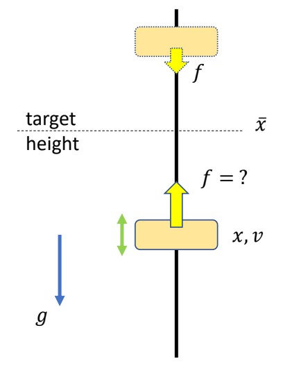

### 使用比例控制

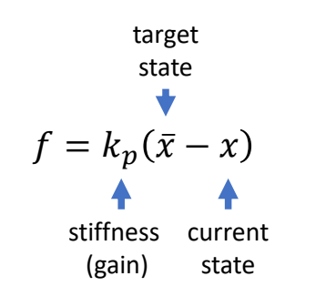

实际上：会产生上下振荡，不会停在目标位置。

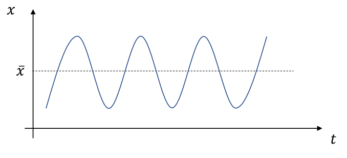

P56   
### 比例控制+Damping

> &#x2705; 改进：如果物体已有同方向速度，则力加得小一点。  

P57   

### 比例微分控制

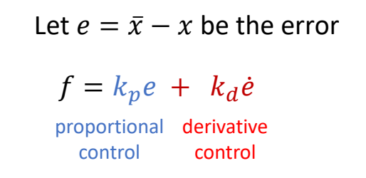

> &#x2705; 第一项：比例控制；第二项：微分控制   

P59   
> &#x2705; 存在的问题：为了抵抗重力，一定会存在这样的误差。

   
P60   

Increase stiffness \\(k_p\\) reduces the steady-state error, but can make the system too stiff and numerically unstable    

> &#x2705; 增加 \\(k_p\\) 可以减小误差，但会让人看起来很僵硬。  

P61   
### 比例积分微分控制 Proportional-Integral-Derivative controller 

  
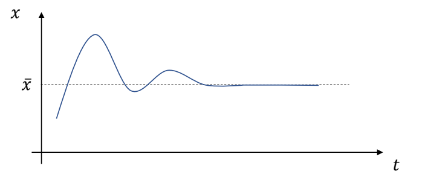  

> &#x2705; 解决误差方法：积分项。   
> &#x2705; 但角色动画通常不用积分项。   
> &#x2705; 积分项跟历史相关，会带来实现的麻烦和控制的不稳定。  

P62   
## PD Control for Characters

> &#x2705; 前面是 PD 的例子，这里是 PD 在物理仿真角色上的应用，计算在每个关节上施加多少力矩。   

> &#x2705; 通常目标的速度 \\(\bar{q} = 0\\).   

因此：  

P63  
### PD Control for Characters的参数和效果

> &#x2705; \\(K_p\\) 太小：可能无法达到目标状态。   
> &#x2705; \\(K_p\\) 太大：人体很僵硬。  
> &#x2705; \\(k_d\\) 太小：动作有明显振荡。    
> &#x2705; \\(k_d\\) 太大，要花更多时间到达目标资态。   

P66  
## Tracking Controllers

> &#x2705; 引入PD Control之后，控制本质上变成了设计 targer state．   

   

P67  
### Full-body Tracking Controllers

   

> &#x2705; 设计角色的目标轨迹。  
> &#x2705; 直接用 PD 控制跟踪动捕数据会有很大的问题，原因：   
> （1）稳态误差。  
> （2）运动轨迹跟原轨迹之间会相差一点点相位  
> （3）欠驱动系统，有一点点误差，后面无法修复。  

P71  
### feedforward ？ feedback

Is PD control a **feedforward** control?   
a **feedback** control?   

> &#x2705; 是反馈控制，因为计算 \\(\tau \\) 时使用了当前状态 \\(q\\)．  
> &#x2705; 是前馈控制，因为在 PD 系统里，状态是位置不是 \\(q\\).   

P72   
## 欠驱动系统

### 欠驱动系统的问题

由于是欠驱动系统，Tracking Mocap with Joint Torques会遇到问题，因为：   

\\(\tau _j\\): joint torques   
Apply \\(\tau _j\\) to “child” body    
Apply \\(-\tau _j\\) to “parent” body   
**All forces/torques sum up to zero**   

> &#x2705; 合力为零，无法控制整体的位置和朝向。   

P73  
### 解决方法：增加净外力

\\(f_0,\tau _0\\): root force / torque    
\\(\quad\quad\\)Apply \\(f_0\\) to the root body    
\\(\quad\quad\\)Apply \\(\tau _0\\) to the root body   
\\(\quad\quad\\)Non-zero net force/torque on the character!  

> &#x2705; 净外力，无施力者，用于帮助角色保持平衡。   
> &#x2705; 缺点：让角色看起来像提线木偶。   

P75   
## Mixture Simulation and Mocap

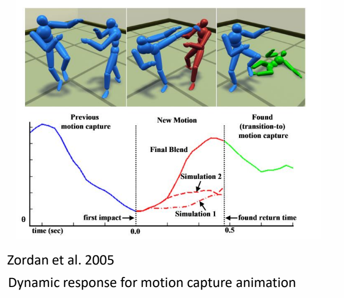

> &#x2705; 关键帧与仿真的混合。  

---------------------------------------
> 本文出自CaterpillarStudyGroup，转载请注明出处。
>
> https://caterpillarstudygroup.github.io/GAMES105_mdbook/