# Lecture 09

P2   
## Outline   

 - Simulating & Actuating Characters   
    - Joint torques   
    
 - PD (Proportional-Derivative) control   

> &#x2705; 在仿真基础之上，如何驱动角色动画，如何动得更好，更真实。   
> &#x2705;（1）控制力如何施加到角色身上   
> &#x2705;（2）如何计算控制力   

P4   
## Recap: Dynamics of a Point Mass

P10  
## Recap: Rigid Body Dynamics   

   

P11   
## Recap: Rigid Body Dynamics

$$
\begin{bmatrix}
 mI_3 & 0\\\\
 0 & I
\end{bmatrix}\begin{bmatrix}
\dot{v}  \\\\
\dot{\omega }
\end{bmatrix}+\begin{bmatrix}
 0\\\\
\omega \times I\omega 
\end{bmatrix}=\begin{bmatrix}
f \\\\
\tau 
\end{bmatrix}
$$

P12   
## Defining a Rigid Body

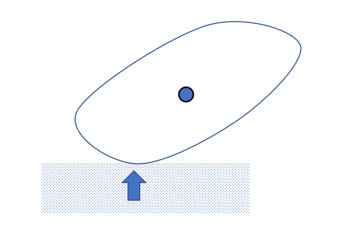

Masses: \\(m,I\\)    
Kinematics:  \\(x,v,R,\omega \\)   

Geometry:    
• Box, Sphere, Capsule, Mesh, …    
• Collision detection   
• Compute \\(m,I\\)    

> &#x2705; 在物理引擎里面定义一个刚体，需要提供这些参数。   

P14   
## Recap: Dynamics of Articulated Rigid Bodies   

  

> &#x2705; 两个独立刚体，和一个不让它们断开的约束。    

P15  
## Recap: Dynamics of Articulated Rigid Bodies

$$
M\dot{v} +C(x,v)  =f+J^T\lambda
$$

P16   
## Recap: Simulation of a Rigid Body System

P17   
## Defining a Simulated Character  

Rigid bodies:    
 - \\(m_i,I_i,x_i,R_i\\)     
 - Geometries    

Joints:   
 - Position   
 - Type   
 - Bodies   

> &#x2705; 仿真过程中通常使用简单几何体代替 Mesh. 为了便于碰撞检测的计算，以及辨别里外。   
> &#x2705; Type决定了约束方程。   
> &#x2705; Type指关节的类型，例如Hint、Universal等。    

P19   
## Simulating a Character   

> &#x2705; 这个仿真流程是ragdoll效果。   

P22   
## Actuating a Rigid Body

> &#x2705; 想让角色做指定动作，不能直接修改其状态，而是控制力影响状态。  

P23  
## Actuating a Rigid Body   

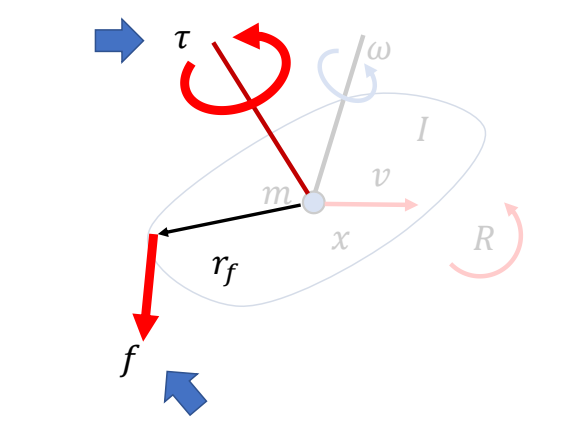

> &#x2705; 在物体边缘旋加力，等价于在质心旋加力，并旋加一个导致旋转的力矩。  

P24   
## Actuating a Rigid Body

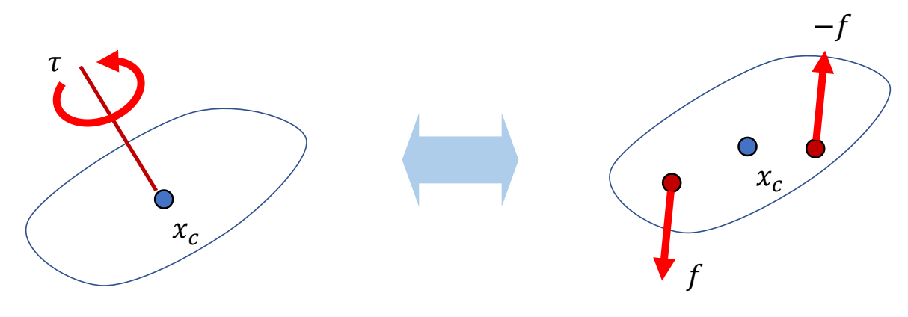

> &#x2705; 施加一个力矩，等价于施加一对大小相同方向相反的力。在质心处的合力为零，不会产生位移，只会产生旋转。   
> &#x2705; 力矩只是数学上的概念。

P26   
## Actuating Articulated Rigid Bodies

> &#x2705; 为了驱动角色，可以单独对每个刚体施加力或力矩。  

P27  
## Actuating Articulated Rigid Bodies

> &#x2705; 也可以在关节上施加力矩。  

P29   
## Joint Torques  

What is a joint torque?   
How is a joint torque applied?   

> &#x2705; 回顾前面公式，力和力矩都是施加在刚体上的，如何施加在关节上。   

P33  
## Joint Torques

$$
\sum_{i}^{} f_i=0
$$

$$
\tau _1= \sum _ {i}^{} (r_1+r_i) \times f_i=r_1 \times \sum _ {i}^{}f_i + \sum _ {i}^{}r_i \times f_i
$$

> &#x2705; 关节上的力矩，可以看作是一个刚体对另一个刚体在关节处施加的成对的力，其合力为零，但可以转化为对另一刚体的力矩。   

P34   
## Joint Torques  

$$
\sum _ {i}^{}  f_i=0
$$

$$
\tau _1= \sum _ {i}^{} r_i \times f_i
$$

P35  
## Joint Torques

$$
\sum _ {i}^{}  f_i=0
$$

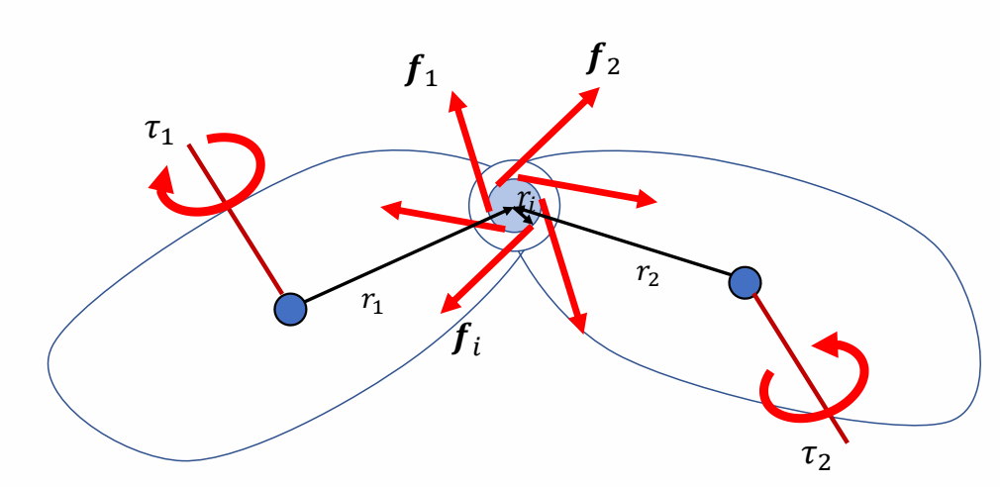

$$
\tau _1= \sum _ {i}^{} r_i \times f_i \quad \quad \quad \quad \tau _2= -\sum _ {i}^{} r_i \times f_i
$$

> &#x2705; 另一个方向同理。   

P36   
## Joint Torques
 
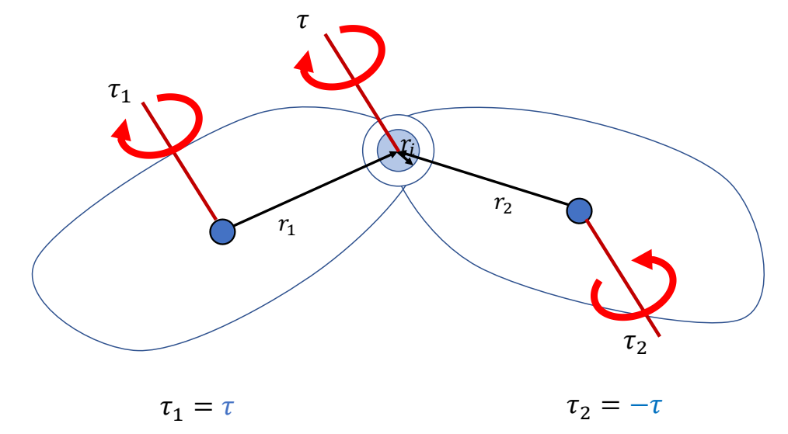

> &#x2705; 在关节上施加力矩 \\( \tau\\) 等价于在一个刚体上施加\\( \tau\\)，在另一个刚体上施加\\(- \tau\\).    

P38  
## Joint Torques

Applying a joint torque \\( \tau\\):   
 - Add \\( \tau\\) to one attached body    
 - Add \\( -\tau\\) to the other attached body    

$$
M\begin{bmatrix}
 \dot{v}_1 \\\\
\dot{\omega }_1 \\\\
\dot{v}_2\\\\
\dot{\omega }_2 
\end{bmatrix} + \begin{bmatrix}
 0\\\\
\omega_1 \times I_1 \omega _1\\\\
0\\\\
\omega_2 \times I_2 \omega _2
\end{bmatrix}=\begin{bmatrix}
0 \\\\
\tau \\\\
0 \\\\
-\tau 
\end{bmatrix}+J^T\lambda 
$$

$$
Jv=0
$$

> &#x2705; 通常在子关节上加\\(\tau \\)，在父关节上加\\(-\tau \\)． 

P40   
## Simulating + Controlling a Character

> &#x2705; 控制器，根据当前角色状态，以及额外控制信号实时计算出 \\(f \\) 和 \\(\tau \\)，影响角色动作变化。   

P44   
## Forward Dynamics vs. Inverse Dynamics
  

P46   

## Fully-Actuated vs. Underactuated

|||
|--|--|
| | 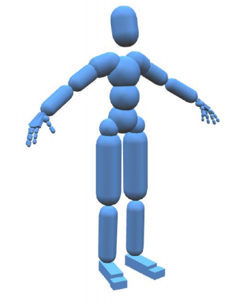|
|If #actuators ≥ #dofs, the system is **fully-actuated** | If #actuators < #dofs, the system is **underactuated** |

> &#x2705; ＃actuators：\\(f \\) 和 \\(\tau \\) 的自由度。  
> &#x2705; #dofs：角色状态的自由度。   
> &#x2705; 左图：可以精确控制机械臂到达目标状态。   
> &#x2705; 右图：不借助外力情况，人无法控制Hips的位移。   
> &#x2705; 避免让角色掉入无法控制的状态。   

P47   
 
## Fully-Actuated vs. Underactuated

For any \\([x,v,\dot{v} ]\\), there exists an \\(f\\) that produces the motion

For many \\([x,v,\dot{v} ]\\) , there is no such \\(f\\) that produces the motion

> &#x2705; 无法直接更改根关节状态。    

P49   

## Feedforward vs. Feedback   

Feedforward control:   
$$
f,\tau =\pi (t)
$$

 - Apply predefined control signals **without considering the current state** of the system   
 - Assuming unchanging system.    
   Perturbations may lead to unpredicted results   

> &#x2705; 如果角色受到挠动而偏离了原计划，无法修正回来。   

P50  
 
## Feedforward vs. Feedback   

Feedforward control:   
$$
f,\tau =\pi (s_t,t)
$$

 - Adjust control signals based on the current state of the system
 - Certain perturbations are expected.    
   The feedback signal will be used to improves the performance at the next state.   

P55   
## Proportional-Derivative Control

> &#x2705; 有反馈，但还是算是前向控制，因为反馈的部分和想控制的部分不完全一致。   
> &#x2705; 例子：物体只能沿竿上下移动，且受到重力。  
> &#x2705; 控制目的：控制力是物体达到目标高度。   
> &#x2705; 实际上：会产生上下振荡，不会停在目标位置。   
> &#x2705; ［＠］增加内容    

P56   
## Proportional-Derivative Control

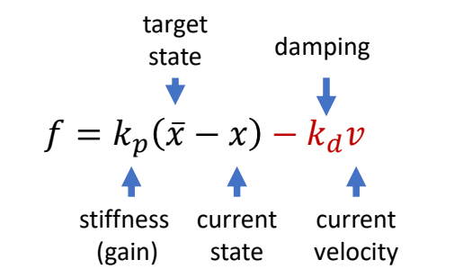

> &#x2705; 改进：如果物体已有同方向速度，则力加得小一点。  

P57   
> &#x2705; 第一项：比例控制；第二项：微分控制
［＠加一页   

P59   
## Proportional-Derivative Control

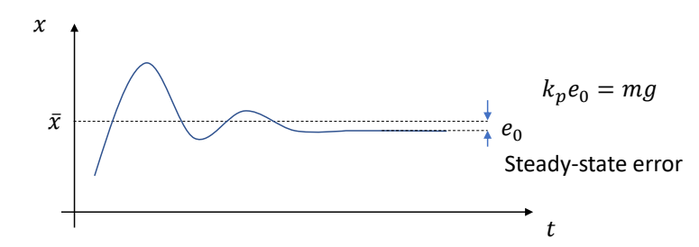

> &#x2705; 存在的问题：为了抵抗重力，一定会存在这样的误差。   
> &#x2705; 增加\\(K_p\\)可以减小误差，但会让人看起来很僵硬。  

P60   

## Proportional-Derivative Control

Increase stiffness \\(k_p\\) reduces the steady-state error, but can make the system too stiff and numerically unstable    

 

P61   
## Proportional-Integral-Derivative controller 

  
  

> &#x2705; 解决误差方法：积分项。   
> &#x2705; 但角色动画通常不用积分项。   
> &#x2705; 积分项会带来实现的麻烦和控制的不稳定。  

P62   
## PD Control for Characters

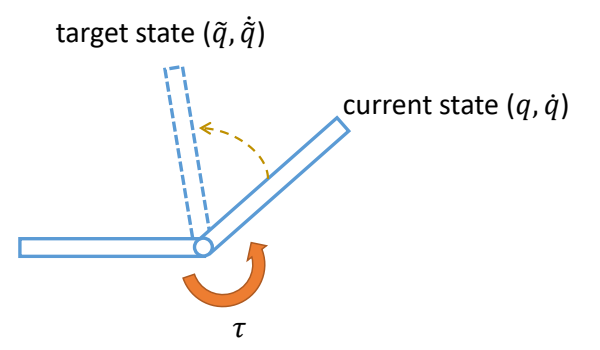

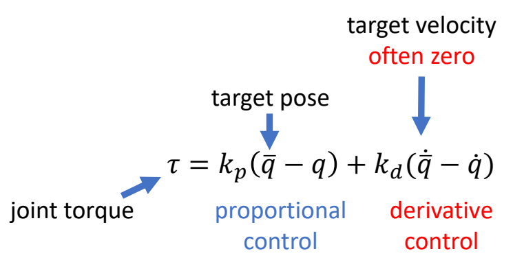

> &#x2705; 前面是PD的例子，这里是PD在物理仿真角色上的应用，计算在每个关节上施加多少力矩。   
> &#x2705; 通常目标的速度 \\(\bar{q} = 0\\).   

P63  
## PD Control for Characters

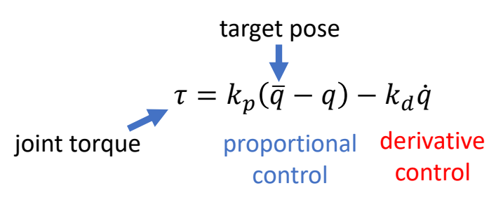

> &#x2705; \\(K_p\\) 太小：可能无法达到目标状态。   
> &#x2705; \\(K_p\\) 太大：人体很僵硬。  
> &#x2705; \\(k_d\\) 太小：动作有明显振荡。    
> &#x2705; \\(k_d\\) 太大，要花更多时间到达目标资态。   

P66  
## Tracking Controllers

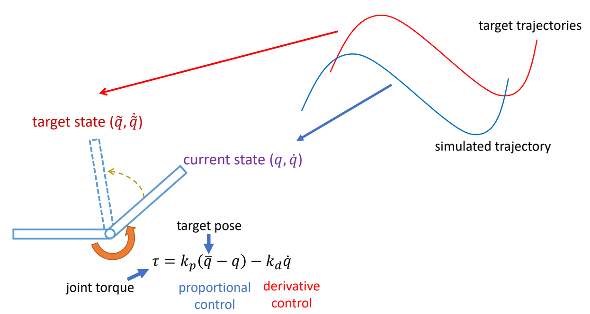   

> &#x2705; 设计targer state．   

P67  
## Full-body Tracking Controllers

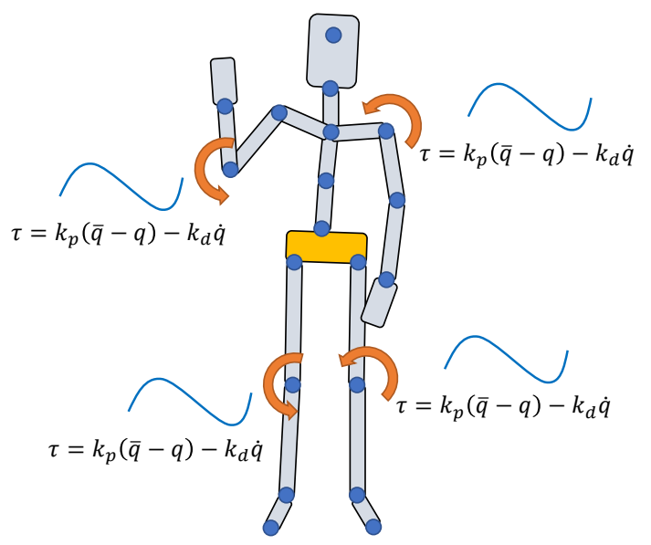   

> &#x2705; 设计角色的目标轨迹。  
> &#x2705; 直接用PD控制跟踪动捕数据会有很大的问题，原因：   
> &#x2705;（1）稳态误差。  
> &#x2705;（2）欠驱动系统，有一点点误差，后面无法修复。  

P71  
## Full-body Tracking Controllers

Is PD control a **feedforward** control?   
a **feedback** control?   

> &#x2705; 是反馈控制，因为计算 \\(\tau \\) 时使用了当前状态 \\(q\\)．  
> &#x2705; 是前馈控制，因为在PD系统里，状态是位置不是 \\(q\\).   

P72   
## Tracking Mocap with Joint Torques   

\\(\tau _j\\): joint torques   
Apply \\(\tau _j\\) to “child” body    
Apply \\(-\tau _j\\) to “parent” body   
**All forces/torques sum up to zero**   

> &#x2705; 合力为零，无法控制整体的位置和朝向。   

P73  
## Tracking Mocap with Root Forces/Torques

\\(f_0,\tau _0\\): root force / torque    
\\(\quad\quad\\)Apply \\(f_0\\) to the root body    
\\(\quad\quad\\)Apply \\(\tau _0\\) to the root body   
\\(\quad\quad\\)Non-zero net force/torque on the character!  

> &#x2705; 净外力，无施力者，用于帮助角色保持平衡。 
> &#x2705; 缺点：让角色看起来像提线木偶。   

P75   
## Mixture Simulation and Mocap

> &#x2705; 关键帧与仿真的混合。  

---------------------------------------
> 本文出自CaterpillarStudyGroup，转载请注明出处。
>
> https://caterpillarstudygroup.github.io/GAMES105_mdbook/