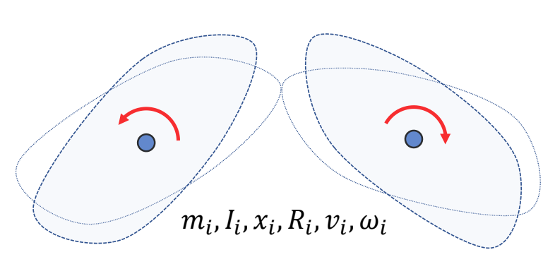

P91   
# Articulated Rigid Bodies
## A System with Two Links    

两个独立刚体的仿真   

> &#x2705; 两个刚体的场景，如果两个刚体独立，可以以矩阵的方式扩展。  
> &#x2705; 物体在力的作用下的物理状态的更新公式．见 GAMES 103．   
> &#x2705; 每一行是独立的，联立起来为方程组。   

以上公式会简化为：

$$
M\dot{v} +C(x,v)=f
$$

> &#x2705; 第二项是关于x和v的函数，x体现在\\(\omega\\)，v体现在I。  

P93   

> &#x2705; 结果是两个物体会分开。  

P95  
## A System with Two Links and a Joint

$$
M\dot{v} +C(x,v)=f+f_J
$$

> &#x2705; 两个物体中间有一个关节通过在关节处添加旋转力\\(f_J\\)的方法来约束两个物体不能分开。但 \\(f_J\\) 是未知的。   

---------------------------------------
> 本文出自CaterpillarStudyGroup，转载请注明出处。
>
> https://caterpillarstudygroup.github.io/GAMES105_mdbook/