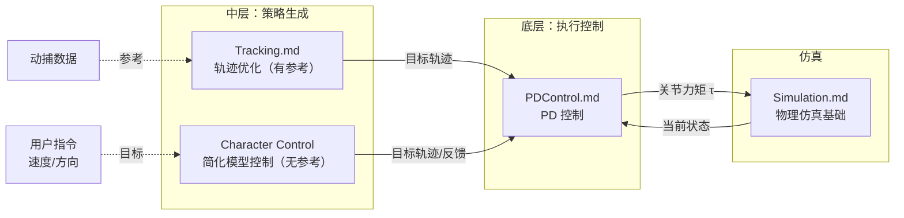

# 角色控制技术

> &#x2705; **本章定位**：理解如何**不依赖参考轨迹**，基于**简化模型和反馈规则**实现稳定的双足行走。

---

## 在控制系统中的位置



---

## 与前面章节的关系

### 三层控制的关系

| 层次 | 章节 | 输入 | 输出 | 特点 |
|------|------|------|------|------|
| **底层** | PD 控制 | 目标状态 + 当前状态 | 关节力矩 τ | 需要调参、有稳态误差 |
| **中层①** | 轨迹优化 | 参考轨迹（动捕） | 修正后的目标轨迹 | 精确跟踪、无法泛化 |
| **中层②** | 角色控制 | 用户指令（速度/方向） | 目标轨迹/反馈 | 无参考、可泛化、只能走路 |

### 轨迹优化 vs 角色控制

| 维度 | 轨迹优化 (Tracking) | 角色控制 (Character Control) |
|------|---------------------|-----------------------------|
| **参考轨迹** | 需要（动捕数据） | 不需要 |
| **方法** | 优化方法（CMA-ES、SAMCON） | 简化模型（ZMP、IPM、SIMBICON） |
| **输出** | 完整的关节目标轨迹 | 简单的反馈规则/步态参数 |
| **动作质量** | 高（来自动捕） | 低（像机器人） |
| **泛化能力** | 差（只能做学过的动作） | 中（可以走不同速度/方向） |
| **应用场景** | 动作复现 | 实时行走控制 |

---

## 为什么需要这一章

**问题**：如果没有动捕数据，如何让角色走路？

**答案**：用简化模型抽象出平衡的本质规律，通过反馈控制实现稳定行走。

### 两种思路对比

**轨迹优化的思路**：
```
动捕数据 → 优化修正 → 跟踪轨迹 → PD 执行
```
- 优点：动作质量高（来自动捕）
- 缺点：依赖数据、无法泛化

**角色控制的思路**：
```
用户指令（速度/方向） → 简化模型 → 生成步态 → PD 执行
```
- 优点：无需参考数据、可实时响应、可泛化到不同速度/方向
- 缺点：动作质量低（像机器人）、只能做简单动作（走路）

### 简化模型方法

| 方法 | 简化什么 | 控制什么 |
|------|---------|---------|
| **ZMP** | 上半身简化为质点 | 控制 ZMP 在支撑多边形内 |
| **IPM（倒立摆）** | 身体简化为杆 + 小车 | 控制落脚点使杆不倒 |
| **SIMBICON** | 步态简化为周期模式 | 加质心反馈修正步态 |

---

## 本章内容导航

| 文件 | 内容 |
|------|------|
| [Learning to Walk](../Learning.md) | 行走基础<br/>- 行走的阶段分析<br/>- 静态平衡 vs 动态平衡 |
| [Zero-Moment Point (ZMP)](../ZMP.md) | ZMP 理论与简化模型<br/>- ZMP 的定义与物理意义<br/>- 倒立摆模型 (IPM)<br/>- 步态规划 |
| [SIMBICON](../SIMBICON.md) | 经典行走控制方法<br/>- 基础步态生成<br/>- 质心反馈控制<br/>- 参数调优 |

---

## 本章重点问题

1. **什么是 ZMP？如何用 ZMP 判断平衡？**
   - ZMP 是地面反作用力的合力作用点
   - 当 ZMP 在支撑多边形内时，角色保持平衡

2. **如何用简化模型规划步态？**
   - 倒立摆模型：身体简化为杆，脚简化为小车
   - 控制落脚点使杆不倒

3. **SIMBICON 如何实现稳定行走？**
   - 基础步态（周期模式）+ 质心反馈
   - 根据质心位置调整落脚点

---

## 后续发展

角色控制是**无参考轨迹行走控制**的入门方法，后续发展：

| 方法 | 与角色控制的关系 |
|------|-----------------|
| **DeepMimic/AMP** | 用强化学习替代手工设计的简化模型 |
| **Motion Matching** | 用数据驱动替代简化模型，但属于运动学方法 |

---

**深入学习**：[DeepMimic](https://caterpillarstudygroup.github.io/ReadPapers/201.html) | [AMP](https://caterpillarstudygroup.github.io/ReadPapers/198.html) | [SIMBICON](http://www.cs.sfu.ca/~kkyin/papers/Yin_SIG07.pdf)
