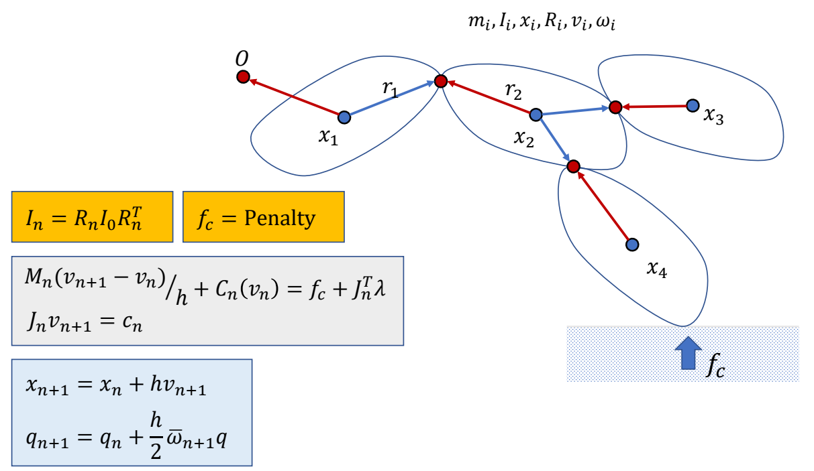

P111   
# Contacts

> &#x2705; 如何处理与地面的接触，让人站在地面上。    

> &#x2705; 要解决的问题：(1) 地面接触检测 (2) 如何对碰撞点施加力，使物体出来。  

P114  
## Penalty-based Contact Model   

### Baseline

$$
f_n=-k_pd-k_dv_{c,\perp }
$$

> &#x2705; \\(d>0\\) 时公式才生效。类似弹簧形式，陷入越深，力越大。   
> &#x2705; 第二项：为了防止落地弹飞，增加阻尼项。  
> &#x2705; 效果：会有一些陷入，但不会陷入太多    
> &#x2757; 支持力竟然不是 \\(-mg\\)。   

P115  
### 考虑摩擦力

> &#x2705; 受力分析：支持力，动摩擦力。   
> &#x2705; 动摩擦力，大小＝支持力 x 摩擦系数，方向与运动方向相反   

$$
\begin{align*}
f_t&=-\mu f_n\frac{v_{c,\parallel }}{||v_{c,\parallel }||} 
\end{align*}
$$

> &#x2705; 一般不模拟静摩擦力   

P116  

### 存在的问题  

> &#x2705; 存在的问题：\\(K_p\\) 必须很大，否则脚陷地明显。\\(K_d\\) 必须非常大，否则地面像蹦床。步长必须非常小，否则不稳定。   

P118  
## Contact as a Constraint

> &#x2705; 另一种方法，把接触建模为约束。  

### 接触点状态分析

接触点 \\(x_c\\) 的位置表示：    
$$
x_c  =x+r_c \quad\quad\quad\quad\quad\quad
$$

接触点 \\(x_c\\) 的速度表示：    

$$
v_c  =v+\omega \times r_c=J_c \begin{bmatrix}
 v\\\\
w
\end{bmatrix}
$$

$$
v_{c,\perp } =v+\omega \times r_c=J_{c,\perp  }\begin{bmatrix}
v \\\\
\omega 
\end{bmatrix}
$$

P120   
### 接触点约束分析

> &#x2705; 约束 1：点在竖直方向的速度必须大于 0，即只能向上移动。      

> &#x2705; 约束 2：力的大小也大于 0．只能推，不能拉。\\(\lambda\\) 是力与速度的大小比例系数。\\(\lambda>0\\) 代表同方向。  

  
> &#x2705; 约束 3：力和速度只能有一个不为零，否则会做功。

$$
v_c\perp \lambda =0
$$

> &#x2705; 合在一起称为线性互补方程，是通常碰撞建模方式。   
> &#x2705; 这个方程比较难解，例如 ODE    

这类问题被称为：(Mixed) Linear Complementary Problem (LCP)   
解LCP的方法有：  
e.g. Lemke's algorithm – a simplex algorithm   

P122   
### 考虑摩擦力的约束问题

How to deal the friction?   

> &#x1F50E; Fast contact force computation for nonpenetrating rigid bodies.    
David Baraff. SIGGRAPH ’94    
> &#x2705; 快速实现静摩擦约束的建模。   

P123  
# Simulation of a Rigid Body System

   

> &#x2705; 把人简化为分段刚体。整体过程为：  
> &#x2705; (1) 黄：计算当前状态。  
> &#x2705; (2) 绿：计算约束，求解，解出下一时刻的速度。   
> &#x2705; (3) 蓝：更新下一时刻的量（积分）。   
> &#x2705; 缺少部分：主动力 \\(f\\) 推动角色产生运动。

---------------------------------------
> 本文出自CaterpillarStudyGroup，转载请注明出处。
>
> https://caterpillarstudygroup.github.io/GAMES105_mdbook/