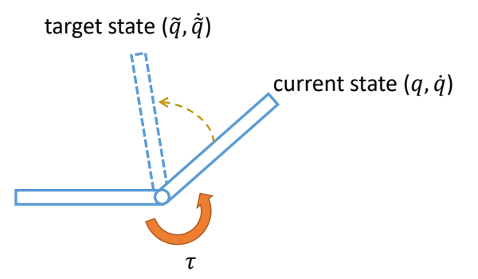
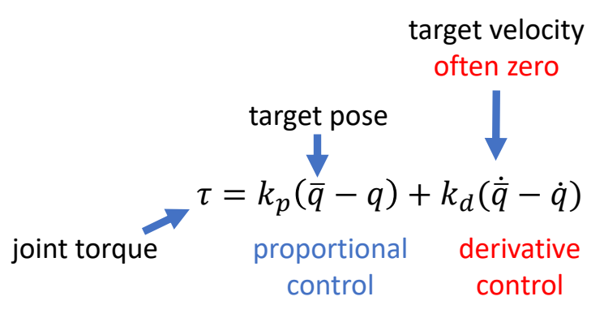
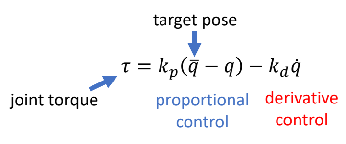
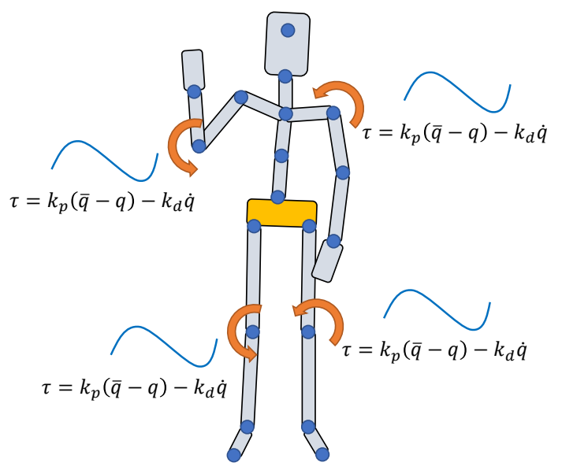
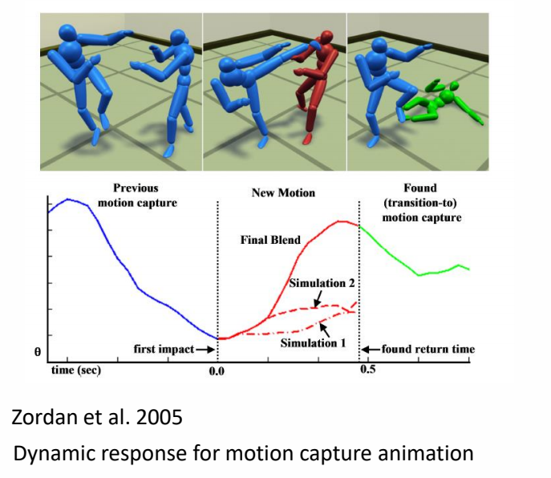

P3
# PD Control for Characters

> &#x2705; 前面是 PD 的例子，这里是 PD 在物理仿真角色上的应用，计算在每个关节上施加多少力矩。

---

## 控制系统层次结构

理解 PD 控制在整个角色控制系统中的位置：

```
┌─────────────────────────────────────────────────────────────┐
│  高层：任务规划 (Task Planning)                              │
│  "做什么动作？什么时候做？"                                   │
│  方法：有限状态机、行为树、任务规划                          │
├─────────────────────────────────────────────────────────────┤
│  中层：轨迹生成/策略学习 (Trajectory/Policy)                 │
│  "如何生成目标动作序列？"                                     │
│  方法：轨迹优化 (CMA-ES/SAMCON)、RL (DeepMimic/AMP/ASE)       │
├─────────────────────────────────────────────────────────────┤
│  底层：执行控制 (Low-level Control)                          │
│  "如何计算关节力矩？"                                         │
│  方法：PD 控制                                                │
└─────────────────────────────────────────────────────────────┘
```

**PD 控制的位置**：
- PD 控制属于**底层执行控制**
- 输入：目标关节位置 $q^*$ 和速度 $\dot{q}^*$
- 输出：关节力矩 $\tau$

**与学习方法的关系**：

```
DeepMimic/AMP/ASE 策略 π(a|s)
         ↓ 输出目标 q*, q̇*
         ↓
    PD 控制器 τ = k_p(q* - q) + k_d(q̇* - q̇)
         ↓ 输出力矩 τ
         ↓
    物理仿真器
```

- DeepMimic/AMP/ASE 是**中层策略**，输出 PD 控制器的目标
- PD 是**底层执行器**，负责跟踪目标

**深入学习**: [DeepMimic 论文笔记](https://caterpillarstudygroup.github.io/ReadPapers/201.html) | [AMP](https://caterpillarstudygroup.github.io/ReadPapers/198.html) | [ASE](https://caterpillarstudygroup.github.io/ReadPapers/199.html)

---






> &#x2705; 通常目标的速度 \\(\dot{\bar{q}}  = 0\\).   

因此：  


   

P63  
### PD Control for Characters的参数和效果

> &#x2705; \\(K_p\\) 太小：可能无法达到目标状态。   
> &#x2705; \\(K_p\\) 太大：人体很僵硬。  
> &#x2705; \\(k_d\\) 太小：动作有明显振荡。    
> &#x2705; \\(k_d\\) 太大，要花更多时间到达目标资态。   

 - Determining gain and damping coefficients can be difficult…   
    - A typical setting \\(k_p\\) = 200, \\(k_d\\) = 20 for a 50kg character   
    - Light body requires smaller gains   
    - Dynamic motions need larger gains

 - High-gain/high-damping control can be unstable, so small times is necessary  
    - \\(h\\) = 0.5~1ms is often used, or 1000~2000Hz   
    - \\(h\\) = 1/120s~1/60s, or 120Hz/60Hz **with Stable PD**   
    - Higher gain/damping requires smaller time step   

P66  


P72   
## 欠驱动系统问题

### 欠驱动系统的问题

由于是欠驱动系统，Tracking Mocap with Joint Torques会遇到问题，因为：   

\\(\tau _j\\): joint torques   
Apply \\(\tau _j\\) to “child” body    
Apply \\(-\tau _j\\) to “parent” body   
**All forces/torques sum up to zero**   


> &#x2705; 合力为零，无法控制整体的位置和朝向。   


P73  
### 解决方法：增加净外力


\\(\tau _j\\): joint torques   
\\(\text{ }\\) Apply \\(\tau _j\\) to “child” body   
\\(\text{ }\\) Apply \\(-\tau _j\\) to “parent” body    
\\(\text{ }\\) All forces/torques sum up to zero   

\\(f_0,\tau _0\\): root force / torque   

\\(\quad\quad\\) Apply \\(f _0\\) to the root body

\\(\quad\quad\\) Apply \\(\tau _0\\) to the root body   

\\(\quad\quad\\) Non-zero net force/torque on the character!   

> &#x2705; 净外力，无施力者，用于帮助角色保持平衡。   
> &#x2705; 缺点：让角色看起来像提线木偶。   

P75   
### 相关工作：Mixture Simulation and Mocap




> &#x2705; 关键帧与仿真的混合。  

P4  
## 稳态误差问题   

PD control computes torques based on **errors**   

### Steady state error   

This arm never reaches the target angle under gravity   

  

在角色上的表现就是 Motion falls behind the reference   


P7   
### 问题原因 

> &#x2705; 前面两个问题的根本原因是相同的，因为需要有误差才能计算force，有了force才能控制。  

High-gain \\((k_p)\\) control is more precise but less stable…   

### 解决方法

> &#x2705; 增大 \\(k_p\\)能缓解以上问题，但大的 \\(k_p\\) 会带来肢体僵硬和计算不稳定。   

P25  
### 相关工作   

> &#x1F50E; 

$$
\tau _{\mathrm{int} }=-K_p(q^n+\dot{q}^n \Delta t-\bar{q} ^{n+1})-K_d(\dot{q} ^n+\ddot{q} ^n \Delta t)
$$

P71  
## feedforward ？ feedback

Is PD control a **feedforward** control?   
a **feedback** control?   


> &#x2705; 是反馈控制，因为计算 \\(\tau \\) 时使用了当前状态 \\(q\\)．  
> &#x2705; 是前馈控制，因为在 PD 系统里，状态是位置不是 \\(q\\).   

---------------------------------------
> 本文出自CaterpillarStudyGroup，转载请注明出处。
>
> https://caterpillarstudygroup.github.io/GAMES105_mdbook/