P2  

# Outline   

 - More about PD (Proportional-Derivative) control   
    - Stable PD control   

 - Feedforward Motion Control   
    - Trajectory optimization   
> &#x2705; 不通过施加净外力，构建物理准确的动画。   

 - Feedback Motion Control   
    - Static balance   

P3  
# PD Control for Characters   

## 基本方法

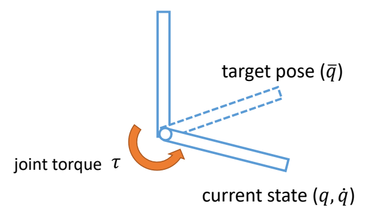

P4  
### 存在的问题   

PD control computes torques based on **errors**   

#### Steady state error   

This arm never reaches the target angle under gravity   

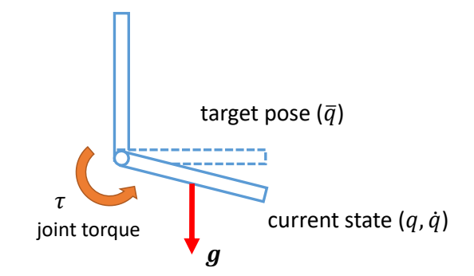  

P5   

#### Motion falls behind the reference   

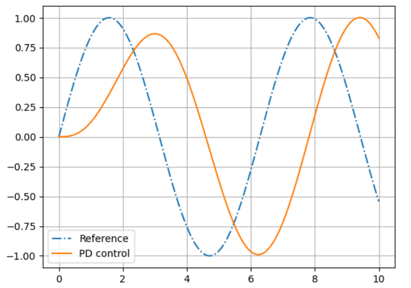

P7   
#### 稳定性

> &#x2705; 前面两个问题的根本原因是相同的，因为需要有误差才能计算force，有了force才能控制。  

High-gain \\((k_p)\\) control is more precise but less stable…   

> &#x2705; 增大 \\(k_p\\)能缓解以上问题，但大的 \\(k_p\\) 会带来肢体僵硬和计算不稳定。   

P8   
## Stability of PD Control

### 以弹簧系统为例子

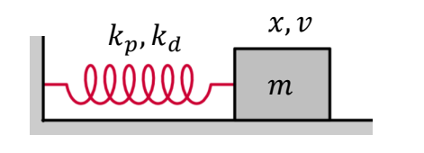

$$
\begin{matrix}
f=-k_px-k_dv \quad\quad\quad\\\\
h: \text{ simulation time step}
\end{matrix}
$$

> &#x2705; PD control 的过程类似于一个弹簧系统。  
> &#x2705; 因此利用弹簧系统中的半隐式欧拉来提升 PD 的稳定性。   

### 半隐式欧拉的弹簧系统

Semi-implicit Euler Integration   

$$
\begin{align*}
v_{n+1}  & =v_n+h\frac{f}{m} \\\\
 x_{n+1} &=x_n+hv_{n+1}
\end{align*}
$$

### 半隐式欧拉的PD控制

> &#x2705; \\(h\\) 为时间步长。  
> &#x2705; (1) 假设 \\(m＝1\\) (2) 代入 \\(f\\) 到方程组 (3) 方程组写成矩阵形式，得：   

P11   

$$
\begin{bmatrix}
 v_{n+1}\\\\
x_{n+1}
\end{bmatrix}=\begin{bmatrix}
1-k_dh  & -k_ph\\\\
 h(1-k_dh) & 1-k_ph^2
\end{bmatrix}\begin{bmatrix}
v_n \\\\
x_n
\end{bmatrix}
$$

P14  
提取常数方程A，得：

$$
A=\begin{bmatrix}
1-k_dh  & -k_ph\\\\
 h(1-k_dh) & 1-k_ph^2
\end{bmatrix}
$$

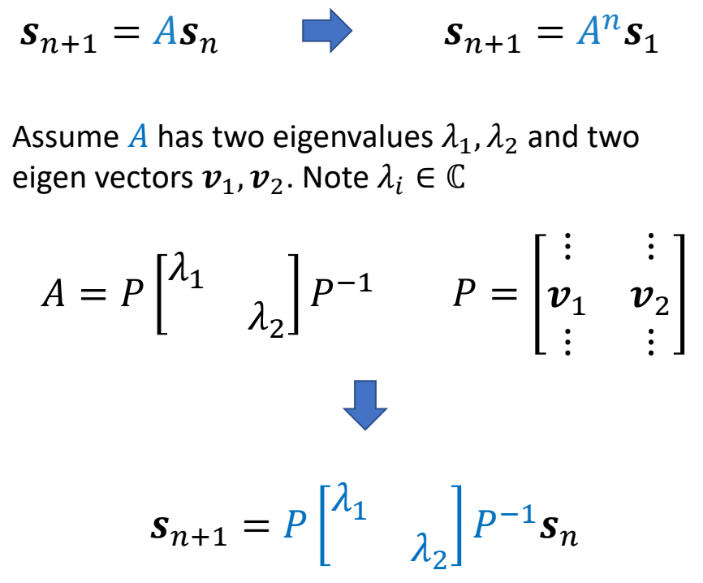

P19   
### PD控制的稳定性

\\(\lambda _1,\lambda _2 \in  \mathbb{C}  \\) are eigenvalues of \\(A\\)   

> &#x2705; 基于中间变是 \\(z_n\\) 推导的过程跳过。  
> &#x2705; 根据矩阵特征值的性质可直接得出结论。  

if \\(|\lambda _1|> 1\\)   

The system is unstable!    

Condition of stability: \\(|\lambda _i|\le  1 \text{ for all } \lambda _i\\)   

P20
### 通过h控制PD控制的稳定性

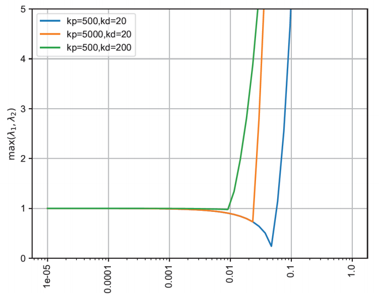

> &#x2705; 如果 \\(k_p\\) 和 \\(k_d\\) 变大，就必须以一个较小的时间步长进行仿真。   

### PD Control for Characters

P21  
 - Determining gain and damping coefficients can be difficult…   
    - A typical setting \\(k_p\\) = 200, \\(k_d\\) = 20 for a 50kg character   
    - Light body requires smaller gains   
    - Dynamic motions need larger gains   

 - High-gain/high-damping control can be unstable, so small times is necessary   
    - \\(h\\) = 0.5~1ms is often used, or 1000~2000Hz   
    - Higher gain/damping requires smaller time step   

P22   
## A More Stable PD Control

### 半隐式欧拉 → 隐式欧拉

> &#x2705; 解决方法：半隐式欧拉 → 隐式欧拉，即用下一时刻的力计算下一时刻的速度。   

- 半隐式欧拉

$$
\begin{align*}
 v_{n+1} & = v_n+h(-k_px_n-k_dv_n) \\\\
 v_{n+1} & = x_n+hv_{n+1}
\end{align*}
$$

$$
\Downarrow 
$$

- 隐式欧拉

$$
\begin{align*}
 v_{n+1} & = v_n+h(-k_px_n-k_dv_{n+1}) \\\\
 x_{n+1} & = x_n+hv_{n+1}
\end{align*}
$$

> &#x2705; 实际上，计算 \\(f_{n＋1}\\) 只使用 \\(V_{n＋1}\\) , 不使用 \\(x_{n＋1}\\) , 因为 \\(x_{n＋1}\\) 会引入非常复杂的计算。   
> &#x2705; 由于 \\(v_{n＋1}\\) 未知，需通过解方程组来求解。   

P23  
得到的方程组为：  

$$
\begin{bmatrix}
 v_{n+1} \\\\
x_{n+1} 
\end{bmatrix}=\frac{1}{1+hk_d} \begin{bmatrix}
 1 & -k_ph\\\\
 h & 1+k_dh-k_ph^2
\end{bmatrix}\begin{bmatrix}
 v_n\\\\
x_n
\end{bmatrix}
$$

P24  
### 稳定性分析

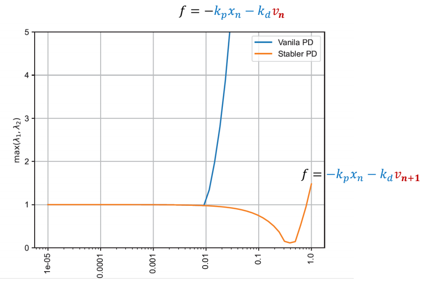

> &#x2705; \\(v_{n}\\) 换成 \\(v_{n＋1}\\) ，很大承度上提高了稳定性。  

P25  
### 相关工作   

> &#x1F50E; 

$$
\tau _{\mathrm{int} }=-K_p(q^n+\dot{q}^n \Delta t-\bar{q} ^{n+1})-K_d(\dot{q} ^n+\ddot{q} ^n \Delta t)
$$

P26  
### PD Control for Characters

 - Determining gain and damping coefficients can be difficult…   
    - A typical setting \\(k_p\\) = 200, \\(k_d\\) = 20 for a 50kg character   
    - Light body requires smaller gains   
    - Dynamic motions need larger gains

 - High-gain/high-damping control can be unstable, so small times is necessary  
    - \\(h\\) = 0.5~1ms is often used, or 1000~2000Hz   
    - \\(h\\) = 1/120s~1/60s, or 120Hz/60Hz **with Stable PD**   
    - Higher gain/damping requires smaller time step   

P28  
# Tracking Mocap with Root Forces/Torques   

> &#x2705; 当前系统仍存的问题。(1) 稳态误差，相位延迟 (2) 缺少对根结点的力。   

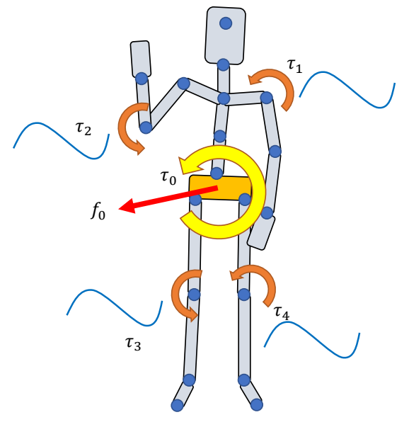

\\(\tau _j\\): joint torques   
\\(\text{ }\\) Apply \\(\tau _j\\) to “child” body   
\\(\text{ }\\) Apply \\(-\tau _j\\) to “parent” body    
\\(\text{ }\\) All forces/torques sum up to zero   

\\(f_0,\tau _0\\): root force / torque   

\\(\quad\quad\\) Apply \\(f _0\\) to the root body

\\(\quad\quad\\) Apply \\(\tau _0\\) to the root body   

\\(\quad\quad\\) Non-zero net force/torque on the character!    

> &#x2705; 净外力能解决问题 2，但会有“提线木偶”的 artifacts.   
> &#x2705; 解决方法：不直接学习目标轨迹，而是先对目标轨迹增加一个修正。即轨迹优化。    

P30   
## Trajectory Optimization

> &#x1F50E; [Witkin and Kass 1988 – Spacetime constraints]   

> &#x2705; 轨迹优化的问题描述：   

Find the trajectories:   

$$
\begin{align*}
 \text{Simulation trajectory } & : S_0,S_1,\dots ,S_T \\\\
 \text{Control trajectory } & : a_0,a_1,\dots ,a_{T-1}
\end{align*}
$$

> &#x2705; \\(S\\)：每一个时刻，角色的状态，包括位置、速度、朝向等。   
> &#x2705; \\(a\\)：目标轨迹。   
> &#x2705; 优化出 \\(S\\) 和 \\(a\\)，根据 \\(S\\) 和 \\(a\\) 得到关节力矩，关节力矩再控制角色。   

that minimize the objective function   

$$
\min_{(S_t,a_t)} f(S_T)+\sum_{t=0}^{T-1} f(S_t,a_t)
$$

> &#x2705; 目标函数第一项：关于轨迹结束时刻的状态。   
> &#x2705; 第二项：关于每一时刻的状态。    

and satisfy the constraints:   

$$
\begin{align*}
M\dot{v}+C(x,v)   & =f+J^T\lambda & \text{Equations of motion} \\\\
 g(x,v) & \ge 0 & \text{constraints } \quad \quad\quad
\end{align*}
$$

> &#x2705; 约束第一项：运动学方程。   
> &#x2705; 第二项：根据场景特殊定义的约束。  

 
P33 
## 简化问题分析   

> &#x2705; 仍以方块移动到目标高度为例。   

### 问题描述

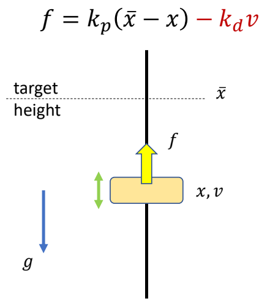

Compute a target trajectory \\(\tilde{x} (t)\\) such that the simulated trajectory \\(x(t)\\) is a sine curve.    

### 目标函数

$$
\min_ {(x_n,v_n,\tilde {x} _n)} \sum _ {n=0}^{N} (\sin (t_n)-x_n)^2+\sum _ {n=0}^{N} \tilde {x}^2_n 
$$

> &#x2705; 目标函数：目标项＋正则项    

### 约束

$$
\begin{align*}
 s.t. \quad & v _ {n+1}= v_ n+h (k _ p( \tilde {x} _n-x_n)-k _ dv_n) \\\\
  & v _ {n+1} = x _ n + hv _ {n+1}
\end{align*}
$$

> &#x2705; 约束：半隐式积分的运动方程      

P34   

|||
|--|--|
|Hard constraints: | 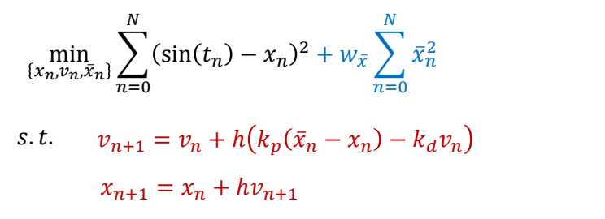 |
| Soft constraints:  | |

> &#x2705; 以两种方式体现约束：   
> &#x2705;（1）Hard：必须满足，难解，不稳定。    
> &#x2705;（2）Soft：尽可能满足，易求解。   

P35   
### 参数简化

Collocation methods:   

Assume the optimization variables {\\(x_n, v_n, \tilde{x}_n\\)} are values of a set of parametric curves    
 - typically polynomials or splines    

Optimize the parameters of the curves \\(\theta\\) instead     
 - with smaller number of variables than the original problem    

> &#x2705; 要优化的参数量太大，难以优化。  
> &#x2705; 解决方法：假设参数符合特定的曲线，只学习曲线的参数，再生成完整的参数。   

P37  
### 优化方法   

How to solve this optimization problem?    
Gradient-based approaches:    
 - Gradient descent   
 - Newton’s methods   
 - Quasi-Newton methods   
 - ……   

P39   
## Trajectory Optimization for Tracking Control  

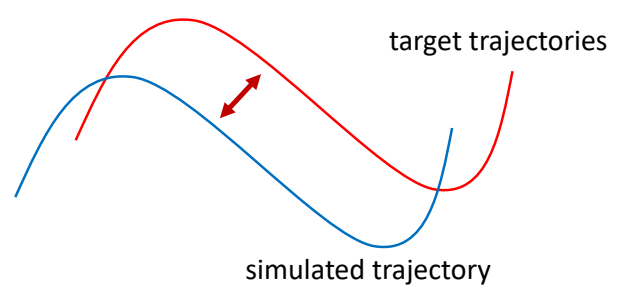

find a target trajectory    

> &#x2705; 把动捕结果当成初始解，然后以优化的方式找到合理轨迹。  

P40  
### Problem with Gradient-Based Methods

 - The optimization problem is usually **highly nonlinear**, gradients are unreliable    
 - The system is a black box with unknow dynamics, gradients are not available   

解决方法： Derivative-Free Optimization   

 - Iterative methods
    - Goal: find the variables 𝒙 that optimize \\(f(x)\\)   
    - Determining an initial guess of \\(x\\)   
    - Repeat:   
      - Propose a set of candidate variables {\\(x_i\\)} according to \\(x\\)   
      - Evaluate the objective function \\(f_i=f(x_i)\\)   
      - Update the estimation for \\(x\\)   

 - Examples:   
    - Bayesian optimization, Evolution strategies (e.g. CMA-ES), Stochastic optimization, Sequential Monte Carlo methods, ……   

> &#x2705; 启发式方法或随机采样方法，不需要梯度。   
> &#x2705; 缺点：慢、不精确。   

P43  
### CMA-ES   

 - Covariance matrix adaptation evolution strategy (CMA-ES)   
    - A widely adopted derivative-free method in character animation   

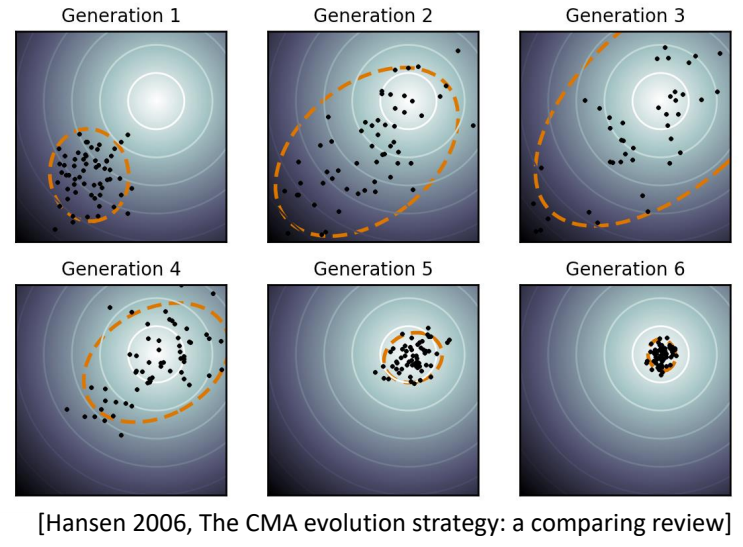

Goal: find the variables 𝒙 that optimize \\(f(x)\\) 
 - Initialize Gaussian distribution \\(x\sim \mathcal{N} (\mu ,\Sigma )\\)   
 - Repeat:   
    - sample candidate variables {\\(x_i\\)} \\( \sim \mathcal{N} (\mu ,\Sigma )\\)   
    - Evaluate the objective function \\(f_i=f(x_i)\\)   
      - Involve simulation and generate simulation trajectories   
    - Sort {\\(f_i\\)} and keep the top \\(N\\) elite samples   
    - Update \\(\mu ,\Sigma \\) according to the elite samples    

> &#x2705; 优点：稳定，无梯度，可用于黑盒系统。  

P44  

> &#x1F50E; [Wampler and Popović 2009 - Optimal Gait and Form for Animal Locomotion]    

P45    

> &#x2705; [Al Borno et al. 2013 - Trajectory Optimization for Full-Body Movements with Complex Contacts]   

> &#x2705; 只优化目标轨迹，不优化仿真轨迹。因为仿真轨迹可以通仿真得到。    

P46  
### SAMCON   

> &#x2705; CMA-ES 的缺点：   
> （1）每次都从头到尾做仿真，计算量大。   
> （2）如果仿真轨迹长，则难收敛。   
> &#x2705; 改进方法：每次采样，只考虑下面一帧。   

> &#x1F50E; **SA**mpling-based **M**otion **CON**trol [Liu et al. 2010, 2015]   
    - Motion Clip → Open-loop control trajectory   
    - A sequential Monte-Carlo method   

|||
|---|---|
|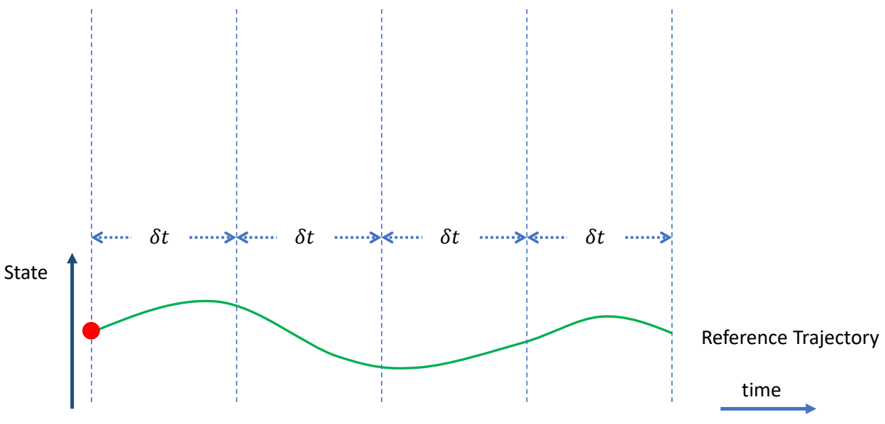 |&#x2705; 把轨迹分割开，每次优化一小段。  |
||&#x2705; 在目标轨迹上增加偏移，跟踪偏移之后的轨迹。  &#x2705; 偏移量未知，因此以高斯分布对偏移量采样。    &#x2705; 高斯分布可由其它分布代替。  |
|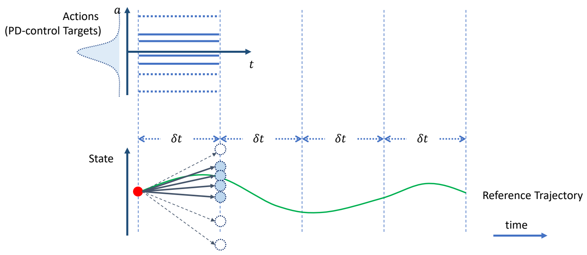| &#x2705; 对每个偏移量做一次仿真，生成新的状态，保留其中与当目标接近的 N 个。   |
|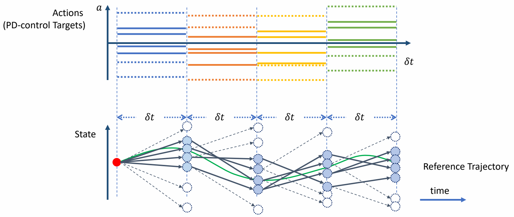| &#x2705; 从上一步 N 个中随机选择出发点，以及随机的偏移量，再做仿真与筛选。|  
|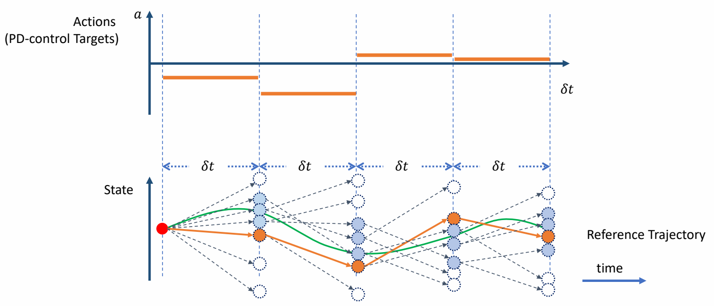| &#x2705; 最终找到一组最接近的。     &#x2705; 原理：只选一个容易掉入局部最优，因此保留多个。    &#x2705; 蒙特卡罗＋动态规划 |

> &#x2705; 优点：穿膜问题也能被修正掉，可还原动捕数据，可根据环境影响而自动调整。  

P54  
# Feedforward & Feedback Control
## Feedforward Control

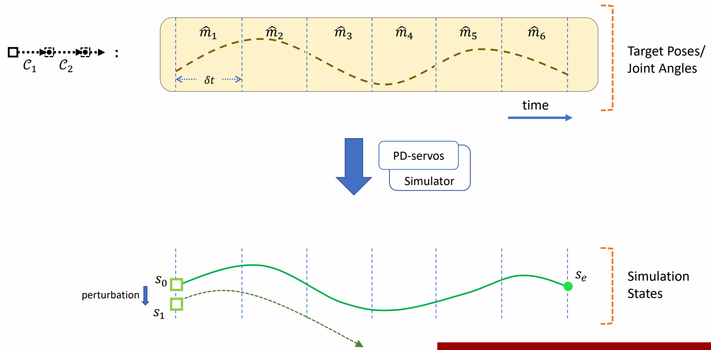

> &#x2705; 前馈控制，要求每一步的起始状态都是在获取轨迹过程中能得到的状态。  
> &#x2705; 如果对起始状态加一点挠动，状态会偏离很远。  

P56  
## Feedback Control

> &#x2705; 解决方法：引入反馈策略。根据当前偏差，自动计算出更正，把更正叠加到控制轨迹上。   

||
|---|
||
|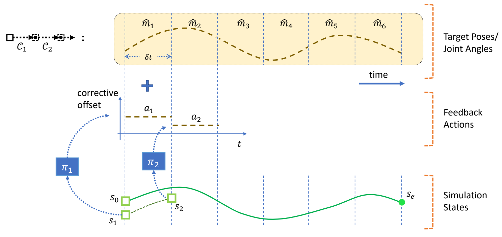|   
|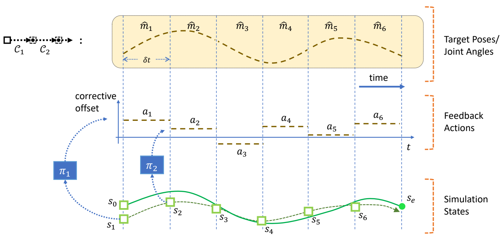|   

P62  
# Static Balance   

## 定义
What is balance?   

> &#x2705; Static Balance：在不发生移动的情况下，通过简单的控制策略，保证角色不摔倒。  
> &#x2705; 平衡：质心在支撑面内。  

P64  
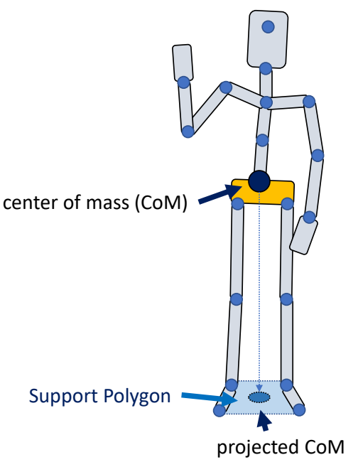   

> &#x2705; 人的质心：每一段的质心的加权平均。  
> &#x2705; 人的支撑面：两脚之内。   

P66 
## A simple strategy： PD Control   

A simple strategy to maintain balance:   

### 根据条件计算力矩

 - Keep projected CoM close to the center of support polygon **while tracking a standing pose**   

 - Use **PD control** to compute feedback torque   

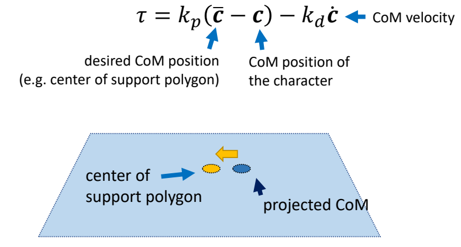   

> &#x2705; 力矩 1：让角色保持某个姿势。  
> &#x2705; 力矩 2：让质心与目标质心位置接近。  
> &#x2705; 在某些关节上增加一些额外的力矩。   

P68  
### 施加力矩

 - Apply the feedback torque at **ankles** (ankle strategy) or **hips** (hip strategy)   

P69   
## Jacobian Transpose Control

> &#x2705; 实现 static balance，除了 PD 控制还有其它方法。  

### 计算要施加的力

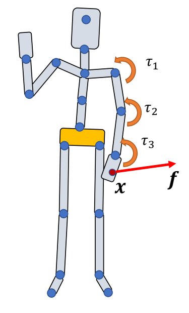   

Can we use joint torques \\(\tau _i\\) to mimic the effect of a force \\(f\\) applied at \\(x\\)   

 - Note that the **desired force** \\(f\\) is not actually applied   
 - Also called **“virtual force”**   

> &#x2705; 通过施加 \\(\tau _1 ，\tau _2，\tau _3\\) 来达到给 \\(x\\) 施加 \\(f\\) 的效果！  

P73  
### 把力转化为力矩  

Make \\(f\\) and \\(\tau _i\\) done the same power    

$$
P=f^T\dot{x}=\tau  ^T\dot{\theta } 
$$

> &#x2705; 从做功的角度。功率 = fv
  
Forward kinematics \\(x=g(\dot{\theta } )\Rightarrow \dot{x}=J \dot{\theta } \\)   

> &#x2705; \\(g（* ）\\) 是一个FK函数。其中：  
$$
J=\frac{\partial g}{\partial \theta } 
$$    
> &#x2705; 把 \\( \dot{x } \\) 代入上面公式得   

$$
f^T J\dot{\theta } = \tau  ^T\dot{\theta } 
$$

$$
\Downarrow 
$$

P76  

$$
\tau =J^Tf
$$

> &#x2705; 把 \\( \tau\\) 分解为每一个关节每一个旋转的 \\( \tau\\)．通过 Jacobian 矩阵的含义推出：     

$$
\Downarrow 
$$

$$
\tau _i=(x-p_i)\times f
$$

P77  
### 用于Static Balance

A simple strategy to maintain balance:   
 - Keep projected CoM close to the center of support polygon **while tracking a standing pose**    

 - Use PD control to compute feedback **virtual force**    

> &#x2705; P66 中在 Hips 上加力矩的方式只能进行简单的控制。    
> &#x2705; 可以通过虚力实现相似的效果。  

$$
f=k_p(\bar{c} -c)-k_d\dot{c}
$$

> &#x2705; \\(c\\) 不一定是投影距离，还可以描述高度距离，实现站起蹲下的效果。    

P78   

 - Assuming \\(f\\) **is applied to the CoM**, compute necessary joint torques using Jacobian transpose control to achieve it   

> &#x2705; 但也不是真的加力，而是通过前面讲的 Jacobian transpose control 方法转为特定关节的力矩。   

 - Usually using the joints in the legs   

> &#x2705; 最后达到在Hips上加力的效果  
> &#x2705; 但这种方式能施加的力非常弱，只能实现比较微弱的平衡

P79   
## A fancier strategy:   

 - Mocap tracking as an objective function   
 - Controlling both the CoM position/**momentum** and the **angular** momentum   
 - Solve a **one-step** optimization problem to compute joint torques   
 
> &#x1F50E;    

---------------------------------------
> 本文出自CaterpillarStudyGroup，转载请注明出处。
>
> https://caterpillarstudygroup.github.io/GAMES105_mdbook/