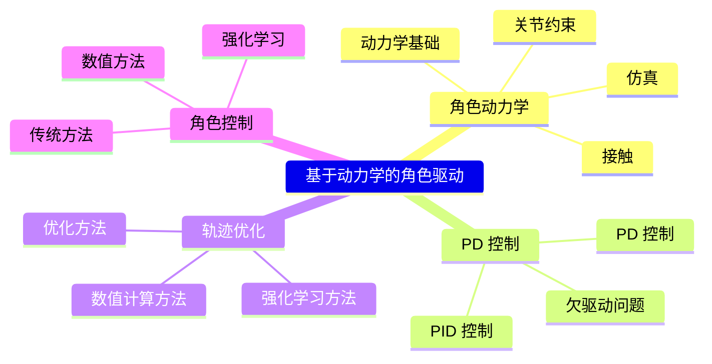

# 基于动力学的角色驱动方法概览

> &#x2705; **本章定位**：理解如何**通过力/力矩驱动角色**，生成符合物理规律的动画。

> 💡 **运动学 vs 动力学** 的详细对比参见 [Introduction](Introduction.md#运动学-vs-动力学对比)

---

## 本章知识框架



> &#x2705; **物理方法的难点**：
> &#x2705; (1) 仿真：在计算机中模拟出真实世界的运行方式。
> &#x2705; (2) 控制：生成角色的动作，来做出响应。
> &#x2705; 角色物理动画通常不关心仿真怎么实现。
> &#x2705; 但也可以把仿真当成白盒，用模型的方法来实现。


---

## 动力学方法的四个核心模块

理解动力学方法的四个核心模块：

```
┌─────────────────────────────────────────────────────────────┐
│  仿真器 (Simulation)                                        │
│  输入：力/力矩 → 输出：新状态                                │
│  核心：Mv̇ + C = f + Jᵀλ                                    │
├─────────────────────────────────────────────────────────────┤
│  底层执行 (PD Control)                                      │
│  输入：目标状态 → 输出：关节力矩 τ                            │
│  核心：τ = k_p(q* - q) + k_d(q̇* - q̇)                       │
├─────────────────────────────────────────────────────────────┤
│  中层策略 (Trajectory/Policy Generation)                    │
│  输入：任务指令 → 输出：目标轨迹/策略                         │
│  ① 轨迹优化：有参考轨迹 (CMA-ES/SAMCON)                     │
│  ② 角色控制：无参考轨迹 (ZMP/IPM/SIMBICON)                  │
│  ③ 强化学习：DeepMimic/AMP/ASE                              │
├─────────────────────────────────────────────────────────────┤
│  高层规划 (Task Planning)                                   │
│  输入：用户意图 → 输出：任务序列                              │
│  方法：有限状态机、行为树                                    │
└─────────────────────────────────────────────────────────────┘
```

**四个模块的关系**：

```
高层规划 → 任务指令
    ↓
中层策略 → 目标轨迹 q*, q̇*  (轨迹优化/角色控制/RL)
    ↓
底层执行 → 关节力矩 τ
    ↓
仿真器 → 新状态
```

**本章子章节**：

| 模块 | 文件 | 内容 |
|------|------|------|
| **仿真基础** | [Simulation.md](Simulation.md) | 物理仿真器的工作原理 |
| **约束** | [JointConstraint.md](JointConstraint.md) | 关节约束、接触约束 |
| **执行控制** | [PDControl/](PDControl/PDControl.md) | PD 控制原理与应用 |
| **轨迹优化** | [Tracking/](Tracking/Tracking.md) | 有参考轨迹的生成方法 |
| **角色控制** | [CharacterControl/](CharacterControl/CharacterControl.md) | 无参考轨迹的行走控制 |
