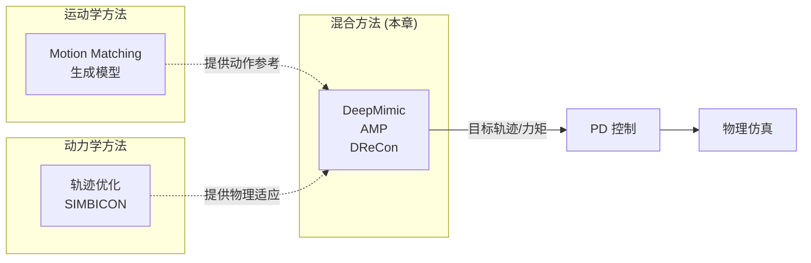

# 混合方法

> &#x2705; **本章定位**：理解如何结合**运动学方法**和**动力学方法**的优势，实现高质量且符合物理的角色动画。

---

## 为什么要混合？

### 纯运动学方法的问题

| 优点 | 缺点 |
|------|------|
| 动作质量高（来自动捕） | 不符合物理（穿模、滑步） |
| 计算效率高 | 抗扰动能力差 |
| 易于控制 | 无法与环境交互 |

### 纯动力学方法的问题

| 优点 | 缺点 |
|------|------|
| 符合物理 | 动作质量低（像机器人） |
| 抗扰动能力强 | 计算成本高 |
| 可与环境交互 | 需要大量调参/训练 |

**混合方法的核心思想**：取长补短，结合两种范式的优势。

---

## 两个维度的混合

### 维度 1：运动学 + 动力学

| 方法 | 运动学部分 | 动力学部分 |
|------|-----------|-----------|
| **DeepMimic** | 动捕参考轨迹 | RL 跟踪策略 |
| **AMP** | 动捕风格先验（判别器） | RL 策略（生成器） |
| **DReCon** | Motion Matching | RL 适配 + PD |

### 维度 2：有参考 + 无参考

| 方法 | 训练时 | 推理时 |
|------|-------|-------|
| **DeepMimic** | 依赖参考轨迹 | 跟踪参考轨迹 |
| **AMP** | 用动捕训练判别器 | 无需参考，只模仿风格 |
| **DReCon** | 构建动作数据库 | Motion Matching 提供初值 |

---

## 在控制系统中的位置



---

## 代表方法分类

### 方案 1：运动学参考 + 动力学跟踪

```
动捕数据 → PD 控制 → 仿真器
         ↑
    跟踪目标
```

**代表工作**：
- **传统 Tracking**：直接用 PD 跟踪动捕
- **DeepMimic**：用 RL 学习跟踪策略

**特点**：
- 优点：动作质量高（来自动捕）
- 缺点：仍然依赖动捕数据，泛化能力有限

**深入学习**：[DeepMimic](https://caterpillarstudygroup.github.io/ReadPapers/201.html)

---

### 方案 2：运动学先验 + 动力学生成

```
动捕数据 → 学习风格先验 → RL 策略 → 仿真器
                    (AMP/ASE)
```

**代表工作**：
- **AMP**：用对抗学习模仿风格，无需精确跟踪
- **ASE**：扩展 AMP 到更复杂的技能

**特点**：
- 优点：不依赖精确跟踪，可泛化到新动作
- 缺点：训练成本高，需要大量采样

**深入学习**：[AMP](https://caterpillarstudygroup.github.io/ReadPapers/198.html) | [ASE](https://caterpillarstudygroup.github.io/ReadPapers/199.html)

---

### 方案 3：运动学搜索 + 动力学适配

```
Motion Matching → 参考姿态 → 轨迹优化 → PD 执行
                                    (DReCon)
```

**代表工作**：
- **DReCon**：Motion Matching 提供初值，RL 做物理适配

**特点**：
- 优点：兼顾动作质量和物理适应性
- 缺点：系统复杂，需要维护动作数据库

**深入学习**：[DReCon](https://caterpillarstudygroup.github.io/ReadPapers/190.html)

---

### 方案 4：端到端统一模型

```
多模态输入 → Diffusion 模型 → 关节力矩/姿态
            (UniPhys/CAMDM)
```

**代表工作**：
- **UniPhys**：统一规划器 + 控制器，消除 domain gap
- **CAMDM**：条件自回归扩散模型，支持多模态控制

**特点**：
- 优点：端到端训练，无需手动设计接口
- 缺点：需要大量训练数据

**深入学习**：[UniPhys](https://caterpillarstudygroup.github.io/ReadPapers/184.html) | [CAMDM](https://caterpillarstudygroup.github.io/ReadPapers/177.html)

---

## 与前面章节的关系

| 章节 | 与混合方法的关系 |
|------|-----------------|
| **轨迹优化** | 混合方法可以借用轨迹优化的思想进行物理适配 |
| **角色控制** | 混合方法可以看作"有参考的角色控制" |
| **PD 控制** | 混合方法的输出通常通过 PD 控制执行 |

```
轨迹优化（有参考）────┐
                     ├──→ 混合方法
角色控制（无参考）────┘

混合方法 = 有参考的动作质量 + 无参考的物理适应性
```

---

## 本章内容导航

| 文件 | 内容 |
|------|------|
| [DeepMimic](../ReadPapers/201.html) | 用强化学习跟踪动捕轨迹 |
| [AMP](../ReadPapers/198.html) | 用对抗学习模仿动作风格 |
| [DReCon](../ReadPapers/190.html) | Motion Matching + RL 物理适配 |

---

## 本章重点问题

1. **如何设计运动学与动力学的接口？**
   - DeepMimic：参考轨迹作为 RL 的 reward
   - AMP：动捕数据训练判别器
   - DReCon：Motion Matching 输出作为 RL 输入

2. **如何平衡动作质量与物理适应性？**
   - 动作质量：来自动捕/生成模型
   - 物理适应性：来自 RL/轨迹优化

3. **如何处理训练与推理的差异？**
   - 训练时：可以用动捕数据
   - 推理时：可以无参考或弱参考

---

## 总结

| 方法 | 运动学部分 | 动力学部分 | 参考依赖 | 动作质量 | 物理适应 |
|------|-----------|-----------|---------|---------|---------|
| **DeepMimic** | 动捕轨迹 | RL 跟踪 | 强 | 高 | 中 |
| **AMP** | 风格先验 | RL 生成 | 弱 | 高 | 高 |
| **DReCon** | Motion Matching | RL 适配 | 中 | 高 | 高 |
| **UniPhys** | Diffusion 生成 | 统一模型 | 中 | 高 | 高 |

---

**深入学习**：[ReadPapers - Physics-based Character Control](https://caterpillarstudygroup.github.io/ReadPapers/)
