P7   
# 3D Computer Graphics    

P10    
## 3D Computer Animation

> &#x2705; 仿真，用于描述客观事物，它们的运动规律可以用精确的数来描述。GAMES103    
> &#x2705; 动画，用于描述有主观意志的事物，使用统计的方式来对它们的行为建模(例如AI建模)。 GAMES105  

P11   

## Why Do We Study Character Animation   

 - A character typically has 20+ joints, or 50-100+ parameters    
    - It is not super high-dimensional, so most animation can be created manually, by posing the character at keyframes    
    - **Labor-intensive, not for interactive applications**    

   

 - Character animation techniques   
    - **Understanding the mechanism behind motions and behaviors**   
    - Smart editing of animation/ Reuse animation / Generate new animation   
    - **“Compute-intensive”**     

   

> &#x2705; 计算机角色动画把原本劳动密集型的动画师工作变成计算密集型的工作。

P13  
# Character Animation Pipeline   

  

P15  

## Where does a Motion Come From   

根据是否使用物理，把角色动画分为两大类。

  

P16  

### Keyframe-based/Kinematic Approaches  

 

> &#x2705; 基于运动学直接更新角色状态，运动可以不符合物理规律。

P18    
### Physics-based/Dynamic Approaches

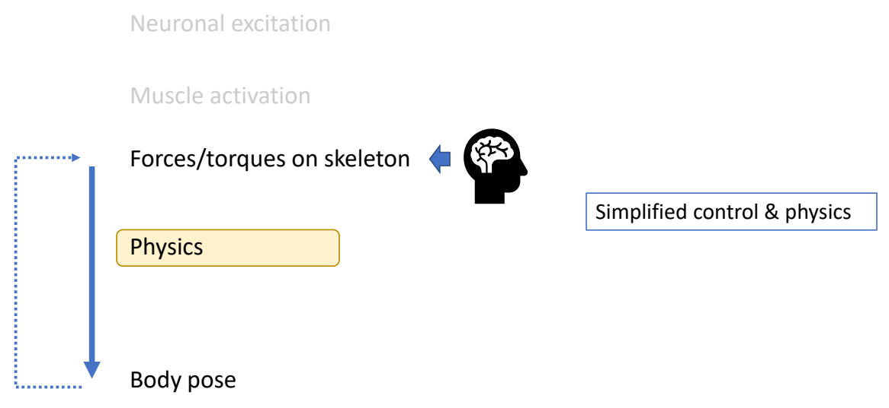  

> &#x2705; 基于物理，但实际情况会有简化，不能直接干预角色姿态。 

P19   
## Control Level

根据控制方式的高度，可以分为Low Level和Heigh Level

P20   
### low-level control   

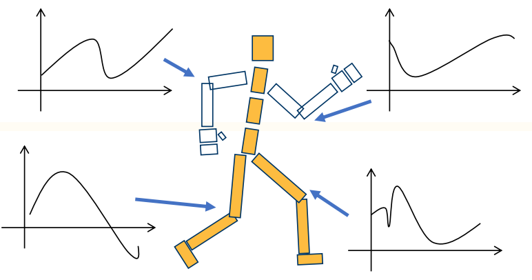  

> &#x2705; 对每一帧每一个姿态进行精确控制每个细节。   
> &#x2705; 优点：精确控制；缺点：低效。   

P21   
### high-level control

  

> &#x2705; 控制高级目标。   

# Keyframe-based/Kinematic Approaches

P24   
## Disney’s 12 Principles of Animation

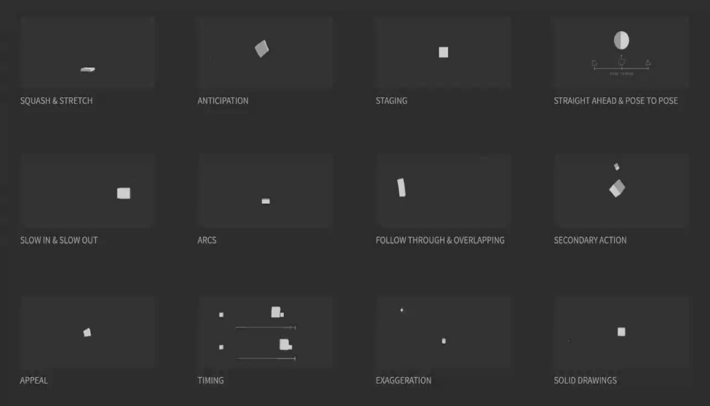  

[<http://the12principles.tumblr.com/>]

> &#x2705; 在动画师总结的准则里隐藏了物理规则和艺术夸张

## Keyframe Animation

> &#x2705; 这是一种非常low level的控制方法，可以保证所有细节，但非常慢

P26    
### Forward Kinematics

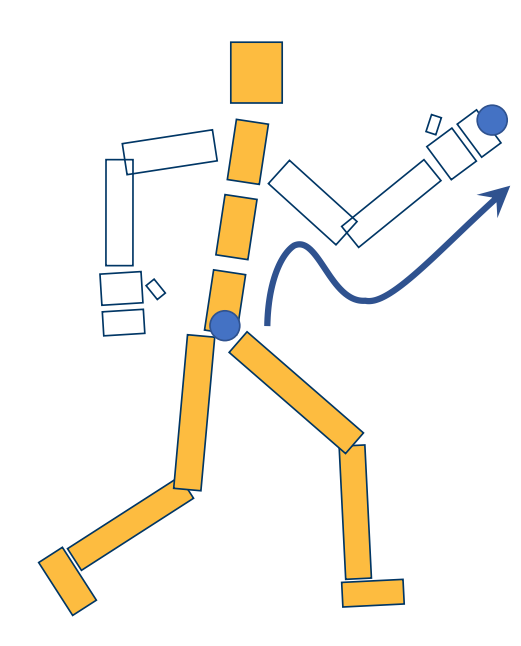  

**Given** rotations of every joints    
**Compute** position of end-effectors    

P27   
### Inverse Kinematics   

  

**Given** position of end-effectors     
**Compute** rotations of every joints    

P28   
### Interpolation
 
  

## Motion Capture

动捕设备、视频动捕，把动捕角色应用到角色身上，需要经过重定向  
动作捕捉和重放，不能产生新的数据

> &#x2705; 光学动捕、视频动捕、穿戴传感器动捕。   

P34   
### Motion Retargeting   

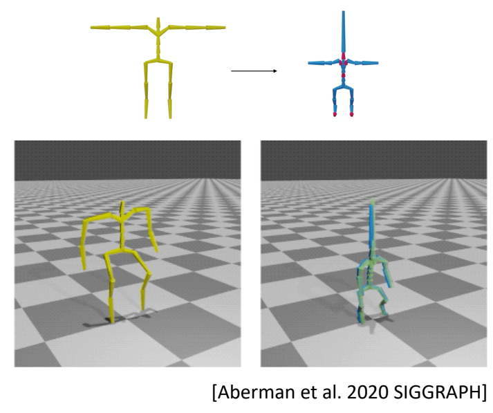  

**Given** motions of a source character   
**Compute** motions for target characters with   
  - different skeleton sizes
  - different number of bones
  - different topologies
  - ……   

P36   
## Motion Graphs / State Machines

  

> &#x2705; 把捕出来的动作进行分解和重组，生成新的动作。  

P37   

### Motion Graphs

  

> &#x2705; 给一段任意的动作，寻找能够构建状态机切换的位。 

P38   
### Motion Graphs的改进 - Interactively Controlled Boxing

   

[Heck and Gleicher 2007, Parametric Motion Graphs]  

> &#x2705; 对Motion Graph的改进，比如一个节点中有很多动作，对这些动作进行插值，来实现精确控制。   

P39   
### Motion Graphs的高级应用

**Character Animation in Two-Player Adversarial Games**   
KEVIN WAMPLER,ERIK ANDERSEN, EVAN HERBST, YONGJOON LEE, and ZORAN POPOVIC Univoersity of Washington     

**Near-optimal Character Animation with Continuous Control**   
Adrien Treuille  \\(\quad\\)   Yongjoon Lee   \\(\quad\\)  Zoran Popovic    
University of Washington    

> &#x2705; Motion Graph＋AI，实现高级控制   
> &#x2705; 例如：AI使用Motion Graph，通过选择合适的边，进行执行，完成高级语义。   

P42  

### Complex Motion Graphs

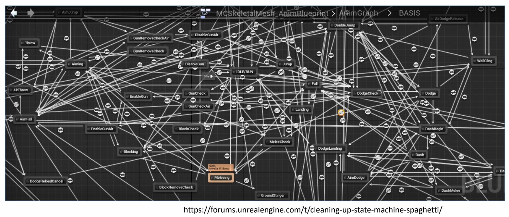  

> &#x2705; 动作图非常复杂，容易出BUG．  

P43  

## Motion Mathing

> &#x2705; 改进，Motion Graph的动作都是完整的片断，可以把动作再分细一点，切到每一帧。    
> &#x2705; 不是完整地播放一段动作，而是每一帧结束后，通过最近邻搜索找到一个新的姿态，  
> &#x2705; 满足：（1）接近控制目标（2）动作连续    
> &#x2705; 关键：（1）定义距离函数（2）设计动作库   

P45  
## Learning-based Approaches

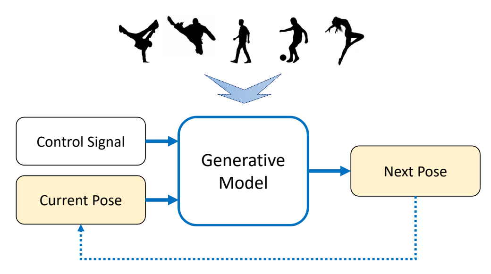 

> &#x2705; 对角色动作的内在规律去理解和建模，从数据学习统计规律。  
> &#x2705; 生成模型：只需要采足够的动作去给模型就能生成新的动作。   
> &#x2705; 不需要手工作切分、生成状态机   

|ID|Year|Name|Note|Tags|Link|
|---|---|---|---|---|---|
||2020|Local Motion Phases for Learning Multi-Contact Character Movements|  
||2021|Character Controllers Using Motion VAEs|

P49   
## Cross-Modal Motion Synthesis

 - Audio-driven animation   
    - Music to dance    
    - Co-speech gesture   
    - ……      
- Natural language to animation   
    - Descriptions to actions   
    - Scripts to performance   
    - ……   

|ID|Year|Name|Note|Tags|Link|
|---|---|---|---|---|---|
||2022|Rhythmic Gesticulator|&#x2705; 语言和动作都有内存的统计规律，把两种统计模型之间建关系，实现跨模态生成。|

  

## 总结

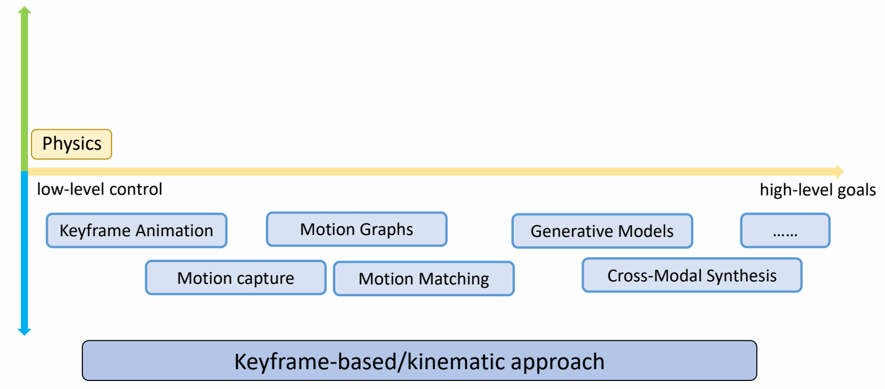  

# Physics-based/Dynamic Approaches

> &#x2705; 不直接生成姿态，而是控制量（例如力），通过物理仿真真正改变角色。   

  
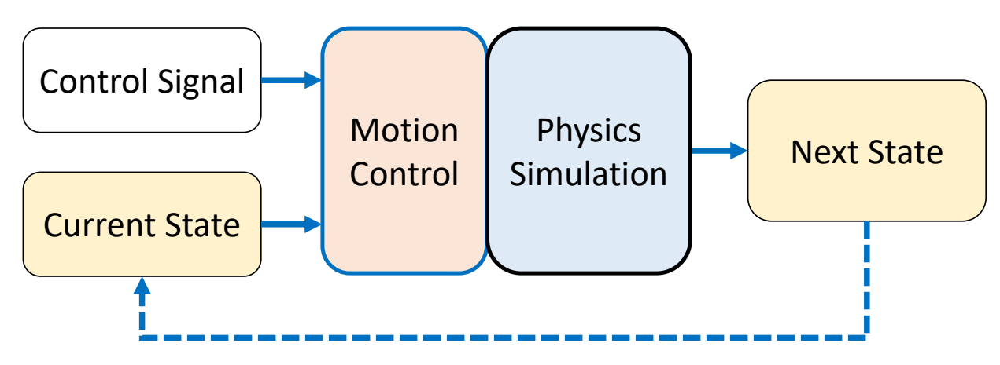  

P59

## Ragdoll Simulation

  

> &#x2705; 用于人死掉、失去意识、突发事件来不及响应的情况。

P63   
## 物理仿真角色动画的应用

  

[DeepMotion: Virtual Reality Tracking]   

[Ye et al. 2022: Neural3Points]   

[Yang et al. 2022: Learning to Use Chopsticks]

> &#x2705; 抓住手指动作细节
P67   

P68  
## 物理角色的建模方法   

  

> &#x2705; 构建完整的神经系统和肌肉系统。   
> &#x2705; （1）神经肌肉机理不清楚。   
> &#x2705; （2）自由度高，仿真效率低。   
> &#x2705; 所以实际上会做简化，对关节力矩进行建模

  

> &#x2705; 用关节力矩仿真肌肉的力。     

P70   

### Force & Torque

  

P71   

## Keyfrmae Control

### Proportional-Derivative (PD) Control  
  

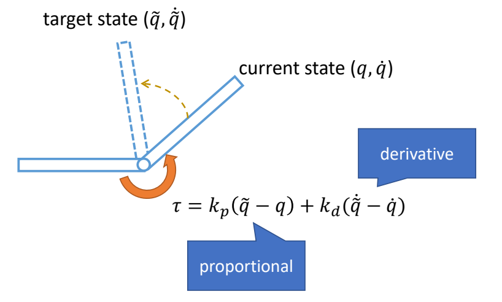  

> &#x2705; 根据当前状态与目标状态的差距，计算出当前状态运动到目标状态所需要的力矩。  

P72  
### Tracking Controllers

  

> &#x2705; 比如要做一个动作，给出目标高度的轨迹，采用PD控制生成每个关节的力矩，大概能产生要做的动作 

> [Hodgins and Wooten 1995, Animating Human Athletics]   
 
P76   
### Trajectory Crafting

NaturalMotion - Endorphin   

> &#x2705; 关键帧→力→仿真   

实际上这个方法很难用起来，因为调整仿真参数甚至比直接做关键帧更花时间。  

P79  
## Spacetime/Trajectory Optimization

> &#x2705; 用优化方法实现，结合重定向

[Liu et al 2010. SAMCON]

[Wampler and Popović. 2009. Optimal gait and form for animal locomotion]    

[Hamalainen et al. 2020, Visualizing Movement Control Optimization Landscapes]    

> &#x2705; 这是高维非线性优化问题，非常准解。    

P83   
## Abstract Models 简化模型

通过简化模型实现对一些动作的控制，但只能做简单动作

### SIMBICON

  

> &#x2705; 用简化模型把想要的动作描述出来，来指导角色控制。   
> &#x2705; 基于此实现稳定的多技能的控制策略。  
> &#x2705; 控制简化、缺少细节，走路像机器人。   
> &#x2705; 简化模型思路，可以实现对一些动作进行控制，且结果鲁棒，允许使用外力与角色交互。   
> &#x2705; 缺点：只能走路，不能复杂动作。 

P85   
### Inverted Pendulum Model

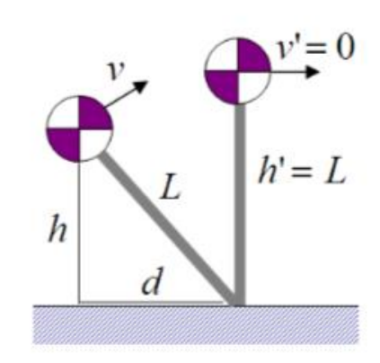  

[Coros et al. 2010]

P87   
## Reinforcement Learning  

  

P89   

### DRL-based Tracking Controllers  

 
[Liu et al. 2016. ControlGraphs]    

[Liu et al. 2018]     

[Peng et al. 2018. DeepMimic]    

> &#x2705; 利用DRL做复杂动作，但还只是动作复现。   

P90  
### Multi-skill Characters

#### 引入状态机，完成更复杂动作。
State Machines of Tracking Controllers    

#### 引入Motion Maching

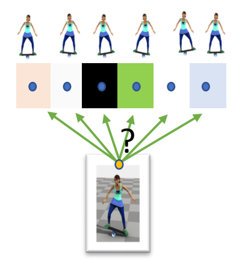  

[Liu et al. 2017: Learning to Schedule Control Fragments]  

## Hierarchical Controllers

在高级指令控制下，综合使用动作来完成功能

Generative Control Policies

|运动生成模型|控制生成模型|
|---|---|
|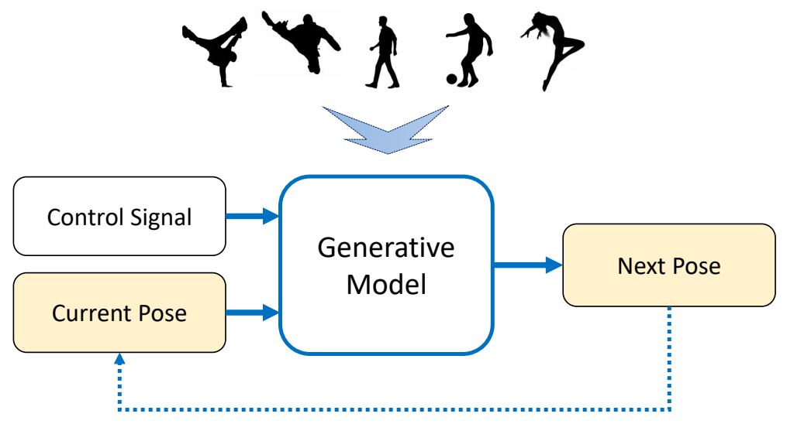  |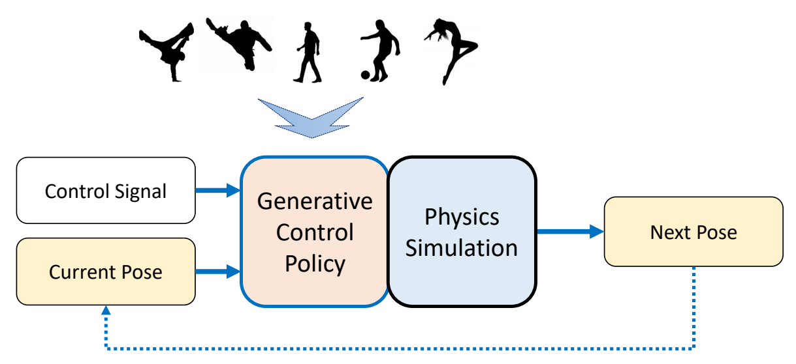|  

## 总结

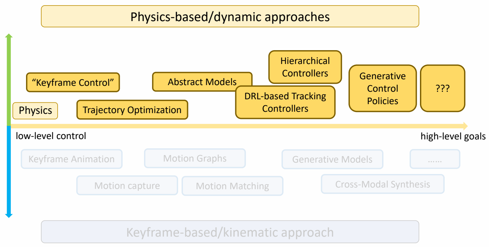  

> &#x2705; 回顾计算机角色动化领域最近30年主要研究方向。 

P102    
# About This Course    

 - What will not be covered   
    - How to use Maya/Motion Builder/Houdini/Unity/Unreal Engine…   
    - How to become an animator    

 - What will be covered   
    - Methods, theories, and techniques behind animation tools   
      - Kinematics of characters   
      - Physics-based simulation   
      - Motion control   

    - Ability to create an interactive character   

---------------------------------------
> 本文出自CaterpillarStudyGroup，转载请注明出处。
>
> https://caterpillarstudygroup.github.io/GAMES105_mdbook/