# Lecture 01

P8   
## 3D Computer Graphics    

P10  
> &#x2705; 仿真，用于描述客观事物，它们的运动规律可以用精确的数来描述。GAMES103    
动画，用于描述有主观意志的事物，使用统计的方式来对它们的行为建模；利如AI建模 GAMES105  

P11   
## 3D Computer Animation

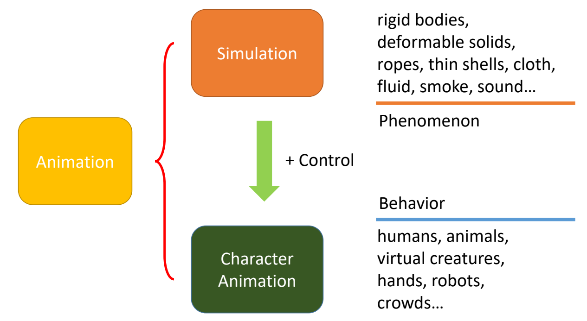

> &#x2705; 上：主要指电影。下：主要是游戏。

P12   
## Why Do We Study Character Animation   

 - A character typically has 20+ joints, or 50-100+ parameters    
    - It is not super high-dimensional, so most animation can be created manually, by posing the character at keyframes    
    - **Labor-intensive, not for interactive applications**    

   

 - Character animation techniques   
    - Understanding the mechanism behind motions and behaviors   
    - Smart editing of animation/ Reuse animation / Generate new animation   
    - **“Compute-intensive”**     

   

P14  
## Character Animation Pipeline   

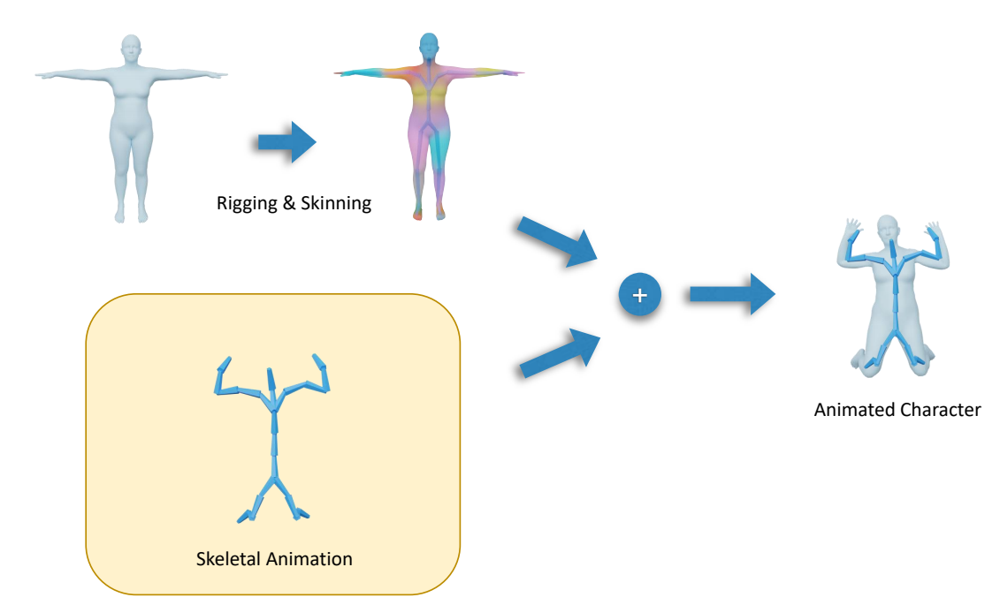  

P15  

> &#x2705; 根据是否使用物理，把角色动画分为两大类。 

P16  
## Where does a Motion Come From   
 
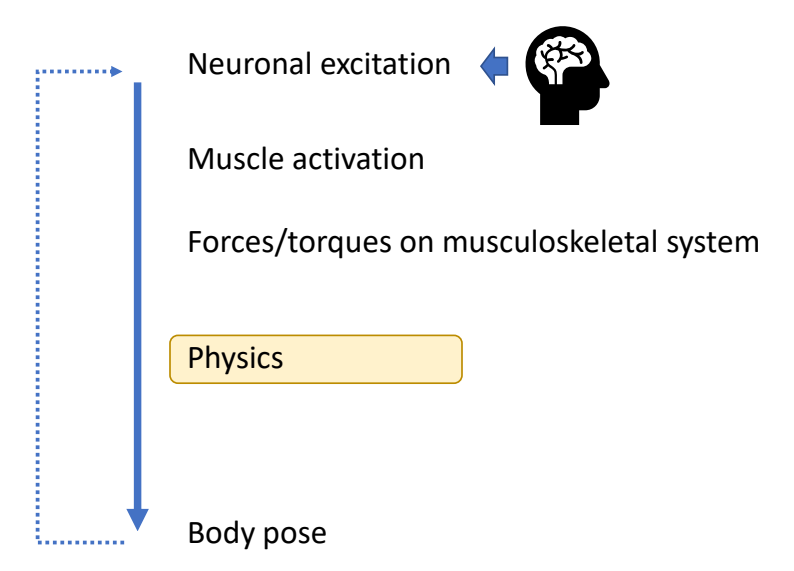  

> &#x2705; 基于运动学直接更新角色状态，运动可以不符合物理规律。

P17
## Keyframe-based/Kinematic Approaches  

  

P18   

> &#x2705; 基于物理，但实际情况会有简化，不能直接干预角色姿态。 

P19    
## Physics-based/Dynamic Approaches

  

P20   
## Character Animation Methods

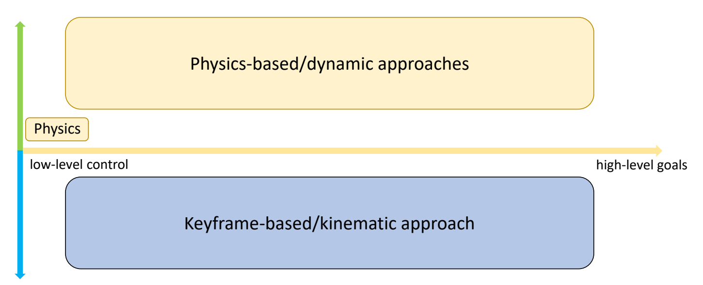  

> &#x2705; 对每一帧每一个姿态进行精确控制每个细节。   
优点：精确控制，缺点低效。   

P21   
## Character Animation Methods

low-level control   

  

> &#x2705; 控制高级目标。   

P22   
## Character Animation Methods

high-level control

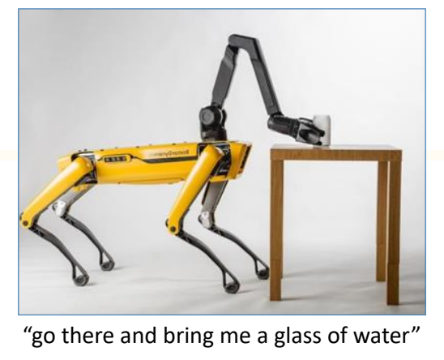  

P25   
## Disney’s 12 Principles of Animation

  

[<http://the12principles.tumblr.com/>]

P27    
## Forward Kinematics

  

**Given** rotations of every joints    
**Compute** position of end-effectors    

P28   
## Inverse Kinematics   

  

**Given** position of end-effectors     
**Compute** rotations of every joints    

P29   
## Interpolation
 
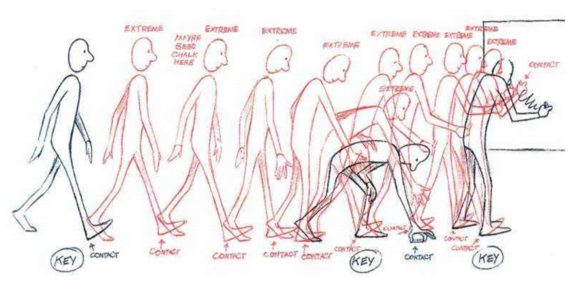  

P34   

> &#x2705; 光学动捕、视频动捕、穿戴传感器动捕。   

P35   
## Motion Retargeting   

  

**Given** motions of a source character   
**Compute** motions for target characters with   
  - different skeleton sizes
  - different number of bones
  - different topologies
  - ……   

P36   

> &#x2705; 把捕出来的动作进行分解和重组，生成新的动作。  

P37   
## Motion Graphs / State Machines

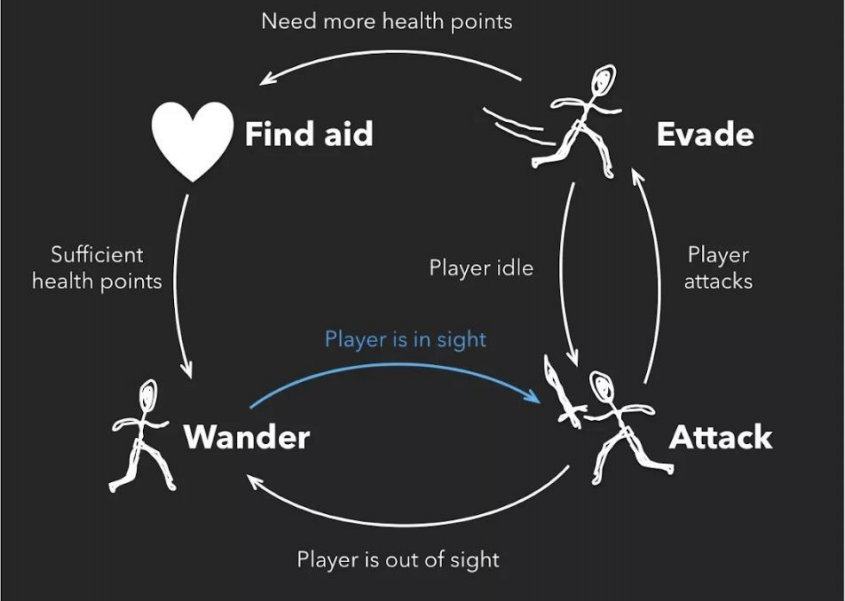  

> &#x2705; 给一段任意的动作，寻找能够构建状态机切换的位。 

P38   
## Motion Graphs / State Machines

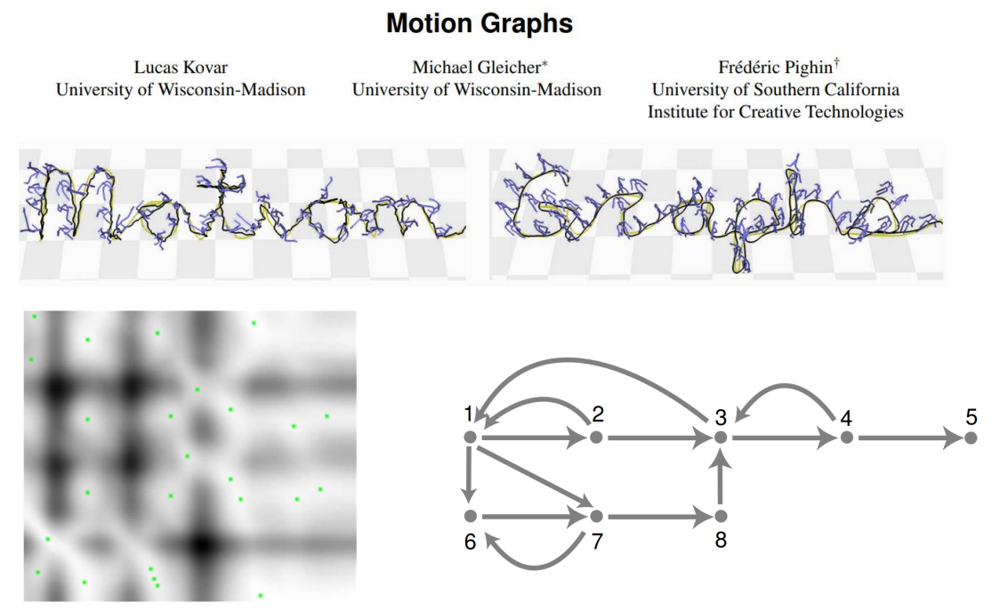  

> &#x2705; 对Motion Graph的改进，比如一个节点中有很多动作，对这些动作进行插值，来实现精确控制。   

P39  
## Motion Graphs / State Machines

   

[Heck and Gleicher 2007, Parametric Motion Graphs]  

> &#x2705; Motion Graph＋AI，实现高级控制   
例如：AI使用Motion Graph，通过选择合适的边，进行执行，完成高级语义。     

P40   
## Motion Graphs / State Machines

**Character Animation in Two-Player Adversarial Games**   
KEVIN WAMPLER,ERIK ANDERSEN, EVAN HERBST, YONGJOON LEE, and ZORAN POPOVIC Univoersity of Washington     

**Near-optimal Character Animation with Continuous Control**   
Adrien Treuille  \\(\quad\\)   Yongjoon Lee   \\(\quad\\)  Zoran Popovic    
University of Washington    

P42  

> &#x2705; 动作图非常复架，容易出BUG．  

P43  
## Complex Motion Graphs

  

> &#x2705; 改进，Motion Graph的动作都是完整的片断，可以把动作再分细一点，切到每一帧。    
不是完整地播放一段动作，而是每一帧结束后，通过最近邻搜索找到一个新的姿态，  
满足：（1）接近控制目标（2）动作连续    
关键：（1）定义距离函数（2）设计动作库   

P45  
> &#x2705; 对角色动作的内在规律去理解和建模，从数据学习统计规律。  
生成模型：只需要采足够的动作去给模型就能生成新的动作。   
不需要手工作切分、生成状态机   

P46   
## Learning-based Approaches

  

P50   
## Cross-Modal Motion Synthesis

 - Audio-driven animation   
    - Music to dance    
    - Co-speech gesture   
    - ……   

[Ao et al. 2022. Rhythmic Gesticulator. SIGGRAPH Asia 2022]    

> &#x2705; 语言和动作都有内存的统计规律，把两种统计模型之间建关系，实现跨模态生成。   

P51   
## Cross-Modal Motion Synthesis   

 - Natural language to animation   
    - Descriptions to actions   
    - Scripts to performance   
    - ……   

  

> &#x2705; 不直接生成姿态，而是控制量（例如力），通过物理仿真真正改变角色。   

P53  
## Character Animation Methods  

  

P56  
## Character Animation Methods   

  

P58  
## Kinematic Approaches

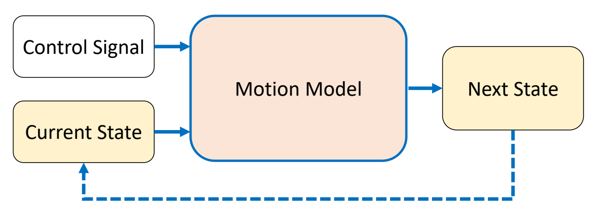  

P59   
## Physics-based Character Animation

  

> &#x2705; 用于人死掉、失去意识、突发事件来不及响应的情况。

P60 

## Ragdoll Simulation

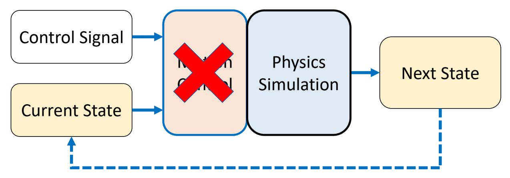  

P62  
## Physics-based Character Animation

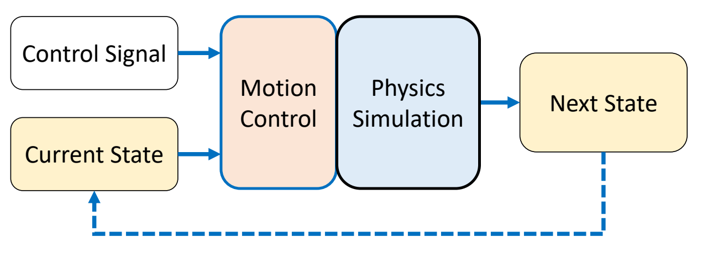  

P64   
## Motion Reconstruction with Sparse Sensors

  

P65  
## Motion Reconstruction with Sparse Sensors

[DeepMotion: Virtual Reality Tracking]   

P66

[Ye et al. 2022: Neural3Points]   

P67   
[Yang et al. 2022: Learning to Use Chopsticks]

P68   
## Character Animation Methods

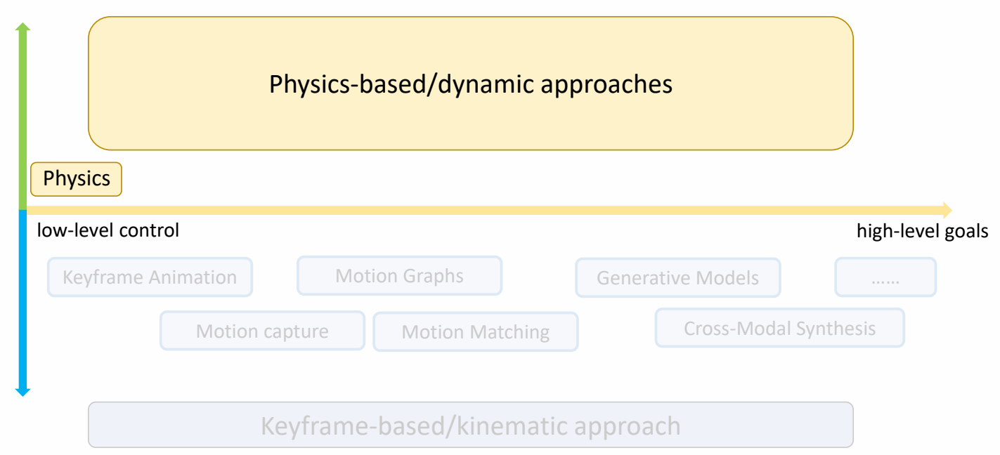  

> &#x2705;构建完整的神经系统和肌肉系统。   
（1）神经肌肉机理不清楚。   
（2）自由度高，仿真效率低。   

P69  
## Physics-based/Dynamic Approaches   

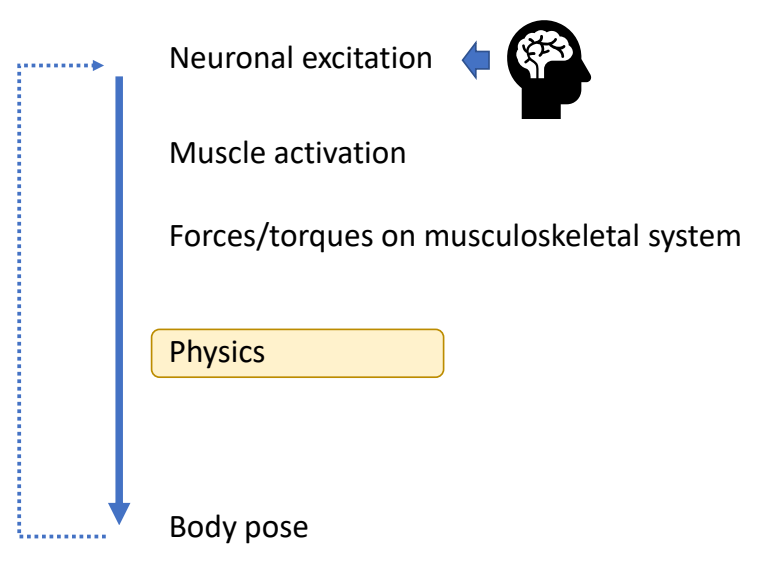  

> &#x2705; 用关节力矩仿真肌肉的力。     

P70   

## Physics-based/Dynamic Approaches   

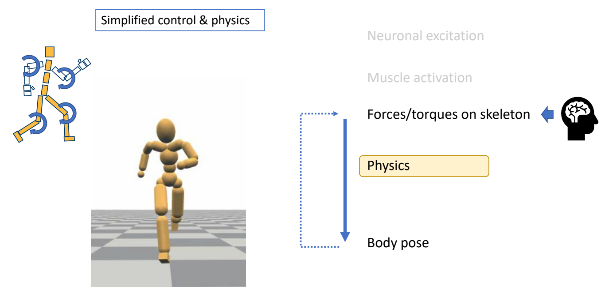  

P71   

## Force & Torque

  

> &#x2705; 根据当前状态与目标状态的差距，计算出当前状态运动到目标状态所需要的力矩。  

P72   

## Proportional-Derivative (PD) Control  
  

  

> &#x2705; 目标状态→力矩→动作   

P73   
## Tracking Controllers

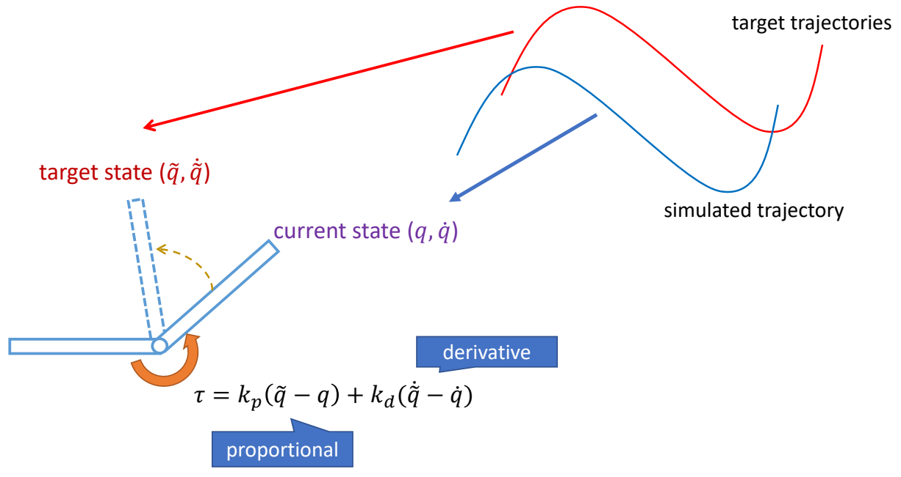  

P74   
## Tracking Controllers

[Hodgins and Wooten 1995, Animating Human Athletics]   

P76  

> &#x2705; 关键帧→力→仿真   

P77   
## Trajectory Crafting

NaturalMotion - Endorphin   

P79   

> &#x2705; 用优化方法实现，结合重定向

P80  
## Spacetime/Trajectory Optimization

  

[Liu et al 2010. SAMCON]

P81  
## Spacetime/Trajectory Optimization

[Wampler and Popović. 2009. Optimal gait and form for animal locomotion]    

> &#x2705; 这是高维非线性优化问题，非常准解。    

P82   
## Spacetime/Trajectory Optimization

[Hamalainen et al. 2020, Visualizing Movement Control Optimization Landscapes]    

P83   

> &#x2705; 用简化模型把想要的动作描述出来，来指导角色控制。   
基于此实现稳定的多技能的控制策略。  
控制简化、缺少细节，走路像机器人。   
简化模型思路，可以实现对一些动作进行控制，且结果鲁棒，允许使用外力与角色交互。   
缺点：只能走路，不能复杂动作。   

P84   
## Abstract Models   

  

P86   
## Abstract Models   

Inverted Pendulum Model

  

[Coros et al. 2010]

P88   
## Reinforcement Learning  

  

P89   

> &#x2705; 利用DRL做复杂动作，但还只是动作复现。   

P90   

## DRL-based Tracking Controllers  

 
[Liu et al. 2016. ControlGraphs]    

[Liu et al. 2018]     

[Peng et al. 2018. DeepMimic]    

> &#x2705; 引入状态机，完成更复杂动作。

P91  
## Multi-skill Characters

State Machines of Tracking Controllers    

> &#x2705; 引入moton Matding     

P92   

## Multi-skill Characters  

  

[Liu et al. 2017: Learning to Schedule Control Fragments]  

P95   
## Generative Control Policies

  

P96   
## Generative Control Policies

  

P100   
## Character Animation Methods  

  

> &#x2705; 回顾计算机角色动化领域最近30年主要研究方向。 

P101  

## Character Animation Methods   

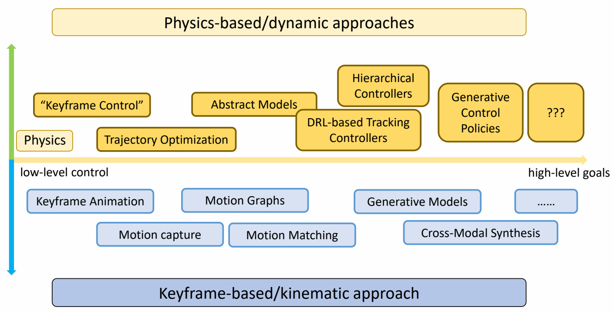  

P103    
## About This Course    

 - What will not be covered   
    - How to use Maya/Motion Builder/Houdini/Unity/Unreal Engine…   
    - How to become an animator    

 - What will be covered   
    - Methods, theories, and techniques behind animation tools   
      - Kinematics of characters   
      - Physics-based simulation   
      - Motion control   

    - Ability to create an interactive character   

---------------------------------------
> 本文出自CaterpillarStudyGroup，转载请注明出处。
>
> https://caterpillarstudygroup.github.io/GAMES105_mdbook/