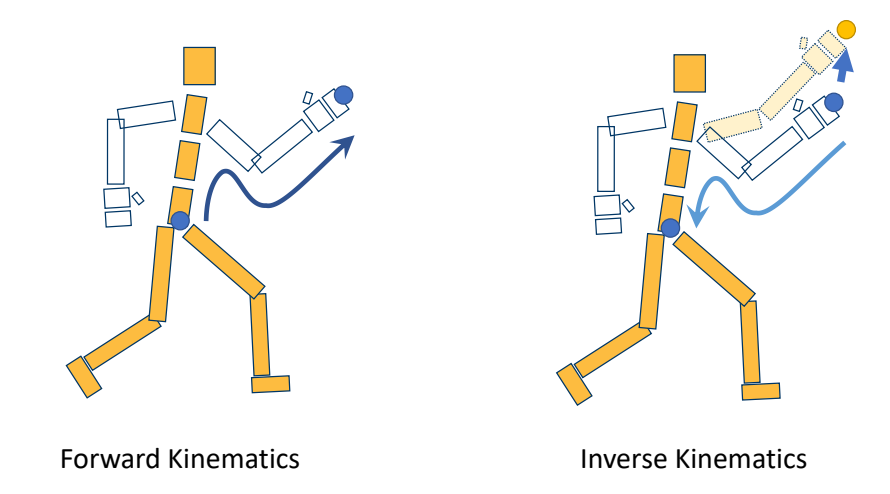
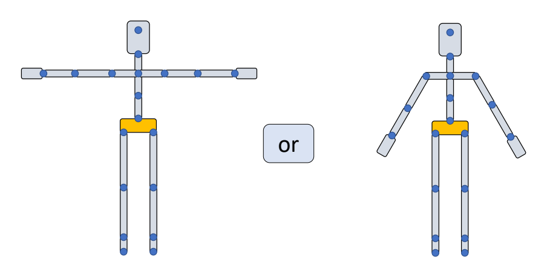
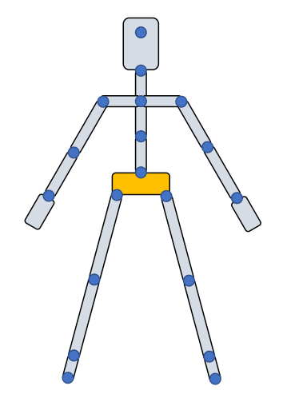
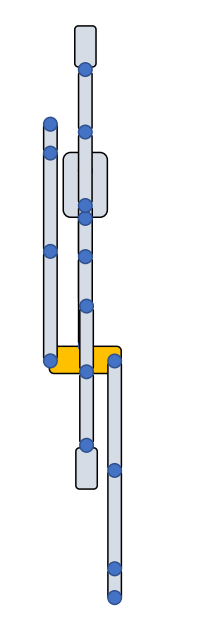
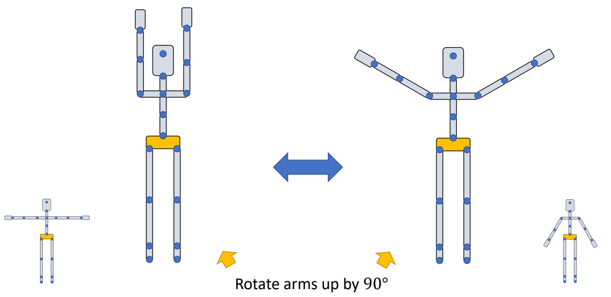
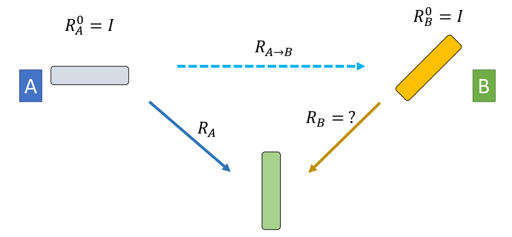
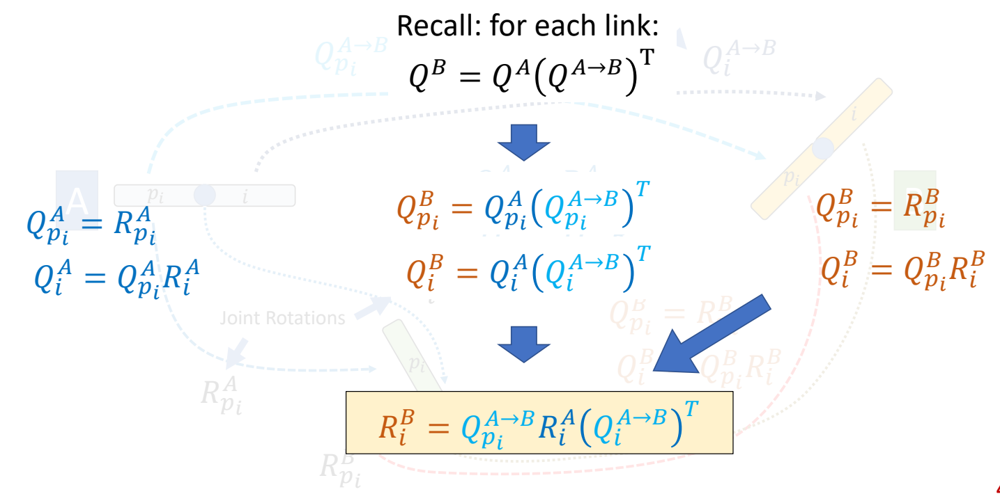
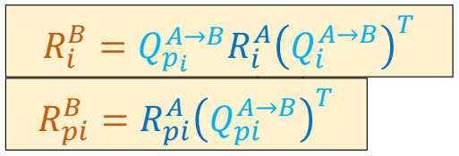

P3   
# Outline

 - Character Kinematics (cont.)   
    - Motion Retargeting    
    - Full-body IK   

 - Keyframe Animation   
    - Interpolation and splines   

P4   

## Recap: Character Kinematics

  

P15   

# Reference Pose

{ \\(𝑅_𝑖 = 𝐼\\) }    
The pose with zero / identity rotation Bind pose / Reference pose  

> &#x2757; reference pose不一定是Tpose。  

P16   
## T-Pose? A-Pose?

  

  

> &#x2705; 常见的reference pose一般为Apose或者Tpose。  
> &#x2705; 对于骨骼动画来讲，\\(A\\) 或 \\(T\\) 都一样。  
> &#x2705; 对于骼骼绑定与蒙皮来讲，更倾向于\\(A\\)。因为 \\(A\\) 的肩膀是自然状态。    

P19   
## 特殊的reference pose

||||
|---|---|---|
|  |   |    &#x2705; 这个动作跟建模师建模时的动作镜像操作有关。  
 |

P23   
## 不同reference pose会引入的问题   

  

> &#x2705; 相同的姿态参数放在不同的参考姿态下呈现出的姿态不同。
> &#x2705; 解决方法：Retargeting

P29    
# **Retargeting** between reference poses

  

> &#x2705; 让不同参考姿态的角色做出同样的动作，根据 \\(R_A\\) 求 \\(R_B\\).   
> &#x2705; 重定向还有其它问题，例如关节长度、穿模。   

P33   
## Retargeting for a single object

### 问题分析

  

### 公式推导

  

> &#x2705; 把 B 先转到 A 的姿态，再做指定动作。

P45    

## Retargeting for a chain of links

### 问题分析

  

> &#x2705; 两个关节的场景   

### 公式推导

P49    

  

### 结论
P51   

  

P52   
## **Retargeting** between reference poses

### 问题分析

  

P53   
### 结论

  

P101  

# Keyframe Animation and Interpolation

> &#x2705; Keyframe Animation跳过

P106   
## Interpolation

 - Given a set of data pairs \\(D=\\){\\((x_i,y_i)\mid i=0,\dots ,N\\)} find a function \\(f(x)\\) such that    

P107   

  

常见的差值方法有Linear Interpolation、Polynomial Interpolation等。详见GAMES102。

P114   
## Smoothness

  

## Interpolation of Rotations
P154   

  

P157   
SLERP for Quaternions

$$
q_t=\frac{\sin[(1-t)\theta ]}{\sin \theta } q_0 + \frac{\sin t \theta }{\sin \theta }q_1
$$

$$
\cos \theta = q_0 \cdot q_1
$$

Constant rotational speed, but only “linear” interpolation    

P158   
> &#x1F50E; Animating rotation with quaternion curves.  
> Ken Shoemake. 1985    
*SIGGRAPH Computer Graphics,*    

---------------------------------------
> 本文出自CaterpillarStudyGroup，转载请注明出处。
>
> https://caterpillarstudygroup.github.io/GAMES105_mdbook/