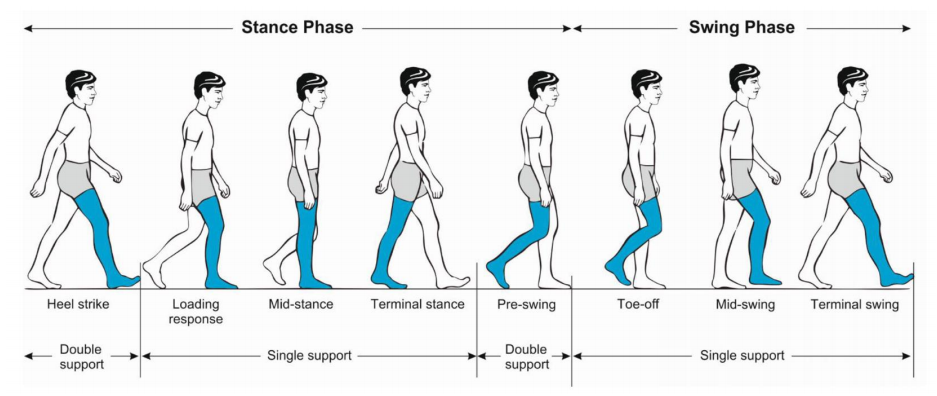
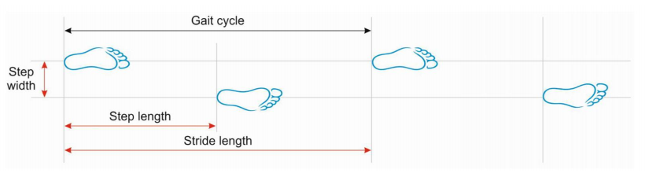
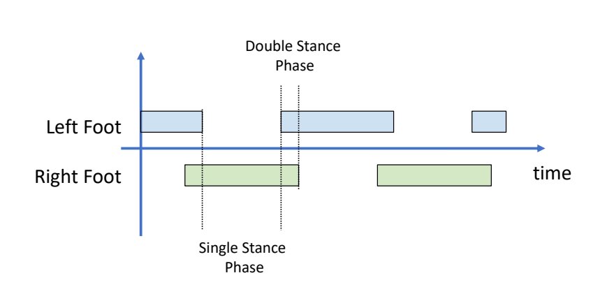
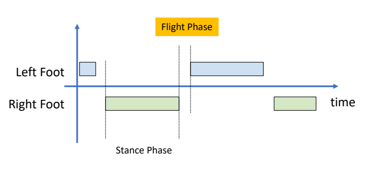
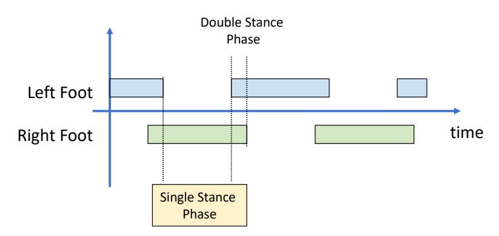
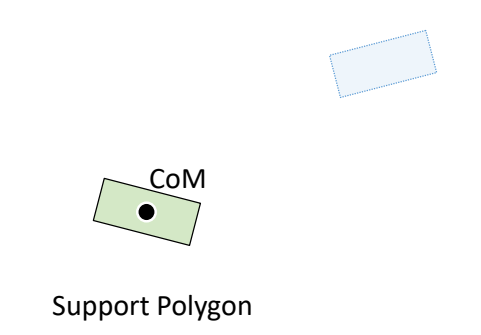
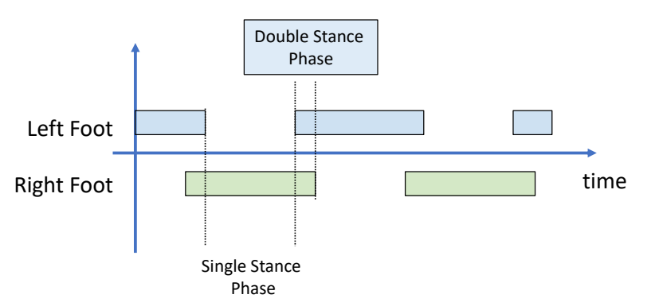
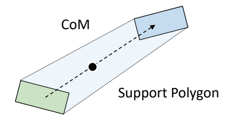
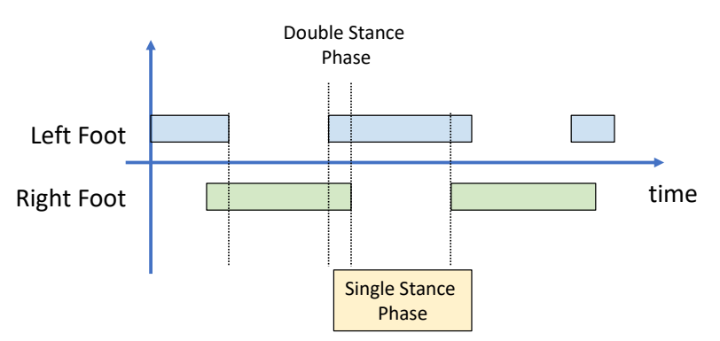
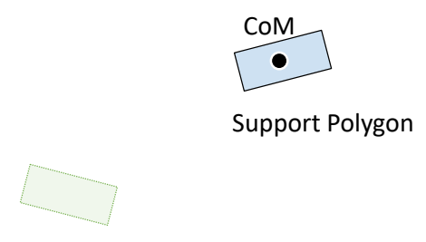

P2  
# Outline   

 - Walking and Dynamic Balance   

 - Simplified Models   
     - ZMP (Zero-Moment Point)   
     - Inverted Pendulum   
     - SIMBICON   

> &#x2705; 不能直接控制角色位置，而是通过与地面的力和反作用力。  

P3  
# Walking

> &#x1F50E; **Gait disorders in adults and the elderly**.  
phases of a walking gait cycle   
Pirker and Katzenschlager 2017.    
 

P4   
## Walking VS Running

|Walking|Running|
|---|---|
| Walking: move without *loss of contact*, or flight phases||

P7  
## Walking的几个阶段  

|||
|---|---|
|||
|||
|||

> &#x2705; 以上过程假设角色处于 static 状态。没有考虑到移动过程中的脚的动量。因此只能勉强保持角色稳定。要以非常慢的速度相前移动。    

---------------------------------------
> 本文出自CaterpillarStudyGroup，转载请注明出处。
>
> https://caterpillarstudygroup.github.io/GAMES105_mdbook/

