P2  
# Outline   

 - Walking and Dynamic Balance   

 - Simplified Models   
     - ZMP (Zero-Moment Point)   
     - Inverted Pendulum   
     - SIMBICON   

> &#x2705; 不能直接控制角色位置，而是通过与地面的力和反作用力。  

P3  
## Walking

phases of a walking gait cycle   
Pirker and Katzenschlager 2017.    
**Gait disorders in adults and the elderly**.   

P4   
## Walking

Walking: move without *loss of contact*, or flight phases   

P5  
## Walking   

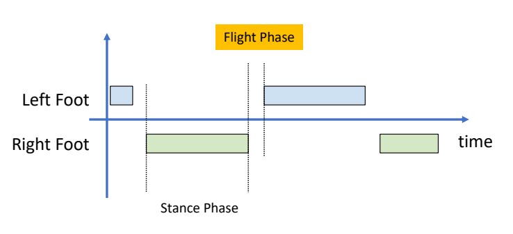

$$
\text{Running  } 
$$

P7  
## Walking with Static Balance  

 

P8   
## Walking with Static Balance   

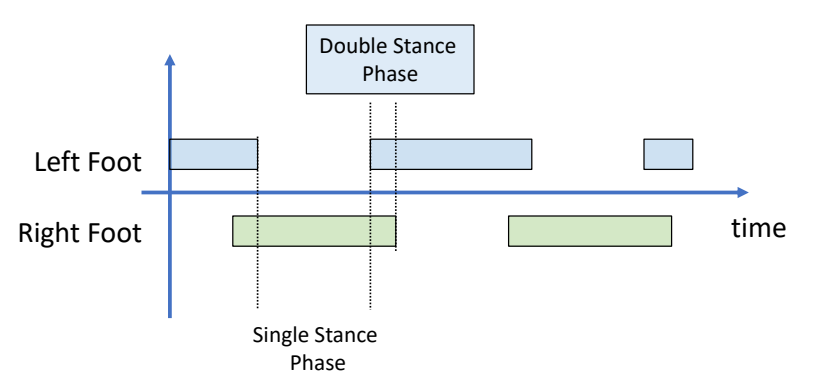
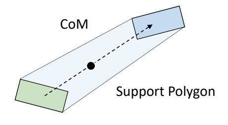

P9   
## Walking with Static Balance  

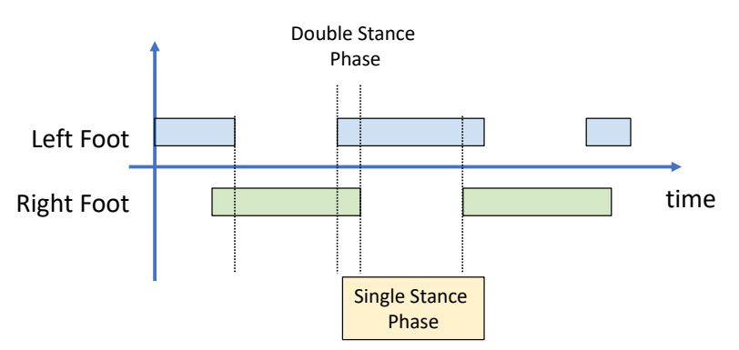

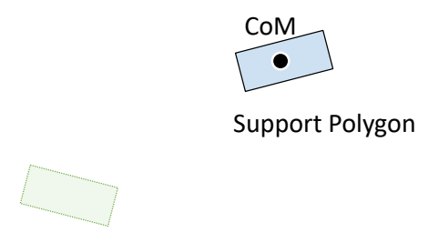

> &#x2705; 以上过程假设角色处于 static 状态。   
> &#x2705; 没有考虑到移动过程中的脚动量。  

P11   
## Zero-Moment Point (ZMP)

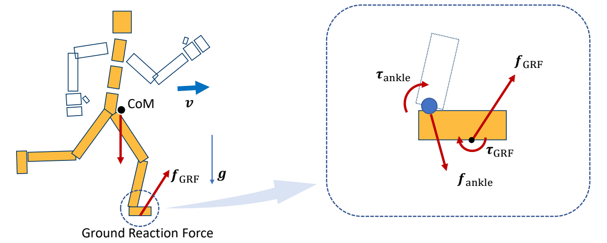   

> &#x2705; 角色受到重力和GRF力。   
> &#x2705; GRF ＝ 支持力（向上）＋ 动摩擦力（有速度时才有）   
> &#x2705; 简化：上半身受到的所有的力，都体现在 ankle 关节上。  

P12  
  
## Recall: A System of Links and Joints

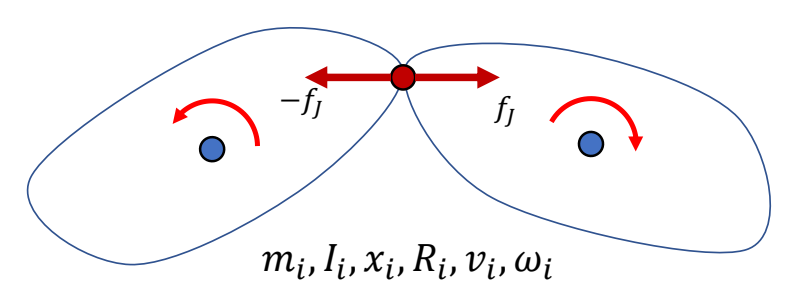   

$$
M\dot{v} +C(x,v)=f+f_J
$$

P15  
## Zero-Moment Point (ZMP)  

   

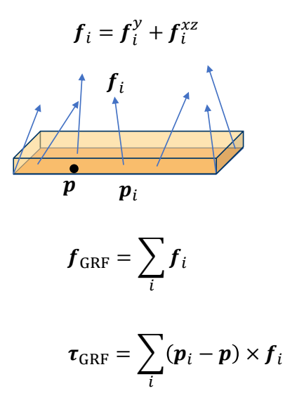   

> &#x2705; 仅分析脚上的力，\\(f_{\text{ankle}}\\) 为 ankle 上的力短转化到脚上的力。    
> &#x2705; 地面对脚的力不是施加到某一个点上，但可以根据公式换算成施加到某一点的力。  

P17   
## Zero-Moment Point (ZMP)

Assuming the ground is flat and level    
so \\(p_i\\) - \\(p\\)  is always in the horizontal plane   

   

P18  
## Zero-Moment Point (ZMP)

   

> &#x2705; 把 \\(\tau _{GRF} \\) 分解为与地面垂直部分和与地面平行部分。  
 

P19   
## Zero-Moment Point (ZMP)

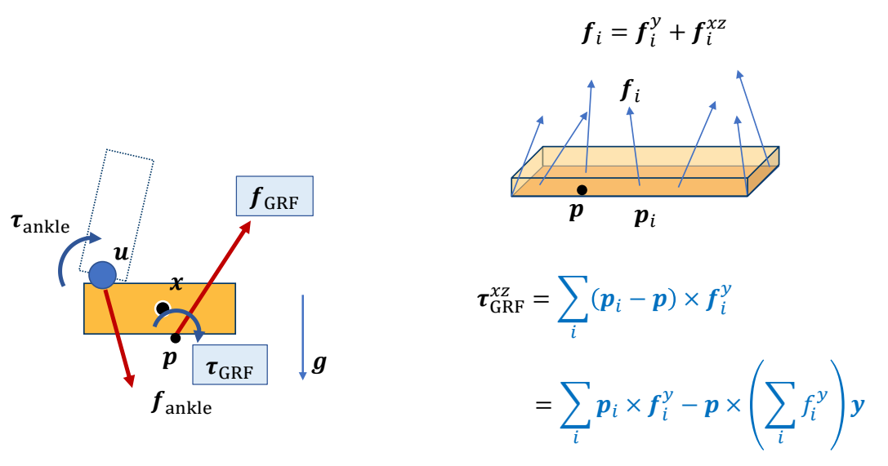   

> &#x2705; 力矩的方向是指它的旋转轴的方向。  

P20  
## Zero-Moment Point (ZMP)

   

   

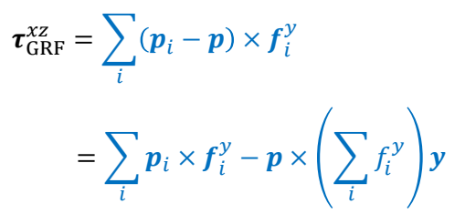   

Can we find \\(p\\) such that \\(\tau _{GRF}^{xz}=0\\) ?     

P21   
## Zero-Moment Point (ZMP)

   

P22  
## Zero-Moment Point (ZMP)

     

$$
\begin{align*}
f_{GRF}  & =\sum _{i}^{} f_i \\\\
 \tau _{GRF} & =\tau _{GRF}^y=\sum _{i}^{}(p_i-p)\times f_i^{xz}
\end{align*}
$$

> &#x2705; \\(p\\) 为 center pressure    

P24  
## Zero-Moment Point (ZMP)   

The position of \\(p\\) is not known, but we assume   

$$
\tau _{GRF}^{xz}=0
$$

SO

$$
\tau _{GRF}=\tau _{GRF}^y
$$

P26  
## Zero-Moment Point (ZMP)

   

The foot should not move in a **stance phase**   

Static Equilibrium:   

$$
f_{\text{ankle}} + f_{\text{GRF}} + mg = 0  
$$

The moment around a reference point \\(o\\):    

$$
(u-o) \times f_{\text{ankle}} + (p-o) \times f_{\text{GRF}} + (x-o)\times mg + \tau _{GRF}^{y} + \tau _{\text{ankle}} = 0
$$
   

> &#x2705; 在所有力作用下处于静平衡状态。  
> &#x2705; \\(o\\) 是一个参考点。  

P27   
## Zero-Moment Point (ZMP)   

Horizontal components (moment projected onto \\(xz\\) plane):       

$$
((u-o) \times f_{\text{ankle}})^{xz} +( (p-o) \times f_{\text{GRF}} ) ^{xz}+ (x-o)\times mg + \tau _{\text{ankle}}^{xz} = 0
$$

> &#x2705; U：ankle 位置， \\(\quad\quad\\) O: 任意位置。   
> &#x2705; X：质心位置 \\(\quad\quad\quad\\) P：位置未知，高度为 0．  
> &#x2705; 总力矩为 0，否则人会旋转。   

P28   
## Zero-Moment Point (ZMP)

We can solve this equation to find \\(p\\)   

P29    
> &#x2705; \\(u，O，X\\) 都是已知，\\(p\\) 的高度为 0，只有 \\(P_xP_y\\) 未知且该公式分别在 \\(X\\) 和 \\(Z\\) 上成立，实际上是两个方程。   
> &#x2705; 两个未知量和两个方程，可以解出 \\(p\\)。   

P30   
## Zero-Moment Point (ZMP)   

\\(p\\) is **called Zero-Moment Point (ZMP)** because it makes   

$$
\tau _{GRF}^{xz}=0
$$

and the horizontal moment   

$$
((u-o) \times f_{\text{ankle}})^{xz} +( (p-o) \times f_{\text{GRF}} ) ^{xz}+ (x-o)\times mg + \tau _{\text{ankle}}^{xz} = 0
$$

Only when 𝑝 is within the support polygon!    

> &#x2705; \\(p\\) 满足（1）水平力矩为0.   
> &#x2705; （2）人整体上平衡。   

P33   
## Zero-Moment Point (ZMP)   

If the solution of   

$$
((u-o) \times f_{\text{ankle}})^{xz} +( (p-o) \times f_{\text{GRF}} ) ^{xz}+ (x-o)\times mg + \tau _{\text{ankle}}^{xz} = 0
$$

\\(p\\) is outside the support polygon   

\\(p\\) could NOT be the center of pressure, because all the GRFs 
are applied within the polygon, so that    

$$
\tau _{GRF}^{xz}\ne 0
$$

Or, if \\({p}' \\) is the real center of pressure, we have    

$$
((u-o) \times f_{\text{ankle}})^{xz} +( ({p}'-o) \times f_{\text{GRF}} ) ^{xz}+ (x-o)\times mg + \tau _{\text{ankle}}^{xz} \ne 0
$$

> &#x2705; \\({p}' \ne p\\)，\\({p}'\\) 处水平方向的合外力不为零，脚会翻转人会摔倒。   
> &#x2705; 如果求出 \\(p\\) 在 polygon 则不能平衡，因为不是 center pressure.  

P34   

the foot will rotate…    

P35   
## Zero-Moment Point (ZMP)  

The existence of ZMP is an indication of dynamic balance We can achieve balanced walking by controlling ZMP But how?    

P36   
## Simplified Models   

 - Simplify humanoid / biped robot into an abstract model   
    - Often consists of a CoM and a massless mechanism   
    - Need to map the state of the robot to the abstract model   

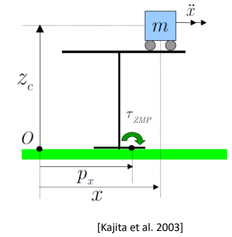 

 - Plan the control and movement of the model   
    - Optimization   
    - Dynamic programming   
    - Optimal control   
    - MPC   

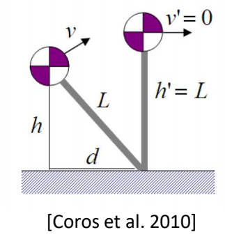   

 - Track the planned motion of the abstract model   
    - Inverse Kinematics   
    - Inverse Dynamics   

   

> &#x2705; 实际上更加复杂，对上半身任何一个部位的干挠，都会影响到脚上的力。  
> &#x2705; 因此，把最影响平衡的量拿出来，建立简化模型。   

P37  
## Example: ZMP-Guided Control   

  

   

  

> &#x2705; 把机器人简化为桌子和小车，通过控制小车来控制 ZMP.   
> &#x2705; 使 ZMP 满足预定义轨迹，通过优化得到 \\(m\\) 的运动。  

P38   
## Example: ZMP-Guided Control

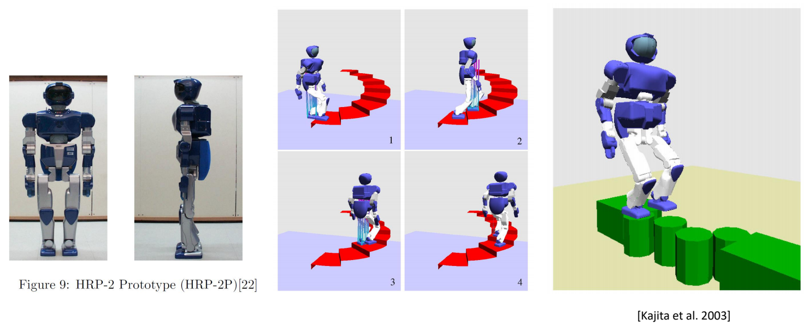   

> &#x2705; 局限性：(1) 脚必须与地面平行。 (2) 脚必须弯曲。 (3) 整体移动速度慢。  

P39   
## ASIMO

> &#x2705; 人的特点是重心偏离再拉回来，这样比始终保持平更省。   

P40  

## Walking == Falling + Step Planning   

P42  
## Inverted Pendulum Model (IPM)

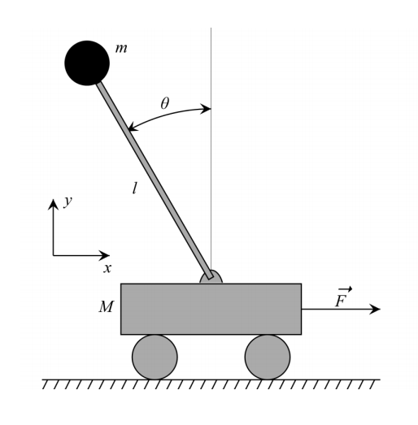   

   

Inverted pendulum on a cart   

> &#x2705; 倒立摆模型，控制小车使杆不掉下去。    

P44   
## Inverted Pendulum Model (IPM)   

 - Step Plan with IPM

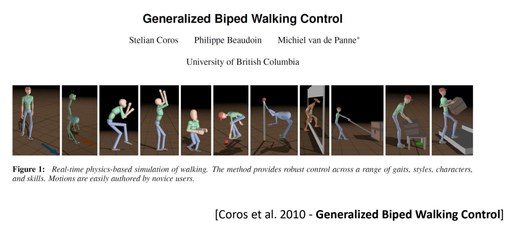  

P45   
## Inverted Pendulum Model (IPM)

 - Step Plan with IPM   
    - Map CoM of the character and the stance foot as IPM   
    - Plan the position of the next foot step so that the mass point rests at the top of the pendulum   
    - Create foot trajectory based on the step plan   
    - Compute target poses using IK   

  

> &#x2705; 脚到重心是一个倒立摆。  
> &#x2705; 由于失去平衡，质心有一个向前的速度，通过到一个合适的落脚点，使质心到达脚的正上方刚好到达速度稳定。  
> &#x2705; 算出脚的目标位置后，插值，IK，PD 控制。   

P46   
## Inverted Pendulum Model (IPM)    

 - Step Plan with IPM

  

> &#x2705; 动能转势能，能量守恒．算出高度。   
> &#x2705; 注意：杆的长度是不确定的，因为腿会弯曲。   

P47   

## Generalized walking control

> &#x2705; 可以适用于不同角色，不同动作，不同环境交互。   

P48   
## SIMBICON   

 - SIMBICON (SIMple BIped Locomotion CONtrol)   
    - Yin et al. 2007   
 
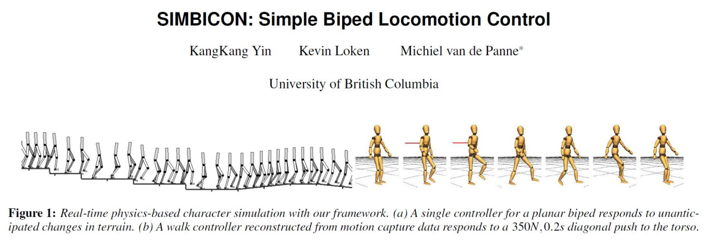  

> &#x2705; 经典工作，第一个实现了鲁棒的步态控制。  

P49   
## SIMBICON   

 - Step 1: develop a cyclical base motion   
    - PD controllers track target angles   
    - FSM (Finite State Machine) or mocap   

  

> &#x2705; 本质上是一个跟踪控制器。  

P50   
## SIMBICON   

 - Step 2:    
    - control torso and swing-hip wrt world frame   

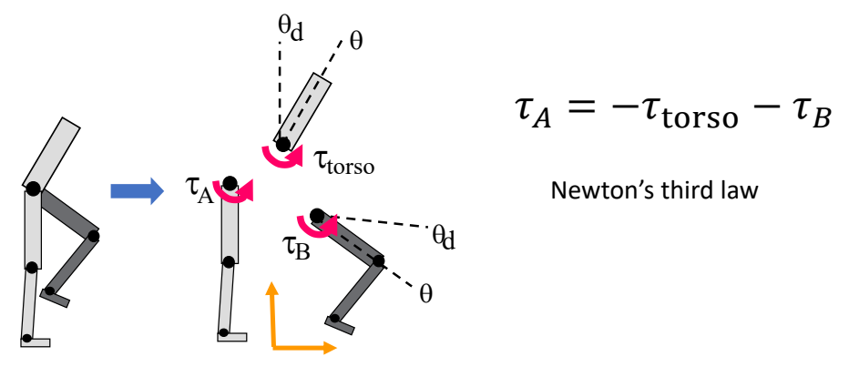  

> &#x2705; 控制目标：上半身保持竖直。  
> &#x2705; 控制方法：通过 \\(\tau _{A} \\) 和 \\(\tau _{B} \\) 控制 \\(\tau _{\text{torso}} \\).   

P51  
## SIMBICON  

 - Step 3: COM feedback   

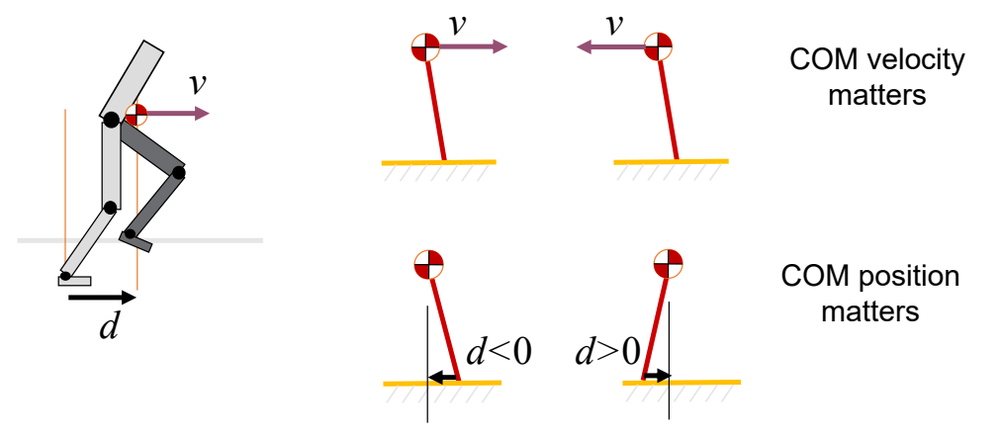  

> &#x2705; \\(d\\) 与 \\(D\\) 有关，但关系复杂，在此处做了简化。   
> &#x2705; 估计下一个脚步的位置，使质心处于可控范围内。   

P52   
## SIMBICON   

 - Step 3: COM feedback    

  

> &#x2705; 简化问题：\\(d\\) 和 \\(v\\) 与 \\(\theta _d\\) 的速度是线性关系。速度会转化为 PD 目标的修正。   
> &#x2705; 线性的系数为手调。   

P53   
## SIMBICON   
 
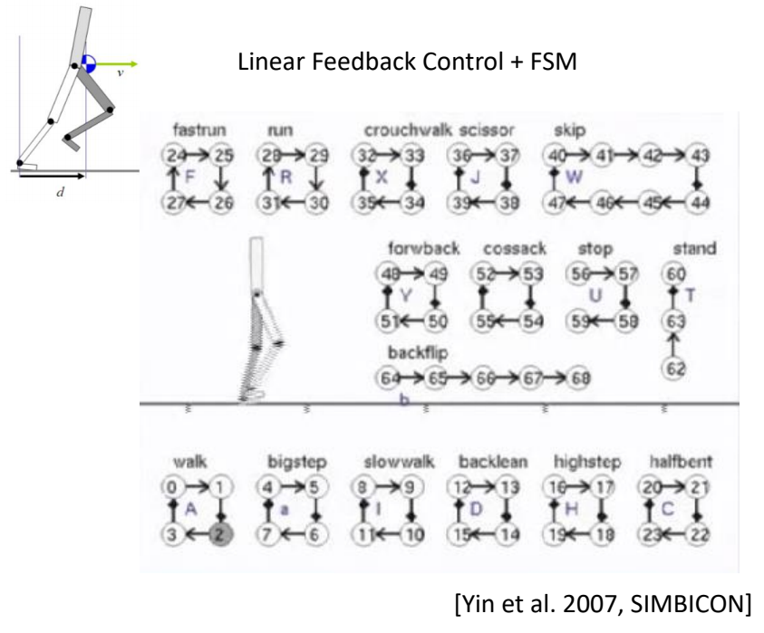  

P54   
## Outline   

 - How to generalize to other motion?    

  

---------------------------------------
> 本文出自CaterpillarStudyGroup，转载请注明出处。
>
> https://caterpillarstudygroup.github.io/GAMES105_mdbook/
