# 角色位移控制 (Locomotion Control) 技术洞察

**更新时间**: 2026-03-29

**范围**: 2010-2025 年角色位移 (locomotion) 控制技术分析

---

## 一、概述

角色位移控制是计算机图形学、机器人学和游戏开发的核心问题，目标是**生成自然、稳定、可控的角色运动**（如行走、跑步、跳跃等）。

### 1.1 为什么 Locomotion 是一个难题？

1. **高维状态空间**: 人形角色通常有 30+ 自由度
2. **强非线性动力学**: 接触力、摩擦力、碰撞使系统高度非线性
3. **多模态行为**: 行走、跑步、跳跃等不同步态需要不同控制策略
4. **实时性要求**: 游戏/VR 应用需要 60+ FPS
5. **鲁棒性要求**: 需要抵抗外部扰动、适应地形变化

### 1.2 技术分类：运动学 vs 动力学

| 维度 | 运动学方法 (Kinematics) | 动力学方法 (Dynamics) |
|------|------------------------|----------------------|
| **核心目标** | 生成视觉上合理的动作 | 生成物理可行的动作 |
| **输出** | 关节姿态/速度 | 关节力矩/PD 控制目标 |
| **是否物理仿真** | 否 | 是 |
| **典型应用** | 动画生成、VR 化身 | 游戏、机器人仿真 |
| **优势** | 速度快、质量高 | 物理交互、抗扰动 |
| **局限** | 无法处理物理交互 | 训练成本高、实现复杂 |

---

## 二、基于运动学的方法 (Kinematics-based Methods)

**核心特征**：直接从数据学习动作生成，**不经过物理仿真**，输出为关节姿态。

### 2.1 技术演进时间线

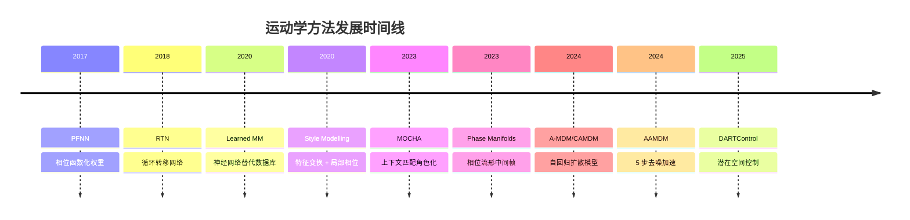

### 2.2 核心思想继承关系

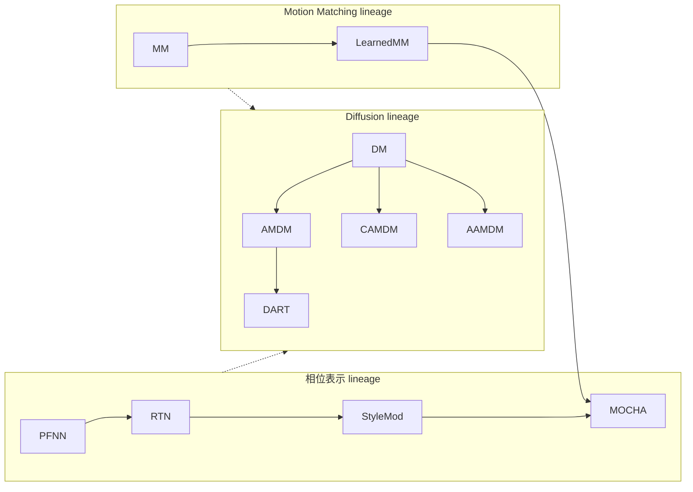

---

### 2.3 PFNN: Phase-Functioned Neural Networks (SIGGRAPH 2017)

**论文**: [[113.md](https://caterpillarstudygroup.github.io/ReadPapers/index.html)](https://caterpillarstudygroup.github.io/ReadPapers/src/113.html)

**核心创新**: 将相位从「网络输入特征」升级为「网络权重的参数化变量」

**架构**:

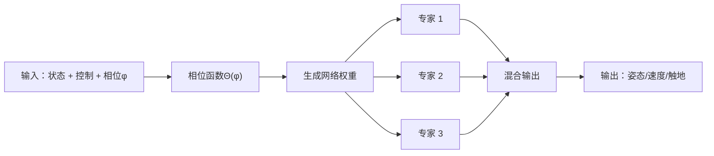

**关键洞察**:
- 相位作为权重参数，避免不同相位动作混合导致的 artifacts
- 使用 Cubic Catmull-Rom Spline 插值专家权重
- 地形数据增强：从平地 mocap 生成崎岖地形训练数据

**优点**:
- 相位解耦，避免 artifacts
- 仅 10MB 模型大小
- 实时 60 FPS

**缺点**:
- 仍需手工标注相位和步态标签
- 泛化能力有限，仅支持训练过的步态

---

### 2.4 RTN: Recurrent Transition Networks (SIGGRAPH 2018)

**论文**: [[210.md](https://caterpillarstudygroup.github.io/ReadPapers/index.html)](https://caterpillarstudygroup.github.io/ReadPapers/src/210.html)

**核心创新**: 首个专门为 transition 生成设计的未来感知深度循环架构

**背景**: 游戏动画图中 transition 数量随状态数指数增长，手工制作耗时。

**架构**:

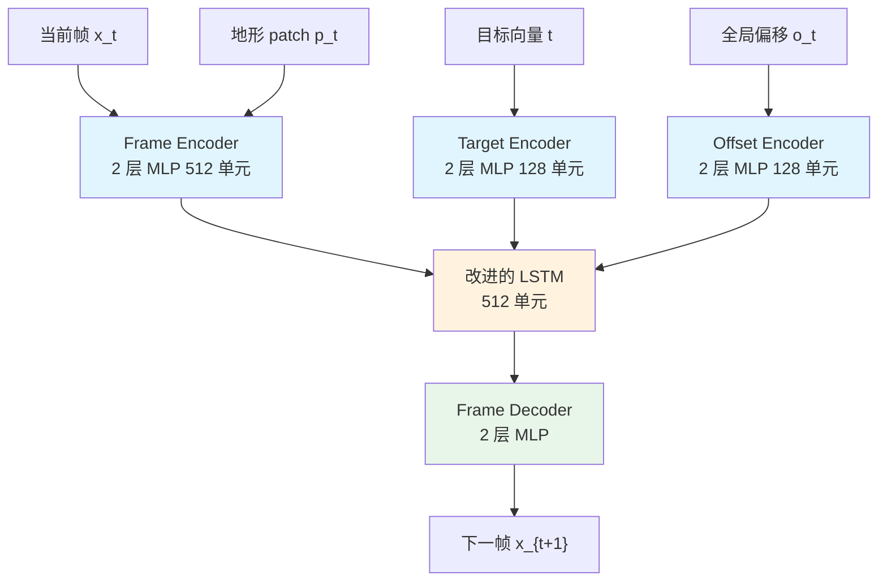

**改进的 LSTM 公式**:
\\[
\\begin{aligned}
i_t &= \\alpha(W^{(i)}h^E_t + U^{(i)}h^R_{t-1} + C^{(i)}h^{F,O}_t + b^{(i)}) \\\\
o_t &= \\alpha(W^{(o)}h^E_t + U^{(o)}h^R_{t-1} + C^{(o)}h^{F,O}_t + b^{(o)}) \\\\
f_t &= \\alpha(W^{(f)}h^E_t + U^{(f)}h^R_{t-1} + C^{(f)}h^{F,O}_t + b^{(f)}) \\\\
c_t &= f_t \\odot c_{t-1} + i_t \\odot \\tau(\\hat{c}_t) \\\\
h^R_t &= o_t \\odot \\tau(c_t)
\\end{aligned}
\\]

**关键设计**:
- 添加 \\(C^{(\\cdot)}\\) 权重用于未来上下文条件化
- Hidden State 初始化器：从第一帧映射到初始 hidden state
- 地形感知：局部高度图 \\(13 \\times 13\\) 网格
- **无需任何标注**（gait/phase/contact）

**与 PFNN 的差异**:
- PFNN: 生成连续 locomotion，需要相位标注
- RTN: 专门处理 transition 场景，无需标注

**优点**:
- **无需任何标注**
- 固定大小网络，不随数据集增长
- 质量媲美 mocap ground truth

**缺点**:
- Transition 长度固定
- 自回归生成，长 transition 推理慢

---

### 2.5 Real-Time Style Modelling (SIGGRAPH 2020)

**论文**: [[211.md](https://caterpillarstudygroup.github.io/ReadPapers/index.html)](https://caterpillarstudygroup.github.io/ReadPapers/src/211.html)

**核心创新**: Feature-Wise Transformations + Local Motion Phases

**架构**:

```mermaid
flowchart LR
    motion["输入动作 x"] --> Enc["动作编码器"]
    style["风格代码 z"] --> StyleEnc["风格编码器"]
    Enc --> FWT["Feature-Wise<br/>Transformation"]
    StyleEnc --> FWT
    FWT --> Dec["动作解码器"]
    Dec --> out["风格化动作 y"]
```

**AdaIN 公式**:
\\[
\\text{AdaIN}(x, z) = \\sigma(z) \\cdot \\frac{x - \\mu(x)}{\\sigma(x)} + \\mu(z)
\\]

**Local Motion Phases vs 全局相位**:

| 全局相位 | 局部相位 |
|---------|---------|
| 单一相位值 | 每个身体部位独立相位 |
| 适用于周期性动作 | 适用于非同步动作 |
| 难以处理复杂动作 | 灵活处理多接触动作 |

**与 PFNN 的继承关系**:
- PFNN: 全局相位，适用于 locomotion
- Style Modelling: 局部相位，适用于更复杂动作

**优点**:
- 实时 60+ FPS
- 支持多种风格平滑过渡
- 少样本风格学习

**缺点**:
- 仅适用于 locomotion
- 极端风格可能失真

---

### 2.6 Learned Motion Matching (SIGGRAPH 2020)

**论文**: [[208.md](https://caterpillarstudygroup.github.io/ReadPapers/index.html)](https://caterpillarstudygroup.github.io/ReadPapers/src/208.html)

**核心创新**: 用三个神经网络替代 Motion Matching 的数据库搜索

**背景**: Motion Matching 是游戏工业标准，但需要存储海量动画数据库，内存占用随数据量线性增长。

**三网络功能**:

| 网络 | 输入 | 输出 | 替代功能 |
|------|------|------|----------|
| **Decompressor** | 特征向量 x + 潜变量 z | 姿态 y | Animation Database 查找 |
| **Projector** | 查询特征向量 | 最近邻索引 k* | 最近邻搜索 |
| **Stepper** | 当前索引 k* | 下一帧索引 | 数据库索引推进 |

**优点**:
- 保留 Motion Matching 的质量和可控性
- 固定内存占用（网络权重），不随数据量增长
- 已应用于多个 AAA 游戏

**缺点**:
- 训练时间比原始 Motion Matching 长
- 网络预测 vs 精确搜索有轻微质量损失

---

### 2.7 MOCHA: Real-Time Motion Characterization (SIGGRAPH Asia 2023)

**论文**: [[209.md](https://caterpillarstudygroup.github.io/ReadPapers/index.html)](https://caterpillarstudygroup.github.io/ReadPapers/src/209.html)

**核心创新**: 首个实时角色表征框架，**同时转换动作风格和身体比例**

**背景**: 将中性动作转换为特定角色风格（如僵尸、公主、小丑），同时适配不同体型。

**架构**:

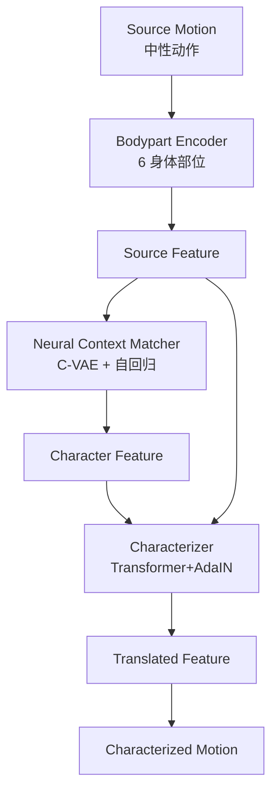

**AdaIN 公式**:
\\[
\\text{AdaIN}(z_{src}, z_{cha}) = \\sigma(z_{cha}) \\cdot \\frac{z_{src} - \\mu(z_{src})}{\\sigma(z_{src})} + \\mu(z_{cha})
\\]

**NCM Prior**:
\\[
p(s_i | z_{i-1}^{cha}, f(z_i^{src})) = \\mathcal{N}(\\mu, \\sigma)
\\]

**与 Style Modelling 的继承关系**:
- Style Modelling: AdaIN 用于风格转换
- MOCHA: AdaIN + Transformer，同时处理风格 + 体型

**优点**:
- 实时 60 FPS
- 同时处理风格转换 + 身体比例适配
- 支持稀疏输入（VR tracker）

**缺点**:
- 训练数据中的角色有限，新角色需重新训练
- 极端风格可能失真

---

### 2.8 Motion In-Betweening with Phase Manifolds (2023)

**论文**: [[212.md](https://caterpillarstudygroup.github.io/ReadPapers/index.html)](https://caterpillarstudygroup.github.io/ReadPapers/src/212.html)

**核心创新**: 使用 Periodic Autoencoder 学习相位变量，在相位空间进行插值

**架构**:


**相位约束**:
- 相位在单位圆上：\\(\\phi \\in [0, 2\\pi)\\)
- 周期性：\\(\\phi(t) = \\phi(t + T)\\)

**与 RTN 的差异**:
- RTN: transition 生成，连接两个状态
- Phase Manifolds: in-betweening，支持用户约束

**优点**:
- 生成自然流畅的过渡
- 支持用户约束（end effector 位置）
- 多样化过渡生成

**缺点**:
- 依赖训练数据
- 长过渡质量下降

---

### 2.9 自回归扩散模型系列 (2024-2025)

#### 核心思想演进

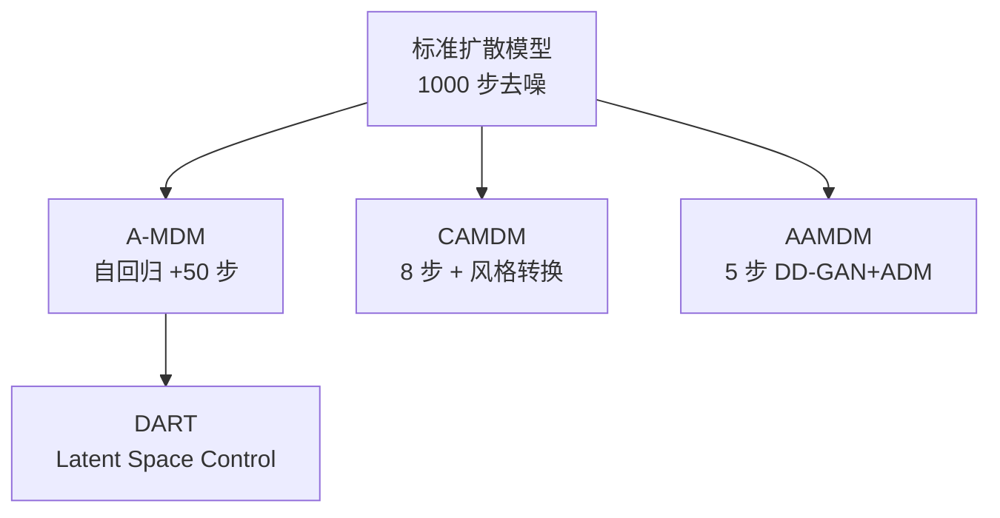

---

#### A-MDM: Auto-regressive Motion Diffusion Model (SIGGRAPH 2024)

**论文**: [[206.md](https://caterpillarstudygroup.github.io/ReadPapers/index.html)](https://caterpillarstudygroup.github.io/ReadPapers/src/206.html)

**核心创新**: 将扩散模型从 space-time 重新设计为 auto-regressive

**自回归公式**:
\\[
p(x_{1:T}) = \\prod_{t=1}^{T} p(x_t | x_{1:t-1})
\\]

**架构**: 简单 3 层 MLP，50 步去噪

**控制套件**:
- Task-oriented sampling
- Motion in-painting
- Keyframe in-betweening
- Hierarchical reinforcement learning

**与 CAMDM 的差异**:
- A-MDM: 强调控制套件，MLP 架构
- CAMDM: 强调风格转换，Transformer 架构

---

#### CAMDM: Conditional Autoregressive Motion Diffusion Model (SIGGRAPH 2024)

**论文**: [[207.md](https://caterpillarstudygroup.github.io/ReadPapers/index.html)](https://caterpillarstudygroup.github.io/ReadPapers/src/207.html)

**核心创新**: **8 步去噪**实现实时高质量多样角色动画

**关键技术**:

| 技术 | 作用 |
|------|------|
| **分离条件 Tokenization** | 每个控制条件独立 token，避免特征主导 |
| **Classifier-free guidance on history** | 在历史动作上应用 guidance，实现风格转换 |
| **启发式轨迹扩展** | 回收上次预测轨迹，避免抖动 |

**条件输入**:
- 风格/步态
- 移动速度
- 朝向方向
- 未来轨迹

**优点**:
- 8 步去噪 ≈ 几毫秒，60+ FPS
- 支持多风格平滑转换
- 无需微调实现风格转换

**缺点**:
- 8 步去噪仍有优化空间
- 依赖 mocap 数据

---

#### AAMDM: Accelerated Auto-regressive Motion Diffusion Model (CVPR 2024)

**论文**: [[204.md](https://caterpillarstudygroup.github.io/ReadPapers/index.html)](https://caterpillarstudygroup.github.io/ReadPapers/src/204.html)

**核心创新**: **5 步去噪** (3 DD-GAN + 2 ADM)

**架构**:
```
Autoencoder: 338D pose → 64D latent
      ↓
Generation Module: DD-GANs (3 步)
      ↓
Polishing Module: ADM (2 步)
      ↓
输出：高质量动作
```

**总去噪步数**: \\(T_{AA} = T_{GAN} + T_{ADM} = 3 + 2 = 5\\)

**与 CAMDM 的差异**:
- CAMDM: 8 步，强调风格转换
- AAMDM: 5 步，强调加速

---

#### DARTControl: Diffusion-based Autoregressive Motion Model (ICLR 2025)

**论文**: [[205.md](https://caterpillarstudygroup.github.io/ReadPapers/index.html)](https://caterpillarstudygroup.github.io/ReadPapers/src/205.html)

**核心创新**: Motion Primitive 表示 + Latent Space Control

**Motion Primitive**:
- H=2 帧历史（与前一 primitive 重叠）
- F=8 帧未来

**Latent Space Control 方法**:
1. **优化方法**: latent noise optimization
2. **学习方法**: MDP + RL (PPO)

**优势**: 10x 加速 vs FlowMDM

**与 A-MDM 的差异**:
- A-MDM: 原始空间扩散
- DART: Latent 空间扩散，更高效

---

### 2.10 运动学方法对比

| 方法 | 架构 | 去噪步数 | FPS | 风格转换 | 空间控制 |
|------|------|---------|-----|---------|---------|
| **PFNN** | 混合专家 | N/A | 60+ | △ | △ |
| **RTN** | LSTM | N/A | 60+ | ✗ | ✓ |
| **Learned MM** | 三网络 | N/A | 60+ | ✗ | △ |
| **Style Modelling** | FWT+ 相位 | N/A | 60+ | ✓ | ✗ |
| **MOCHA** | Transformer | N/A | 60+ | ✓ | ✗ |
| **Phase Manifolds** | MoE | N/A | 30+ | ✗ | ✓ |
| **A-MDM** | MLP | 50 | 30+ | △ | △ |
| **CAMDM** | Transformer | 8 | 60+ | ✓ | ✓ |
| **AAMDM** | DD-GAN+ADM | 5 | 60+ | △ | ✗ |
| **DART** | Latent Diffusion | ~20 | 60+ | ✓ | ✓ |

---

## 三、基于动力学的方法 (Dynamics-based Methods)

**核心特征**: 输出为**关节力矩或 PD 控制目标**，需要物理仿真器执行。

### 3.1 技术演进时间线

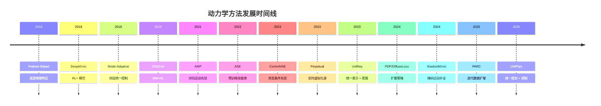

### 3.2 核心思想继承关系

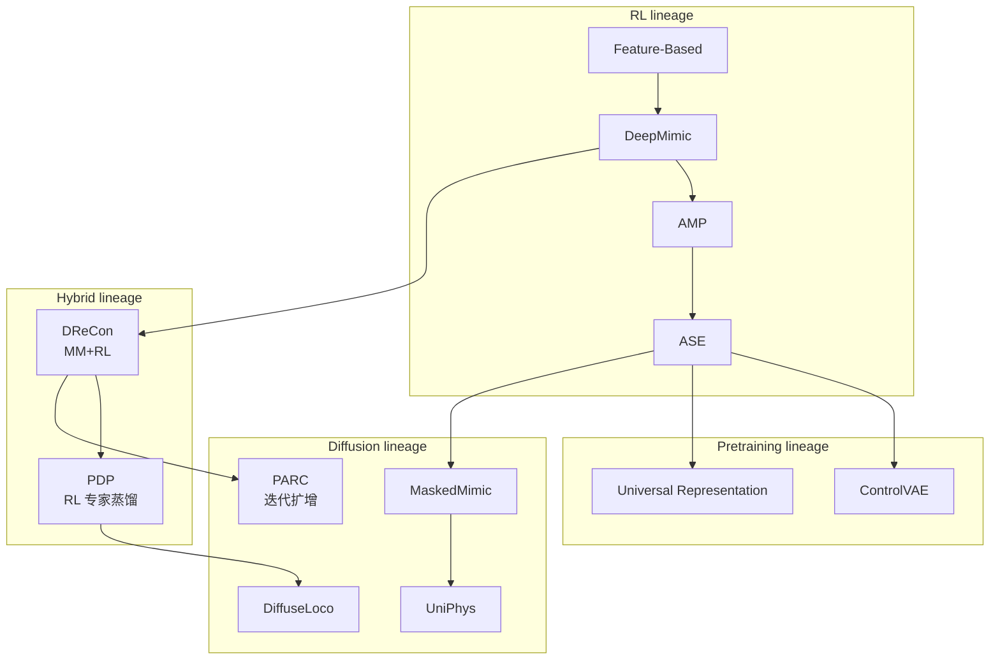

---

### 3.3 Feature-Based Control (SIGGRAPH 2010)

**论文**: [[200.md](https://caterpillarstudygroup.github.io/ReadPapers/index.html)](https://caterpillarstudygroup.github.io/ReadPapers/src/200.html)

**核心思想**: 用高层物理特征设计控制器

**方法框架**:


**关键公式**:
- Setpoint 目标：\\(E(x) = ||\\ddot{y}_d - \\ddot{y}||^2\\)
- 角动量目标：\\(E_{AM}(x) = ||\\dot{L}_d - \\dot{L}||^2\\)
- 优先级优化：\\(h_i = \\min_x E_i(x)\\) s.t. \\(E_k(x) = h_k, \\forall k < i\\)

**优点**: 可解释、无需数据
**缺点**: 实现复杂、动态性差

---

### 3.4 DeepMimic (SIGGRAPH 2018)

**论文**: [[201.md](https://caterpillarstudygroup.github.io/ReadPapers/index.html)](https://caterpillarstudygroup.github.io/ReadPapers/src/201.html)

**核心创新**: 深度 RL + 模仿学习

**方法框架**:


**模仿奖励**:
\\[
r^I_t = w_p r^p_t + w_v r^v_t + w_e r^e_t + w_c r^c_t
\\]

**训练技巧**:
- **RSI (Reference State Initialization)**: 从参考动作随机状态开始
- **ET (Early Termination)**: 跌倒立即终止
- **相位条件化**: \\(\\phi_t = (t \\mod T_{cycle}) / T_{cycle}\\)

**优点**: 动作质量高、可学习动态动作
**缺点**: 每技能单独训练、样本效率低

---

### 3.5 Mode-Adaptive Neural Networks (SIGGRAPH 2018)

**论文**: [[213.md](https://caterpillarstudygroup.github.io/ReadPapers/index.html)](https://caterpillarstudygroup.github.io/ReadPapers/src/213.html)

**核心创新**: 单个神经网络处理多种四足动物步态

**架构**:

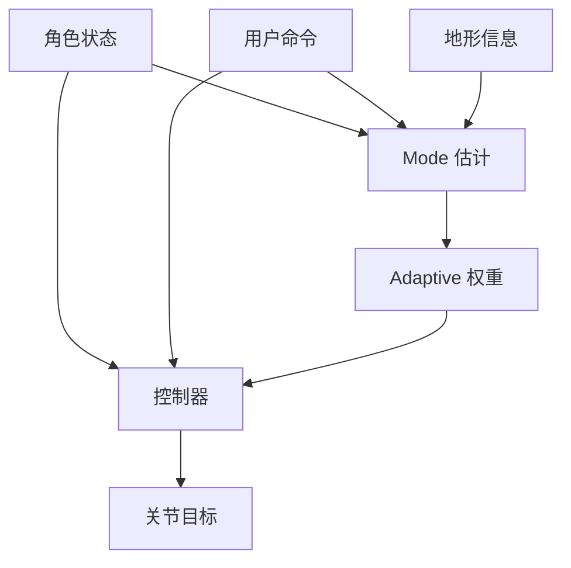

**优点**:
- 流畅的步态切换
- 适应不同地形
- 自然运动质量

**缺点**:
- 仅适用于四足动物
- 需要 mocap 数据

---

### 3.6 DReCon (SIGGRAPH Asia 2019)

**论文**: [[190.md](https://caterpillarstudygroup.github.io/ReadPapers/index.html)](https://caterpillarstudygroup.github.io/ReadPapers/src/190.html)

**核心架构**:


**创新点**:
- 用 Motion Matching 替代 mocap 参考轨迹
- RL 输出 PD 目标而非直接力矩
- 支持实时响应

**与 DeepMimic 的差异**:
- DeepMimic: 跟踪单一 mocap 片段
- DReCon: 用 Motion Matching 选择参考轨迹

---

### 3.7 AMP: Adversarial Motion Priors (SIGGRAPH 2021)

**论文**: [[198.md](https://caterpillarstudygroup.github.io/ReadPapers/index.html)](https://caterpillarstudygroup.github.io/ReadPapers/src/198.html)

**核心创新**: 用对抗学习从**无标注数据**学习

**方法框架**:

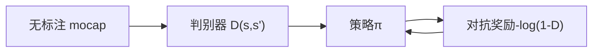

**对抗奖励**:
\\[
r_{adv} = -\\log(1 - D(s_t, s_{t+1}))
\\]

**AMP 的核心优势**:
1. 无需精确跟踪参考动作
2. 能够从多样化数据集学习
3. 自动学习技能组合

**局限性**:
- 训练不稳定（对抗博弈）
- GAN+RL 训练难度大

---

### 3.8 ASE: Adversarial Skill Embeddings (SIGGRAPH 2022)

**论文**: [[199.md](https://caterpillarstudygroup.github.io/ReadPapers/index.html)](https://caterpillarstudygroup.github.io/ReadPapers/src/199.html)

**核心创新**: 预训练通用技能库 + 下游微调

**两阶段训练**:

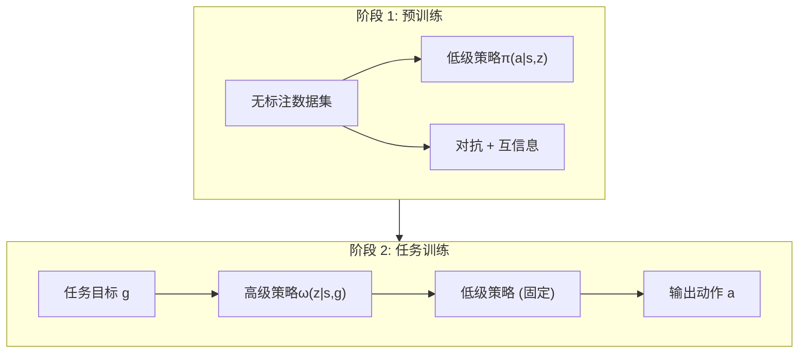

**预训练目标**:
\\[
\\max_{\\pi} -D_{JS}(d_{\\pi} || d_M) + \\beta I(s, s'; z | \\pi)
\\]

**与 AMP 的差异**:
- AMP: 每任务从头训练
- ASE: 预训练可复用，技能库学习

**优点**: 技能可复用、支持插值和组合
**缺点**: 需要大规模并行模拟（Isaac Gym）

---

### 3.9 ControlVAE (TOG 2023)

**论文**: [[202.md](https://caterpillarstudygroup.github.io/ReadPapers/index.html)](https://caterpillarstudygroup.github.io/ReadPapers/src/202.html)

**核心创新**: 状态条件先验 + 世界模型

**与 ASE 对比**:
| 维度 | ASE | ControlVAE |
|------|-----|------------|
| 先验类型 | 球面均匀分布 | 状态条件高斯 |
| 学习方式 | 对抗 + 互信息 | 世界模型 + ELBO |
| 技能表示 | 离散技能库 | 连续潜在空间 |

---

### 3.10 Perpetual Humanoid Control (ICCV 2023)

**论文**: [[196.md](https://caterpillarstudygroup.github.io/ReadPapers/index.html)](https://caterpillarstudygroup.github.io/ReadPapers/src/196.html)

**核心创新**: 实时虚拟化身控制系统

**系统架构**:


**特点**:
- Meta 出品，面向 VR/AR 应用
- 实时优先，支持多种输入源
- 物理感知保证可行性

---

### 3.11 Universal Humanoid Motion Representations (2023)

**论文**: [[191.md](https://caterpillarstudygroup.github.io/ReadPapers/index.html)](https://caterpillarstudygroup.github.io/ReadPapers/src/191.html)

**核心创新**: 建立 Prior + Distillation + RL 的标准范式

**三阶段训练**:

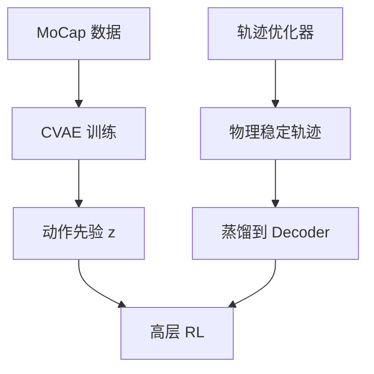

**核心困境解决**:
- MoCap 生成模型：动作自然但物理不稳定
- 纯轨迹优化：物理稳定但动作单调

**方案**: 用蒸馏将物理稳定性灌进网络，保留 z 的多样性

**历史贡献**: 定型并普及了 **Prior + Distillation + RL** 的标准流水线

---

### 3.12 扩散模型时代的动力学方法 (2024-2025)

#### DiffuseLoco (2024)

**论文**: [[195.md](https://caterpillarstudygroup.github.io/ReadPapers/index.html)](https://caterpillarstudygroup.github.io/ReadPapers/src/195.html)

**方法框架**:


**优点**: 离线训练、无需在线 RL

---

#### PDP: Physics-Based Character Animation via Diffusion Policy (2024)

**论文**: [[192.md](https://caterpillarstudygroup.github.io/ReadPapers/index.html)](https://caterpillarstudygroup.github.io/ReadPapers/src/192.html)

**核心**: RL 专家蒸馏 + 扩散策略

**两阶段训练**:
1. 训练多个单任务 RL 专家
2. 离线行为克隆蒸馏到单一 Diffusion Policy

**与 DReCon 的继承关系**:
- DReCon: Motion Matching + RL
- PDP: RL 专家 + Diffusion Policy

---

#### MaskedMimic (SIGGRAPH Asia 2024)

**论文**: [[183.md](https://caterpillarstudygroup.github.io/ReadPapers/index.html)](https://caterpillarstudygroup.github.io/ReadPapers/src/183.html)

**核心创新**: 掩码运动补全统一多模态控制

**CVAE 架构**:
- 输入：多模态控制信号（掩码关键帧、对象、文本等）
- 输出：物理一致的 PD 控制目标

**特点**:
- 无需奖励工程
- 支持无缝任务切换
- 实时响应能力

**与 UniPhys 的对比**:
- MaskedMimic: 掩码补全范式
- UniPhys: Diffusion Forcing 范式

---

#### PARC (SIGGRAPH 2025)

**论文**: [[189.md](https://caterpillarstudygroup.github.io/ReadPapers/index.html)](https://caterpillarstudygroup.github.io/ReadPapers/src/189.html)

**核心创新**: 基于物理仿真的迭代数据扩增框架

**迭代循环**:

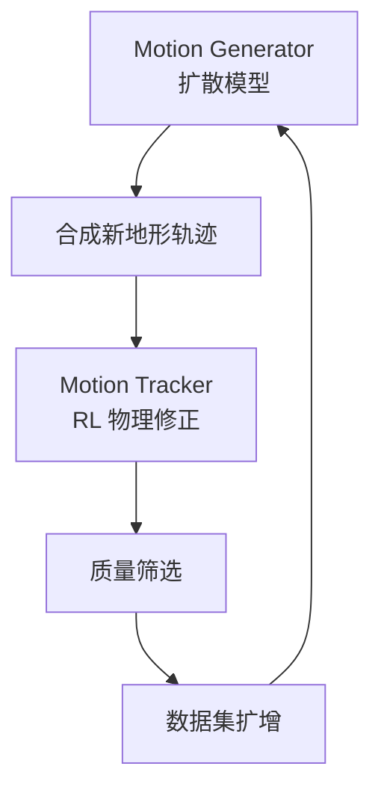

**四项关键机制防止性能退化**:
1. **固定采样比例**: 保留原始 mocap 作为监督锚点
2. **物理约束修正**: RL 控制器修正为物理可信运动
3. **质量筛选**: 仅保留成功样本
4. **小步迭代**: 微调策略，防止分布漂移

**应用场景**: 敏捷地形穿越（如跑酷）

**与 DReCon 的继承关系**:
- DReCon: Motion Matching + RL 跟踪
- PARC: 扩散生成 + RL 跟踪 + 迭代扩增

---

#### UniPhys (2025)

**论文**: [[191.md](https://caterpillarstudygroup.github.io/ReadPapers/index.html)](https://caterpillarstudygroup.github.io/ReadPapers/src/191.html)

**核心创新**: 统一规划器 + 控制器，Diffusion Forcing 范式

**方法框架**:

```mermaid
flowchart LR
    Mocap["mocap 数据"] --> Preprocess["PD 控制预处理"]
    Preprocess --> GT["物理合理 GT<br/>动作略僵硬"]
    GT --> Train["训练 Diffusion 模型"]
    MultiModal["多模态输入<br/>文本/轨迹/目标"] --> Infer["引导采样推理"]
    Train --> Infer
    Infer --> Output["物理合理运动"]
```

**与 MaskedMimic 对比**:
| 维度 | MaskedMimic | UniPhys |
|------|-------------|---------|
| 训练范式 | 掩码补全 | Diffusion Forcing |
| PD 目标来源 | mocap+ 跟踪 | mocap+PD 预处理 |
| 长序列处理 | 较短序列 | 噪声历史去噪 |

**优点**:
- 无需强化学习和蒸馏
- 训练简单，单模型推理
- 物理合理但动作略僵硬

---

### 3.13 动力学方法对比

| 方法 | 训练范式 | 样本效率 | 动作质量 | 抗扰动 | 实时性 |
|------|---------|---------|---------|-------|-------|
| **Feature-Based** | 无需训练 | N/A | 中 | 中 | ✓ |
| **DeepMimic** | RL+ 模仿 | 低 | 极高 | 高 | ✓ |
| **Mode-Adaptive** | 模仿学习 | 中 | 高 | 高 | ✓ |
| **DReCon** | RL+MM | 中 | 高 | 高 | ✓ |
| **AMP** | 对抗学习 | 低 | 极高 | 高 | ✓ |
| **ASE** | 预训练 + 微调 | 高 | 极高 | 高 | ✓ |
| **ControlVAE** | 世界模型 | 高 | 高 | 高 | ✓ |
| **Perpetual** | 实时跟踪 | 高 | 高 | 高 | ✓ |
| **UniRep** | Prior+ 蒸馏 +RL | 高 | 高 | 高 | ✓ |
| **DiffuseLoco** | 离线蒸馏 | 高 | 极高 | 高 | ✓ |
| **PDP** | RL 专家蒸馏 | 中 | 极高 | 高 | ✓ |
| **MaskedMimic** | 掩码补全 | 高 | 极高 | 高 | ✓ |
| **PARC** | 迭代扩增 | 高 | 极高 | 高 | ⚠️ |
| **UniPhys** | 直接训练 | 高 | 高 | 高 | ⚠️ |

---

## 四、运动学 vs 动力学：技术选型指南

### 4.1 核心差异

| 维度 | 运动学方法 | 动力学方法 |
|------|-----------|-----------|
| **输出** | 关节姿态/速度 | 关节力矩/PD 控制目标 |
| **物理仿真** | 否 | 是 |
| **真实感来源** | 数据驱动 | 物理约束 + 数据 |
| **抗扰动能力** | 无 | 强 |
| **环境交互** | 有限 | 强 |
| **训练成本** | 低 - 中 | 中 - 高 |
| **实现难度** | 低 | 高 |

### 4.2 思想演进总结

#### 运动学方法演进主线

1. **相位表示线** (PFNN → Style Modelling → MOCHA → Phase Manifolds)
   - 核心思想：用相位解耦不同动作状态
   - 演进：全局相位 → 局部相位 → 相位流形插值

2. **Motion Matching 线** (MM → Learned MM → MOCHA)
   - 核心思想：用数据搜索生成动作
   - 演进：数据库搜索 → 神经网络预测 → 角色化扩展

3. **扩散模型线** (A-MDM → CAMDM → AAMDM → DART)
   - 核心思想：扩散模型高质量生成
   - 演进：1000 步 → 50 步 → 8 步 → 5 步，同时支持实时控制

#### 动力学方法演进主线

1. **RL 模仿线** (DeepMimic → AMP → ASE)
   - 核心思想：从 mocap 数据学习控制策略
   - 演进：单技能跟踪 → 对抗先验 → 预训练技能库

2. **混合控制线** (DReCon → PDP → PARC)
   - 核心思想：生成器 + RL 跟踪
   - 演进：Motion Matching → RL 专家 → 扩散模型 + 迭代扩增

3. **统一表示线** (ControlVAE → UniRep → MaskedMimic → UniPhys)
   - 核心思想：统一潜在空间表示
   - 演进：状态条件先验 → Prior+ 蒸馏 → 掩码补全 → Diffusion Forcing

### 4.3 应用场景推荐

| 应用场景 | 推荐方法 | 理由 |
|---------|---------|------|
| **游戏 NPC** | DeepMimic / ASE / Learned MM | 实时、质量高、抗扰动 |
| **电影动画** | CAMDM / DART / MOCHA | 多样性、风格控制、无需物理 |
| **VR 化身** | PFNN / CAMDM / MOCHA / Perpetual | 低延迟、稀疏输入支持 |
| **机器人仿真** | Feature-Based + RL / ASE | 安全、可解释、物理正确 |
| **在线游戏** | Learned Motion Matching | 低内存、服务器友好 |
| **角色设计** | MOCHA / Style Modelling | 风格转换、体型适配 |
| **四足动物** | Mode-Adaptive | 统一多步态控制 |
| **敏捷地形** | PARC / RTN (地形版) | 复杂地形穿越 |
| **多任务控制** | MaskedMimic / UniPhys | 统一框架处理多模态输入 |

### 4.4 方法选择决策树

```mermaid
flowchart TD
    Q1["需要物理仿真/抗扰动？"] --> |否 | A1["运动学方法"]
    Q1 --> |是 | A2["动力学方法"]

    A1 --> Q2["需要风格转换？"]
    Q2 --> |是 | A3["MOCHA / Style Modelling / CAMDM"]
    Q2 --> |否 | A4["PFNN / Learned MM / AAMDM"]

    A2 --> Q3["有无标注数据？"]
    Q3 --> |无 | A5["AMP / ASE"]
    Q3 --> |有 | A6["DeepMimic / DiffuseLoco"]

    A6 --> Q4["需要多模态控制？"]
    Q4 --> |是 | A7["MaskedMimic / UniPhys"]
    Q4 --> |否 | A8["PDP / DiffuseLoco"]

    A2 --> Q5["需要敏捷地形穿越？"]
    Q5 --> |是 | A9["PARC"]
```

---

## 五、开放性问题与未来趋势

### 5.1 技术挑战

1. **实时性与质量权衡**
   - 扩散模型推理速度仍是瓶颈
   - 方向：一致性模型、蒸馏、更少去噪步数

2. **长时序规划**
   - 当前方法多为短时域反应式
   - 方向：分层控制、世界模型、Diffusion Forcing

3. **多角色泛化**
   - 技能绑定特定形态
   - 方向：形态无关表示、零样本迁移

4. **与语言模型结合**
   - 自然语言指令驱动
   - 方向：LLM + 运动生成联合训练

5. **在线适应**
   - 适应新环境、新扰动
   - 方向：Test-Time Training、元学习、迭代扩增（如 PARC）

### 5.2 未来趋势

1. **运动学 + 动力学融合**
   - 运动学方法生成参考轨迹
   - 动力学方法保证物理可行性
   - 代表工作：UniPhys、PARC

2. **世界模型 + 扩散**
   - 学习可微物理引擎
   - 在 latent space 规划

3. **多模态大模型**
   - 视觉 + 语言 + 运动联合训练
   - 具身智能 (Embodied AI)

4. **自动技能发现**
   - 无监督发现技能层级
   - 类似 LLM 的 emergent abilities

5. **数据高效学习**
   - 少样本风格学习
   - 迭代数据扩增（PARC 范式）

---

## 六、关键论文索引

### 运动学方法

| 论文 | 年份 | 链接 | 核心贡献 |
|------|------|------|---------|
| PFNN | 2017 | [113](https://caterpillarstudygroup.github.io/ReadPapers/src/113.html) | 相位函数化权重 |
| RTN | 2018 | [210](https://caterpillarstudygroup.github.io/ReadPapers/src/210.html) | 循环转移网络 |
| Style Modelling | 2020 | [211](https://caterpillarstudygroup.github.io/ReadPapers/src/211.html) | 特征变换 + 局部相位 |
| Learned Motion Matching | 2020 | [208](https://caterpillarstudygroup.github.io/ReadPapers/src/208.html) | 神经网络替代数据库 |
| MOCHA | 2023 | [209](https://caterpillarstudygroup.github.io/ReadPapers/src/209.html) | 上下文匹配角色化 |
| Phase Manifolds | 2023 | [212](https://caterpillarstudygroup.github.io/ReadPapers/src/212.html) | 相位流形中间帧 |
| A-MDM | 2024 | [206](https://caterpillarstudygroup.github.io/ReadPapers/src/206.html) | 自回归扩散模型 |
| CAMDM | 2024 | [207](https://caterpillarstudygroup.github.io/ReadPapers/src/207.html) | 8 步去噪 + 风格转换 |
| AAMDM | 2024 | [204](https://caterpillarstudygroup.github.io/ReadPapers/src/204.html) | 5 步 DD-GAN+ADM |
| DARTControl | 2025 | [205](https://caterpillarstudygroup.github.io/ReadPapers/src/205.html) | 潜在空间控制 |

### 动力学方法

| 论文 | 年份 | 链接 | 核心贡献 |
|------|------|------|---------|
| Feature-Based Control | 2010 | [200](https://caterpillarstudygroup.github.io/ReadPapers/src/200.html) | 高层物理特征控制 |
| DeepMimic | 2018 | [201](https://caterpillarstudygroup.github.io/ReadPapers/src/201.html) | RL+ 模仿学习 |
| Mode-Adaptive | 2018 | [213](https://caterpillarstudygroup.github.io/ReadPapers/src/213.html) | 四足动物统一控制 |
| DReCon | 2019 | [190](https://caterpillarstudygroup.github.io/ReadPapers/src/190.html) | Motion Matching+RL |
| AMP | 2021 | [198](https://caterpillarstudygroup.github.io/ReadPapers/src/198.html) | 对抗运动先验 |
| ASE | 2022 | [199](https://caterpillarstudygroup.github.io/ReadPapers/src/199.html) | 预训练技能嵌入 |
| ControlVAE | 2023 | [202](https://caterpillarstudygroup.github.io/ReadPapers/src/202.html) | 状态条件先验 |
| Perpetual | 2023 | [196](https://caterpillarstudygroup.github.io/ReadPapers/src/196.html) | 实时虚拟化身 |
| UniRep | 2023 | [191](https://caterpillarstudygroup.github.io/ReadPapers/src/191.html) | 统一表示 + 蒸馏 |
| DiffuseLoco | 2024 | [195](https://caterpillarstudygroup.github.io/ReadPapers/src/195.html) | 扩散策略 |
| PDP | 2024 | [192](https://caterpillarstudygroup.github.io/ReadPapers/src/192.html) | RL 专家蒸馏 |
| MaskedMimic | 2024 | [183](https://caterpillarstudygroup.github.io/ReadPapers/src/183.html) | 掩码运动补全 |
| PARC | 2025 | [189](https://caterpillarstudygroup.github.io/ReadPapers/src/189.html) | 迭代数据扩增 |
| UniPhys | 2025 | [191](https://caterpillarstudygroup.github.io/ReadPapers/src/191.html) | 统一规划 + 控制 |

---

## 七、总结

角色位移控制领域呈现**双轨并行、多线演进**的发展态势：

**运动学方法**沿三条主线演进：
1. **相位表示线**：PFNN 的相位函数化权重 → Style Modelling 的局部相位 → MOCHA 的上下文匹配 → Phase Manifolds 的相位流形插值
2. **Motion Matching 线**：工业界标准 Motion Matching → Learned Motion Matching 的神经网络替代 → MOCHA 的角色化扩展
3. **扩散模型线**：A-MDM 的自回归设计 → CAMDM 的 8 步去噪 + 风格转换 → AAMDM 的 5 步加速 → DART 的潜在空间控制

**动力学方法**沿三条主线演进：
1. **RL 模仿线**：DeepMimic 的 RL+ 模仿 → AMP 的对抗先验 → ASE 的预训练技能库
2. **混合控制线**：DReCon 的 Motion Matching+RL → PDP 的 RL 专家蒸馏 → PARC 的扩散生成 + 迭代扩增
3. **统一表示线**：ControlVAE 的状态条件先验 → UniRep 的 Prior+ 蒸馏范式 → MaskedMimic 的掩码补全 → UniPhys 的 Diffusion Forcing

**融合趋势**：2024-2025 年的工作开始探索运动学 + 动力学的融合：
- UniPhys 用 PD 预处理保证物理合理性
- PARC 用迭代扩增结合生成与物理修正
- Perpetual 实现实时物理跟踪

这将是未来的重要方向。

---

**参考文献**: 详见各论文笔记文件
