# Lecture 02

P2  
## Outline   

 - Review of Linear Algebra    
    - Vector and Matrix   
    - Translation, Rotation, and Transformation   

 - Representations of 3D rotation   
    - Rotation matrices   
    - Euler angles   
    - Rotation vectors/Axis angles   
    - Quaternions   

P3

## Review of Linear Algebra    

#### Vectors and Matrices   

* a few slides were modified from GAMES-101 and GAMES-103   

P24   

> &#x2705; 两个单位向量的叉乘不一定是单位向量。   
> &#x2705; 要得到方向，应先叉乘再单位化   
> &#x2705; \\(n=\frac{a\times b}{||a\times b||} \quad\quad\quad n=\frac{a}{||a||} \times \frac{b}{||b||}\\)

P26   

## How to find the rotation between vectors?   

  

> &#x2705; 已知\\(a,b\\) , 求旋转。   

P27   

Any vector in the bisecting plane can be the axis

P28   

The minimum rotation:    
$$
𝒖 =\frac{𝒂 × 𝒃}{||𝒂 × 𝒃||}  \quad \quad  \theta = \mathrm{arg} \cos \frac{a\cdot b}{||a||||b||} 
$$

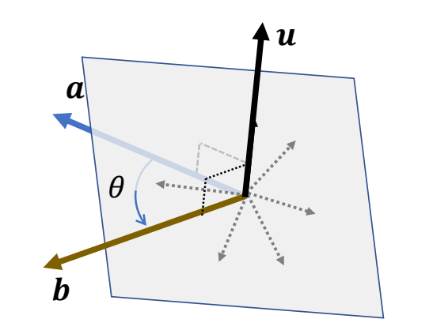  

> &#x2705; \\(u\\) 为旋转轴，\\( \theta \\) 为旋转角。   

P33   
## How to rotate a vectors?

  

$$
𝒗 \gets  𝒖 \times  𝒂
$$

$$
𝒕 \gets 𝒖 \times 𝒗 = 𝒖 \times( 𝒖 \times 𝒂)
$$

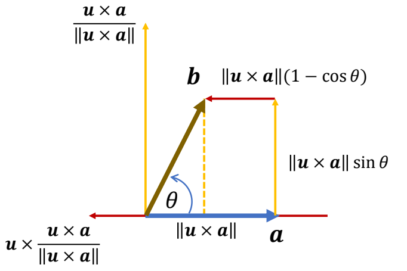  

> &#x2705; 已知 \\(a\\) 和旋转 \\((𝒖, \theta )\\) 求终点 \\(b\\)   
> &#x2705; \\(a\\) 移动到 \\(b\\) 看作是先移动 \\(𝒗\\) 再移动 \\(t\\)，分别计算 \\(𝒗\\) 和 \\(t\\) 的方向和长度。   
> &#x2705; 单独把平面拿出来看。 

P35   
## How to rotate a vectors?

$$
𝒗 = (\sin \theta) 𝒖 \times  𝒂
$$

$$
𝒕 =(1-\cos \theta ) 𝒖 \times( 𝒖 \times 𝒂)
$$

Rodrigues' rotation formula    

$$
𝒃 = 𝒂 + (\sin \theta) 𝒖 × 𝒂 + (1-\cos \theta ) 𝒖 \times( 𝒖 \times 𝒂)
$$

P53   

# Matrix   
## Matrix Form of Cross Product

$$
\begin{align*}
 c=a\times b= & \begin{bmatrix}
a_yb_z-a_zb_y \\\\
a_zb_x-a_xb_z \\\\
a_xb_y-a_yb_x
\end{bmatrix}\\\\
 = & \begin{bmatrix}
  0 & -a_z & a_y \\\\
  a_z & 0 & -a_x \\\\
  -a_y & a_x & 0
\end{bmatrix}\begin{bmatrix}
 b_x \\\\
b_y  \\\\
b_z
\end{bmatrix}=[a]_\times b
\end{align*}
$$

$$
\quad 
$$

$$ 
[a]_\times +[a]^ \mathbf{T} _\times =0 \quad \quad \mathrm{skewsymmetric} 
$$ 

P56  
## Matrix Form of Cross Product

$$
\begin{align*}
a \times b = &[a] _ \times b  \\\\
 a \times (b \times c) = & [a] _ \times ( [b] _ \times c ) \\\\
        =  & [a] _ \times [b] _ \times c  \\\\
 a \times (a \times c) = & [a] ^2 _ \times  b \\\\
 (a \times b) \times c = & [a\times b] _ \times  c \\\\
\end{align*}
$$

> &#x2705; 最后一个公式注意一下，叉乘不满足结合律。

P57   
## How to rotate a vectors?   

$$
\begin{align*}
b = & a+(\sin \theta )u \times a +(1-\cos \theta)u \times(u \times a) \\\\
 b = & (I+(\sin \theta ))[u]_ \times + (1-(\cos \theta )[u]^2_ \times ) a \\\\
 = & Ra
\end{align*}
$$

> &#x2705; 把前面的叉乘公式转化为点乘形式   

P58
## How to rotate a vectors?

Rodrigues' rotation formula

$$
R = I+(\sin \theta )[u]_ \times + (1-\cos \theta )[u]^2_ \times
$$

> &#x2705; \\(R\\) 是旋转 \\((u, \theta )\\) 对应的旋转矩阵。  

P62

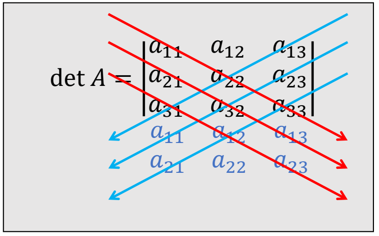  

> &#x2705; 行列式的计算：红色相乘减蓝色相乘。

P63   
## Determinant of a Matrix   

 - det \\(I = 1\\)     
 - det \\(AB = \text{ det } A ∗ \text{det } B\\)    
 - det \\(A^T\\) = det \\(A\\)   
 - If \\(A\\) is invertible，det \\(A^{−1}\\) = \\((\text{det } A)^{−1}\\)   
 - If \\(U\\) is orthogonal，\\(\text{det } U = ± 1\\)   

P64   
## Cross Product as a Determinant

$$
\begin{align*}
 c=a\times b= & \begin{bmatrix}
a_yb_z-a_zb_y \\\\
a_zb_x-a_xb_z \\\\
a_xb_y-a_yb_x
\end{bmatrix}\\\\
 = & \text{det } \begin{bmatrix}
  i & j & k \\\\
  a_x & a_y & a_z \\\\
  b_x & b_y & b_z
\end{bmatrix}
\end{align*}
$$

> &#x2705; 用行列式运算规则来计算叉乘结果。   

P66   
## Eigenvalues and Eigenvectors  

For a matrix \\(A\\), if a **nonzero** vector \\(x\\) satisfies    
$$
Ax=\lambda x
$$

Then:   
\\(\lambda\\): an eigenvalue of \\(A\\)    
\\(x\\): an eigenvector of \\(A\\)   

Especially, a \\(3\times 3\\) **orthogonal** matrix \\(U\\)    
has at least one real eigenvalue: \\(\lambda=\text{det } U = ±1\\)   

P67   

## Rigid Transformation   

Translation, rotation, and coordinate transformation 

P68   

## Rigid Transformation: Translation + Rotation

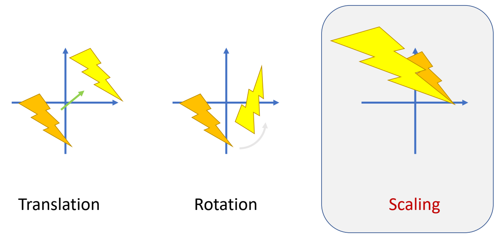  

> &#x2705; 刚体变换不能改变形状和大小，因此没有Scaling   

P69  
## Scaling   

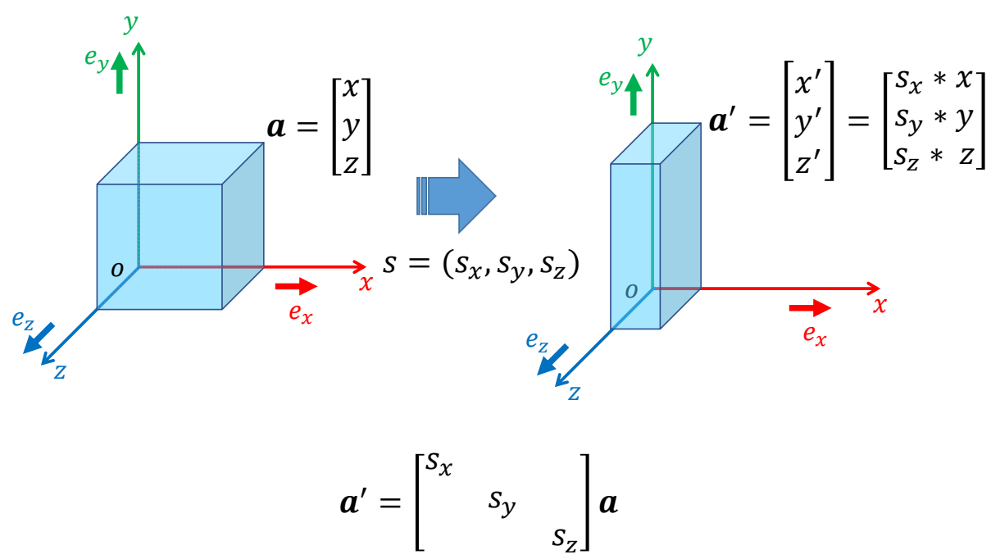  

P70   

## Translation   

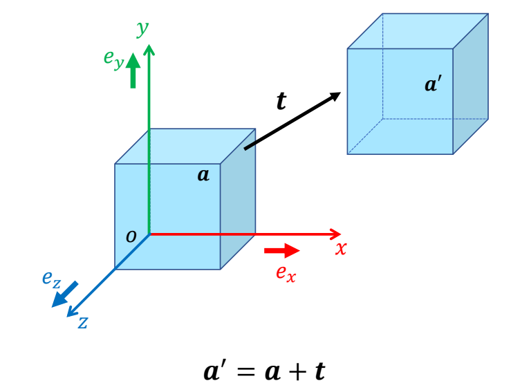    

P72   
## Rotation   

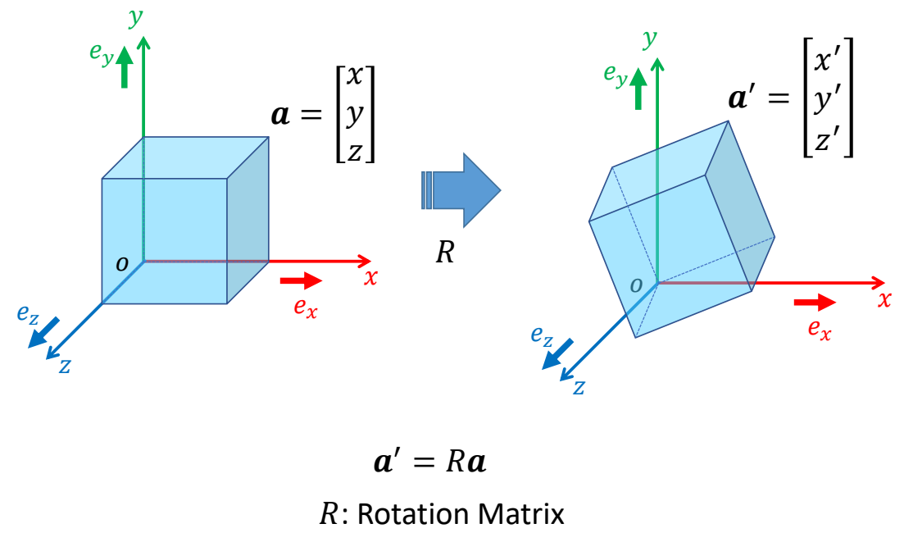    

P73   
## Rotation Matrix    

 - Rotation matrix is orthogonal:   

$$
R^{-1}=R^{T}  \quad R^TR=RR^T=1
$$

 - Determinant of \\(R\\)    
$$
\text{det } R = + 1
$$
 - Rotation maintains length of vectors
$$
||Rx|| = ||x||
$$

> &#x2705; 公式2：\\(R\\) 不会改变左、右手系    
> &#x2705; 公式3：\\(R\\) 是刚性变换，不改变大小    

P75   
## Combination of Rotations   

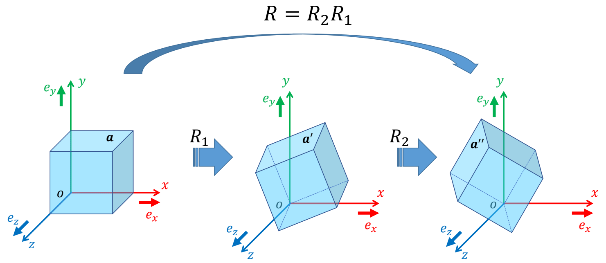    

P76   
## Rotation around Coordinate Axes

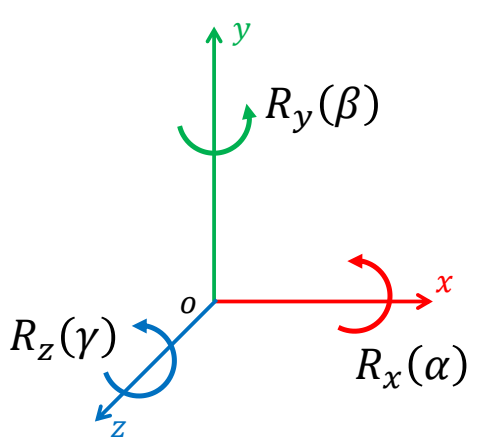    

$$
R_x(\alpha )=\begin{pmatrix}
 1 & 0 & 0 \\\\
 0 & \cos\alpha  & -\sin \alpha \\\\
 0 & \sin \alpha  & \cos \alpha 
\end{pmatrix}
$$

$$
R_y(\beta )=\begin{pmatrix}
 \cos \beta & 0 & \sin \beta \\\\
 0 & 1  & 0  \\\\
 -\sin \beta & 0   & \cos \beta 
\end{pmatrix}
$$

$$
R_z(\gamma  )=\begin{pmatrix}
 \cos \gamma & -\sin \gamma & 0 \\\\
 \sin \gamma & \cos \gamma  & 0  \\\\
 0 & 0   & 1 
\end{pmatrix}
$$

> &#x2705; 沿着哪个轴转，那个轴上的坐标不会改变。   
> &#x2705; 三个基本旋转可以组合出复杂旋转。    

P79   

## Rotation Axis and Angle   

Rotation matrix \\(R\\) has a real eigenvalue: +1   
$$
Ru=u
$$

In other words, \\(R\\) can be considered as a rotation around axis \\(u\\) by some angle \\(\theta \\)   
How to find axis 𝒖 and angle \\(\theta \\)?   

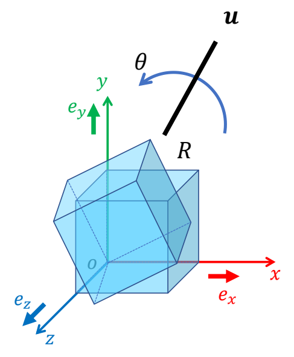    

> &#x2705; 用 \\(R\\) 旋转时，向量 \\(u\\) 不会变化。   
> &#x2705; 对于任意 \\(R\\)，都存在这样一个 \\(u\\).     
> &#x2705; \\(u\\) 是 \\(R\\) 的旋转轴。   

P80   

## Rotation Axis and Angle   

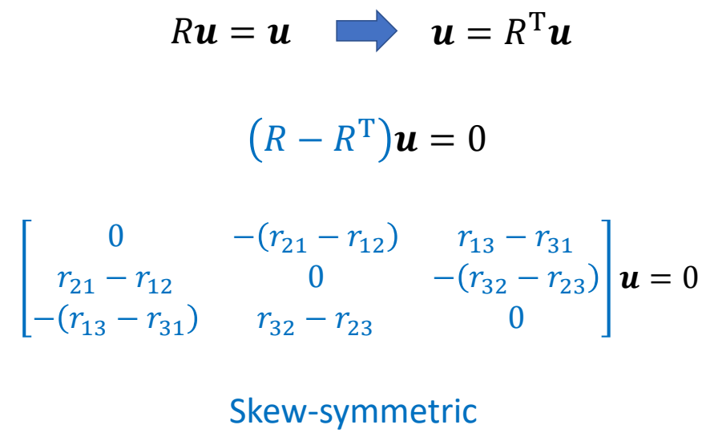    

P81  

   

> &#x2705; \\({u}' \\) 与 \\({u} \\) 共线，\\({u}' \\) 单位化得到 \\({u} \\)．  
> &#x2705; \\(q\\) 和 \\(-q\\) 两种表示方法会引入插值问题，需要注意。

P82  

$$
u\gets {u}' =\begin{bmatrix}
r_{32}-r_{23}  \\\\
r_{13}-r_{31}  \\\\
r_{21}-r_{12} 
\end{bmatrix}
$$

$$
\text{When }  R\ne R^T \Leftrightarrow \sin \theta \ne 0\Leftrightarrow \theta \ne 0^{\circ} 
\text{ or }  180^{\circ} 
$$

P83  
## Rotation Axis and Angle   

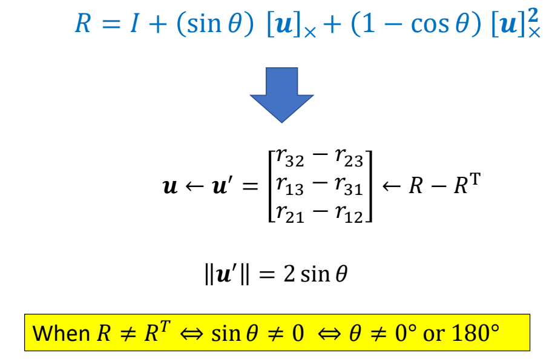    

> &#x2705; 从 \\(R\\) 的公式也能得出相同的结论    
> &#x2705; \\(u  →  {u}'  →  \\)旋转角度   

P85   

## Coordinate Transformation   

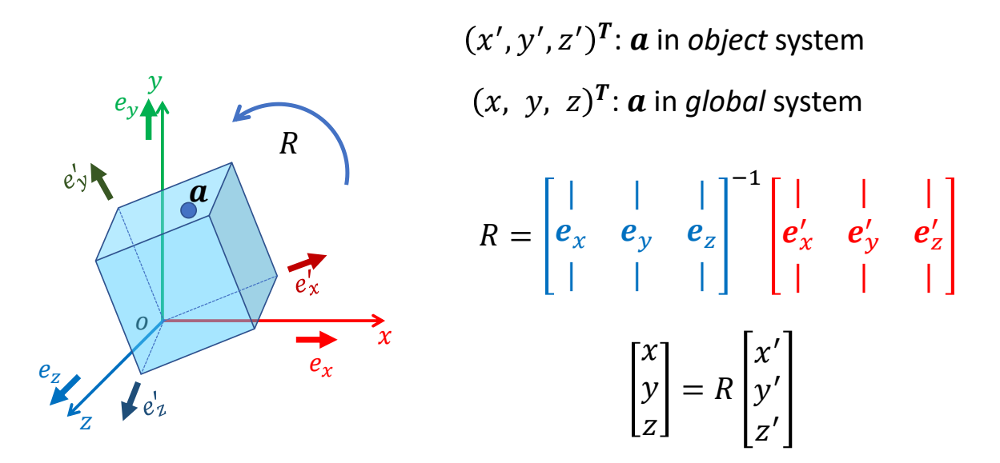    

P86   
## Coordinate Transformation

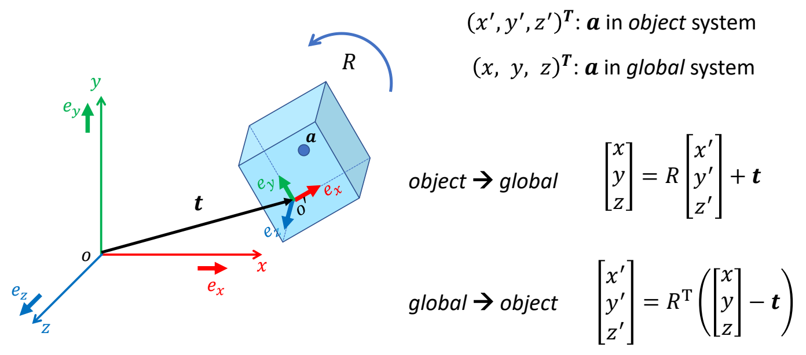 

P87   

## Representations of 3D Rotation   

P90   
##　Parameterization of Rotation

degrees of freedom (DoF) = 3　　　

P91   

## Parameterization of Rotation

 - A rotation matrix, 9 parameters: \\(𝑎_{𝑖𝑗}\\)   
$$
R=\begin{bmatrix}
a_{11} & a_{12} & a_{13} \\\\
a_{21} & a_{22} &a_{23} \\\\
a_{31} & a_{32} &a_{33}
\end{bmatrix}
$$

| degrees of freedom (DoF) = 3 |
|---|

> &#x2705; det 只是把空间减少一半，没有降低自由度

P93  
## Interpolation of Translations

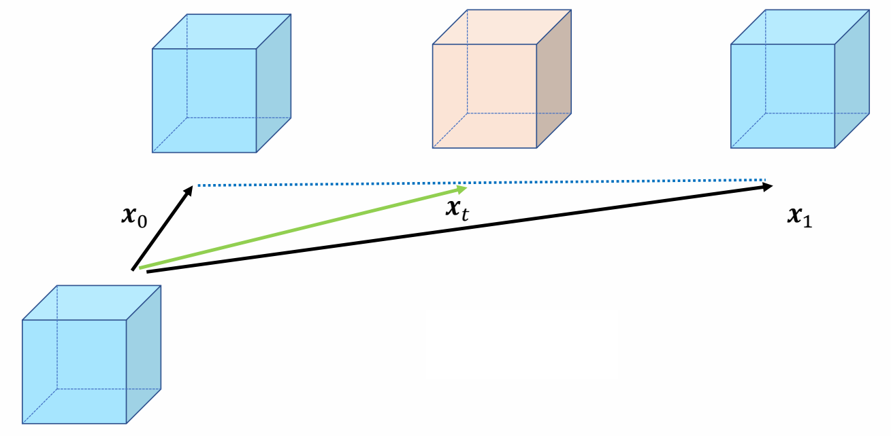 

$$
x_t=(1-t)x_0+tx_1
$$

> &#x2705; 平移使用线性插值    
> &#x2705; 对于任意 \\(t\\), \\(x_t\\) 一定是合法的。运动的速度是常数，因此速度可控。    

P95   
##  Interpolation of Rotations    

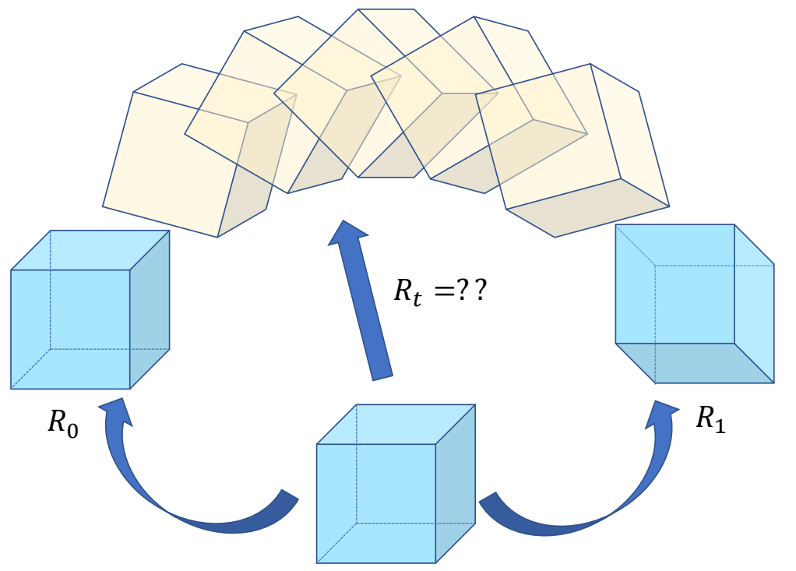 

P98   
## Interpolation of Rotations  

 - What is good interpolation?   
    - Rotation is valid at any time \\(t\\)   
    - Constant rotational speed is preferred   

> &#x2705; 旋转不适合线性插值。

P99   

 - Easy to compose?   \\(\quad \quad \quad {\color{Red} \times } \\)
 - Easy to apply?   \\(\quad \quad \quad \quad {\color{Green}  \surd }\\)
 - Easy to interpolate?  \\(\quad  \quad {\color{Red} \times } \\)

P100  
## Euler angles

 - Basic rotations

 

$$
R_x(\alpha )=\begin{pmatrix}
 1 & 0 & 0 \\\\
 0 & \cos\alpha  & -\sin \alpha \\\\
 0 & \sin \alpha  & \cos \alpha 
\end{pmatrix}
$$

$$
R_y(\beta )=\begin{pmatrix}
 \cos \beta & 0 & \sin \beta \\\\
 0 & 1  & 0  \\\\
 -\sin \beta & 0   & \cos \beta 
\end{pmatrix}
$$

$$
R_z(\gamma  )=\begin{pmatrix}
 \cos \gamma & -\sin \gamma & 0 \\\\
 \sin \gamma & \cos \gamma  & 0  \\\\
 0 & 0   & 1 
\end{pmatrix}
$$

P101  
## [囘] Euler Angles   

 - Any rotation can be represented as a combination of three basic rotations

P102   

## [囘] Euler Axes   

 - Any combination of three basic rotations are allowed   
    - Excluding those rotate twice around the same axis   
    - XYZ, XZY, YZX, YXZ, ZYX, ZXY, XYX, XZX, YXY, YZY, ZXZ, ZYZ    

P103  

## [囘] Conventions of Euler Angles   

intrinsic rotations: axes attached to the **object**

$$
R_x(\alpha )R_y(\beta )R_z(\gamma )
$$

extrinsic rotations: axes fixed to the **world**   

$$
R_z(\gamma )R_y(\beta )R_x(\alpha )
$$

> &#x2705; 使用欧拉角时应先明确所使用的 convetion 和顺序。  
> &#x2705; 不同的商业软件可能有不同的内置参数。   
> &#x2705; maya 和 unity 都是 extrinsic.   
> &#x2705; maya 可选顺序，Unity 固定 Zxy   

P104   

## [囘] Gimbal Lock    

 - When two local axes are driven into a parallel configuration, 
one degree of freedom is “locked”   

> &#x2705; 当其中两个轴共线时，会丢失一个自由度，此时表示不唯一（奇异点）   

P105  

## [囘] Euler Angles   

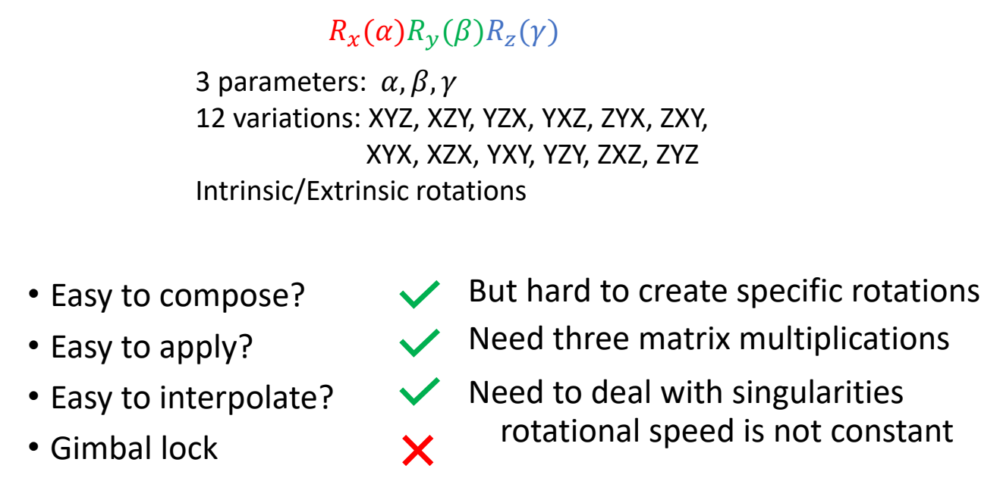 

> &#x2705; 插值时需注意作用域为 \\([-\pi , \pi ]\\)，否则容易出现翻转现象。   

P107  

## [囬] Rotation Vectors / Axis Angles   

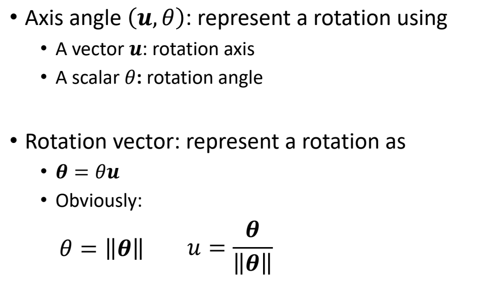 

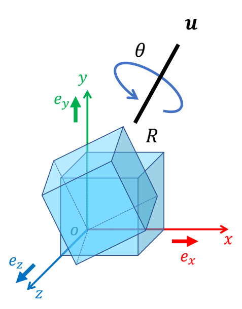 

   
> &#x2705; 粗体 ***θ***：轴角表示法描述的旋转    
> &#x2705; 细体 \\(\theta \\)：以 \\(u\\) 为轴的旋转角度      
> &#x2705; 应用时要先转为旋转矩阵，做旋转组合时也要借助旋转矩阵       

**θ**

P110   
## [囬] Interpolating Rotation Vectors / Axis Angles   

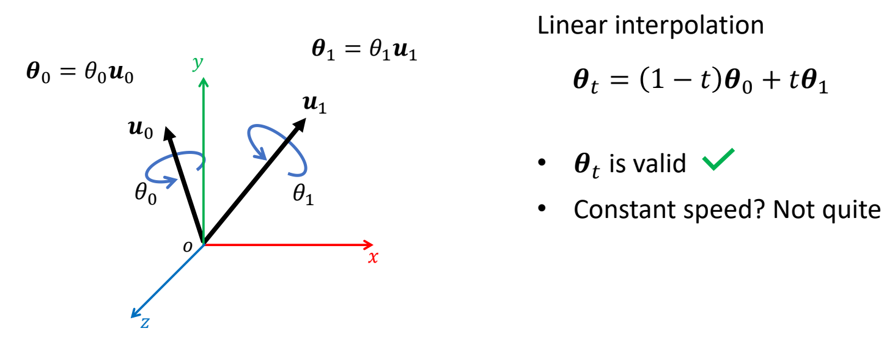 

P111   

## [囬] Interpolating Rotation Vectors / Axis Angles   

Compute offset rotation   

$$
\begin{align*}
 R(\delta \theta )= & R^T(\theta _0)R(\theta _1)\\\\
 \delta \theta _t= & (1-t)0+t\delta \theta \\\\
 R( \theta_t)= & R( \theta _0)R(\delta \theta _t)
\end{align*}
$$

 - \\(\theta _t\\) is valid \\(\quad {\color{Green} \surd } \\)   
 - Constant speed \\({\quad \color{Green} \surd } \\) 

> &#x2705; 这个方法没听懂，可以实现允许插值。   

P112  

## [囬] Rotation Vectors / Axis Angles   

$$
(u,\theta) \text{ or } \theta =\theta u
$$

Representation is not unique    

$$
\begin{matrix}
 (u,\theta ), & (-u,-\theta ),  & (u,\theta+2n\pi), 
\end{matrix}
$$

 - Easy to compose?   \\(\quad \quad {\color{Green} \surd } \quad \quad \\)   But hard to manipulate    
 - Easy to apply?   \\(\quad \quad \quad {\color{Red} \times }  \quad \quad \\)     Need to convert to matrix    
 - Easy to interpolate?  \\(\quad \quad {\color{Green} \surd } \quad \quad \\)  Linear interpolation works, but not perfect    
 - No Gimbal lock    \\(\quad \quad {\color{Green} \surd } \quad \quad \\)  need to deal with singularities     
 

P113   

## Quaternions   

P116   
## [𡇌] Quaternions   

 - Extending complex numbers    
$$
q =a+bi +cj +dk \in \mathbb{H} ,a,b,c,d\in \mathbb{R}
$$

 - \\(i^2=j^2=k^2=ijk=-1\\)   
 - \\(ij=k,ji=-k(^*\text{cross product})\\)   
 - \\(jk=i,kj=-i\\)   
 - \\(ki=j,ik=-j\\)   

P117  

## [𡇌] Quaternion Arithmetic

$$
 q =a+bi +cj +dk \in \mathbb{H} ,a,b,c,d\in \mathbb{R}
$$

Conjugation:   \\(\quad \quad q^*=a-bi-cj-dk\\)   
\\( \\)    
Scalar product:  \\(\quad \quad tq=ta+tbi+tcj+tdk\\)   
\\( \\)  
Addition:  \\(\quad \quad q_1+q_2=(a_1+a_2)+(b_1+b_2)i+(c_1+c_2)j+(d_1+d_2)k\\)   
\\( \\)   
Dot product:  \\(\quad \quad q_1\cdot q_2=a_1a_2+b_1b_2+c_1c_2+d_1d_2\\)   
\\( \\)  
Norm:  \\(\quad \quad ||q||=\sqrt{a^2+b^2+c^2+d^2} =\sqrt{q\cdot q}\\)

P118   

## [𡇌] Quaternion Multiplication   

$$
q_1q_2=(a_1+b_1i+c_1j+d_1k)*(a_2+b_2i+c_2j+d_2k)
$$

$$
q_1q_2=a_1a_2-b_1b_2-c_1c_2-d_1d_2
$$

$$
+(b_1a_2+a_1b_2-d_1c_2+c_1d_2)i   
$$

$$
+(c_1a_2+d_1b_2+a_1c_2-b_1d_2)j  
$$

$$
+(d_1a_2-c_1b_2+b_1c_2+a_1d_2)k
$$

note:   
 - \\(i^2=j^2=k^2=ijk=-1\\)    
 - \\(ij=k,ji=-k (^* \text{cross product})\\)   
 - \\(jk=i,kj=-i\\)   
 - \\(ki=j,ik=-j\\)   

> &#x2705; \\(q_1 \cdot q_2\\) 和 \\(q_1q_2\\) 是两种不同的运算。

P119   

## [𡇌] Quaternions   

$$
q=w+xi+yj+zk \quad \Rightarrow  \quad  q=\begin{bmatrix}
 w\\\\
 x\\\\
 y\\\\
z
\end{bmatrix}=\begin{bmatrix}
 w\\\\
v
\end{bmatrix}
$$

$$
q =[w,v]^T \in \mathbb{H} ,w\in \mathbb{R},v\in \mathbb{R}^3
$$

$$
w =[w,0]^T : \text{ scalar quaternion }
$$

$$
v =[0,v]^T : \text{ pure quaternion }
$$

P120  
## [𡇌] Quaternion Arithmetic

Conjugation:   \\(\quad \quad q^*=[w,-v]^T\\)   
\\( \\)    
Scalar product:  \\(\quad \quad tq=[tw,tv]^T\\)   
\\( \\)  
Addition:  \\(\quad \quad q_1+q_2=[w_1+w_2,v_1+v_2]^T\\)   
\\( \\)   
Dot product:  \\(\quad \quad q_1\cdot q_2=w_1w_2+v_1 \cdot v_2\\)   
\\( \\)  
Norm:  \\(\quad \quad ||q||=\sqrt{w_1w_2+v_1 \cdot v_2} =\sqrt{q\cdot q}\\)

P122   
## [𡇌] Quaternion Multiplication   

$$
q_1q_2=\begin{bmatrix}
 w_1\\\\
v_1
\end{bmatrix}\begin{bmatrix}
w_2 \\\\
v_2
\end{bmatrix}=\begin{bmatrix}
 w_1w_2-v_1\cdot v_2\\\\
w_1v_2+w_2v_1+v_1\times v_2
\end{bmatrix}
$$

Non-Commutativity: 

$$
q_1q_2\ne q_2q_1
$$

Associativity:    

$$
q_1q_2q_3=(q_1q_2)q_3=q_1(q_2q_3)
$$

P123   
## [𡇌] Quaternion Multiplication   

Conjugation:   

$$
(q_1q_2)^\ast=q^\ast_2q^\ast_1
$$

Norm:    

$$
||q||^2 = q^ \ast q =qq^\ast
$$

Reciprocal:    

$$
\begin{matrix}
qq^{-1}=1  & \Rightarrow & q^{-1}=\frac{q^*}{||q||^2}\\\\
q^{-1}q=1  &  &
\end{matrix}
$$

P124   

## [𡇌] Unit Quaternions   

$$
\begin{matrix}
 q=\begin{bmatrix}
 w\\\\
v
\end{bmatrix} &||q||=1
\end{matrix}
$$

For any non-zero quaternion \\(\tilde{q} \\):   

$$
q=\frac{\tilde{q}}{||\tilde{q}||}
$$

Reciprocal:   

$$
\begin{matrix}
 q^{-1}=q^\ast =\begin{bmatrix}
 w\\\\
-v
\end{bmatrix} &\Leftrightarrow & R^{-1}=R^T
\end{matrix}
$$

P125   
## [𡇌] Unit Quaternions   

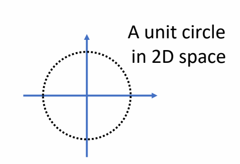  

$$
\begin{matrix}
\text{unit complex number} \\\\
z = \cos \theta  + i\sin \theta 
\end{matrix}
$$

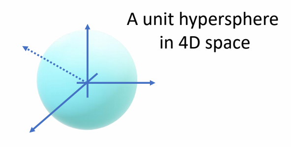  

$$
\begin{matrix}
\text{unit quaternion} \\\\
q = [\cos \frac{\theta}{2} ,  + u\sin \frac{\theta}{2} ]&||u||=1 
\end{matrix}
$$

> &#x2705; 所有单位四元数构成 4D 空间上的单位球核。  

P126   
## [𡇌] Unit Quaternions  

$$
\begin{matrix}
q =  \begin{bmatrix}
 w\\\\
v
\end{bmatrix}= [\cos \frac{\theta}{2} ,   u\sin \frac{\theta}{2} ]&||u||=1 
\end{matrix}
$$

same information as axis angles \\((u,\theta)\\) But in a different form   

P127   
## [𡇌] Unit Quaternions as 3D Rotations   

Any 3D rotation \\((v,\theta)\\) can be represented as a **unit quaternion**   

$$
\begin{matrix}
 \text{Angle}: & \theta =2 \text{ arg } \cos w\\\\
\text{ Axis}:  & u=\frac{v}{||v||} 
\end{matrix}
$$

P128   
## [𡇌] Rotation a Vector Using Unit Quaternions   

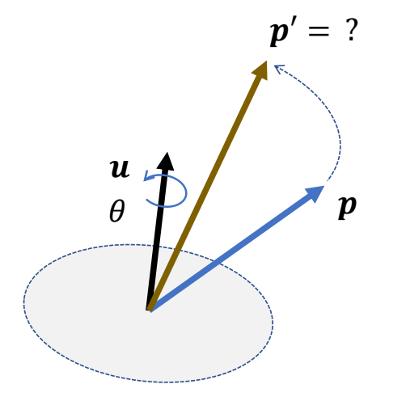  

$$
\begin{matrix}
 \text{Unit quaternion}: & q=\begin{bmatrix}
 w\\\\
v
\end{bmatrix}=[\cos \frac{\theta }{2} ,u\sin \frac{\theta }{2}]\\\\
\text{ 3D vector}:p  & \text{ Rotation result }: {p}'
\end{matrix}
$$

Then the rotation can be applied by **quaternion multiplication**:  

$$
\begin{bmatrix}
0 \\\\
{p}' 
\end{bmatrix}=q\begin{bmatrix}
 0\\\\
p
\end{bmatrix}q^\ast 
$$

> &#x2705; 纯方向 \\(P\\) 可用四元数表示为 \\([0 \quad p ]\\)    
> &#x2705;  \\({P}' = R (q) \cdot p\\)     

P129   

## [𡇌] Rotation a Vector Using Unit Quaternions  

 

$$
\begin{bmatrix}
0 \\\\
{p}' 
\end{bmatrix}=q\begin{bmatrix}
 0\\\\
p
\end{bmatrix}q^\ast =(-q)\begin{bmatrix}
 0\\\\
p
\end{bmatrix}(-q)^\ast 
$$

\\(\mathbf{q}\\) **and** \\(−\mathbf{q}\\) **represent the same rotation**   

P131   
## [𡇌] Combination of Rotations   

$$
\begin{matrix}
 \text{Unit quaternion}&: & q_1,q_2\\\\
 \text{3D vector}&: & p\\\\
\end{matrix}
$$

$$
\begin{align*}
 \begin{bmatrix}
 0\\\\
{p}' 
\end{bmatrix} = & q _ 1 \begin{bmatrix}
 0 \\\\
 p
\end{bmatrix} q ^ \ast _ 1  \\\\
  \begin{bmatrix}
 0 \\\\
{p}''
\end{bmatrix} =& q _ 2 \begin{bmatrix}
 0 \\\\
{p}' 
\end{bmatrix}q ^ \ast _ 2 = q_ 2 (q_1\begin{bmatrix}
 0 \\\\
p
\end{bmatrix} q ^ \ast _1)q ^ \ast _ 2=(q _ 2 q _ 1)\begin{bmatrix}
 0 \\\\
{p} 
\end{bmatrix}(q_2q_1) ^ \ast \\\\
  = & q \begin{bmatrix}
 0 \\\\
p 
\end{bmatrix}q^\ast 
\end{align*}
$$

$$
\begin{matrix}
  \text{Combined rotation}: & q=q_2q_1
\end{matrix}
$$

P133  
## [𡇌] Quaternion Interpolation    
 
$$
\begin{matrix}
  q=\begin{bmatrix}
 w\\\\
v
\end{bmatrix} & ||q||=1
\end{matrix}
$$

A unit hypersphere in 4D space   

P134   

## [𡇌] Quaternion Interpolation   

  

A unit hypersphere in 4D space    

> &#x2705; 单位四元数表现出来是 4D 空间中的球核，\\(q_1q_2\\) 是球核上的两个点，希望沿球面轨迹插值。   

P135   
## [𡇌] Linear Interpolation   

$$
q_t=(1-t)q_0+tq_1
$$

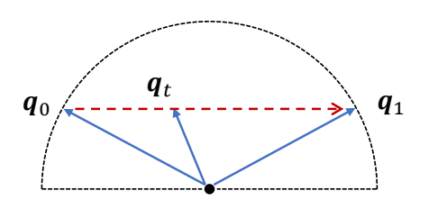  

\\(q_t\\) is not a unit quaternion   

P136  

## [𡇌] Linear Interpolation + Projection

$$
\begin{matrix}
  \tilde{q}_t=(1-t)q_0+tq_1  & q_t=\frac{\tilde{q}_t }{||\tilde{q}_t||} 
\end{matrix}
$$

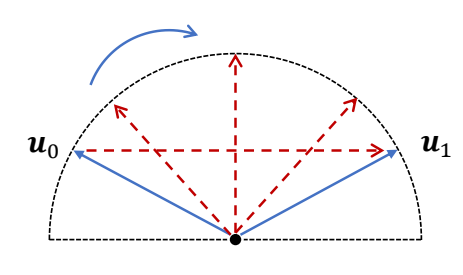  

$$
\begin{matrix}
 q_t \text{ is a unit quaternion}\\\\
\text{Rotational speed is not constant}
\end{matrix}
$$

> &#x2705; 当 \\(u_0＝-u_1\\) 时，可能得到某个 \\(\tilde{q} _t = 0\\)，无法单位化    
> &#x2705; 解决方法:根据 \\(u_0＝-u_0\\)，先找到 \\(u_0\\) 和 \\(u_1\\) 在数值上最接近的四元数表示。   

P137   

## [𡇌] SLERP: Spherical Linear Interpolation   

$$
q_t=a(t)q_0+b(t)q_1
$$

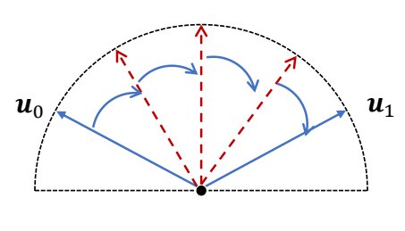  

> &#x2753; 如何让插值结果速度恒定？

P138   

## [𡇌] SLERP: Spherical Linear Interpolation   

$$
r=a(t)p+b(t)q
$$

Consider the angle \\(\theta\\) between \\(p,q\\):    

$$
\cos \theta =p\cdot q
$$

We have:

$$
\begin{matrix}
 p \cdot r=a(t)p\cdot p+b(t)q\cdot p\\\\
\Rightarrow \cos t \theta =a(t)+b(t)\cos \theta 
\end{matrix}
$$

similarly:   

$$
\begin{matrix}
 q \cdot r=a(t)q\cdot p+b(t)\\\\
\Rightarrow \cos (1- t) \theta =a(t)\cos\theta +b(t)  
\end{matrix}
$$

then we have：   

$$
a(t)=\frac{\sin [(1-t)\theta ]}{\sin \theta  } ,b(t)=\frac{\sin t \theta }{\sin \theta } 
$$

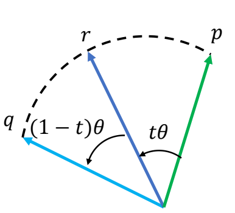  

P139  
## [𡇌] SLERP: Spherical Linear Interpolation   

$$
q_t=\frac{\sin [(1-t)\theta ]}{\sin \theta  }q_0+\frac{\sin t \theta }{\sin \theta }q_1 
$$

$$
\cos \theta=q_0\cdot  q_1
$$

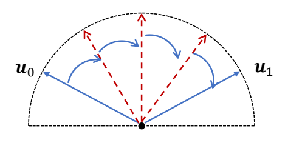  

P140   
## [𡇌] Quaternions  

Rotations can be represented by **unit quaternions**    

Representation is not unique   

\\(q, −q\\) represent the same rotation   

 - Easy to compose?   \\(\quad \quad {\color{Green} \surd }\quad \quad \\)     Need normalization, hard to manipulate,   
 - Easy to apply?    \\(\quad \quad  \quad {\color{Green} \surd }\quad \quad \\)       Quaternion multiplication   
 - Easy to interpolate?  \\(\quad   {\color{Green} \surd }\quad \quad \\)   SLERP, need to deal with singularities   
 - No Gimbal lock  \\(\quad \quad  \quad {\color{Green} \surd }\quad \quad \\)   

---------------------------------------
> 本文出自CaterpillarStudyGroup，转载请注明出处。
>
> https://caterpillarstudygroup.github.io/GAMES105_mdbook/