> &#x2705; 人体运动涉及到角度旋转，因此是非线性的。  

P68  
### Nonlinear problems   

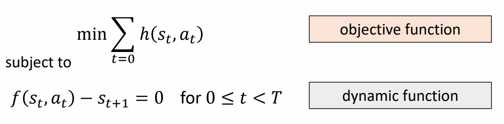 

> &#x2705; 方法：把问题近似为线性问题。  

Approximate cost function as a quadratic function:   

> &#x2705; 目标函数：泰勒展开，保留二次。  

$$
h(s_t,a_t)\approx h(\bar{s}_t ,\bar{a}_t)+\nabla h(\bar{s}_t ,\bar{a}_t)\begin{bmatrix}
 s_t-\bar{s} _t\\\\
a_t-\bar{a} _t
\end{bmatrix} + \frac{1}{2} \begin{bmatrix}
 s_t-\bar{s} _t\\\\
a_t-\bar{a} _t
\end{bmatrix}^T\nabla^2h(\bar{s}_t ,\bar{a}_t)\begin{bmatrix}
 s_t-\bar{s} _t\\\\
a_t-\bar{a} _t
\end{bmatrix}
$$

Approximate dynamic function as a linear function:    

> &#x2705; 转移函数：泰勒展开，保留一次或二次。  

$$
f(s_t,a_t)\approx f(\bar{s}_t ,\bar{a}_t)+\nabla f(\bar{s}_t ,\bar{a}_t)\begin{bmatrix}
 s_t-\bar{s} _t\\\\
a_t-\bar{a} _t
\end{bmatrix}
$$

展开为一次项，对应解决算法：iLQR（iterative LQR） 

Or a quadratic function:   

$$
f(s_t,a_t)\approx \ast \ast \ast \frac{1}{2} \begin{bmatrix}
 s_t-\bar{s} _t\\\\
a_t-\bar{a} _t
\end{bmatrix}^T\nabla^2f(\bar{s}_t ,\bar{a}_t)\begin{bmatrix}
 s_t-\bar{s} _t\\\\
a_t-\bar{a} _t
\end{bmatrix}
$$

展开为二次项，对应解决算法：DDP（Differential Dynamic Programming）

P69  
### 相关应用

> &#x1F50E; [Muico et al 2011 - Composite Control of Physically Simulated Characters]   

> &#x2705; 选择合适的 \\(Q\\) 和 \\(R\\)，需要一些工程上的技巧。   
> &#x2705; 为了求解方程，需要显式地建模运动学方程。  

P70  
## Model-based Method vs. Model-free Method   

> &#x2705; Model Based 方法，要求 dynamic function 是已知的，但是实际上这个函数可能是（1）未知的（2）不精确的。    
> &#x2705; 因此Model Based 方法对于复杂问题难以应用，但对于简单问题非常高效。  

What if the dynamic function \\(f(s,a)\\) is not know?  

> &#x2705; \\(f\\) 未知只是把 \\(f\\) 当成一个黑盒子，仍需要根据 \\(S_t\\) 得到 \\(S_{t＋1}\\) .   

What if the dynamic function \\(f(s,a)\\) is not accurate?    

> &#x2705; 不准确来源于（1）测试量误差（2）问题简化

What if the system has noise?    

What if the system is highly nonlinear?     

P72  
# Sampling-based Policy Optimization   

 - Iterative methods
    - Goal: find the optimal **policy** \\(\pi (s;\theta )\\) that minimize the objective \\(J(\theta )=\sum_{t=0}^{}h(s_t,a_t) \\)     
    - Initialize policy parmeters \\(\pi (x;\theta )\\)   
    - Repeat:   
      - Propose a set of candidate parameters {\\(\theta _i \\)} according to \\(\theta \\)    
      - Simulate the agent under the control of each \\( \pi ( \theta _i)\\) 
      - Evaluate the objective function \\( J (\theta_i )\\)  on the simulated state-action sequences    
      - Update the estimation of \\(\theta \\) based on {\\( J (\theta_i )\\)}     

 - Example: CMA-ES

> &#x2705; 基于采样的方法。  

P73   
## Example: Locomotion Controller with Linear Policy

> &#x1F50E; [Liu et al. 2012 – Terrain Runner]

P74  
### Stage 1a: Open-loop Policy   

Find open-loop control using SAMCON

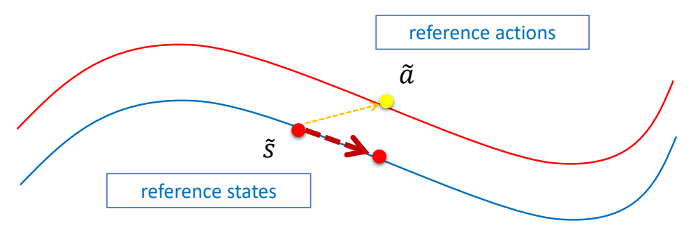 

> &#x2705; 使用开环轨迹优化得到开环控制轨迹。    

P76  
### Stage 1b: Linear Feedback Policy

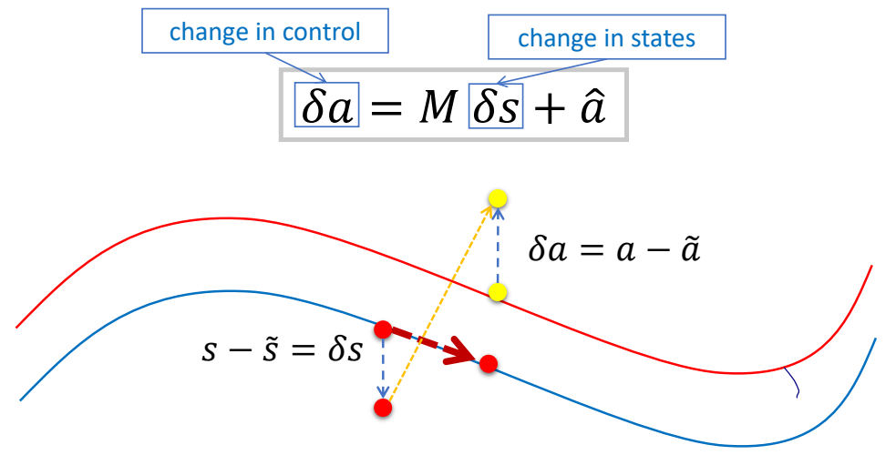   

> &#x2705; 使用反馈控制更新控制信号。由于假设了线性关系，根据偏离 offset 可直接得到调整 offset.  

P78   
### Stage 1b: Reduced-order Closed-loop Policy

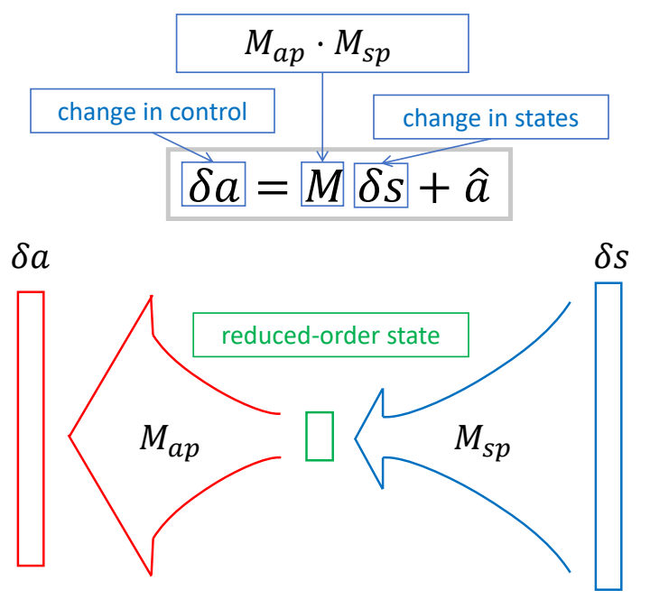  

> &#x2705; 把 \\(M\\) 分解为两个矩阵，\\(M_{AXB} = M_{AXC}\cdot M_{CXB}\\) 如果 \\(C\\) 比较小，可以明显减少矩阵的参数量。    
> &#x2705; 好处：(1) 减少参数，减化优化过程。(2) 抹掉状态里不需要的信息。  

P79   
#### Manually-selected States: s   

 - Running: 12 dimensions

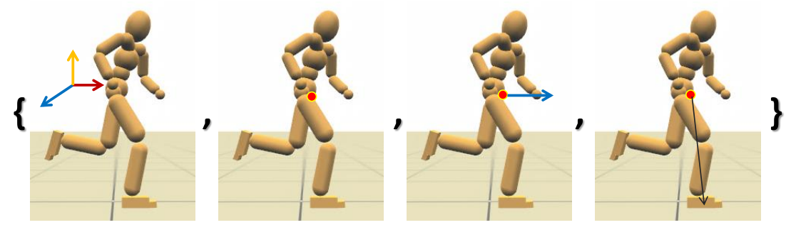 

> &#x2705; （1）根结点旋转（2）质心位置（3）质心速度（4）支撑脚位置   

P80  
#### Manually-selected Controls: a  

 - for all skills: 9 dimensions   

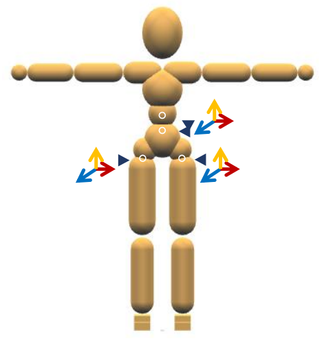   

> &#x2705; 仅对少数关节加反馈。   

P81   
### Optimization

$$
\delta a=M\delta s+\hat{a} 
$$

 - Optimize \\(M\\)   
    - CMA, Covariance Matrix Adaption ([Hansen 2006])
    - For the running task:
      - #optimization variables: \\(12 ^\ast 9 = 108 / (12^\ast 3+3 ^\ast 9) = 63\\)   
     - 12 minutes on 24 cores   

P85  
# Optimal Control \\(\Leftrightarrow \\) Reinforcement Learning   

• RL shares roughly the same overall goal with Optimal Control   

$$
\max \sum_{t=0}^{} r (s_t,a_t)
$$

> &#x2705; 相同点：目标函数相同，是每一时刻的代价函数之和。 

• But RL typically does not assume perfect knowledge of system   

 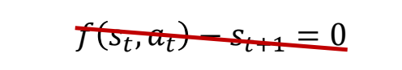 

> &#x2705; 最优控制要求有精确的运动方程，而 RL 不需要。  

 - RL can still take advantage of a system model → model-based RL   
    - The model can be learned from data   
$$
s_{t+1}=f(s_t,a_t;\theta )
$$

> &#x2705; RL 通过不断与世界交互进行采样。   
  

P87   
## Markov Decision Process (MDP)  

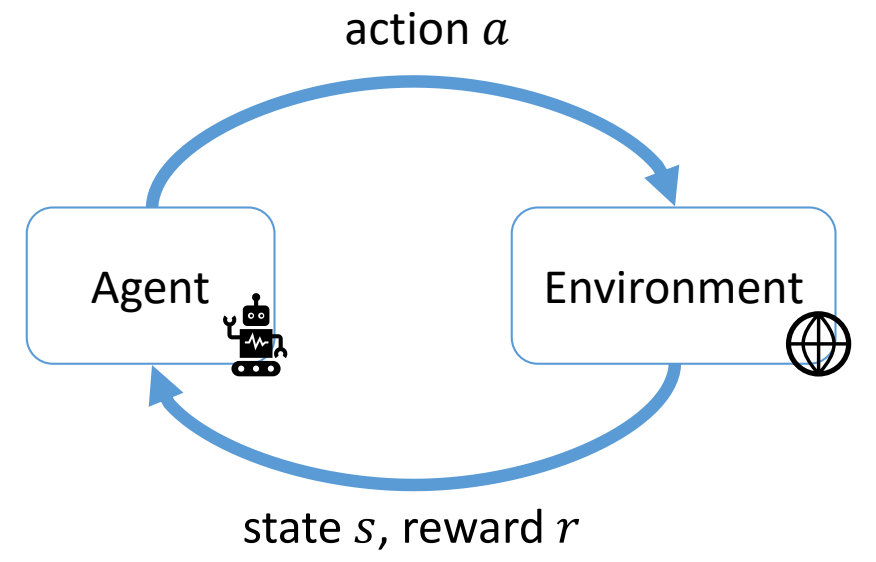   

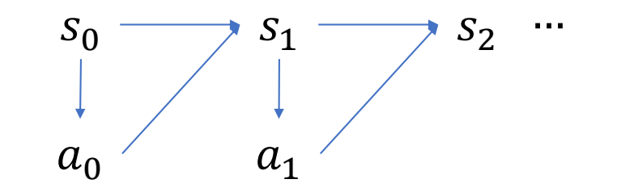   

|||
|---|---|
|State|  \\(\quad s_t \quad \quad \\)|
|Action| \\(\quad a_t\\)|
|Policy |\\(\quad \quad a_t\sim \pi (\cdot \mid s_t)\\)   |
|Transition probability  |\\(\quad \quad s_{t+1}\sim p  (\cdot \mid s_t,a_t)\\)|   
|Reward  |\\(\quad \quad r_t=r (s_t,a_t)\\)|   
|Return| \\(R = \sum _{t}^{} \gamma ^t r (s_t,a_t)\\)|   

> &#x2705; 真实场景中轨迹无限长，会导到 \\(R\\) 无限大。   
> &#x2705; 因此会使用小于 1 的 \\(r,t\\) 越大则对结果的影响越小。   

P88  
## 跟踪问题变成MDP问题   

Trajectory    

$$
\begin{matrix}
  \tau =& s_0 & a_0 & s_1 & a_1 & s_2&\dots 
\end{matrix}
$$

Reward   

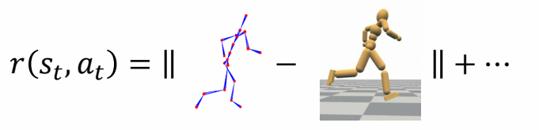   

P90   
## MDP问题的数学描述

> &#x2705; Markov 性质：当当前状态已知的情况下，下一时刻状态只与当前状态相关，而不与之前任一时刻状态相关。   

MDP is a **discrete-time** stochastic control process.    
It provides a mathematical framework for modeling decision making in situations     
where outcomes are **partly random and partly under the control of a decision maker**.   

A MDP problem:    

\\(\mathcal{M}\\) = {\\(S,A,p,r\\)}    
\\(S\\): state space   
\\(A\\): action space   
p：状态转移概率，即运动学方程。   
r：代价函数。   

P91  

Solve for a policy \\(\pi (a\mid s)\\) that optimize the **expected return**    

$$
J=E[R]=E_{\tau \sim \pi }[\sum_{t}^{} \gamma ^tr(s_t,a_t)]
$$

> &#x2705; 求解一个policy \\(\pi \\) 使期望最优，而不是直接找最优解。   

Overall all trajectories \\(\tau \\) = { \\(s_0, a_0 , s_1 , a_1 ,  \dots  \\)} induced by \\(\pi \\)   

> &#x2705; 假设 \\(\pi \\) 函数和 \\(p\\) 函数都是有噪音的，即得到的结果不是确定值，而是以一定概率得到某个结果。**这是与最优控制问题的区别。**   

P93   
## Bellman Equations

In optimal control:    

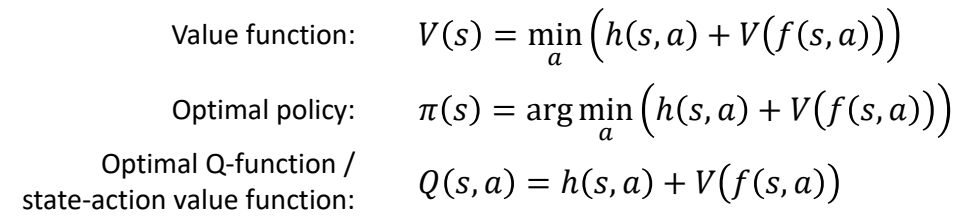   

In RL control:    

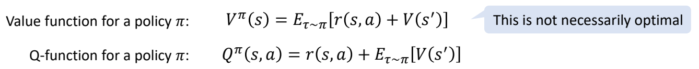   

> &#x2705; 此处的\\(\pi \\)是某一个策略，而不是最优策略。  

P94   
## How to Solve MDP  

### Value-based Methods

- Learning the value function/Q-function using the Bellman equations   
- Evaluation the policy as    

$$
\pi (s) = \arg \min_{a} Q(s,a)
$$

- Typically used for **discrete** problems   
- Example: Value iteration, Q-l a ning, DQN, …   

P95   
> &#x1F50E; DQN [Mnih et al. 2015, Human-level control through deep reinforcement learning]   

P96  

### 相关工作

> &#x1F50E; [Liu et al. 2017: Learning to Schedule Control Fragments ]   

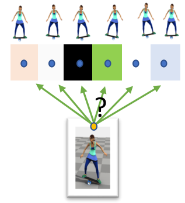   

> &#x2705; DQN 方法要求控制空间必须是离散的，但状态空间可以是连续的。  
> &#x2705; 因此可用于高阶的控制。  

P97   
### Policy Gradient approach
- Learning the value function/Q-function using the Bellman equations   
- Compute approximate **policy gradient** according to value functions using Monte-Carlo method   

- Update the policy using policy gradient  

- Suitable for **continuous** problems   

- Exa pl : REINFORCE, TRPO, PPO, …   

> &#x2705; policy grodient 是 Value function 对状态参数的求导。但这个没法算，所以用统计的方法得到近似。   
> &#x2705; 特点是显示定义 Dolicy 函数。对连续问题更有效。    

P98   
### 相关工作

||||
|--|--|--|
| 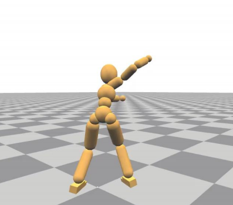   |  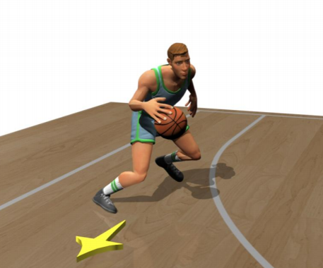   |  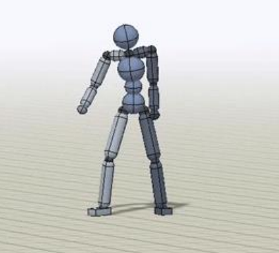   | 
| [Liu et al. 2016. ControlGraphs] | [Liu et al. 2018]   | [Peng et al. 2018. DeepMimic] |  

P100  
## Generative Control Policies   

> &#x2705; 使用RL learning，加上一点点轨迹优化的控制，就可以实现非常复杂的动作。  

> &#x1F50E; [Yao et al. Control VAE]   

P101  
# What’s Next?   

## Digital Cerebellum

Large Pretrained Model for Motion Control

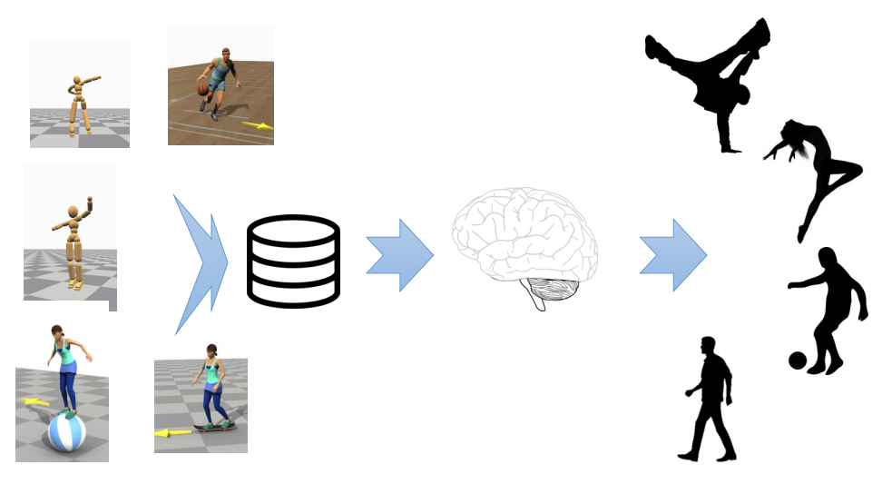   

P102  
## Cross-modality Generation

- \\(\Leftrightarrow\\) LLM \\(\Leftrightarrow\\) Text/Audio \\(\Leftrightarrow\\) Motion/Control \\(\Leftrightarrow\\) Image/Video \\(\Leftrightarrow\\)     
- Digital Actor?    

---------------------------------------
> 本文出自CaterpillarStudyGroup，转载请注明出处。
>
> https://caterpillarstudygroup.github.io/GAMES105_mdbook/