P2   
# Outline   

 - Simulating & Actuating Characters   
    - Joint torques   
    
 - PD (Proportional-Derivative) control   

> &#x2705; 在仿真基础之上，如何驱动角色动画，如何动得更好，更真实。   
> &#x2705;（1）控制力如何施加到角色身上   
> &#x2705;（2）如何计算控制力   

# Simulating & Actuating Characters

P17   
## Defining a Simulated Character  

Rigid bodies:    
 - \\(m_i,I_i,x_i,R_i\\)     
 - Geometries    

Joints:   
 - Position   
 - Type   
> &#x2705; Type指关节的类型，例如 Hint、Universal等。它决定了约束方程。   
 - Bodies   

> &#x2705; 关节的数量比刚体的数量少1  

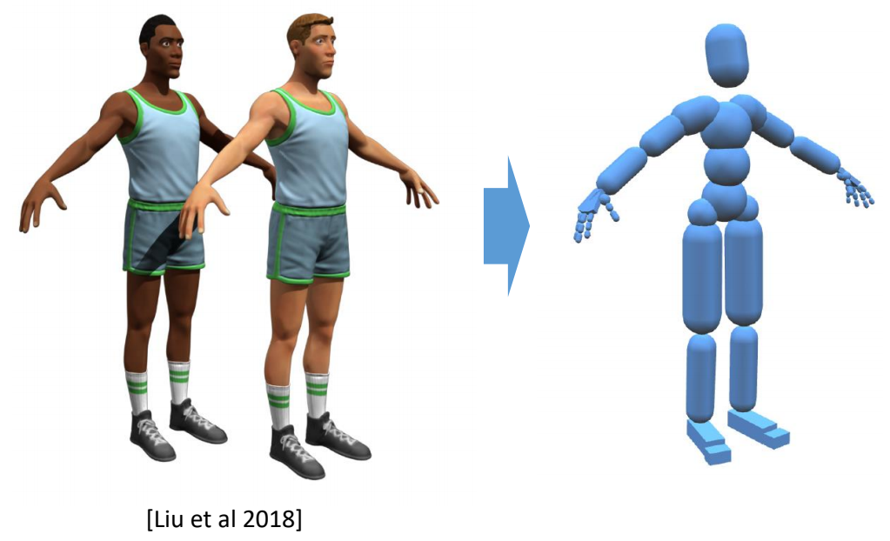

> &#x2705; 仿真过程中通常使用简单几何体代替 Mesh. 为了便于碰撞检测的计算，以及辨别里外。   

P19   
## Simulating a Character Pipeline  

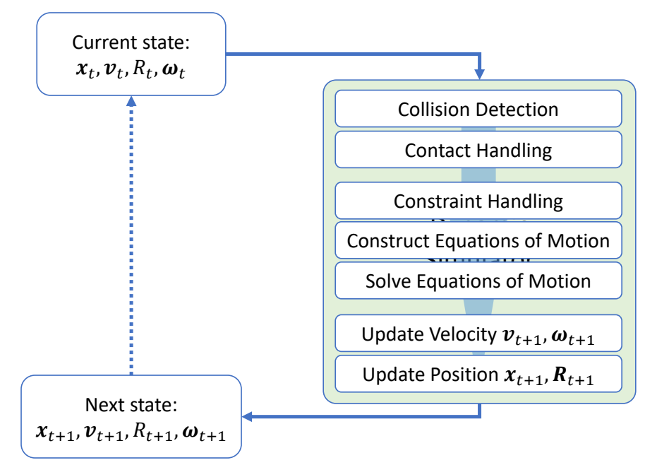

> &#x2705; 这个仿真流程是 ragdoll 效果。   

P22   
## Actuating a Rigid Body

> &#x2705; 想让角色做指定动作，不能直接修改其状态，而是控制力影响状态。  

|||
|---|---|
|力加在质心上，只会导致平移，不会导致旋转。|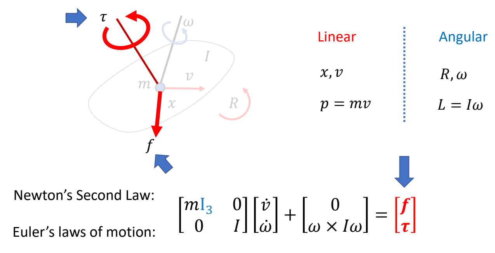|
|&#x2705; 在物体边缘旋加力，等价于在质心施加力，并施加一个导致旋转的力矩。  |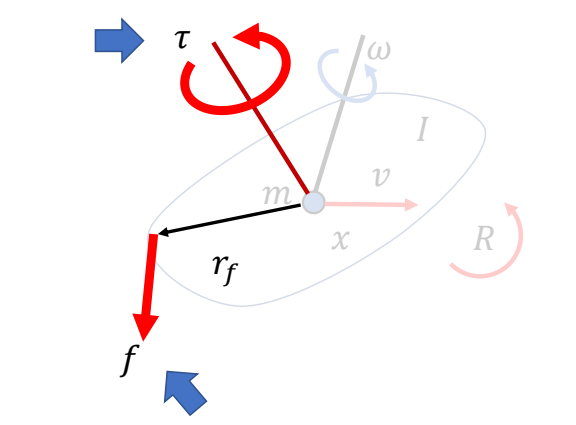 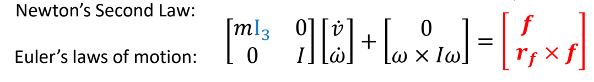|
|&#x2705; 在质心上施加一个力矩，等价于施加一对大小相同方向相反的力。在质心处的合力为零，不会产生位移，只会产生旋转。  &#x2705; 力矩只是数学上的概念。|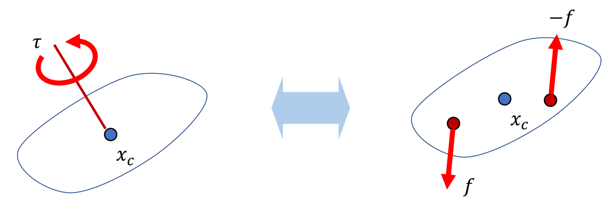|

P26   
## Actuating Articulated Rigid Bodies

|||
|---|---|
|&#x2705; 为了驱动角色，可以单独对每个刚体施加力或力矩。|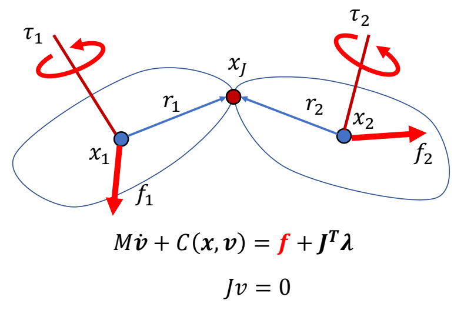|
|&#x2705; 也可以在关节上施加力矩。|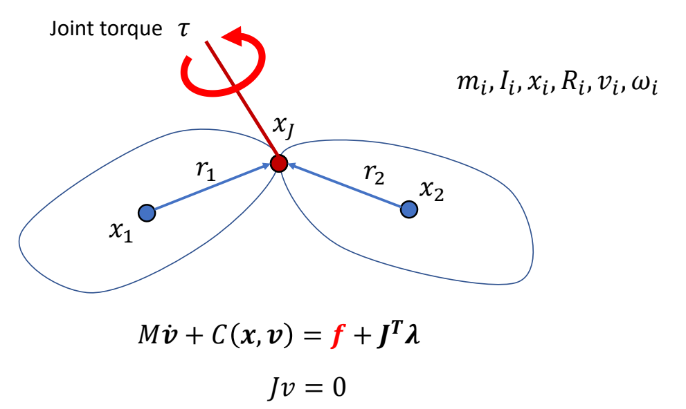|

P29   
## Joint Torques  

What is a joint torque?   
How is a joint torque applied?   

> &#x2705; 回顾前面公式，力和力矩都是施加在刚体上的，如何施加在关节上?   

P33  
### 什么是Joint Torques

> &#x2705; 关节上的力矩，可以看作是一个刚体对另一个刚体在关节处施加的成对的力。其合力为零但每个力施加的位置不同，可以转化为对另一刚体的力矩。   

$$
\sum_{i}^{} f_i=0
$$

> &#x2705; 每个力都会对其中一个刚体的质心上产生力矩，合力矩不为0。  

$$
\tau _1= \sum _ {i}^{} (r_1+r_i) \times f_i=r_1 \times \sum _ {i}^{}f_i + \sum _ {i}^{}r_i \times f_i
$$

P34   
由于

$$
\sum _ {i}^{}  f_i=0
$$

得： 

$$
\tau _1= \sum _ {i}^{} r_i \times f_i \quad \quad \quad \quad \tau _2= -\sum _ {i}^{} r_i \times f_i
$$

> &#x2705; 另一个方向同理。   
> &#x2705; 力矩跟关节的位置没有关系。  

P36   
结论：
 

> &#x2705; 在关节上施加力矩 \\( \tau\\) 等价于在一个刚体上施加 \\( \tau\\)，在另一个刚体上施加 \\(- \tau\\).    

P38  
### 怎样施加Joint Torques

Applying a joint torque \\( \tau\\):   
 - Add \\( \tau\\) to one attached body    
 - Add \\( -\tau\\) to the other attached body    

$$
M\begin{bmatrix}
 \dot{v}_1 \\\\
\dot{\omega }_1 \\\\
\dot{v}_2\\\\
\dot{\omega }_2 
\end{bmatrix} + \begin{bmatrix}
 0\\\\
\omega_1 \times I_1 \omega _1\\\\
0\\\\
\omega_2 \times I_2 \omega _2
\end{bmatrix}=\begin{bmatrix}
0 \\\\
\tau \\\\
0 \\\\
-\tau 
\end{bmatrix}+J^T\lambda 
$$

$$
Jv=0
$$

> &#x2705; 通常在子关节上加 \\(\tau \\)，在父关节上加 \\(-\tau \\)． 

P40   
## Simulating + Controlling a Character

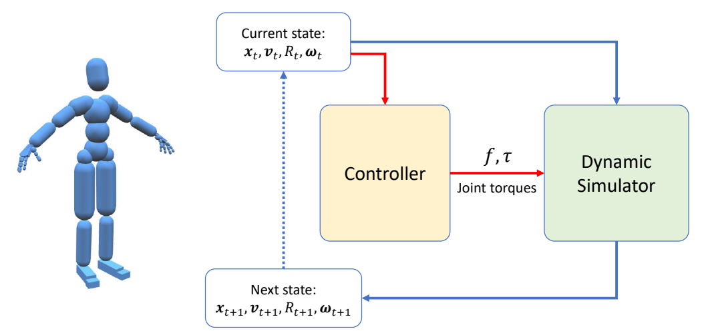

> &#x2705; 控制器，根据当前角色状态，以及额外控制信号实时计算出 \\(f \\) 和 \\(\tau \\)，影响角色动作变化。   

P44   
### Forward Dynamics vs. Inverse Dynamics
  
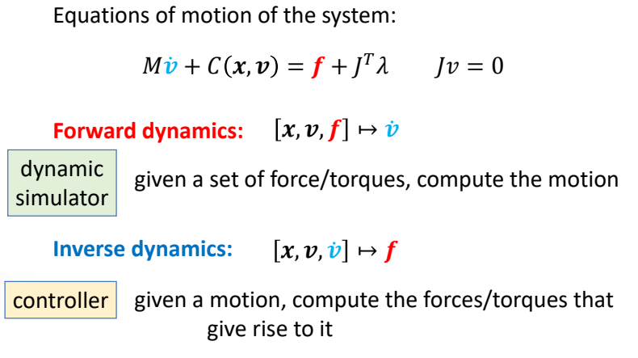

> &#x2705; 运动方程，本质上是建立力与加速度之间的联系。   
> &#x2705; 前向与后向，是一个运动方程的两种用法。  
> &#x2705; 仿真器为前向部分，控制后逆向部分。  

P46   

### Fully-Actuated vs. Underactuated

在上一节中，\\(f\\) 与 \\(V\\) 的自由度可能是不同的。\\(f\\) 是关节数\\( × 3\\)，\\(V\\) 是刚体数\\( × 3\\)。   

|||
|--|--|
|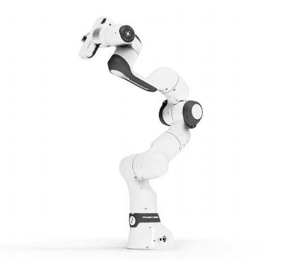 | 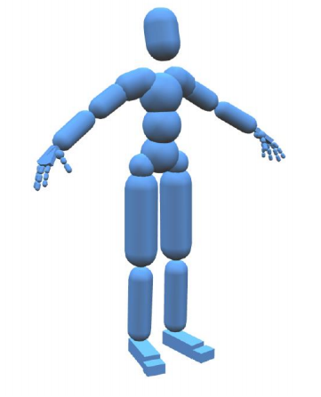|
|If #actuators ≥ #dofs, the system is **fully-actuated** | If #actuators < #dofs, the system is **underactuated** |
|For any \\([x,v,\dot{v} ]\\), there exists an \\(f\\) that produces the motion|For many \\([x,v,\dot{v} ]\\) , there is no such \\(f\\) that produces the motion|
|&#x2705; 可以精确控制机械臂到达目标状态。|&#x2705; 不借助外力情况，人无法控制 Hips 的状态（位置）。|

> &#x2705; ＃actuators：\\(f \\) 和 \\(\tau \\) 的自由度。  
> &#x2705; #dofs：角色状态的自由度。   
> &#x2705; 避免让角色掉入无法控制的状态。   
> [&#x2753;] 一个关节边接多个刚体是不是也会导欠驱动？   

P49   

### Feedforward vs. Feedback   

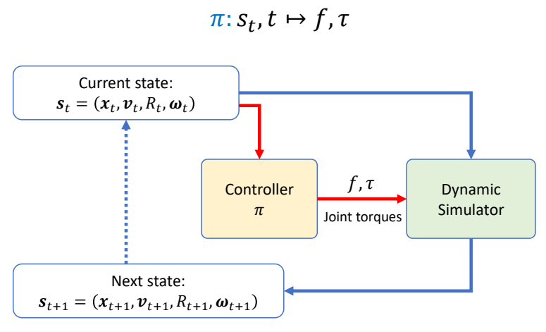

|Feedforward control|Feedback control|
|---|---|
|\\(f,\tau =\pi (t)\\)|\\(f,\tau =\pi (s_t,t)\\)|
|Apply predefined control signals **without considering the current state** of the system|Adjust control signals based on the current state of the system|
|Assuming unchanging system.|Certain perturbations are expected.|
|Perturbations may lead to unpredicted results &#x2705; 如果角色受到挠动而偏离了原计划，无法修正回来。|The feedback signal will be used to improves the performance at the next state.|

---------------------------------------
> 本文出自CaterpillarStudyGroup，转载请注明出处。
>
> https://caterpillarstudygroup.github.io/GAMES105_mdbook/

