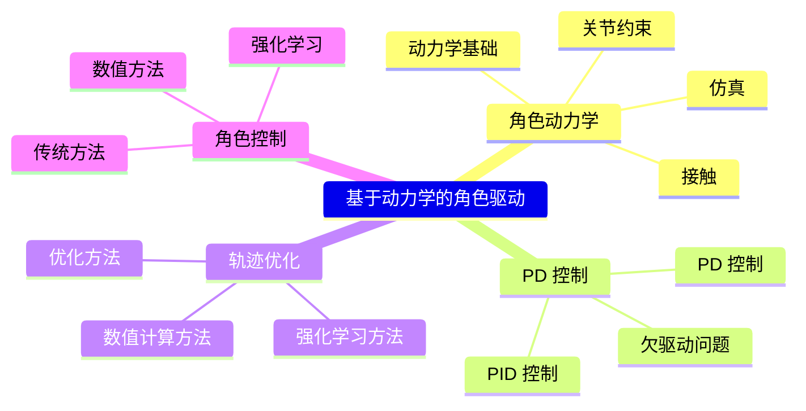

# 控制系统概览

## 本章知识框架



> &#x2705; **物理方法的难点**：
> &#x2705; (1) 仿真：在计算机中模拟出真实世界的运行方式。
> &#x2705; (2) 控制：生成角色的动作，来做出响应。
> &#x2705; 角色物理动画通常不关心仿真怎么实现。
> &#x2705; 但也可以把仿真当成白盒，用模型的方法来实现。


---

## 控制系统层次结构

理解角色控制的三个层次：

```
┌─────────────────────────────────────────────────────────────┐
│  高层：任务规划 (Task Planning)                              │
│  "做什么动作？什么时候做？"                                   │
│  方法：有限状态机、行为树、任务规划                          │
├─────────────────────────────────────────────────────────────┤
│  中层：轨迹生成/策略学习 (Trajectory/Policy)                 │
│  "如何生成目标动作序列？"                                     │
│  方法：轨迹优化 (CMA-ES/SAMCON)、RL (DeepMimic/AMP/ASE)       │
├─────────────────────────────────────────────────────────────┤
│  底层：执行控制 (Low-level Control)                          │
│  "如何计算关节力矩？"                                         │
│  方法：PD 控制                                                │
└─────────────────────────────────────────────────────────────┘
```

**本章节重点**：
- **Outline.md**: 控制系统概览
- **Proportional-DerivativeControl.md**: 底层 PD 控制原理
- **Controlling.md**: PD 在角色上的应用
- **Tracking/**: 中层轨迹优化方法

**层次之间的关系**：

```
中层 (轨迹优化/DeepMimic) 输出目标 q*, q̇*
              ↓
底层 PD 控制器 τ = k_p(q* - q) + k_d(q̇* - q̇)
              ↓
         物理仿真器
```

**深入学习**: [DeepMimic](https://caterpillarstudygroup.github.io/ReadPapers/201.html) | [AMP](https://caterpillarstudygroup.github.io/ReadPapers/198.html) | [ASE](https://caterpillarstudygroup.github.io/ReadPapers/199.html)
