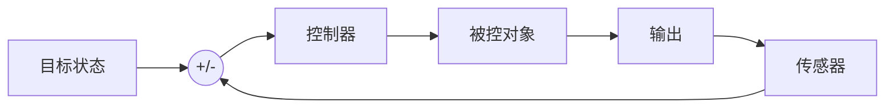
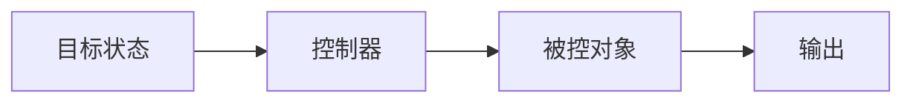
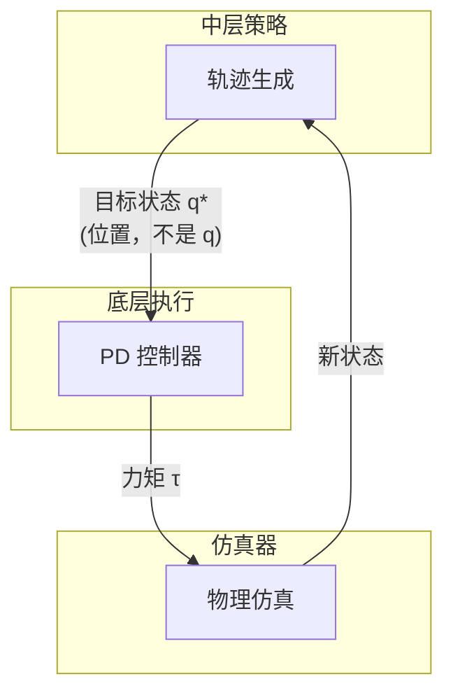
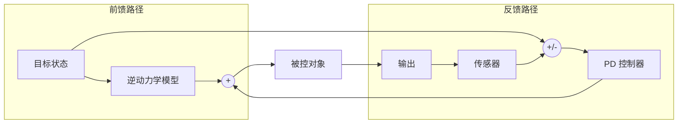

# 前馈控制与反馈控制（Feedforward vs. Feedback Control）

> &#x2705; **本章定位**：理解前馈控制和反馈控制的区别，以及 PD 控制在角色动画中的定位。

---

## 一、基本概念

### 反馈控制（Feedback Control）

**定义**：根据**当前状态**与**目标状态**的误差来调整控制输出。

$$
\tau = f(\text{当前状态}, \text{目标状态}) = f(e(t))
$$

**核心特征**：
- 依赖传感器测量当前状态
- 根据误差调整输出
- 可以抵抗扰动和不确定性

**框图**：



**例子**：
- PD 控制：\\(\tau = k_p(q_{\text{des}} - q_{\text{curr}}) + k_d(\dot{q}_{\text{des}} - \dot{q}_{\text{curr}})\\)
- 巡航控制：根据当前速度调整油门
- 恒温器：根据当前温度调整加热

---

### 前馈控制（Feedforward Control）

**定义**：根据**目标状态**和**系统模型**预先计算控制输出，不依赖当前状态测量。

$$
\tau = f(\text{目标状态}, \text{系统模型}) = f(q_{\text{des}}, M, C, G)
$$

**核心特征**：
- 不依赖传感器
- 基于模型预先计算
- 无法抵抗未建模的扰动

**框图**：



**例子**：
- 根据期望加速度预先计算需要的力矩
- 钢琴自动演奏：按预设程序执行
- 洗衣机：按预设程序运行，不检测衣服干净程度

---

## 二、核心区别

| 维度 | 反馈控制 | 前馈控制 |
|------|---------|---------|
| **输入** | 当前状态 + 目标状态 | 仅目标状态 + 模型 |
| **误差纠正** | ✅ 可以 | ❌ 不可以 |
| **抗扰动能力** | ✅ 强 | ❌ 弱 |
| **响应速度** | 受限于误差出现 | 可以预先动作 |
| **稳定性** | 可能振荡 | 取决于模型精度 |
| **模型依赖** | 低 | 高 |

---

## 三、PD 控制是反馈还是前馈？

### 这个问题很复杂...

### 从公式角度看：PD 是反馈控制

$$
\tau = k_p (q_{\text{des}} - q_{\text{curr}}) + k_d (\dot{q}_{\text{des}} - \dot{q}_{\text{curr}})
$$

**反馈特征**：
- 使用了当前状态 \\(q_{\text{curr}}, \dot{q}_{\text{curr}}\\)
- 根据误差 \\(e = q_{\text{des}} - q_{\text{curr}}\\) 计算输出
- 可以抵抗扰动

---

### 从系统角度看：PD 可以是前馈控制

在角色动画的完整系统中：



**前馈特征**：
- PD 的输入是轨迹生成器输出的 \\(q^*\\)
- \\(q^*\\) 是**期望位置**，不是当前状态 \\(q\\)
- PD 在这个层次上是**执行器**，不是控制器

---

### 正确答案：取决于观察层次

| 观察层次 | PD 控制类型 | 原因 |
|---------|-----------|------|
| **关节级别** | 反馈控制 | 使用当前关节状态计算力矩 |
| **系统级别** | 前馈控制 | 目标状态由上层决定，PD 只是执行 |

---

## 四、PD 控制器的两种形式

### 1. 纯反馈 PD（无前馈项）

$$
\tau = k_p (q^* - q) + k_d (\dot{q}^* - \dot{q})
$$

| 特点 | 说明 |
|------|------|
| **力矩来源** | 100% 来自反馈项 |
| **输入** | 仅需目标状态 \\((q^*, \dot{q}^*)\\) |
| **优点** | 简单、无需轨迹优化 |
| **缺点** | 稳态误差大、响应滞后、需要较大增益 |
| **适用场景** | 简单动作、对精度要求不高 |

**DeepMimic/AMP 等深度学习方法采用这种形式**：
- RL 策略输出目标状态 \\((q^*, \dot{q}^*)\\)
- PD 控制器负责计算力矩

---

### 2. 前馈 - 反馈复合 PD（有前馈项）

$$
\tau = \underbrace{\tau^*}_{\text{前馈}} + \underbrace{k_p (q^* - q) + k_d (\dot{q}^* - \dot{q})}_{\text{反馈}}
$$

| 特点 | 说明 |
|------|------|
| **力矩来源** | 前馈 \\(\tau^*\\) + 反馈 \\(\text{PD}\\) |
| **输入** | 目标状态 \\((q^*, \dot{q}^*)\\) + 前馈力矩 \\(\tau^*\\) |
| **优点** | 跟踪精度高、稳态误差小、增益可设小、动作更自然 |
| **缺点** | 需要轨迹优化或逆动力学计算 \\(\tau^*\\) |
| **适用场景** | 高精度跟踪、复杂动作 |

**前馈项 \\(\tau^*\\) 的来源**：
1. **轨迹优化**：同时优化状态轨迹和控制轨迹，\\(\tau^*\\) 作为前馈项
2. **逆动力学**：给定期望运动 \\((q^*, \dot{q}^*, \ddot{q}^*)\\)，计算需要的力矩

---

### 3. 两种形式的对比

| 维度 | 纯反馈 PD | 前馈 - 反馈复合 PD |
|------|----------|------------------|
| **公式** | \\(\tau = k_p e + k_d \dot{e}\\) | \\(\tau = \tau^* + k_p e + k_d \dot{e}\\) |
| **力矩分配** | 反馈 100% | 前馈 60-80% + 反馈 20-40% |
| **跟踪精度** | 较低（有稳态误差） | 较高（前馈抵消大部分力） |
| **抗扰动能力** | 好 | 好 |
| **参数整定** | \\(k_p, k_d\\) 需较大 | \\(k_p, k_d\\) 可较小 |
| **动作自然度** | 可能僵硬 | 更自然流畅 |
| **计算成本** | 低 | 中（需计算 \\(\tau^*\\)） |

---

### 4. 直观类比：开车

| | 纯反馈 PD | 前馈 - 反馈复合 PD |
|---|----------|------------------|
| **场景** | 新手开车上山 | 老司机开车上山 |
| **做法** | 看速度表，慢了加油，快了收油 | 凭经验预先加油门，同时微调 |
| **结果** | 能开，但速度波动大 | 开得平稳、省油 |

---

### 5. 实际建议

```
推荐方案：前馈 - 反馈复合控制
```

**参数分配建议**：
- 前馈项 \\(\tau^*\\)：承担 60-80% 的跟踪任务
- 反馈项 \\(k_p e + k_d \dot{e}\\)：承担 20-40% 的纠偏任务

**好处**：
- 反馈增益可以设小，动作更自然
- 前馈提供主要驱动力，跟踪更精确
- 反馈负责抗扰动，系统更鲁棒

---

## 五、在角色动画中的应用

### 纯反馈控制的局限

如果只用反馈控制：

$$
\tau = k_p (q_{\text{des}} - q_{\text{curr}}) + k_d (\dot{q}_{\text{des}} - \dot{q}_{\text{curr}})
$$

**问题**：
1. **稳态误差**：需要误差才能产生力矩
2. **响应滞后**：误差出现后才纠正
3. **被动性**：无法主动预测

---

### 前馈 + 反馈的组合控制

**最优方案**：结合前馈和反馈的优势

$$
\tau = \underbrace{k_p e + k_d \dot{e}}_{\text{反馈}} + \underbrace{\tau_{\text{feedforward}}}_{\text{前馈}}
$$

其中前馈项：

$$
\tau_{\text{feedforward}} = M(q)\ddot{q}_{\text{des}} + C(q, \dot{q}) + G(q)
$$

**框图**：



**优势**：
- 前馈项负责精确跟踪目标
- 反馈项负责抵抗扰动
- 两者结合实现最优控制

---

## 六、DeepMimic/AMP 中的控制类型

### DeepMimic 的控制架构

```mermaid
flowchart TB
    Mocap[参考动作] --> Reward[奖励函数]
    Reward --> RL[RL 策略训练]
    RL --> Policy[策略网络 π(a|s)]
    Policy --> PD[PD 控制器]
    PD --> Sim[物理仿真]
```

**控制类型分析**：

| 模块 | 控制类型 | 说明 |
|------|---------|------|
| **策略网络** | 前馈 + 反馈 | 输入当前状态 s，输出动作 a |
| **PD 控制器** | 反馈 | 使用当前关节状态计算力矩 |
| **整体系统** | 反馈 | 根据当前状态调整输出 |

---

### AMP 的控制架构


**控制类型**：
- 对抗学习训练策略
- 策略输出关节力矩或 PD 目标
- 本质上是反馈控制

---

## 七、实际应用中的选择

### 何时使用反馈控制？

| 场景 | 原因 |
|------|------|
| **有外部扰动** | 反馈可以纠正误差 |
| **模型不确定** | 不依赖精确模型 |
| **需要鲁棒性** | 反馈提供稳定性 |

### 何时使用前馈控制？

| 场景 | 原因 |
|------|------|
| **已知轨迹** | 可以预先计算 |
| **快速响应** | 不需要等待误差 |
| **模型精确** | 前馈效果准确 |

### 最佳实践：组合使用

```
总控制 = 前馈（逆动力学） + 反馈（PD）
```

**比例建议**：
- 前馈：60-80%（承担主要跟踪任务）
- 反馈：20-40%（负责误差纠正）

---

## 八、关键要点总结

1. **反馈控制**
   - 根据当前状态与目标的误差调整输出
   - 可以抵抗扰动
   - PD 控制是典型的反馈控制

2. **前馈控制**
   - 根据目标状态和模型预先计算
   - 无法抵抗未建模扰动
   - 响应更快，可以"预见"动作

3. **PD 控制的定位**
   - 关节级别：反馈控制
   - 系统级别：前馈控制的执行器
   - 完整系统：通常与前馈组合使用

4. **实际应用**
   - 纯反馈：简单但有稳态误差
   - 纯前馈：无法抵抗扰动
   - **前馈 + 反馈**：最优方案

---

## 九、与前向/后向动力学的关系

| 动力学类型 | 对应控制类型 | 说明 |
|-----------|------------|------|
| **前向动力学** | - | 给定力求运动（仿真器） |
| **后向动力学** | 前馈控制 | 给定运动求力（逆动力学） |

**关系**：
- 前馈控制需要解决后向动力学问题
- 反馈控制只需要前向动力学（仿真）

---

> &#128218; **深入学习**：
> - [稳态误差问题](SteadyStateError.md) - 反馈控制的固有局限
> - [欠驱动系统问题](UnderactuatedSystem.md) - PD 控制的另一个挑战
> - [Controlling Characters](Controlling.md) - PD 控制在角色上的应用
> - [轨迹优化](../Tracking/Tracking.md) - 前馈控制的典型应用

---

> 本文出自 CaterpillarStudyGroup，转载请注明出处。
> https://caterpillarstudygroup.github.io/GAMES105_mdbook/
