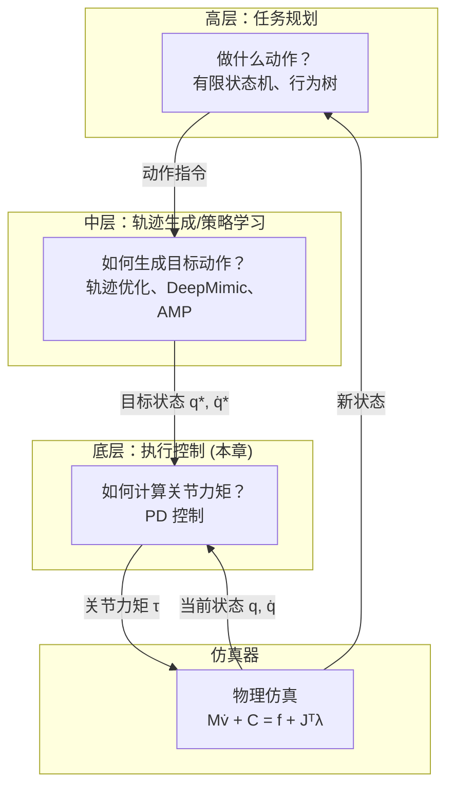

# PD 控制

> &#x2705; **本章定位**：理解如何设计和应用 PD 控制器，将**目标状态**转换为**关节力矩**。

---

## 在控制系统中的位置

| 层次 | 功能 | 典型方法 |
|------|------|----------|
| **高层** | 任务规划：决定做什么动作 | 有限状态机、行为树 |
| **中层** | 轨迹生成：输出目标状态 \\(q^*, \dot{q}^*\\) | 轨迹优化、DeepMimic、AMP |
| **底层** | 执行控制：计算关节力矩 \\(\tau\\) | PD 控制 |

**PD 控制的输入输出**：
- **输入**：目标状态 \\(q^*, \dot{q}^*\\) + 当前状态 \\(q, \dot{q}\\)
- **输出**：关节力矩 \\(\tau\\) → 送入仿真器

---

## 与仿真器的关系

| 模块 | 输入 | 输出 | 核心问题 |
|------|------|------|----------|
| **控制器** | 目标状态/轨迹 + 当前状态 | 关节力矩 τ | 如何生成力矩让角色达到目标？ |
| **仿真器** | 关节力矩 τ + 外力 | 新状态 | 给定力矩，角色会如何运动？ |

**分工说明**：
- 控制器是「逆向问题」：从目标反推力矩
- 仿真器是「前向问题」：从力矩推算运动

> &#x2705; 详细讲解见 [角色物理仿真基础](../Simulation.md)

---

## 本章内容导航

| 文件 | 内容 |
|------|------|
| [Proportional-Derivative Control](../Proportional-DerivativeControl.md) | PD 控制理论基础 - 简化例子：物体上下移动 - P 控制、PD 控制、PID 控制 - Stable PD（隐式欧拉） |
| [Controlling Characters](../Controlling.md) | PD 在角色上的应用 - 参数调优（\\(k_p\\)、\\(k_d\\)） - 欠驱动问题与净外力 - 稳态误差问题 |
| [Static Balance](StaticBalance.md) | 静态平衡专题 - 支撑面与质心 - PD 控制策略 - Jacobian Transpose Control |

---

## 本章重点问题

1. **PD 参数如何调优？**
   - \\(k_p\\) 太小：无法达到目标
   - \\(k_p\\) 太大：角色僵硬
   - \\(k_d\\) 太小：振荡
   - \\(k_d\\) 太大：响应慢

2. **欠驱动系统如何处理？**
   - 人形角色是欠驱动系统（无法直接控制质心位置）
   - 解决方案：净外力（root force/torque）

3. **稳态误差如何解决？**
   - PD 控制需要误差才能产生力
   - 解决方案：增大 \\(k_p\\) 或使用前馈补偿

4. **如何保证数值稳定性？**
   - 高增益需要小时间步长
   - 解决方案：隐式欧拉（Stable PD）

---

**深入学习**：[DeepMimic](https://caterpillarstudygroup.github.io/ReadPapers/201.html) | [AMP](https://caterpillarstudygroup.github.io/ReadPapers/198.html) | [ASE](https://caterpillarstudygroup.github.io/ReadPapers/199.html)
