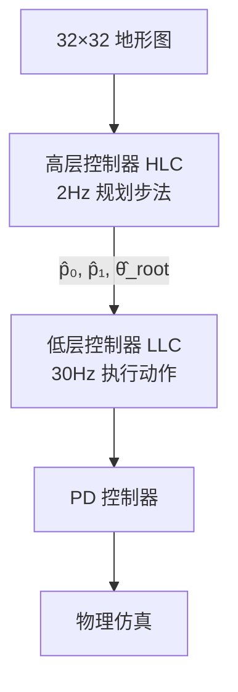

# 欠驱动系统问题（Underactuated System）

> &#x2705; **本章定位**：理解人形角色为什么是欠驱动系统，以及 PD 控制如何处理这个问题。

---

## 一、什么是欠驱动系统

### 定义

|  |  |
|--|--|
| **Fully-Actuated（完全驱动）** | 执行器数量 \\(\geq\\) 自由度数量 |
| **Underactuated（欠驱动）** | 执行器数量 \\(<\\) 自由度数量 |

**数学表述**：

$$
f, \tau \text{ 的自由度} < V \text{ 的自由度}
$$

其中：
- \\(f, \tau\\)：可主动控制的力/力矩
- \\(V\\)：角色状态的自由度

---

## 二、人形角色为什么是欠驱动系统

### 自由度分析

对于一个人形角色：

| 自由度类型 | 数量 | 是否可直接控制 |
|-----------|------|--------------|
| **根节点位置（Hips）** | 3 平移 + 3 旋转 = 6 | ❌ **不可直接控制** |
| **关节旋转** | 约 30+ | ✅ 可通过 \\(\tau\\) 控制 |

### 关键问题

**无法直接控制质心位置**：

```
     关节力矩 τ
        ↓
    只能控制关节旋转
        ↓
    无法直接控制 Hips 位置
        ↓
    需要借助外力（地面反作用力）
```

---

## 三、欠驱动带来的控制挑战

### 问题 1：无法直接控制质心

**场景**：想让角色向前走

```
❌ 错误思路：
   直接控制 Hips 向前移动 → 做不到！

✅ 正确思路：
   1. 用关节力矩 \\(\tau\\) 驱动腿部关节
   2. 脚对地面施加力
   3. 地面反作用力推动质心向前
```

### 问题 2：PD 控制的局限性

PD 控制公式：

$$
\tau = k_p (\theta_{\text{des}} - \theta_{\text{curr}}) + k_d (\dot{\theta}_{\text{des}} - \dot{\theta}_{\text{curr}})
$$

**局限性**：
- PD 控制只能控制**关节角度**
- 无法直接控制**质心位置**
- 质心运动是关节运动的**间接结果**

---

## 四、与完全驱动系统的对比

### 完全驱动系统（如机械臂）

```
     基座固定
        ↓
   所有关节都可控
        ↓
   可直接控制末端执行器位置
```

| 特性 | 机械臂（完全驱动） | 人形角色（欠驱动） |
|------|-----------------|-----------------|
| **基座** | 固定 | 自由浮动 |
| **可控自由度** | 所有关节 | 仅关节旋转 |
| **质心控制** | 间接 | 间接（需外力） |

### 欠驱动 vs. 完全驱动

|||
|---|---|
| | |
|If #actuators \\(\geq\\) #dofs, the system is **fully-actuated** | If #actuators \\(<\\) #dofs, the system is **underactuated** |
|For any \\([x,v,\dot{v}]\\) , there exists an \\(f\\) that produces the motion | For many \\([x,v,\dot{v}]\\) , there is no such \\(f\\) that produces the motion |
|&#x2705; 可以精确控制机械臂到达目标位置。|&#x2705; 不借助外力情况，人无法控制 Hips 的位置。|

> &#x2705; ＃actuators：\\(f\\) 和 \\(\tau\\) 的自由度。
> &#x2705; #dofs：角色状态的自由度。

---

## 五、解决方案

### 方案 1：净外力（Root Force/Torque）

**核心思想**：在根节点（Hips）上施加虚拟的力和力矩。

$$
\tau_{\text{root}} = k_p (x_{\text{des}} - x_{\text{curr}}) + k_d (\dot{x}_{\text{des}} - \dot{x}_{\text{curr}})
$$

**说明**：
- 虚拟力，不真实存在
- 用于计算期望的地面反作用力
- 在优化框架中常用

---

### 方案 2：动量控制（Momentum Control）

**核心思想**：通过控制动量来间接控制质心。

$$
\frac{d}{dt}(m \dot{x}_{\text{com}}) = \sum f_{\text{ext}}
$$

**说明**：
- 质心动量变化率 = 外力之和
- 通过控制地面反作用力来控制质心

---

### 方案 3：分层控制（Hierarchical Control）

**核心思想**：高层规划质心轨迹，低层用 PD 控制关节。

```
高层控制器
    输入：任务目标
    输出：质心轨迹、步法计划
    ↓
低层控制器（PD）
    输入：质心轨迹、当前状态
    输出：关节力矩 \\(\tau\\)
```

---

## 六、实际应用中的处理

### DeepLoco 的分层架构



| 控制器 | 频率 | 处理的问题 |
|--------|------|-----------|
| **HLC** | 2Hz | 规划步法（解决欠驱动问题） |
| **LLC** | 30Hz | 关节 PD 控制 |

---

### DeepMimic 的相位条件化

$$
\phi_t = (t \mod T_{\text{cycle}}) / T_{\text{cycle}}
$$

**核心思想**：用相位变量隐式编码质心运动规律。

---

## 七、欠驱动系统的控制难点总结

| 难点 | 原因 | 后果 |
|------|------|------|
| **质心不可控** | 无直接执行器 | 需要借助外力 |
| **平衡问题** | 支撑面有限 | 容易摔倒 |
| **接触切换** | 步态变化 | 动力学突变 |
| **冗余自由度** | 多关节协同 | 控制复杂度高 |

---

## 八、与稳态误差问题的关系

欠驱动系统问题和稳态误差问题是 PD 控制在角色动画中的**两大核心挑战**：

| 问题 | 本质 | 解决方案 |
|------|------|---------|
| **欠驱动系统** | 无法直接控制所有自由度 | 净外力、动量控制、分层控制 |
| **稳态误差** | 需要误差才能产生力矩 | 增大 \\(k_p\\)、前馈补偿 |

**关系**：
- 欠驱动问题是**结构性问题**（系统本身特性）
- 稳态误差问题是**控制器设计问题**（PD 控制局限）

---

## 九、关键要点总结

1. **人形角色是欠驱动系统**：无法直接控制质心位置
2. **PD 控制只能控制关节**：质心运动是间接结果
3. **需要借助外力**：地面反作用力是控制质心的关键
4. **分层控制是主流方案**：高层规划质心，低层控制关节
5. **与稳态误差问题并列**：是 PD 控制在角色控制中的两大挑战

---

> &#128218; **深入学习**：
> - [Controlling Characters](Controlling.md) - PD 控制在角色上的应用
> - [Static Balance](StaticBalance.md) - 静态平衡中的控制策略
> - [DeepLoco](https://caterpillarstudygroup.github.io/ReadPapers/218.html) - 分层控制案例

---

> 本文出自 CaterpillarStudyGroup，转载请注明出处。
> https://caterpillarstudygroup.github.io/GAMES105_mdbook/
