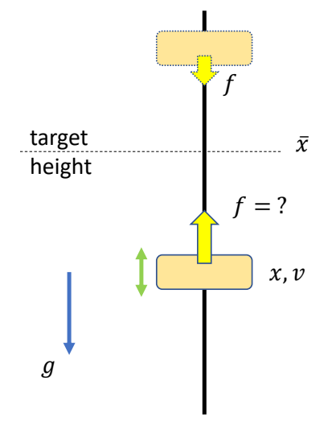
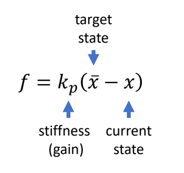
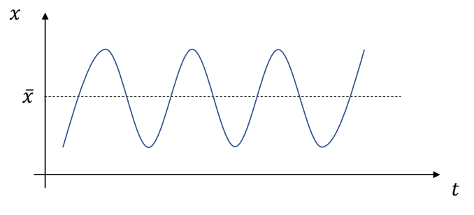
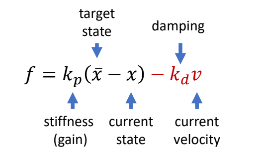
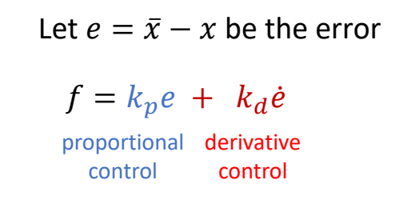
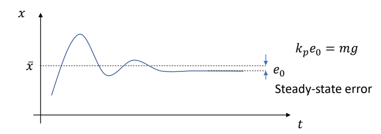
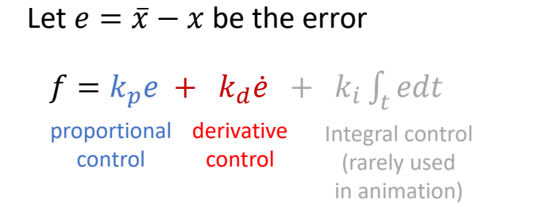
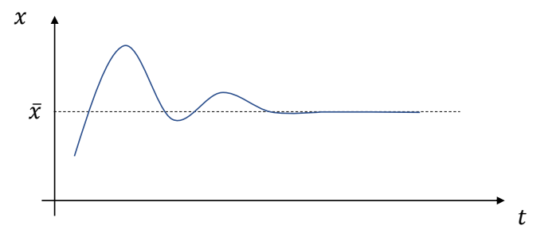

P55   
# Proportional-Derivative Control

这是一种常用的控制器。   

> &#x2705; 有反馈，但还是算是前向控制，因为反馈的部分和想控制的部分不完全一致。   

这一页先用一个简化问题来分析PD控制

## 问题描述

Compute force \\(f\\) to move the object to the target height    

> &#x2705; 例子：物体只能沿竿上下移动，且受到重力。  
> &#x2705; 控制目的：设计控制器，使物体在控制力的作用下达到目标高度。   

## 使用比例控制

实际上：会产生上下振荡，不会停在目标位置。

P56   
## 比例控制+Damping

> &#x2705; 改进：如果物体已有同方向速度，则力加得小一点。  

P57   

## 比例微分控制

> &#x2705; 第一项：比例控制；第二项：微分控制   

P59   
> &#x2705; 存在的问题：为了抵抗重力，一定会存在这样的误差。

   
P60   

Increase stiffness \\(k_p\\) reduces the steady-state error, but can make the system too stiff and numerically unstable    

> &#x2705; 增加 \\(k_p\\) 可以减小误差，但会让人看起来很僵硬。  

P61   
## 比例积分微分控制 Proportional-Integral-Derivative controller 

  
  

> &#x2705; 解决误差方法：积分项。   
> &#x2705; 但角色动画通常不用积分项。   
> &#x2705; 积分项跟历史相关，会带来实现的麻烦和控制的不稳定。  

## Stable PD Control

> &#x2705; PD control 的过程类似于一个弹簧系统。  
> &#x2705; 因此利用弹簧系统中的半隐式欧拉来提升 PD 的稳定性。   

### 显式欧拉的PD控制的稳定性分析

> &#x2705; \\(h\\) 为时间步长。  
> &#x2705; (1) 假设 \\(m＝1\\) (2) 代入 \\(f\\) 到方程组 (3) 方程组写成矩阵形式，得：   

P11   

$$
\begin{bmatrix}
 v_{n+1}\\\\
x_{n+1}
\end{bmatrix}=\begin{bmatrix}
1-k_dh  & -k_ph\\\\
 h(1-k_dh) & 1-k_ph^2
\end{bmatrix}\begin{bmatrix}
v_n \\\\
x_n
\end{bmatrix}
$$

P14  
提取常数方程A，得：

$$
A=\begin{bmatrix}
1-k_dh  & -k_ph\\\\
 h(1-k_dh) & 1-k_ph^2
\end{bmatrix}
$$

\\(\lambda _1,\lambda _2 \in  \mathbb{C}  \\) are eigenvalues of \\(A\\)   

> &#x2705; 基于中间变是 \\(z_n\\) 推导的过程跳过。  
> &#x2705; 根据矩阵特征值的性质可直接得出结论。  

if \\(|\lambda _1|> 1\\)   

The system is unstable!    

Condition of stability: \\(|\lambda _i|\le  1 \text{ for all } \lambda _i\\)   

> &#x2705; 如果 \\(k_p\\) 和 \\(k_d\\) 变大，就必须以一个较小的时间步长进行仿真。   

P22   
### 隐式欧拉的PD控制

> &#x2705; 解决方法：半隐式欧拉 → 隐式欧拉，即用下一时刻的力计算下一时刻的速度。   

- 半隐式欧拉

$$
\begin{align*}
 v_{n+1} & = v_n+h(-k_px_n-k_dv_n) \\\\
 v_{n+1} & = x_n+hv_{n+1}
\end{align*}
$$

$$
\Downarrow 
$$

- 隐式欧拉

$$
\begin{align*}
 v_{n+1} & = v_n+h(-k_px_n-k_dv_{n+1}) \\\\
 x_{n+1} & = x_n+hv_{n+1}
\end{align*}
$$

> &#x2705; 实际上，计算 \\(f_{n＋1}\\) 只使用 \\(V_{n＋1}\\) , 不使用 \\(x_{n＋1}\\) , 因为 \\(x_{n＋1}\\) 会引入非常复杂的计算。   
> &#x2705; 由于 \\(v_{n＋1}\\) 未知，需通过解方程组来求解。   

P23  
得到的方程组为：  

$$
\begin{bmatrix}
 v_{n+1} \\\\
x_{n+1} 
\end{bmatrix}=\frac{1}{1+hk_d} \begin{bmatrix}
 1 & -k_ph\\\\
 h & 1+k_dh-k_ph^2
\end{bmatrix}\begin{bmatrix}
 v_n\\\\
x_n
\end{bmatrix}
$$

> &#x2705; \\(v_{n}\\) 换成 \\(v_{n＋1}\\) ，很大承度上提高了稳定性。  

---------------------------------------
> 本文出自CaterpillarStudyGroup，转载请注明出处。
>
> https://caterpillarstudygroup.github.io/GAMES105_mdbook/