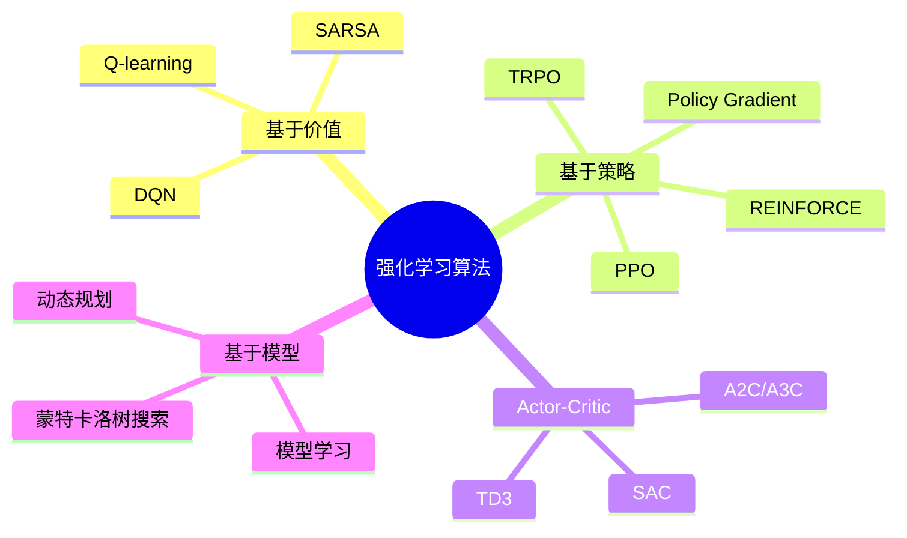

# 强化学习基础

> ✅ **本章定位**：理解强化学习的核心概念、数学基础和在 3D 角色动画中的应用。

---

## 一、什么是强化学习

### 核心思想

**强化学习 (Reinforcement Learning, RL)** 是一种通过**与环境交互**来学习最优行为的学习范式。

```
智能体 (Agent)
    │
    │ 观察状态 s_t
    ▼
环境 (Environment) ──→ 执行动作 a_t ──→ 获得奖励 r_t
    │                                       │
    └───────────────────────────────────────┘
                环境状态更新
```

**关键特点**：
- **试错学习**：通过尝试错误来学习
- **延迟奖励**：当前动作可能影响未来的奖励
- **序列决策**：需要考虑长期后果

---

### 与监督学习的对比

| | **监督学习** | **强化学习** |
|---|------------|------------|
| **数据来源** | 标注数据集 | 与环境交互 |
| **学习目标** | 预测标签/值 | 最大化累积奖励 |
| **反馈形式** | 正确答案 | 奖励信号（标量） |
| **时间依赖** | 通常独立同分布 | 序列依赖 |
| **典型应用** | 图像分类、翻译 | 游戏 AI、机器人控制 |

---

## 二、马尔可夫决策过程 (MDP)

### MDP 的定义

**马尔可夫决策过程 (Markov Decision Process, MDP)** 是强化学习的数学框架，用于描述序贯决策问题。

一个 MDP 由五元组定义：

$$
\mathcal{M} = (S, A, P, R, \gamma)
$$

| 符号 | 名称 | 说明 |
|------|------|------|
| \\(S\\) | **状态空间** (State Space) | 所有可能状态的集合 |
| \\(A\\) | **动作空间** (Action Space) | 所有可能动作的集合 |
| \\(P\\) | **状态转移概率** | \\(P(s' \mid s, a)\\)：在状态 \\(s\\) 执行动作 \\(a\\) 后转移到 \\(s'\\) 的概率 |
| \\(R\\) | **奖励函数** | \\(R(s, a, s')\\)：状态转移的即时奖励 |
| \\(\gamma\\) | **折扣因子** | \\(\gamma \in [0,1]\\)：未来奖励的折现率 |

---

### 马尔可夫性质

**马尔可夫性质**：当前状态已知的情况下，下一时刻状态只与当前状态相关，而与历史无关。

$$
P(s _{t+1} \mid s _t, a _t, s _{t-1}, a _{t-1}, \dots) = P(s _{t+1} \mid s _t, a _t)
$$

**直观理解**：当前状态 \\(s _t\\) 包含了做决策所需的**全部信息**。

---

### 轨迹与回报

**轨迹 (Trajectory)**：一次完整的状态 - 动作序列

$$
\tau = (s _0, a _0, s _1, a _1, s _2, a _2, \dots)
$$

**回报 (Return)**：轨迹的累积折扣奖励

$$
G_t = \sum _{k=0}^{\infty} \gamma ^k r _{t+k} = r_t + \gamma r _{t+1} + \gamma ^2 r _{t+2} + \dots
$$

**折扣因子的作用**：
- \\(\gamma = 0\\)：只关心眼前利益
- \\(\gamma \to 1\\)：考虑长远利益
- 数学上保证无限时域回报有界

---

## 三、核心概念

### 策略 (Policy)

**策略** \\(\pi\\) 是智能体的行为准则，定义了在每个状态下如何选择动作。

| 类型 | 数学形式 | 说明 |
|------|---------|------|
| **确定性策略** | \\(a = \pi(s)\\) | 状态 \\(s\\) 下总是选择同一动作 |
| **随机性策略** | \\(\pi(a \mid s)\\) | 状态 \\(s\\) 下选择动作 \\(a\\) 的概率 |

---

### 价值函数 (Value Function)

**状态价值函数** \\(V ^\pi(s)\\)：从状态 \\(s\\) 开始，遵循策略 \\(\pi\\) 的期望回报

$$
V ^\pi(s) = \mathbb{E} _\pi\left[G_t \mid s_t = s\right] = \mathbb{E} _\pi\left[\sum _{k=0}^{\infty} \gamma ^k r _{t+k} \mid s_t = s\right]
$$

**动作价值函数 (Q 函数)** \\(Q ^\pi(s, a)\\)：在状态 \\(s\\) 执行动作 \\(a\\) 后，遵循策略 \\(\pi\\) 的期望回报

$$
Q ^\pi(s, a) = \mathbb{E} _\pi\left[G_t \mid s_t = s, a_t = a\right]
$$

---

### 贝尔曼方程 (Bellman Equation)

贝尔曼方程描述了价值函数的**递归结构**：

**状态价值的贝尔曼方程**：

$$
V ^\pi(s) = \sum _a \pi(a \mid s) \sum _{s'} P(s' \mid s, a) \left[R(s, a, s') + \gamma V ^\pi(s')\right]
$$

**Q 函数的贝尔曼方程**：

$$
Q ^\pi(s, a) = \sum _{s'} P(s' \mid s, a) \left[R(s, a, s') + \gamma \sum _{a'} \pi(a' \mid s') Q ^\pi(s', a')\right]
$$

---

### 最优价值函数

**最优状态价值函数**：

$$
V^*(s) = \max _\pi V ^\pi(s)
$$

**最优动作价值函数**：

$$
Q^*(s, a) = \max _\pi Q ^\pi(s, a)
$$

**贝尔曼最优方程**：

$$
V^*(s) = \max _a \sum _{s'} P(s' \mid s, a) \left[R(s, a, s') + \gamma V^*(s')\right]
$$

$$
Q^*(s, a) = \sum _{s'} P(s' \mid s, a) \left[R(s, a, s') + \gamma \max _{a'} Q^*(s', a')\right]
$$

---

## 四、强化学习算法分类

### 分类图谱



---

### 1. 基于价值的方法 (Value-based)

**核心思想**：学习价值函数（Q 函数），通过价值函数导出策略。

$$
\pi(s) = \arg\max_a Q(s, a)
$$

**代表算法**：
- **Q-learning**：离线时序差分学习
- **SARSA**：在线时序差分学习
- **DQN**：深度 Q 网络（用神经网络近似 Q 函数）

**特点**：
- ✅ 样本效率较高
- ✅ 适用于离散动作空间
- ❌ 难以处理连续动作空间

---

### 2. 基于策略的方法 (Policy-based)

**核心思想**：直接学习并优化策略函数 \\(\pi(a \mid s; \theta)\\)。

$$
\max _\theta J(\theta) = \mathbb{E} _{\tau \sim \pi _\theta}\left[\sum _{t=0}^T \gamma ^t r_t\right]
$$

**策略梯度定理**：

$$
\nabla _\theta J(\theta) = \mathbb{E} _{\tau \sim \pi _\theta}\left[\sum _{t=0}^T \nabla_\theta \log \pi _\theta(a _t \mid s _t) Q ^\pi(s _t, a _t)\right]
$$

**代表算法**：
- **REINFORCE**：蒙特卡洛策略梯度
- **TRPO**：信赖域策略优化
- **PPO**：近端策略优化

**特点**：
- ✅ 适用于连续动作空间
- ✅ 可学习随机策略
- ❌ 样本效率较低

---

### 3. Actor-Critic 方法

**核心思想**：结合基于价值和基于策略的方法。

```
Actor (策略网络) ──→ 选择动作 a
       │
       ▼
Critic (价值网络) ──→ 评估动作好坏
```

**更新规则**：
- **Actor**：根据 Critic 的评估更新策略
- **Critic**：学习价值函数

**代表算法**：
- **A2C/A3C**：同步/异步优势 Actor-Critic
- **SAC**：软 Actor-Critic（最大熵 RL）
- **TD3**：双延迟深度确定性策略梯度

**特点**：
- ✅ 样本效率高
- ✅ 适用于连续控制
- ✅ 训练稳定

---

### 4. 基于模型的方法 (Model-based)

**核心思想**：学习环境的动力学模型，然后基于模型进行规划。

$$
s _{t+1} = f(s_t, a_t; \theta _{model})
$$

**方法分类**：

| 方法 | 说明 |
|------|------|
| **已知模型** | 使用已知的物理模型（如机器人动力学） |
| **学习模型** | 用神经网络学习状态转移函数 |
| **模型学习 + 规划** | 学习模型后用 MPC 等方法规划 |

**代表算法**：
- **MBPO**：基于模型的策略优化
- **MuZero**：学习隐式模型 + 蒙特卡洛树搜索

**特点**：
- ✅ 样本效率最高
- ✅ 可"想象"未来
- ❌ 模型误差影响性能

---

## 五、在 3D 角色动画中的应用

### DeepMimic 范式

**核心思想**：用强化学习模仿参考动作（来自动捕或轨迹优化）。

```
参考轨迹 (动捕/轨迹优化)
         ↓
奖励函数设计（跟踪误差 + 风格项）
         ↓
RL 训练（PPO/TRPO）
         ↓
泛化策略 π
```

**奖励函数设计**：

$$
r_t = w _{pose} \cdot r _{pose} + w _{vel} \cdot r _{vel} + w _{com} \cdot r _{com} + w _{end} \cdot r _{end}
$$

| 奖励项 | 说明 |
|--------|------|
| \\(r _{pose}\\) | 姿势跟踪奖励（关节角度） |
| \\(r _{vel}\\) | 速度跟踪奖励 |
| \\(r _{com}\\) | 质心跟踪奖励 |
| \\(r _{end}\\) | 终止奖励（摔倒惩罚） |

**代表工作**：
- **DeepMimic (2018)**：开创性工作，模仿多样化动作
- **AMP (2021)**：无参考姿态的对抗模仿学习
- **ASE (2022)**：环境交互的技能学习

---

### 状态空间设计

**典型的角色状态表示**：

$$
s_t = (q _{root}, \dot{q} _{root}, q _{local}, \dot{q} _{local}, q _{ref}, \dot{q} _{ref})
$$

| 分量 | 说明 |
|------|------|
| \\(q _{root}\\) | 根节点位置和旋转 |
| \\(\dot{q} _{root}\\) | 根节点速度 |
| \\(q _{local}\\) | 局部关节角度 |
| \\(\dot{q} _{local}\\) | 局部关节角速度 |
| \\(q _{ref}\\) | 参考姿势 |
| \\(\dot{q} _{ref}\\) | 参考速度 |

---

### 动作空间设计

| 类型 | 说明 | 适用场景 |
|------|------|---------|
| **关节位置目标** | 输出目标关节角度，用 PD 控制跟踪 | 最常用，平滑稳定 |
| **关节力矩** | 直接输出关节力矩 | 精确控制，但难训练 |
| **肌肉激活** | 输出肌肉激活信号 | 生物力学仿真 |

---

## 六、强化学习 vs. 轨迹优化

### 核心对比

| 维度 | 轨迹优化 | 强化学习 |
|------|---------|---------|
| **输出** | 一条轨迹 \\((\mathbf{x}, \mathbf{u})\\) | 一个策略 \\(\pi(\mathbf{s})\\) |
| **泛化能力** | ❌ 仅适用于该轨迹 | ✅ 可处理新状态 |
| **训练时间** | 秒级 ~ 分钟级 | 小时级 ~ 天级 |
| **推理速度** | N/A | 毫秒级 |
| **模型需求** | ✅ 需要精确模型 | ⚠️ 可有可无 |
| **样本效率** | ✅ 高 | ❌ 低 |

### 方法选择决策树

```
开始：选择角色控制方法
    │
    ├─ 是否需要泛化能力？
    │   ├─ 否 → 轨迹优化 ⭐
    │   └─ 是 → 强化学习 ⭐
    │
    ├─ 是否有精确动力学模型？
    │   ├─ 是 → MPC / 轨迹优化
    │   └─ 否 → 强化学习
    │
    └─ 实时性要求？
        ├─ 毫秒级 → 强化学习（推理）
        └─ 秒级可接受 → MPC
```

---

## 七、实践建议

### 训练技巧

| 技巧 | 说明 |
|------|------|
| **课程学习** | 从简单任务开始，逐步增加难度 |
| **奖励塑形** | 设计稠密奖励，加速学习 |
| **域随机化** | 随机化物理参数，提高泛化性 |
| **并行采样** | 多环境并行采样，提高样本效率 |

### 常见陷阱

| 陷阱 | 症状 | 解决方案 |
|------|------|---------|
| **奖励黑客** | 智能体找到奖励漏洞 | 仔细设计奖励函数 |
| **欠训练** | 策略不稳定、易摔倒 | 增加训练步数 |
| **过拟合** | 只在特定场景有效 | 域随机化、增加多样性 |
| **稀疏奖励** | 学习缓慢或不收敛 | 奖励塑形、课程学习 |

---

## 八、关键要点总结

### MDP 基础
- **状态**、**动作**、**转移概率**、**奖励**、**折扣因子**
- **策略** \\(\pi\\)：状态到动作的映射
- **价值函数** \\(V ^\pi, Q ^\pi\\)：评估状态/动作的好坏

### 算法分类
| 类别 | 代表算法 | 适用场景 |
|------|---------|---------|
| 基于价值 | DQN | 离散控制 |
| 基于策略 | PPO, TRPO | 连续控制 |
| Actor-Critic | SAC, TD3 | 连续控制 + 高效率 |
| 基于模型 | MBPO | 样本效率优先 |

### 角色动画应用
- **DeepMimic 范式**：模仿学习 + 泛化
- **状态设计**：关节角度、速度、参考轨迹
- **动作设计**：关节目标、力矩、肌肉激活

### 与轨迹优化的关系
- **轨迹优化**：特定动作生成、高精度
- **强化学习**：通用策略、泛化能力强
- **混合方法**：轨迹优化 + RL 模仿

---

> 📚 **深入学习**：
> - [方法对比与分类](Tracking/MethodComparison.md) - 轨迹优化方法对比
> - [DeepMimic](https://caterpillarstudygroup.github.io/ReadPapers/201.html) - RL 在角色动画中的经典应用
> - [AMP](https://caterpillarstudygroup.github.io/ReadPapers/198.html) - 无参考动作的模仿学习
> - [Sutton & Barto - Reinforcement Learning: An Introduction](https://www.cs.ubc.ca/~murphyk/Teaching/CS340-07/reading/sutton.pdf) - RL 经典教材

---

> 本文出自 CaterpillarStudyGroup，转载请注明出处。
> https://caterpillarstudygroup.github.io/GAMES105_mdbook/
