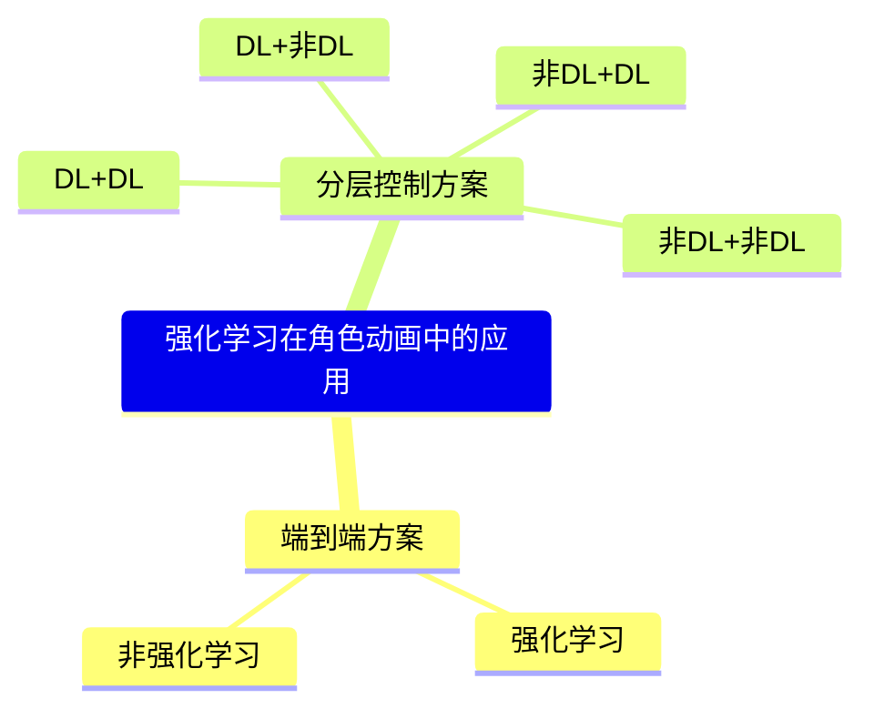

# 强化学习在角色动画中的应用

强化学习适用于在给定极少且不确定的未来信息的情况做出当前的最优决策。  
在角色动画领域中，强化学习有两种使用场景：
1. 高层控制：根据任务目标规划任务的执行方案。执行方案可能是明确的动画轨迹，也可能是latent code，或者是其它控制信号。    
2. 中层控制：根据角色当前的状态，规划自己的动作，保证能完成高层给的执行方案且保证较好的动作质量。在动力学方法中，『较好的动作质量』即不摔倒，走得稳。在运动学方法中，『较好的动作质量』指动作转移合理。

高层控制和中层控制都适合用强化学习解决，但也可以通过其它方法解决。通过梳理相关工作，分为以下几类：
1. 把高层控制和中层控制看作是一个端到端的任务，用一个强化学习同时解决『执行方案』和『执行细节』两个问题。
2. 分别解决高层控制和中层控制，各自使用一个强化学习。
3. 高层控制使用强化学习来解决，中层控制使用其它方法。例如运动学方法使用运动转移先验模型。动力学方法可以使用轨迹优化（如果高层输出的是轨迹）方法或者直接使用前向推理方向。
4. 中层使用强化学习来解决『走得好』的问题，高层则通过其它方法生成执行方案。例如生成类的方法、Motion Matching或者直接使用动捕数据。
5. 也可以完成不用强化学习。直接端到端地生成动作，或者分别用不同的方法解决两个level的控制问题。这一类方法不在本页的讨论范围中。

关于参考动作，有没有参考动作对结果影响非常大。参考动作主要有三个作用：
1. 加速训练收敛
2. 让动作更『人』
3. 定义动作的风格

参考动作发挥作用的方法主要有两种：
1. GT，直接作为模型的模仿目标
2. 鉴定，用于判断生成动作与参考动作是否相似
3. 提取数据的关节特征，构造模型的目标函数

除了参考动作，还有其它构造数据的方式：
1. 对参考动作做增强
2. 用传统算法构造数据
3. 从生成的动作中挑一些好的



## 端到端的强化学习方案

### 在线RL

| 方法 | 状态空间 S | 动作空间 A | 奖励函数 R | 核心贡献 |
|------|-----------|-----------|-----------|---------|
| [**Feature-Based**2010](https://caterpillarstudygroup.github.io/ReadPapers/200.html) | 物理特征（角动量等） | 关节力矩 | 手工设计多目标 | 高层特征控制器 |
| **Nerve Net**2015 | 关节 + 根节点状态 | 关节力矩 | 任务奖励 | 通用多角色控制器 |
| [**Predict-and-Simulate**2019](https://caterpillarstudygroup.github.io/ReadPapers/215.html) | 状态 + 目标 | PD 目标 | 任务奖励 | 从无组织数据学习 |
| [**Gait-Conditioned Reinforcement Learning with Multi-Phase Curriculum for Humanoid Locomotion**2025](https://caterpillarstudygroup.github.io/ReadPapers/185.html) | 关节 +IMU+ 命令 | PD 目标轨迹 | 步态条件奖励 (独热路由) | PPO+RNN | 课程学习 + 奖励路由 |

### 离线RL

由于RL模型只能针对特定任务训练，所以有些方法会离线训练多个RL模型，再用非RL蒸馏出一个同样功能的非RL模型供在线使用。

| 方法 | 状态空间 S | 动作空间 A | 训练范式 | 蒸馏源 |
|------|-----------|-----------|---------|--------|
| [**DiffuseLoco**2024](https://caterpillarstudygroup.github.io/ReadPapers/195.html) | 关节 + 根节点 + 技能标签 | 31D PD 目标 | 纯离线 | 多专家 RL |
| [**PDP**2024](https://caterpillarstudygroup.github.io/ReadPapers/192.html) | 物理状态 + 任务标签 | 多帧 PD 目标 | 离线 BC | 多任务 RL 专家 |

| 维度 | DiffuseLoco | PDP | 
|------|------------|----------|
| **数据源** | 闭环离线 RL 数据 | RL 专家轨迹 | 
| **模型类型** | 扩散 | 扩散 | 
| **输出** | 单帧 PD 目标 | 多帧序列 | 
| **物理稳定** | ✅ RL 专家保证 | ✅ RL 专家保证 | 

## DL + DL

| 方法 | 状态空间 S | 动作空间 A | 奖励函数 R | 价值函数 V | 算法 |
|------|------|-----------|-----------|-----------|-----------|
| [**DeepLoco (2017)**](https://caterpillarstudygroup.github.io/ReadPapers/218.html) | **LLC**: 110D (关节 + 根节点 + 相位) | **LLC**: 22D 关节 PD 目标 | **LLC**: 姿势风格 + 末端位置 + 速度 + 平衡 | CACLA Critic | Actor-Critic+CACLA |
|  | **HLC**: 1129D (+32×32 地形图) | **HLC**: 5D 步法计划 | **HLC**: 朝目标方向移动 | CACLA Critic | Actor-Critic+CACLA |
| [**ASE (2022)**](https://caterpillarstudygroup.github.io/ReadPapers/199.html) | 120D 身体配置<br>+ 技能 z | **低级**: 31D PD 目标 | 对抗奖励 + 技能多样性奖励 | PPO Critic | PPO +<br>互信息最大化 |
|| 120D 身体配置<br>+ 任务目标 | **高级**: z̄→z (球面) | 任务奖励 + 风格奖励 | PPO Critic | PPO +<br>互信息最大化 |

## 非DL + DL

| 方法 | 上层方法及输出 | 状态空间 S | 动作空间 A | 奖励函数 R | 价值函数 V | 算法 |
|------|------|---|-----------|-----------|-----------|-----------|
|[**DeepMimic (2018)**](https://caterpillarstudygroup.github.io/ReadPapers/201.html)| 固定轨迹<br>（Mocap 时间序列） | 关节 [p,v,q,ω] + 相位 φ | PD 目标 | 模仿奖励 + 任务奖励<br>模仿奖励=姿势 + 速度 + 末端 + 质心 | PPO Critic<br>GAE(λ) | PPO |
| [**DReCon**2019](https://caterpillarstudygroup.github.io/ReadPapers/190.html) | MM动态生成轨迹 | 角色状态 + 辅助信息 +MM 参考 | PD 目标 | 跟踪奖励 + 稳定性奖励 | PPO Critic | PPO+MM |
|[AMP (2021)](https://caterpillarstudygroup.github.io/ReadPapers/198.html)|Mocap轨迹| ~120D 躯干 + 关节 + 末端 | ~31D 关节目标旋转 | 任务奖励 + 风格奖励<br>风格奖励由判别器给出 | PPO Critic | PPO+LS-GAN |
| [**ControlVAE**2023](https://caterpillarstudygroup.github.io/ReadPapers/202.html) | CVAE输出z | 120D 身体配置 | 31D PD 目标 | 任务奖励 + VAE 重建奖励 | PPO Critic | VAE+PPO |
| [**CLOSD**2025](https://caterpillarstudygroup.github.io/ReadPapers/188.html) | 扩散规划输出轨迹 | 角色状态 + 辅助信息 | PD 控制器目标 | 文本 + 目标双条件 | PPO Critic | 扩散规划 + RL 跟踪 |
| [**DARTControl**2025](https://caterpillarstudygroup.github.io/ReadPapers/205.html) | Latent Diffusion输出z | 动作历史 + 文本 + 空间目标 | Latent noise optimization | 空间目标达成度 + 动作质量 | PPO Critic | PPO |
| [**A-MDM**2024](https://caterpillarstudygroup.github.io/ReadPapers/206.html) | 自回归扩散模型输出动作 | 关节 + 根节点 + 任务目标 | 残差扰动信号（各去噪步骤） | 任务奖励 + 扩散引导 | PPO Critic | 自回归扩散 + RL |

### 数据增强

| 方法 | 上层方法及输出 | 状态空间 S | 动作空间 A | 奖励函数 R | 价值函数 V | 算法 |
|------|------|---|-----------|-----------|-----------|-----------|
| [**PARC**2025](https://caterpillarstudygroup.github.io/ReadPapers/189.html) | 扩散模型输出轨迹 | 角色状态 + 地形信息 | PD 控制器目标 | 物理约束 + 模仿奖励 | PPO Critic | PPO |

## DL + 非DL

| 方法 | 状态空间 S | 动作空间 A | 奖励函数 R | 价值函数 V | 算法 |中层控制方法|
|------|-----------|-----------|-----------|-----------|------|---|
| [**UHMP**](https://caterpillarstudygroup.github.io/ReadPapers/191.html) | 关节 + 根节点 + 任务目标 | z (隐变量)<br>可**Decoder**出 a (PD 目标) | 任务奖励 | PPO Critic | CVAE +<br>蒸馏 +PPO |从mocap学CVAE，再通过轨迹优化+蒸馏保证物理合理|

**核心设计**：
- 阶段 1：CVAE 从 MoCap 学习动作先验
- 阶段 2：轨迹优化器蒸馏，保证物理稳定
- 阶段 3：高层 RL 学习选择隐变量 z


> 📚 **深入学习 RL 算法**：[DeepLearningNotes - RL](https://windmissing.github.io/DeepLearningNotes/RL/Reinforce.html) - 包含 REINFORCE、Q-Learning、A3C、PPO 等算法的详细推导
>
> 📚 **轨迹优化对比**：[方法对比与分类](Tracking/MethodComparison.md)


---

## 方法分类总览

基于物理的角色控制中的强化学习方法，可以根据**参考数据的使用方式**分为以下几类：

```
基于强化学习的角色控制方法
│
├── 一、有参考动作（模仿学习）
│   │   目标：模仿参考数据的动作风格
│   │
│   ├── 1.1 精确跟踪参考轨迹
│   │   │   特点：跟踪一个具体的参考轨迹，要求高度一致
│   │   │
│   │   ├── (a) 固定轨迹（预定义时间序列）
│   │   │   └── DeepMimic (2018)
│   │   │
│   │   └── (b) 动态生成轨迹（实时选择）
│   │       └── DReCon (2019) - MM 生成参考
│   │
│   ├── 1.2 风格模仿（无序数据）
│   │   └── DeepLoco (2017) - 分层控制
│   │
│   └── 1.3 无监督模仿学习（无标注数据）
│       │   特点：从无标注数据集中学习动作先验，无需精确跟踪
│       │
│       ├── 对抗学习：AMP (2021)
│       ├── 世界模型：ControlVAE (2023)
│       ├── 预训练 + 微调：ASE (2022)
│       └── CVAE + 蒸馏：UHMP (2024)
│
├── 二、无参考动作（纯 RL）
│   │   目标：仅通过任务奖励学习
│   │
│   ├── 2.1 早期工作（关节力矩控制）
│   │   ├── Feature-Based Control (2010)
│   │   ├── Nerve Net (2015)
│   │   └── Predict-and-Simulate (2019)
│   │
│   └── 2.2 近期工作（PD 控制 + 课程学习）
│       └── 纯 RL (2025)
│
└── 三、新技术融合
    │   目标：结合新型生成模型
    │
    ├── 3.1 扩散模型离线蒸馏
    │   ├── DiffuseLoco (2024)
    │   ├── PDP (2024)
    │   └── UniPhys (2024)
    │
    ├── 3.2 扩散规划 + RL 跟踪
    │   └── CLOSD (2025)
    │
    ├── 3.3 扩散模型 + 掩码补全
    │   └── MaskedMimic (2024)
    │
    ├── 3.4 自回归生成 + RL
    │   ├── A-MDM (2024)
    │   └── DARTControl (2025)
    │
    └── 3.5 数据扩增辅助
        └── PARC (2025)
```

---

## 核心设计详解

### 各方法状态空间设计对比

**典型的角色状态表示**：

$$
s_t = (q _{root}, \dot{q} _{root}, q _{local}, \dot{q} _{local}, q _{ref}, \dot{q} _{ref})
$$

| 分量 | 说明 |
|------|------|
| \\(q _{root}\\) | 根节点位置和旋转 |
| \\(\dot{q} _{root}\\) | 根节点速度 |
| \\(q _{local}\\) | 局部关节角度 |
| \\(\dot{q} _{local}\\) | 局部关节角速度 |
| \\(q _{ref}\\) | 参考姿势 |
| \\(\dot{q} _{ref}\\) | 参考速度 |

**各方法的状态设计特点**：

| 方法 | 状态设计特点 |
|------|-------------|
| **AMP** | ~120D 完整状态，判别器只看状态转换 (s_t, s_{t+1}) |
| **ControlVAE** | 120D 身体配置 + 技能 z，世界模型预测未来状态 |
| **ASE** | 120D 身体配置 + 潜在技能 z，球形空间均匀采样 |
| **UHMP** | 关节 + 根节点 s^p + 隐变量 z，Prior 设计 R(z\|s^p)=N(z\|μ^p_t,σ^p_t) |
| **纯 RL** | 关节状态 +IMU+ 命令，RNN 记忆周期步态 |

### 各方法动作空间设计对比

| 类型 | 说明 | 适用场景 | 代表方法 |
|------|------|---------|---------|
| **关节位置目标** | 输出目标关节角度，用 PD 控制跟踪 | 最常用，平滑稳定 | DeepLoco, DeepMimic, AMP, ASE |
| **关节力矩** | 直接输出关节力矩 | 精确控制，但难训练 | - |
| **肌肉激活** | 输出肌肉激活信号 | 生物力学仿真 | - |
| **潜在变量 z** | 输出隐变量，由 Decoder 转动作 | 统一表示、技能复用 | ASE, UHMP |

**各方法的动作设计特点**：

| 方法 | 动作设计特点 |
|------|-------------|
| **DeepLoco** | 分层设计：LLC 输出 22D 关节 PD 目标，HLC 输出 5D 步法计划 |
| **DeepMimic** | PD 目标 (q^target, ω^target)，直接跟踪参考动作 |
| **DReCon** | PD 目标，从 MM 动态生成 |
| **AMP** | ~31D 关节目标旋转，通过 PD 控制器执行 |
| **ControlVAE** | 31D PD 目标，VAE 解码器输出 |
| **ASE** | 低级策略输出 31D PD 目标，高级策略输出球面潜在变量 z̄ |
| **UHMP** | 高层策略输出隐变量 z，Decoder 解码为 PD 目标 |
| **纯 RL** | 直接输出 PD 目标轨迹，RNN 编码时序信息 |

---

## 强化学习 vs. 轨迹优化

### 核心对比

| 维度 | 轨迹优化 | 强化学习 |
|------|---------|---------|
| **输出** | 一条轨迹 \\((\mathbf{x}, \mathbf{u})\\) | 一个策略 \\(\pi(\mathbf{s})\\) |
| **泛化能力** | ❌ 仅适用于该轨迹 | ✅ 可处理新状态 |
| **训练时间** | 秒级 ~ 分钟级 | 小时级 ~ 天级 |
| **推理速度** | N/A | 毫秒级 |
| **模型需求** | ✅ 需要精确模型 | ⚠️ 可有可无 |
| **样本效率** | ✅ 高 | ❌ 低 |

---

## 实践建议

### 训练技巧

| 技巧 | 说明 |
|------|------|
| **课程学习** | 从简单任务开始，逐步增加难度 |
| **奖励塑形** | 设计稠密奖励，加速学习 |
| **域随机化** | 随机化物理参数，提高泛化性 |
| **并行采样** | 多环境并行采样，提高样本效率 |

### 常见陷阱

| 陷阱 | 症状 | 解决方案 |
|------|------|---------|
| **奖励黑客** | 智能体找到奖励漏洞 | 仔细设计奖励函数 |
| **欠训练** | 策略不稳定、易摔倒 | 增加训练步数 |
| **过拟合** | 只在特定场景有效 | 域随机化、增加多样性 |
| **稀疏奖励** | 学习缓慢或不收敛 | 奖励塑形、课程学习 |

---

## 关键要点总结

### 核心设计趋势

- **状态表示**：从手工设计 → 学习隐变量表示
- **动作表示**：从直接关节控制 → 潜在空间控制
- **训练范式**：从零训练 → 预训练 + 微调
- **技能复用**：从每任务重新训练 → 低级策略固定

---

> 本文出自 CaterpillarStudyGroup，转载请注明出处。
> https://caterpillarstudygroup.github.io/GAMES105_mdbook/
