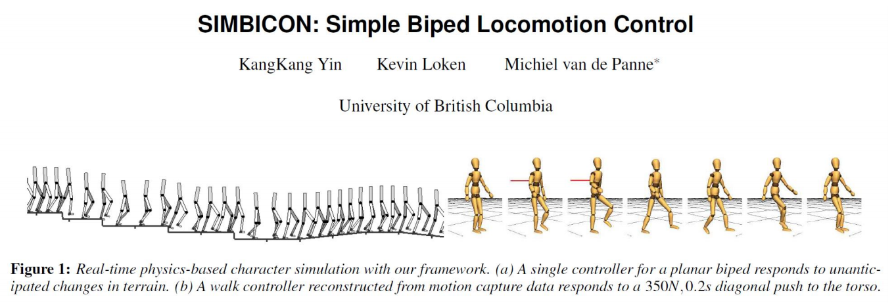
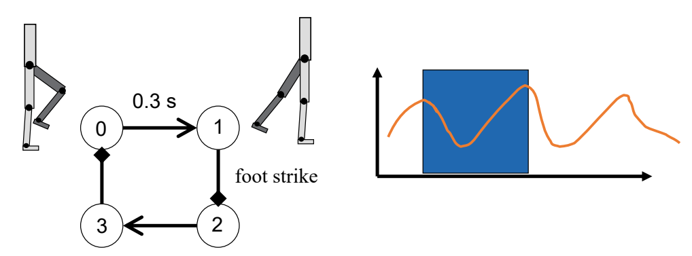
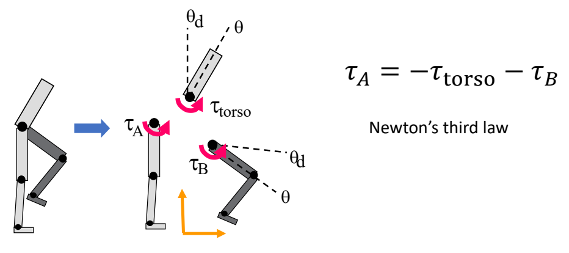
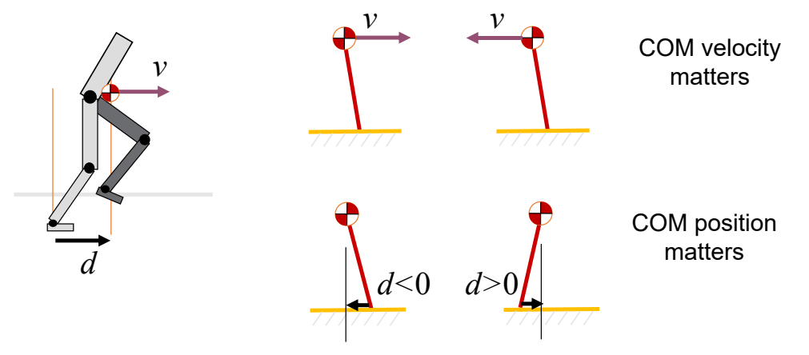
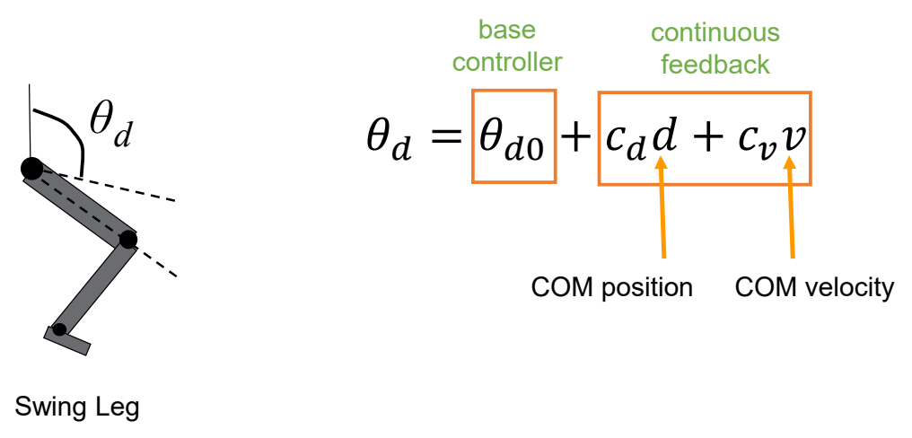
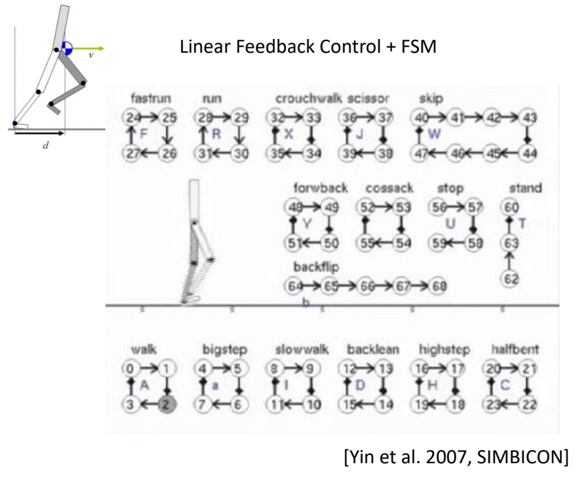

P48   
## SIMBICON   

> &#x1F50E; SIMBICON (SIMple BIped Locomotion CONtrol) Yin et al. 2007   
 
  

> &#x2705; 经典工作，第一个实现了鲁棒的步态控制。  
> &#x2705; 原理：跟踪控制器上加一个反馈

P49   
### Step 1   

 - Step 1: develop a cyclical base motion   
    - PD controllers track target angles   
    - FSM (Finite State Machine) or mocap   

> &#x2705; 本质上是一个跟踪控制器，用状态机来实现的跟踪控制器  

  

> &#x2705; 有四个状态，通过跟踪在4个状态之间切换，也可以用动捕数据来代替

P50   
### Step 2   

 - Step 2:    
    - control torso and swing-hip wrt world frame   

  

> &#x2705; 控制目标：上半身保持竖直。  
> &#x2705; 控制方法：  
> 通过保持上半身竖直，计算出\\(\tau _{\text{torso}} \\)。  
> 通过使B跟踪目标动作，计算出\\(\tau _{B} \\)。  
> 通过 \\(\tau _{\text{torso}} \\) 和 \\(\tau _{B} \\) 控制 \\(\tau _{A} \\).   

P51  
### Step 3  

 - Step 3: COM feedback   

  

> &#x2705; 估计下一个脚步的位置d，使质心处于可控范围内。  
> &#x2705; \\(d\\) 与 \\(D\\) 有关，但关系复杂，在此处做了简化。   
 

P52   

  

> &#x2705; 简化问题：\\(d\\) 和 \\(v\\) 与 \\(\theta _d\\) 的速度是线性关系。速度会转化为 PD 目标的修正。   
> &#x2705; 线性的系数为手调。   

P53   
### SIMBICON   
 
  

P54   
## Outline   

 - How to generalize to other motion?    

  

---------------------------------------
> 本文出自CaterpillarStudyGroup，转载请注明出处。
>
> https://caterpillarstudygroup.github.io/GAMES105_mdbook/
