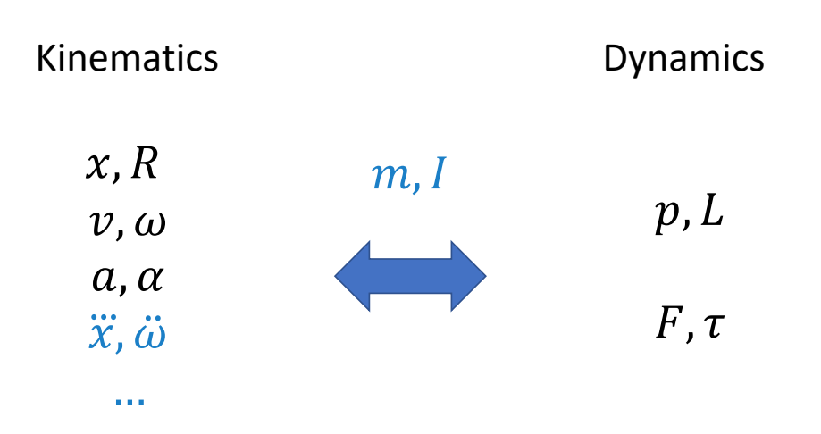
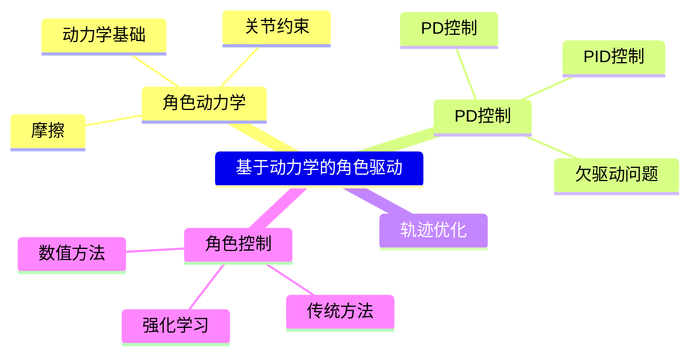

P4   
# Physics-based Character Animation  

P57  
# Kinematics vs. Dynamics

> &#x2705; 运动学与动力学，主要区别在于有没有考虑角色质量。因为质量代表惯性，有惯性就不能瞬移。   
> &#x2705; 动力学基本概念跳过。P58-P89   

> &#x2705; 物理方法的难点：  
> &#x2705; (1) 仿真：在计算机中模拟出真实世界的运行方式。   
> &#x2705; (2) 控制：生成角色的动作，来做出响应。  

P5  
# Outline   

 - Simulation Basis   
    - Numerical Integration: Euler methods   
 - Equations of Rigid Bodies   
    - Rigid Body Kinematics   
    - Newton-Euler equations   
 - Articulated Rigid Bodies   
    - Joints and constraints   
 - Contact Models   
    - Penalty-based contact   
    - Constraint-based contact      

<https://www.cs.cmu.edu/~baraff/sigcourse/>

> &#x2705; 角色物理动画通常不关心仿真怎么实现。   
> &#x2705; 但也可以把仿真当成白盒，用模型的方法来实现。  

---------------------------------------
> 本文出自CaterpillarStudyGroup，转载请注明出处。
>
> https://caterpillarstudygroup.github.io/GAMES105_mdbook/