P4
# Physics-based Character Animation

```mermaid
mindmap
基于动力学的角色驱动
   角色动力学
      仿真
      动力学基础
      关节约束
      接触
   PD控制
      PD控制
      PID控制
      欠驱动问题
   轨迹优化
      优化方法
      数值计算方法
      强化学习方法
   角色控制
      传统方法
      数值方法
      强化学习
```

> &#x2705; 物理方法的难点：  
> &#x2705; (1) 仿真：在计算机中模拟出真实世界的运行方式。   
> &#x2705; (2) 控制：生成角色的动作，来做出响应。  
> &#x2705; 角色物理动画通常不关心仿真怎么实现。   
> &#x2705; 但也可以把仿真当成白盒，用模型的方法来实现。  

P17   
# Defining a Simulated Character  

Rigid bodies:    
 - \\(m_i,I_i,x_i,R_i\\)     
 - Geometries    

Joints:   
 - Position   
 - Type   
> &#x2705; Type指关节的类型，例如 Hint、Universal等。它决定了约束方程。   
 - Bodies   

> &#x2705; 关节的数量比刚体的数量少1  

> &#x2705; 仿真过程中通常使用简单几何体代替 Mesh. 为了便于碰撞检测的计算，以及辨别里外。       

---------------------------------------
> 本文出自CaterpillarStudyGroup，转载请注明出处。
>
> https://caterpillarstudygroup.github.io/GAMES105_mdbook/