# Lecture 08

P4   
## Physics-based Character Animation  

[ControlVAE – Yao et al. 2022]  

> &#x2705; 物理方法的难点：  
> &#x2705; (1) 仿真：在计算机中模拟出真实世界的运行方式。   
> &#x2705; (2) 控制：生成角色的动作，来做出响应。  

P5  
## Outline   

 - Simulation Basis   
    - Numerical Integration: Euler methods   
 - Equations of Rigid Bodies   
    - Rigid Body Kinematics   
    - Newton-Euler equations   
 - Articulated Rigid Bodies   
    - Joints and constraints   
 - Contact Models   
    - Penalty-based contact   
    - Constraint-based contact      

<https://www.cs.cmu.edu/~baraff/sigcourse/>

> &#x2705; 角色物体动画通常不关心仿真怎么实现。   
> &#x2705; 但也可以把仿真当成白盒，用模型的方法来实现。  
> &#x2705; 粒子运动模拟的部分跳过。P6-P22    
> &#x2705; 弹簧模拟跳过。P23-P27   
> &#x2705; 刚体模拟跳过。P28-P56   

P57  
## Kinematics vs. Dynamics

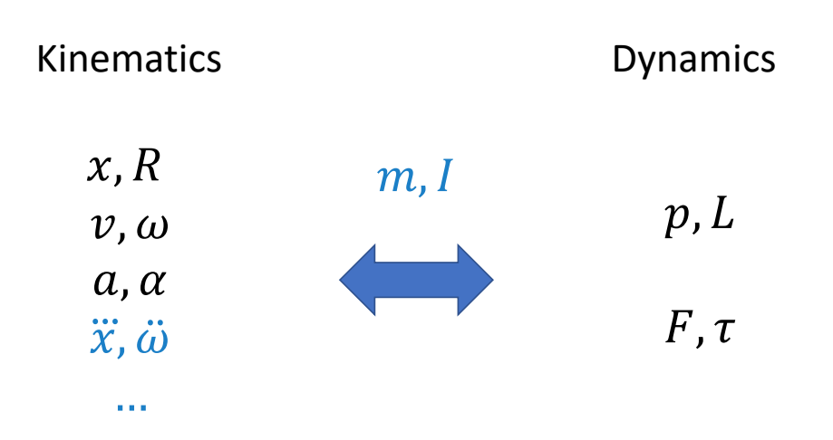

> &#x2705; 运动学与动力学，主要区别在于有没有考虑角色质量。因为质量代表贯性，有贯性就不能瞬移。   
> &#x2705; 动力学基本概念跳过。P58-P89   

P91   
## A System with Two Links

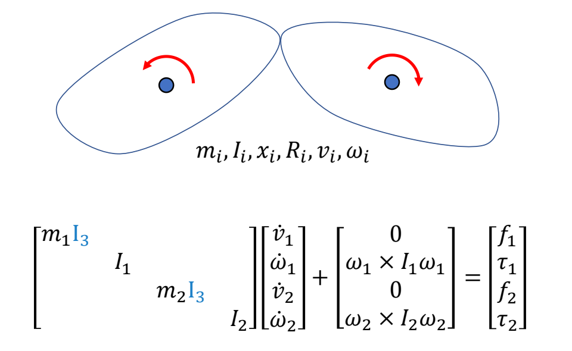

> &#x2705; 两个刚体的场景，如果两个刚体独立，可以以矩阵的方式扩展。  

  

P92   
> &#x2705; 物体在力的作用下的物理状态的更新公式．见 GAMES 103．   
> &#x2705; 每一行是独立的，联立起来为方程组。   

P93   

## A System with Two Links

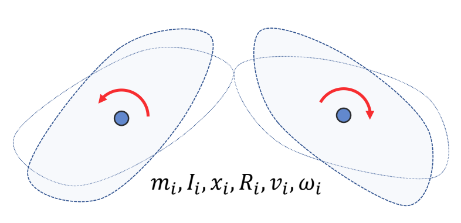

$$
M\dot{v} +C(x,v)=f
$$

> &#x2705; 结果是两个物体会分开。  

P95  
## A System with Two Links and a Joint

$$
M\dot{v} +C(x,v)=f+f_J
$$

> &#x2705; 两个物体中间有一个关节，约束两个物体不能分开。   
> &#x2705; 但 \\(f_J\\) 是未知的。  

P97  

## Constraints  

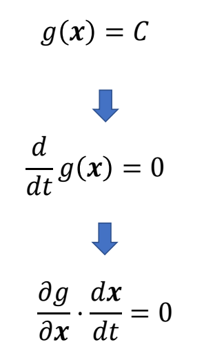

> &#x2705; 假没有一约束：小球必须按轨道行进。   
> &#x2705; 由于每一时刻都满足，对时间求导，导数为零。    
［＠］分子截图.     

P98 

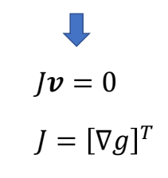

P99  
## Constraint Force

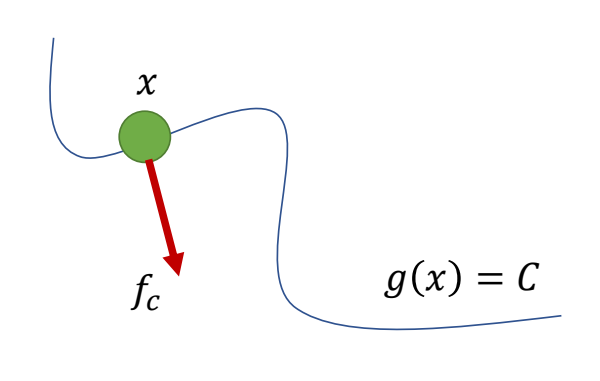

\\(^\ast \\) Constraint is passive No energy gain or loss!!!   

$$
f_c\cdot v=0
$$

> &#x2705; 为了让小球满足约束，需给小球一个约束力。   
> &#x2705; 约束力不应产生能量，即力与运动方向垂直。   

P100   

> &#x2705; \\(f_c\\) 与 \\(J\\) 同方向，但大小未知。   
> &#x2705; \\(f_c\\) 大小以当前状态和外力情况计算而得。   

 

P101   
## Equation of Motion with Constraints

$$
\begin{align*}
 M\dot{v} & =f+J^T\lambda  \\\\
  Jv&=0
\end{align*}
$$

$$
\begin{align*}
 M\frac{v_{n+1}-v_n}{h}  & =f+J^T\lambda  \\\\
  Jv_{n+1}&=0
\end{align*}
$$

> &#x2705; 假设 \\(M，x，v．f\\) 已知，求 \\(f_c\\)    
> &#x2705; 公式 1：\\(f＝am\\)．公式 2：前面推导得出。   
> &#x2705; 把两个公式离散化。   
> &#x2705; 未知数：\\(\lambda ，v_{n+1}\\) 方程组联立，求解。     
> &#x2705; 离散化后对原公式只是近似，会有误差，导到小球远离曲线。   
> &#x2705; 对小球做受力分析，受到外力 \\(f\\) 和约束力 \\(f_c\\)．   
> &#x2705; \\(f\\) 已知，求 \\(f_c\\)，使得小球沿轨迹移动。    
> &#x2705; 因为公式 2 只约束了速度没有约束位置。   

P103  

## Numerical Solution   

$$
Jv_{n+1}=\alpha \frac{C-g(x_n)}{h} 
$$

Correction of numerical errors   
𝛼: error reduction parameter (ERP)   

> &#x2705; 解决方法：当物体偏离轨道，要有拉回来的速度。   

P104   

## Numerical Solution   

 

> &#x2705; 把ERP简写为 \\(b\\).   
> &#x2705; 为了防止矩阵不可逆，增加 \\(\beta I\\).（常见技巧）   
> &#x2705; 解 \\(\lambda\\) 需要先求逆。   

P105   
## Joint Constraint

$$
x_1+R_1r_1=x_J=x_2+R_2r_2
$$

对\\(dt\\)求导：

$$
v_1+\omega _1\times r_1=v_2+\omega _2\times r_2
$$

> &#x2705; 前面是约束应用的简单例子，如何把约束应用到两个物体的连接约束上。   
> &#x2705; 约束：从 \\(x_1\\) 求 \\(x_J\\) 和从 \\(x_2\\) 求 \\(x_J\\) 所得结果应该相同。  

P106   
## Joint Constraint

$$
\begin{bmatrix}
 I_3 & -[r_1] _ \times  & -I_3 & [r_2] _ \times 
\end{bmatrix}\begin{bmatrix}
v_1 \\\\
w_1 \\\\
v_2 \\\\
w_2
\end{bmatrix}=0
$$

$$
Jv=0
$$

> &#x2705; 整理得矩阵形式   
> &#x2705; 矩阵乘法第一项为 \\(J\\)，第二项为 \\(v\\).   
> &#x2705; 公式 1：运动方程。公式 2：约束方程。  

P107   
 
## Simulation of a Rigid Body System   

$$
\begin{align*}
 M\dot{v} +C(x,v)& =f+J^T\lambda  \\\\
  Jv&=0
\end{align*}
$$

> &#x2705; 运动方程与约束方程联立。   

P109  
## Different Types of Joints

> &#x2705; 这里描述的是 Ball 约束。   
> &#x2705; Hinge 约束：除了位置还有角速度约束，在某个轴上的角速度应当一致。Universal 类似。    

P110   
## A System with Many Links Joints   

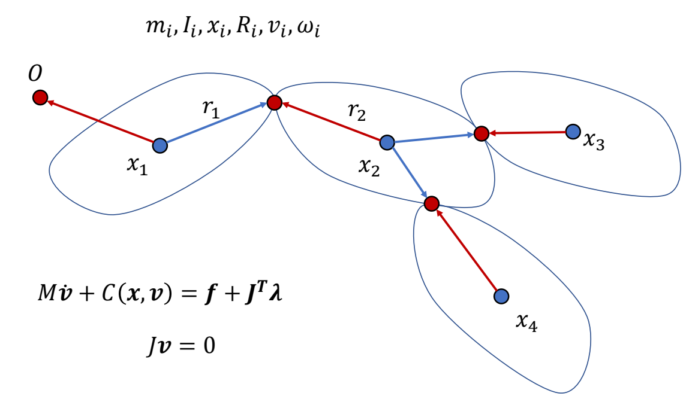

> &#x2705; 分段多刚体在公式上没有本质区别，只是矩阵更大一点。   

P111   
## Contacts

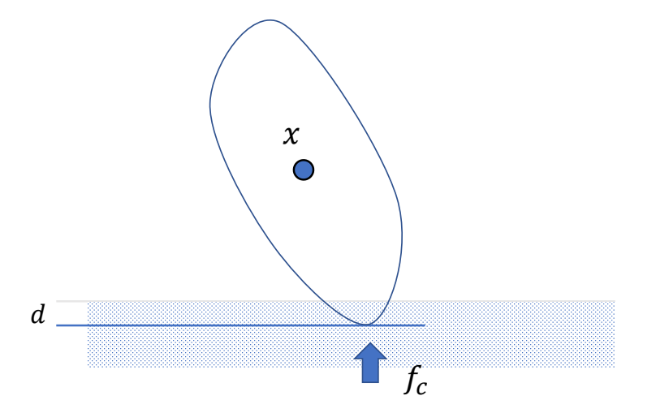

> &#x2705; 如何处理与地面的接触，让人站在地面上。    
> &#x2705; 要解决的问题：(1) 地面接触检测 (2) 如何对碰撞点施加力，使物体出来。  

P114  
## Penalty-based Contact Model   

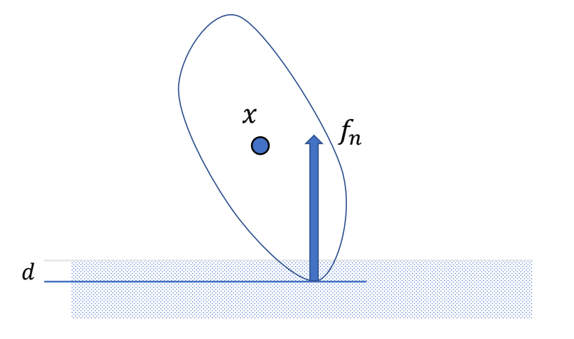

$$
f_n=-k_pd-k_dv_{c,\perp }
$$

> &#x2705; 类似弹簧形式，陷入越深，力越大。   
> &#x2705; 第二项：为了防止落地弹飞，增加阻尼项。

P115  
## Frictional Contact  

> &#x2705; 动摩擦力大小＝支持力 x 摩擦系数    
> &#x2705; 方向与运动方向相反   
> &#x2705; 一般不模拟静摩擦力   
> &#x2705; 受力分析：支持力，动摩擦力。   

P116  

## Frictional Contact   

$$
\begin{align*}
 f_n&=-k_pd-k_dv_{c,\perp }\\\\
f_t&=-\mu f_n\frac{v_{c,\parallel }}{||v_{c,\parallel }||} 
\end{align*}
$$

> &#x2705; 存在的问题：\\(K_p\\) 必须很大，否则脚陷地明显，步长必须非常小，否则不稳定。   

  
P118  
## Contact as a Constraint

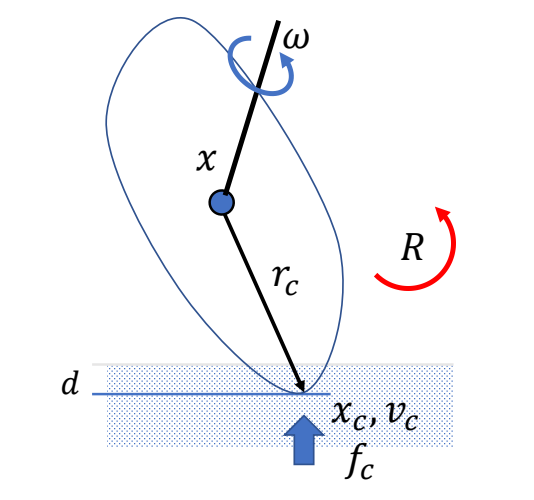

$$
x_c  =x+r_c \quad\quad\quad\quad\quad\quad
$$

$$
v_c  =v+\omega \times r_c=J_c \begin{bmatrix}
 v\\\\
w
\end{bmatrix}
$$

$$
v_{c,\perp } =v+\omega \times r_c=J_{c,\perp  }\begin{bmatrix}
v \\\\
\omega 
\end{bmatrix}
$$

> &#x2705; 另一种方法，把接触建模为约束。  

P119  

> &#x2705; 约束 1：点在竖直方向的速度必须大于 0，即只能向上移动。      
> &#x2705; 约束 2：力的大小也大于 0．   

P120   
## Contact as a Constraint

> &#x2705; 力和速度只能有一个不为零，否则会做功。  
> &#x2705; 合在一起称为线性互补方程，是通常碰撞建模方式。   
> &#x2705; 这个方程比较难解，例如 ODE    

P121   

## Contact as a Linear Complementary Problem

$$
v_c\perp \lambda =0
$$

(Mixed) Linear Complementary Problem (LCP)   

To solve an LCP:   
e.g. Lemke's algorithm – a simplex algorithm   

P122   
## Contact as a Linear Complementary Problem

How to deal the friction?   

David Baraff. SIGGRAPH ’94    
Fast contact force computation for nonpenetrating rigid bodies.    

> &#x2705; 快速实现静摩擦约束的建模。   

P123  
## Simulation of a Rigid Body System

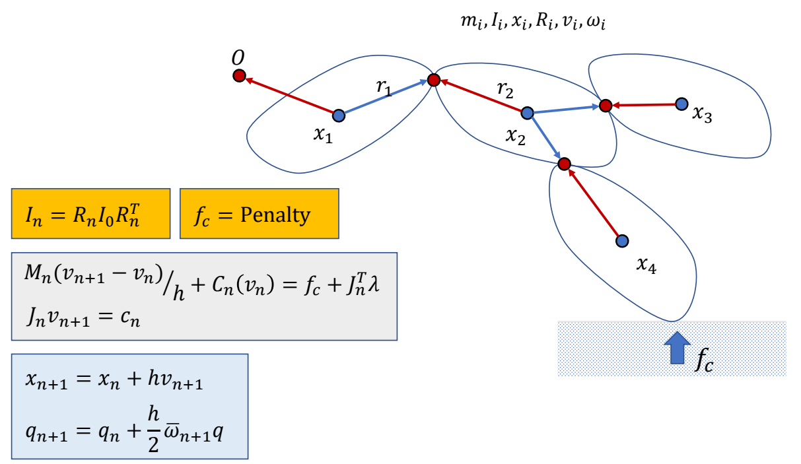   

> &#x2705; 把人简化为分段刚体。整体过程为：  
> &#x2705; (1) 黄：计算当前状态。  
> &#x2705; (2) 绿：计算约束，求解，解出下一时刻的速度。   
> &#x2705; (3) 蓝：更新下一时刻的量（积分）。   
> &#x2705; 缺少部分：主动力 \\(f\\) 推动角色产生运动。

P124   
## Outline   

<https://www.cs.cmu.edu/~baraff/sigcourse/>

---------------------------------------
> 本文出自CaterpillarStudyGroup，转载请注明出处。
>
> https://caterpillarstudygroup.github.io/GAMES105_mdbook/