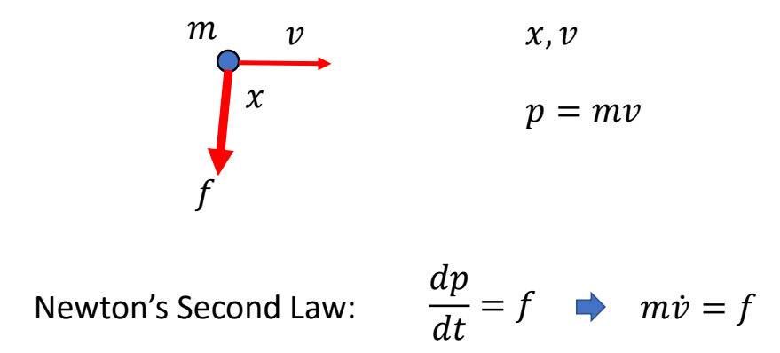
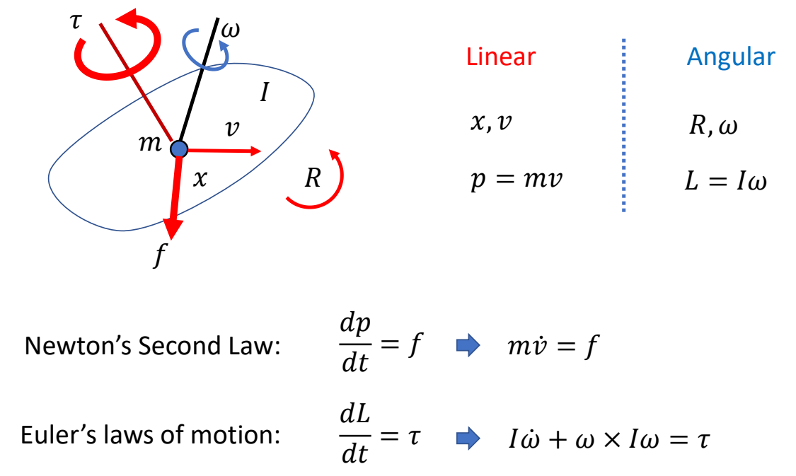
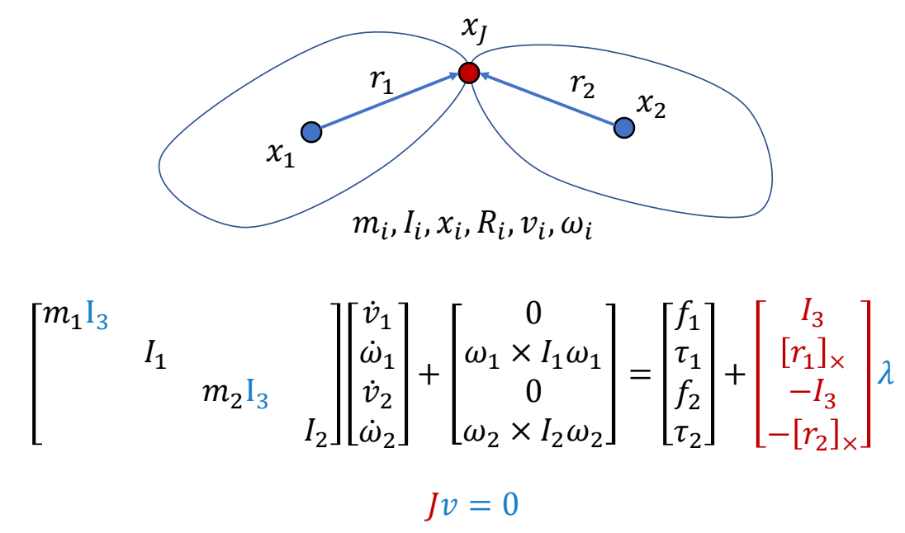
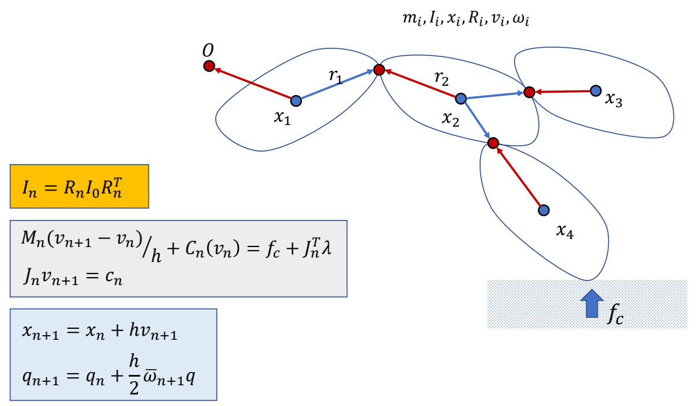

# 质点动力学

P10  
# 刚体动力学  

   

$$
\begin{bmatrix}
 mI_3 & 0\\\\
 0 & I
\end{bmatrix}\begin{bmatrix}
\dot{v}  \\\\
\dot{\omega }
\end{bmatrix}+\begin{bmatrix}
 0\\\\
\omega \times I\omega 
\end{bmatrix}=\begin{bmatrix}
f \\\\
\tau 
\end{bmatrix}
$$

P12   

Masses: \\(m,I\\)    
Kinematics:  \\(x,v,R,\omega \\)   

Geometry:    
• Box, Sphere, Capsule, Mesh, …    
• Collision detection   
• Compute \\(m,I\\)    

> &#x2705; 在物理引擎里面定义一个刚体，需要提供这些参数。   

P14   
# 分段刚体动力学   

  

> &#x2705; 两个独立刚体，和一个不让它们断开的约束。    

P15  

$$
M\dot{v} +C(x,v)  =f+J^T\lambda
$$

P16   
# 刚体系统仿真（无contact）

# 刚体系统仿真

   

> &#x2705; 把人简化为分段刚体。整体过程为：  
> &#x2705; (1) 黄：计算当前状态。  
> &#x2705; (2) 绿：计算约束，求解，解出下一时刻的速度。   
> &#x2705; (3) 蓝：更新下一时刻的量（积分）。   
> &#x2705; 缺少部分：主动力 \\(f\\) 推动角色产生运动。

P19   
# Simulating a Character Pipeline  

> &#x2705; 这个仿真流程是 ragdoll 效果。   

---------------------------------------
> 本文出自CaterpillarStudyGroup，转载请注明出处。
>
> https://caterpillarstudygroup.github.io/GAMES105_mdbook/

