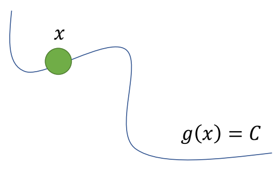
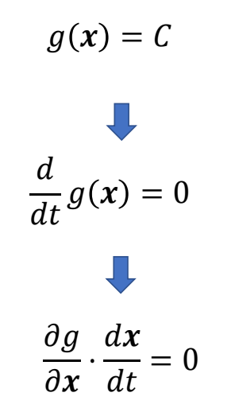
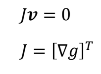
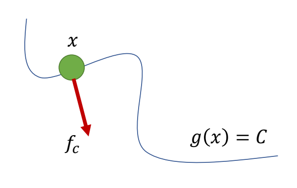
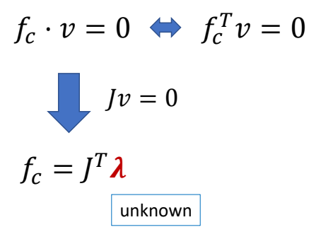
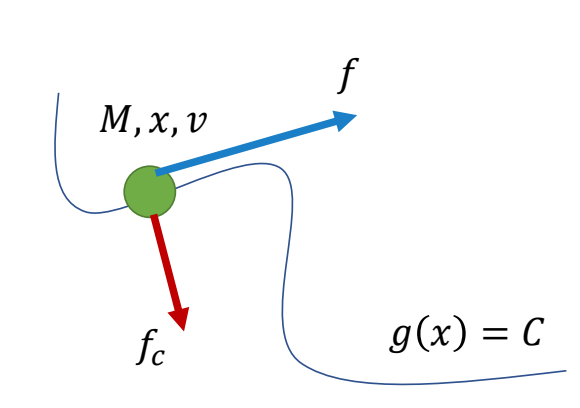
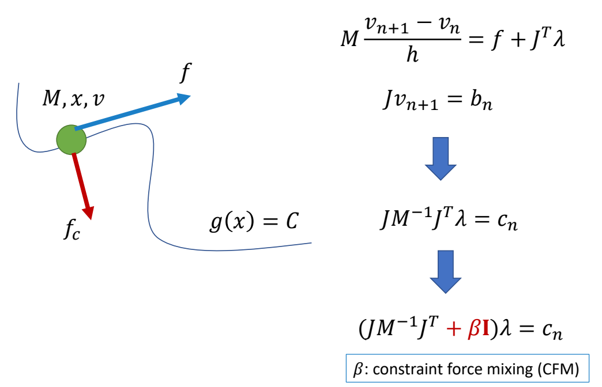

P97

# Constraints 简化问题分析

> 💡 **为什么先学小球？**
> 接下来要介绍关节约束的求解。在讲解角色的关节约束之前，先用**小球的简单例子**来理解约束求解的核心思想。
> 小球约束与关节约束的数学形式完全相同，只是场景更简单、更容易理解。

---

## 问题描述

> &#x2705; 假设有一约束：小球必须按轨道行进。

### 小球速度分析

> &#x2705; 根据已知条件，可以进行以下分析：由于每一时刻都满足，对时间求导，导数为零。

其中第一项为 \\(g(x)\\) 的雅克比矩阵，记作 \\(J\\) 或 \\([\nabla g]^{T}\\), 第二项为 \\(x\\) 的速度。
因此得到约束为：如果要求小球按照轨道运行，其速度必须满足以下公式。

P98

### 小球的约束力分析
P99

> &#x2705; 为了让小球满足约束，需给小球一个约束力。

\\(^\ast \\) Constraint is passive No energy gain or loss!!!

$$
f_c\cdot v=0
$$

> &#x2705; 约束力不应产生能量，即力与运动方向垂直。

P100

> &#x2705; \\(J\\) 本是一个矩阵，但在这个场景中 \\(C\\) 是常数，所以 \\(J\\) 是向量。
> &#x2705; 结合是一页的结论可知：\\(f_c\\) 与 \\(J\\) 同方向，但大小未知。\\(\lambda \\)代表一个未知的 scale。
> &#x2705; \\(f_c\\) 大小以当前状态和外力情况计算而得。

P101

### 小球的整体受力分析

> &#x2705; 对小球做受力分析，受到外力 \\(f\\) 和约束力 \\(f_c\\)．
> &#x2705; 假设 \\(M，x，v．f\\) 已知，求 \\(f_c\\) ，使得小球沿轨迹移动。

$$
\begin{align*}
 M\dot{v} & =f+J^T\lambda  \\\\
  Jv&=0
\end{align*}
$$

> &#x2705; 公式 1：\\(f＝am\\)．公式 2：前面推导得出。把两个公式离散化。
> &#x2705; 假设当前时刻已满足 \\(J_n v_n = 0\\)，所以只约束下一时刻。

$$
\begin{align*}
 M\frac{v_{n+1}-v_n}{h}  & =f+J^T\lambda  \\\\
  Jv_{n+1}&=0
\end{align*}
$$

> &#x2705; 得出未知数为\\(\lambda\\)和\\(v_{n+1}\\)的联立方程组，求解方程组。
> &#x2705; 因为公式 2 只约束了速度没有约束位置。离散化后对原公式只是近似，会有误差，导到小球远离曲线。
> &#x2705; 解方程组不难，但存在小球偏离轨道的问题。

P103

> &#x2705; 当物体偏离轨道，要把它拉回来。因此公式 2 改为：

$$
Jv_{n+1}=\alpha \frac{C-g(x_n)}{h}
$$

等式右边的非零项称为 Correction of numerical errors。
𝛼: error reduction parameter (ERP)

P104

### 方程组求解

> &#x2705; 把校正项简写为 \\(b\\). \\( n \\) 时刻发现的误差由 \\( n+1 \\) 时刻来校正。
> &#x2705; 为了防止矩阵不可逆，增加 \\(\beta I\\).（常见技巧）
> &#x2705; 解 \\(\lambda\\) 需要先求逆。

---

## 附录：公式推导过程

### 目标：求解拉格朗日乘子 \\(\lambda\\)

**已知方程组**（带误差校正）：

$$
\begin{cases}
\displaystyle M\frac{v_{n+1}-v_n}{h} = f + J^T\lambda \\\\
Jv_{n+1} = b
\end{cases}
$$

其中 \\(b = \alpha\frac{C-g(x_n)}{h}\\) 是误差校正项。

---

### 步骤 1：从运动方程解出 \\(v_{n+1}\\)

$$
M\frac{v_{n+1}-v_n}{h} = f + J^T\lambda
$$

$$
v_{n+1}-v_n = h M^{-1}(f + J^T\lambda)
$$

$$
v_{n+1} = v_n + h M^{-1}f + h M^{-1}J^T\lambda
$$

令 \\(v^* = v_n + h M^{-1}f\\)（**不含约束力的预测速度**）

则：
$$
v_{n+1} = v^* + h M^{-1}J^T\lambda
$$

---

### 步骤 2：代入约束方程

约束方程：
$$
Jv_{n+1} = b
$$

代入 \\(v_{n+1}\\)：
$$
J(v^* + h M^{-1}J^T\lambda) = b
$$

展开：
$$
Jv^* + h J M^{-1}J^T\lambda = b
$$

---

### 步骤 3：解出 \\(\lambda\\)

$$
h J M^{-1}J^T\lambda = b - Jv^*
$$

$$
\lambda = (h J M^{-1}J^T)^{-1}(b - Jv^*)
$$

---

### 步骤 4：防止矩阵不可逆

\\(J M^{-1}J^T\\) 可能不可逆（例如约束冗余时），添加正则化项 \\(\beta I\\)：

$$
\lambda = (J M^{-1}J^T + \beta I)^{-1}(b - Jv^*)
$$

---

### 最终公式

$$
\boxed{\lambda = (J M^{-1}J^T + \beta I)^{-1}(b - Jv^*)}
$$

| 符号 | 含义 |
|------|------|
| \\(v^* = v_n + h M^{-1}f\\) | 无约束时的预测速度 |
| \\(b = \alpha\frac{C-g(x_n)}{h}\\) | 误差校正项（ERP） |
| \\(\beta I\\) | 防止矩阵不可逆的正则化项 |

> &#x2705; 核心思想：**把约束求解转化为求解拉格朗日乘子 \\(\lambda\\) 的线性方程组**。

---------------------------------------
> 本文出自 CaterpillarStudyGroup，转载请注明出处。
>
> https://caterpillarstudygroup.github.io/GAMES105_mdbook/
