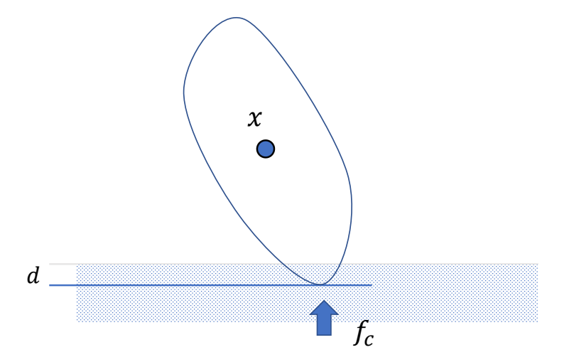
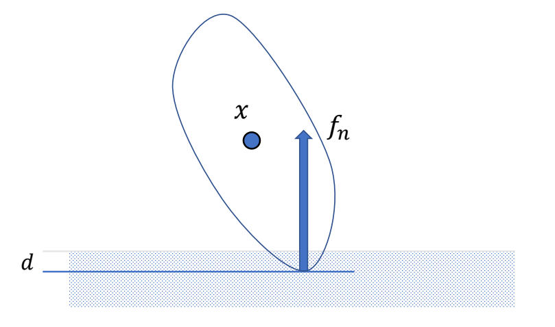
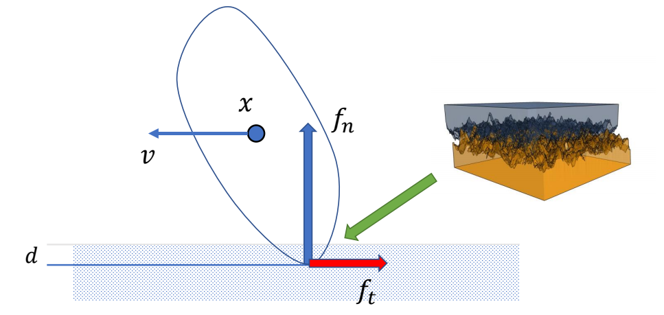
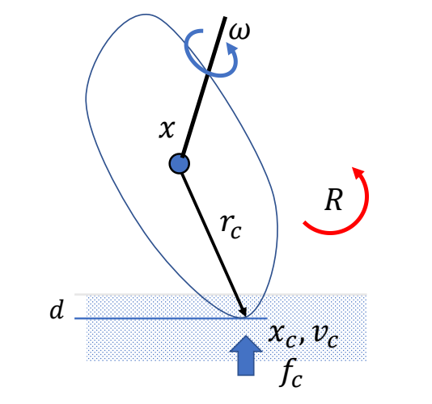
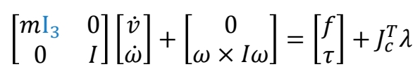
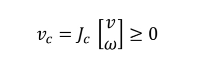

# Contacts

> &#10004; 如何处理与地面的接触，让人站在地面上。

> &#10004; 要解决的问题：
> 1. **地面接触检测**：检测哪些点/面与地面接触
> 2. **接触力施加**：如何对碰撞点施加力，使物体不陷入地面

:::info 与 GAMES103 的分工

- **GAMES103 - 碰撞检测与响应**：详细介绍碰撞检测算法（Broad Phase、Narrow Phase、GJK、CCD）和穿透解除方法（内点法、Impact Zone）
- **GAMES105 - 接触约束求解**：focus 在如何将接触建模为约束，并与关节约束统一求解

**深入学习**：
- [GAMES103 - 刚体的碰撞检测](https://caterpillarstudygroup.github.io/GAMES103_mdbook/9_collision_detect.md)
- [GAMES103 - 内点法](https://caterpillarstudygroup.github.io/GAMES103_mdbook/Interior_Point_Methods.md)
- [GAMES103 - 碰撞响应总结](https://caterpillarstudygroup.github.io/GAMES103_mdbook/9_collision_response.md)

:::

---

## 方法一：Penalty-based Contact Model（基于惩罚的接触模型）

### 基本思想

用**弹簧 - 阻尼模型**近似接触力：当物体穿透地面时，产生一个与穿透深度成正比的斥力。

$$
f_n = -k_p d - k_d v_{c,\perp}
$$

| 参数 | 含义 |
|------|------|
| $d$ | 穿透深度（$d > 0$ 时公式生效） |
| $k_p$ | 弹簧刚度（越大越不容易穿透） |
| $k_d$ | 阻尼系数（防止反弹） |
| $v_{c,\perp}$ | 接触点法向速度 |

> &#10004; 效果：会有一些陷入，但不会陷入太多
> &#10064; 支持力竟然不是 $-mg$，而是由弹簧模型决定

---

### 考虑摩擦力

动摩擦力模型：
$$
f_t = -\mu f_n \frac{v_{c,\parallel}}{||v_{c,\parallel}||}
$$

| 参数 | 含义 |
|------|------|
| $\mu$ | 摩擦系数 |
| $f_n$ | 法向支持力 |
| $v_{c,\parallel}$ | 接触点切向速度 |

> &#10004; 一般不模拟静摩擦力

---

### 存在的问题

| 问题 | 原因 | 后果 |
|------|------|------|
| $k_p$ 必须很大 | 否则脚陷地明显 | 需要非常小的时间步长 |
| $k_d$ 必须非常大 | 否则地面像蹦床 | 数值不稳定 |
| 时间步长必须小 | 高增益导致刚度大 | 仿真效率低 |

---

:::info 与 GAMES103 内点法的关系

GAMES103 中介绍的**内点法（Interior Point Methods）**使用了类似的惩罚思想，但用能量场定义斥力：

$$
E(\mathbf{x}) = -\rho \log ||\mathbf{x}_{ij}||
$$

$$
\mathbf{f} = -\nabla E = \rho \frac{\mathbf{x}_{ij}}{||\mathbf{x}_{ij}||^2}
$$

两种方法本质相同：**距离越近，斥力越大**。GAMES105 使用简化的弹簧模型，更易于理解。

:::

---

## 方法二：Contact as a Constraint（接触作为约束）

> &#10004; 另一种方法，把接触建模为数学约束，与关节约束统一求解。

### 接触点状态分析

接触点 $x_c$ 的位置表示：
$$
x_c = x + r_c
$$

接触点 $x_c$ 的速度表示：
$$
v_c = v + \omega \times r_c = J_c \begin{bmatrix} v \\\\ \omega \end{bmatrix}
$$

接触点法向速度：
$$
v_{c,\perp} = J_{c,\perp} \begin{bmatrix} v \\\\ \omega \end{bmatrix}
$$

---

### 接触点约束分析

> &#10004; **约束 1**：点在竖直方向的速度必须 $\geq 0$，即只能向上移动（不能向下穿透）。

> &#10004; **约束 2**：力的大小 $\lambda > 0$，只能推，不能拉。$\lambda$ 是力与速度的大小比例系数。

> &#10004; **约束 3**：力和速度只能有一个不为零，否则会做功（互补条件）。

$$
v_c \perp \lambda = 0
$$

---

### 线性互补问题（LCP）

> &#10004; 合在一起称为**线性互补方程**，是碰撞建模的标准方式。

这类问题被称为：**(Mixed) Linear Complementary Problem (LCP)**

解 LCP 的方法有：
- Lemke's algorithm – a simplex algorithm
- Projected Gauss-Seidel
- 其他数值优化方法

> &#10064; 这个方程比较难解，计算成本高于 Penalty 方法

---

### 考虑摩擦力的约束问题

How to deal the friction?

> &#128269; **推荐阅读**：Fast contact force computation for nonpenetrating rigid bodies.
> David Baraff. SIGGRAPH '94

> &#10004; 该论文提出了快速实现静摩擦约束的建模方法。

---

## 两种方法对比

| 特性 | Penalty-based | Constraint-based (LCP) |
|------|---------------|------------------------|
| **原理** | 弹簧 - 阻尼模型近似 | 数学约束精确建模 |
| **穿透** | 允许少量穿透 | 无穿透 |
| **求解** | 直接计算力 | 需要专门求解器 |
| **计算成本** | 低 | 高 |
| **数值稳定性** | 需要小步长 | 较稳定 |
| **与关节约束统一** | 否 | ✅ 是 |
| **适用场景** | 实时应用、游戏 | 精确仿真、研究 |

---

## 在运动方程中的位置

对于有接触的角色系统，运动方程为：

$$
M\dot{v} + C(x,v) = f_{\text{ext}} + f_{\text{joint}} + J_{\text{contact}}^T \lambda_{\text{contact}}
$$

$$
J_{\text{contact}} v \geq 0, \quad \lambda_{\text{contact}} \geq 0, \quad (J_{\text{contact}} v) \perp \lambda_{\text{contact}}
$$

> &#10004; **关键**：接触约束与关节约束形式统一，可以同时求解！

---

> 本文出自 CaterpillarStudyGroup，转载请注明出处。
> https://caterpillarstudygroup.github.io/GAMES105_mdbook/
