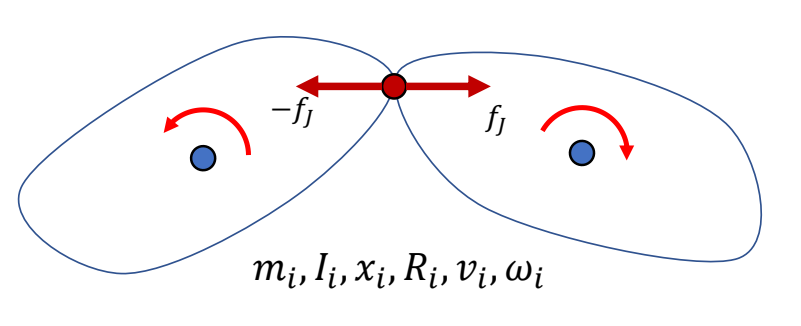
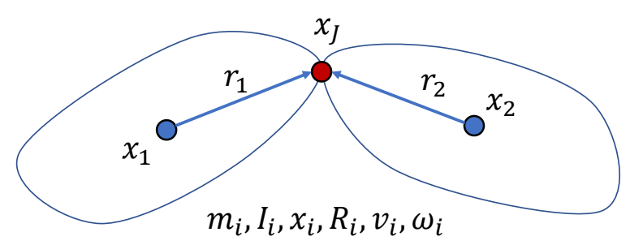
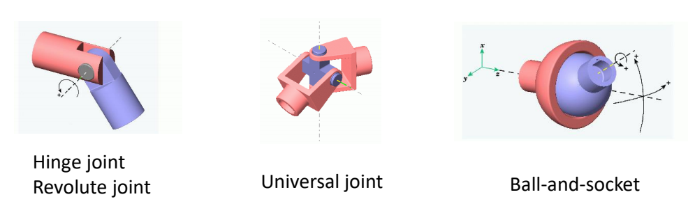
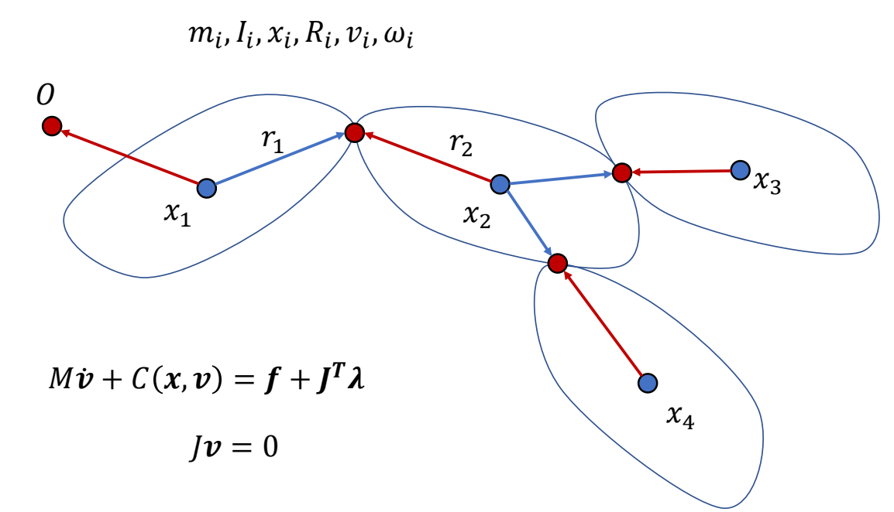
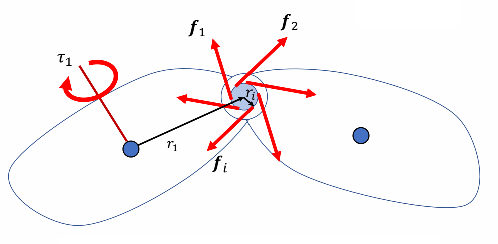
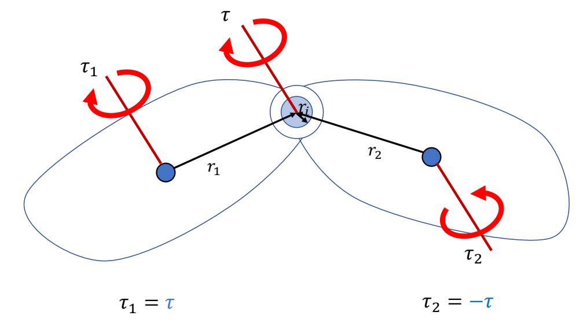

# 关节约束

> 💡 **前置知识**：关于角色的分段刚体表示，见 [RigidBodyRepresentation.md](RigidBodyRepresentation.md)

---

## 关节约束方程

两个刚体通过关节连接时，需要满足约束条件。

> &#x2705; 关节约束防止刚体分离，\\(f_J\\) 是未知的约束力。

### 位置级约束

> &#x2705; 关节约束：两个刚体在关节处的位置必须相同。

$$
x_1 + R_1 r_1 = x_J = x_2 + R_2 r_2
$$

### 速度级约束

对时间求导：

$$
v_1 + \omega_1 \times r_1 = v_2 + \omega_2 \times r_2
$$

### 矩阵形式

整理得：

$$
\begin{bmatrix}
 I_3 & -[r_1]_\times & -I_3 & [r_2]_\times
\end{bmatrix}
\begin{bmatrix}
v_1 \\\\ \omega_1 \\\\ v_2 \\\\ \omega_2
\end{bmatrix} = 0
$$

简化为：

$$
Jv = 0
$$

---

## 运动方程 + 约束方程

$$
\begin{align*}
 M\dot{v} + C(x,v) &= f + J^T\lambda \\\\
 Jv &= 0
\end{align*}
$$

> &#x2705; 公式 1：运动方程。公式 2：约束方程。
> &#x2705; 联立方程组可以解出约束力 \\(\lambda\\) 和下一时刻的速度。

**约束求解的详细推导**：见 [Constraints.md](Constraints.md)（小球例子）

---

## 不同类型的关节

### Ball Joint（球铰）

> &#x2705; 前面推导的是 Ball Joint 的约束，只约束位置，允许三个方向的旋转。

### Hinge Joint（铰链）

> &#x2705; Hinge 约束：除了位置约束，还有角速度约束——在某个轴上的角速度必须一致。

### Universal Joint（万向节）

> &#x2705; Universal 约束：约束两个旋转自由度，允许一个旋转自由度。

---

## 多个刚体与多个约束

> &#x2705; 分段多刚体系统：公式形式相同，只是矩阵维度更大。

对于 \\(n\\) 个刚体、\\(m\\) 个约束的系统：
- \\(M\\) 是 \\(6n \times 6n\\) 的分块对角矩阵
- \\(J\\) 是 \\(m \times 6n\\) 的矩阵

---

## 关节力矩（Joint Torques）

### 什么是 Joint Torques

> &#x2705; 关节上的力矩，可以看作是一个刚体对另一个刚体在关节处施加的成对的力。其合力为零，但每个力施加的位置不同，可以转化为对另一刚体的力矩。

$$
\sum_{i} f_i = 0
$$

> &#x2705; 每个力都会对其中一个刚体的质心上产生力矩，合力矩不为 0。

$$
\tau_1 = \sum_{i} (r_1 + r_i) \times f_i = r_1 \times \sum_{i} f_i + \sum_{i} r_i \times f_i
$$

由于 \\(\sum_{i} f_i = 0\\)，得：

$$
\tau_1 = \sum_{i} r_i \times f_i \quad\quad\quad \tau_2 = -\sum_{i} r_i \times f_i
$$

> &#x2705; 另一个方向同理。
> &#x2705; 力矩跟关节的位置没有关系。

**结论**：

> &#x2705; 在关节上施加力矩 \\(\tau\\) 等价于在一个刚体上施加 \\(\tau\\)，在另一个刚体上施加 \\(-\tau\\)。

---

### 怎样施加 Joint Torques

Applying a joint torque \\(\tau\\):
- Add \\(\tau\\) to one attached body
- Add \\(-\tau\\) to the other attached body

$$
M\begin{bmatrix}
 \dot{v}_1 \\\\ \dot{\omega}_1 \\\\ \dot{v}_2 \\\\ \dot{\omega}_2
\end{bmatrix} + \begin{bmatrix}
 0 \\\\ \omega_1 \times I_1 \omega_1 \\\\ 0 \\\\ \omega_2 \times I_2 \omega_2
\end{bmatrix} = \begin{bmatrix}
 0 \\\\ \tau \\\\ 0 \\\\ -\tau
\end{bmatrix} + J^T\lambda
$$

$$
Jv = 0
$$

> &#x2705; 通常在子关节上加 \\(\tau\\)，在父关节上加 \\(-\tau\\)。

---

> 本文出自 CaterpillarStudyGroup，转载请注明出处。
> https://caterpillarstudygroup.github.io/GAMES105_mdbook/
