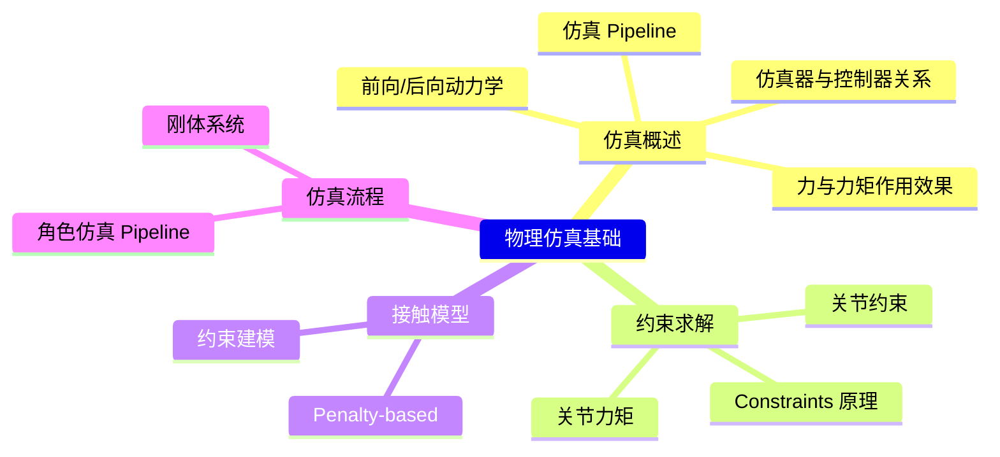
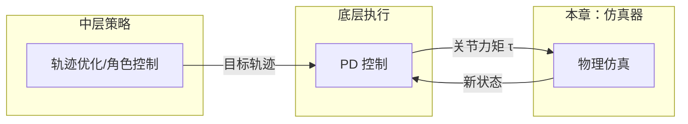

# 物理仿真基础

> &#x2705; **本章定位**：理解物理仿真器如何将**力/力矩**转换为**关节旋转**，为角色控制提供底层支持。

---

## 本章知识框架

---

## 本章内容导航

| 文件 | 内容 | 核心问题 |
|------|------|----------|
| [Simulation.md](Simulation.md) | 仿真概述 | 仿真器的输入输出是什么？ |
| [Constraints.md](Constraints.md) | 约束求解原理 | 如何求解约束力？ |
| [JointConstraint.md](JointConstraint.md) | 关节约束与力矩 | 如何对角色施加关节力矩？ |
| [Contacts.md](Contacts.md) | 接触模型 | 如何处理地面接触？ |
| [Actuating.md](Actuating.md) | 仿真流程总结 | 仿真器的完整工作流程？ |

---

## 核心公式

**运动方程**：
$$
M\dot{v} + C(x,v) = f + J^T\lambda
$$

**约束方程**：
$$
Jv = 0
$$

**关节力矩**：
$$
\tau_1 = \sum_i r_i \times f_i, \quad \tau_2 = -\tau_1
$$

---

## 与其他章节的关系

| 章节 | 关系 |
|------|------|
| [PD 控制](../PDControl/PDControl.md) | PD 控制输出关节力矩，送入仿真器执行 |
| [轨迹优化](../Tracking/Tracking.md) | 轨迹优化生成的目标轨迹，由仿真器验证物理可行性 |
| [角色控制](../CharacterControl/CharacterControl.md) | 角色控制依赖仿真器进行状态预测 |

---

## 学习建议

**推荐顺序**：
1. [Simulation.md](Simulation.md) - 了解仿真器的基本输入输出
2. [Constraints.md](Constraints.md) - 理解约束求解的数学原理
3. [JointConstraint.md](JointConstraint.md) - 学习如何对角色施加约束和力矩
4. [Contacts.md](Contacts.md) - 了解接触模型
5. [Actuating.md](Actuating.md) - 总结完整仿真流程

**前置知识**：
- 线性代数（矩阵、向量）
- 微分方程基础
- 经典力学（牛顿定律、刚体运动）

---

**深入学习**：[GAMES103 物理仿真基础](https://games103.tech/) | [Baraff SIGGRAPH 94 - Fast Contact Force Computation](http://www.cs.cmu.edu/~baraff/papers/sig94.pdf)
