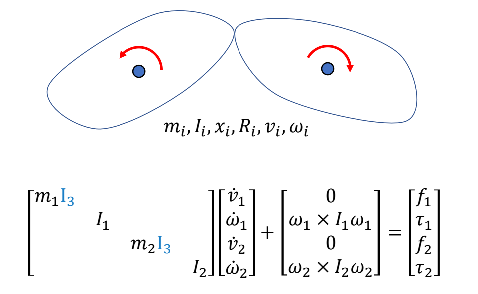

# 角色的分段刚体表示与仿真

> &#x2705; **本章定位**：理解如何将角色建模为**分段多刚体系统**，这是物理仿真的基础。

---

## 一、刚体动力学基础

### 回顾 GAMES103 内容

刚体动力学的核心公式已在 GAMES103 中详细讲解，本节只做简要回顾。

**刚体运动方程**：

$$
\begin{bmatrix}
 mI_3 & 0\\\\
 0 & I
\end{bmatrix}\begin{bmatrix}
\dot{v}  \\\\
\dot{\omega }
\end{bmatrix}+\begin{bmatrix}
 0\\\\
\omega \times I\omega
\end{bmatrix}=\begin{bmatrix}
f \\\\
\tau
\end{bmatrix}
$$

| 符号 | 含义 |
|------|------|
| \\(m\\) | 质量 |
| \\(I\\) | 转动惯量张量 |
| \\(x, v\\) | 位置、线速度 |
| \\(R, \omega\\) | 旋转、角速度 |
| \\(f, \tau\\) | 外力、外力矩 |

**深入学习**：
- [GAMES103 - 刚体动力学](https://games103.tech/)
- [GAMES103 - 运动学基础](https://games103.tech/)

---

## 二、角色的物理仿真表示

### 从角色模型到仿真模型


在物理仿真中，角色不能直接使用渲染用的 Mesh，而是需要简化为**分段多刚体系统**。

### 仿真角色的组成

**Rigid bodies（刚体）**:
 - \\(m_i, I_i\\) - 质量和转动惯量
 - \\(x_i, R_i\\) - 位置和旋转
 - **Geometries** - 碰撞几何体（仿真中使用简单几何体代替 Mesh）

**Joints（关节）**:
 - Position - 关节位置
 - Type - 关节类型（Hinge、Universal、Ball 等，决定约束方程）
 - Bodies - 连接的刚体

> &#x2705; 关节的数量比刚体的数量少 1

### 碰撞几何体的选择

| 身体部位 | 常用几何体 | 原因 |
|----------|-----------|------|
| 头部 | 球体 | 形状接近、计算简单 |
| 躯干 | 胶囊体/盒体 | 近似 torso 形状 |
| 手臂/腿 | 胶囊体 | 细长形状 |
| 手/脚 | 盒体 | 便于接触检测 |


> &#x2705; 使用简单几何体可以大幅提高碰撞检测和约束求解的效率。

### 在物理引擎中定义角色

在物理引擎中创建一个刚体需要提供：

```
Masses:     m, I           // 质量和转动惯量
Kinematics: x, v, R, ω    // 运动学状态
Geometry:   Box/Sphere/Capsule/Mesh  // 碰撞几何体
            Collision detection      // 碰撞检测
            Compute m, I             // 计算质量属性
```

---

## 三、分段多刚体动力学

### 从单刚体到多刚体

**单刚体**：
$$
M\dot{v} + C(x,v) = f
$$

**多刚体（无约束）**：
$$
M\dot{v} + C(x,v) = f
$$
其中 \\(M\\) 和 \\(C\\) 是分块对角矩阵，每个刚体独立。



> &#x2705; 两个刚体如果独立，可以以矩阵的方式扩展。

### 有关约束的多刚体系统

当刚体通过关节连接时，需要添加约束力 \\(f_J = J^T\lambda\\)：

$$
M\dot{v} + C(x,v) = f + J^T\lambda
$$


> &#x2705; 关节约束防止刚体分离，\\(f_J\\) 是未知的约束力。

### 约束方程

**关节约束**（以 Ball Joint 为例）：

$$
x_1 + R_1 r_1 = x_2 + R_2 r_2
$$

对时间求导得到速度级约束：

$$
v_1 + \omega_1 \times r_1 = v_2 + \omega_2 \times r_2
$$

矩阵形式：

$$
\begin{bmatrix}
 I_3 & -[r_1]_\times & -I_3 & [r_2]_\times
\end{bmatrix}
\begin{bmatrix}
v_1 \\\\ \omega_1 \\\\ v_2 \\\\ \omega_2
\end{bmatrix} = 0
$$

简化为：

$$
Jv = 0
$$

### 运动方程 + 约束方程联立

$$
\begin{align*}
 M\dot{v} + C(x,v) &= f + J^T\lambda \\\\
 Jv &= 0
\end{align*}
$$

> &#x2705; 联立方程组可以解出约束力 \\(\lambda\\) 和下一时刻的速度。

### 多刚体系统的扩展


> &#x2705; 分段多刚体在公式上没有本质区别，只是矩阵更大。

对于 \\(n\\) 个刚体的系统：
- \\(M\\) 是 \\(6n \times 6n\\) 的分块对角矩阵
- \\(J\\) 是 \\(m \times 6n\\) 的矩阵（\\(m\\) 是约束数量）

---

## 四、与后续章节的关系

| 本节内容 | 后续应用 |
|----------|----------|
| 刚体动力学基础 | 理解单个身体的运动 |
| 角色仿真表示 | 碰撞检测、接触求解 |
| 分段多刚体动力学 | [Constraints.md](Constraints.md) - 约束求解 [JointConstraint.md](JointConstraint.md) - 关节约束 [Contacts.md](Contacts.md) - 接触模型 |

---

## 小结

**角色物理仿真的建模流程**：

```
角色 Mesh → 简化为刚体 → 添加关节 → 定义碰撞几何体 → 分段多刚体系统
```

**核心公式**：
$$
M\dot{v} + C(x,v) = f + J^T\lambda
$$

- \\(f\\)：外力（重力、风力、关节力矩）
- \\(J^T\lambda\\)：约束力（关节约束、接触约束）

---

> 本文出自 CaterpillarStudyGroup，转载请注明出处。
> https://caterpillarstudygroup.github.io/GAMES105_mdbook/
