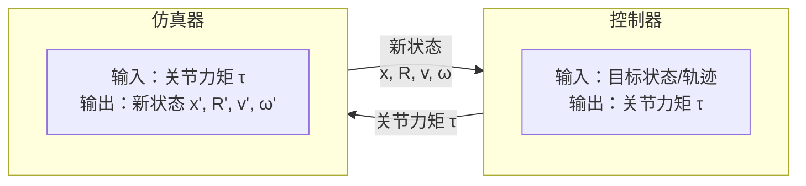
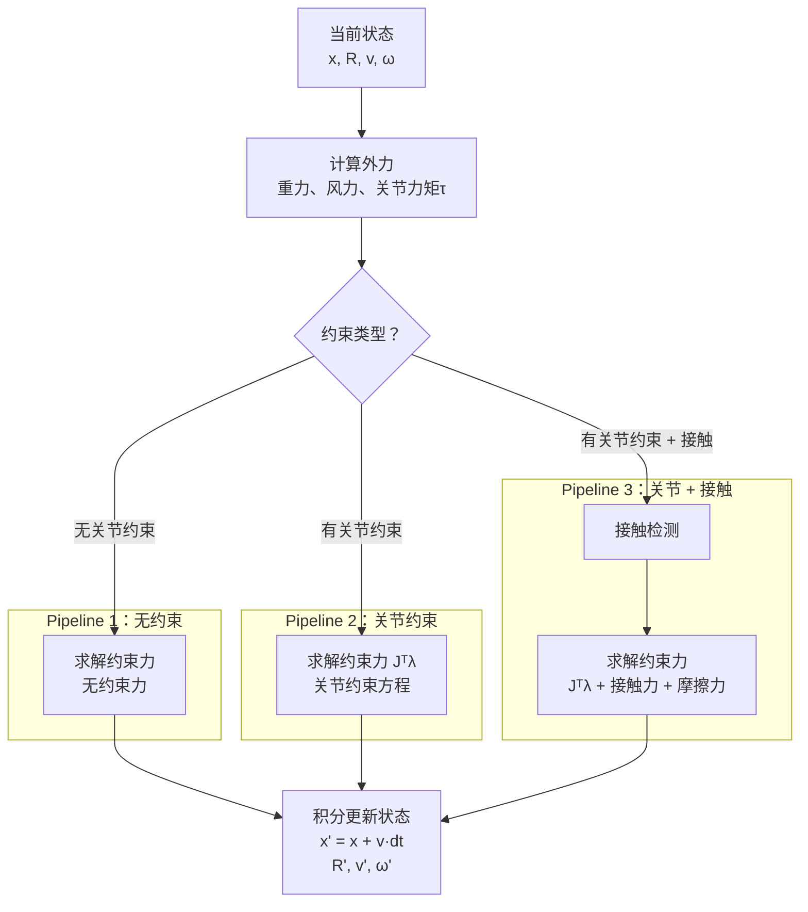

P4
# Physics-based Simulation

> &#x2705; **本章定位**：理解物理仿真器如何将**力/力矩**转换为**关节旋转**。

---

## 一、物理仿真概述

### 1.1 本章要解决的问题

**输入**：
- 当前状态：位置 \\(x\\)、旋转 \\(R\\)、速度 \\(v\\)、角速度 \\(\omega\\)
- 外力/力矩：重力、风力、**关节力矩**（由控制器生成）
- 约束条件：关节约束、接触约束

**输出**：
- 下一帧状态：新位置 \\(x'\\)、新旋转 \\(R'\\)、新速度 \\(v'\\)、新角速度 \\(\omega'\\)

**核心问题**：
> 给定关节力矩，角色为什么会这样动？

---

### 1.2 仿真器与控制器的关系

| 模块 | 输入 | 输出 | 核心问题 |
|------|------|------|----------|
| **控制器** | 目标状态/轨迹 | 关节力矩 τ | 如何生成力矩让角色达到目标？ |
| **仿真器** | 关节力矩 τ | 新状态 | 给定力矩，角色会如何运动？ |

**分工说明**：
- 控制器是「逆向问题」：从目标反推力矩
- 仿真器是「前向问题」：从力矩推算运动

---

### 1.3 仿真 Pipeline

根据考虑的约束复杂度，仿真 Pipeline 分为三种：

#### Pipeline 1：不考虑关节约束

- 每个刚体独立运动
- 适用于自由物体（如抛射物）
- **不适用于角色**（角色有关节连接）

#### Pipeline 2：考虑关节约束

- 关节约束防止刚体分离
- 需求解约束力 \\(J^T\lambda\\)
- 适用于 Ragdoll、无主动控制的角色

#### Pipeline 3：考虑关节约束 + 接触摩擦

- 接触约束防止穿透地面
- 摩擦力防止滑动
- 适用于站立、行走的角色

> &#128218; **深入学习**：
> - [运动方程中的力与力矩](ForcesAndTorques.md) - 外力 vs. 关节力矩的详细对比
> - [前向动力学与后向动力学](ForcesAndTorques.md#四前向动力学与后向动力学) - 运动方程的两种用法

---
