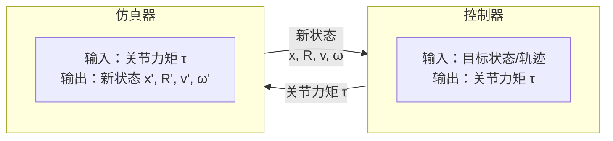
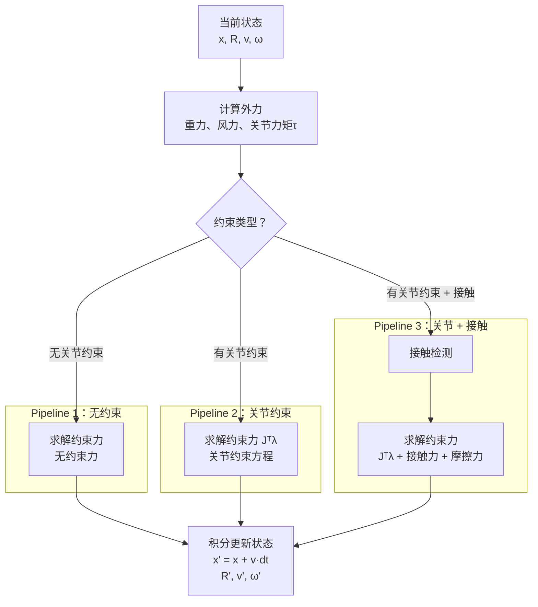

P4
# Physics-based Simulation

> &#x2705; **本章定位**：理解物理仿真器如何将**力/力矩**转换为**关节旋转**。

---

## 一、物理仿真概述

### 1.1 本章要解决的问题

**输入**：
- 当前状态：位置 \\(x\\)、旋转 \\(R\\)、速度 \\(v\\)、角速度 \\(\omega\\)
- 外力/力矩：重力、风力、**关节力矩**（由控制器生成）
- 约束条件：关节约束、接触约束

**输出**：
- 下一帧状态：新位置 \\(x'\\)、新旋转 \\(R'\\)、新速度 \\(v'\\)、新角速度 \\(\omega'\\)

**核心问题**：
> 给定关节力矩，角色为什么会这样动？

---

### 1.2 仿真器与控制器的关系

| 模块 | 输入 | 输出 | 核心问题 |
|------|------|------|----------|
| **控制器** | 目标状态/轨迹 | 关节力矩 τ | 如何生成力矩让角色达到目标？ |
| **仿真器** | 关节力矩 τ | 新状态 | 给定力矩，角色会如何运动？ |

**分工说明**：
- 控制器是「逆向问题」：从目标反推力矩
- 仿真器是「前向问题」：从力矩推算运动

---

### 1.3 仿真 Pipeline

根据考虑的约束复杂度，仿真 Pipeline 分为三种：

#### Pipeline 1：不考虑关节约束

- 每个刚体独立运动
- 适用于自由物体（如抛射物）
- **不适用于角色**（角色有关节连接）

#### Pipeline 2：考虑关节约束

- 关节约束防止刚体分离
- 需求解约束力 \\(J^T\lambda\\)
- 适用于 Ragdoll、无主动控制的角色

#### Pipeline 3：考虑关节约束 + 接触摩擦

- 接触约束防止穿透地面
- 摩擦力防止滑动
- 适用于站立、行走的角色

---

## 二、力与力矩的作用效果

### 施加力/力矩会得到的效果

|||
|---|---|
|力加在质心上，只会导致平移，不会导致旋转。||
|&#x2702; 在物体边缘旋加力，等价于在质心施加力，并施加一个导致旋转的力矩。  | |
|&#x2702; 在质心上施加一个力矩，等价于施加一对大小相同方向相反的力。在质心处的合力为零，不会产生位移，只会产生旋转。  &#x2702; 力矩只是数学上的概念。||

---

### 怎么对角色产生效果

> &#x2702; 想让角色做指定动作，不能直接修改其状态，而是控制力影响状态。

|||
|---|---|
|&#x2702; 为了驱动角色，可以单独对每个刚体施加力或力矩。||
|&#x2702; 也可以在关节上施加力矩。||

> &#x2702; 回顾前面公式，力和力矩都是施加在刚体上的，如何施加在关节上？

---

## 三、前向动力学与后向动力学

### Forward Dynamics vs. Inverse Dynamics

> &#x2702; 运动方程，本质上是建立力与加速度之间的联系。
> &#x2702; 前向与后向，是一个运动方程的两种用法。
> &#x2702; 仿真器为前向部分，控制后逆向部分。
