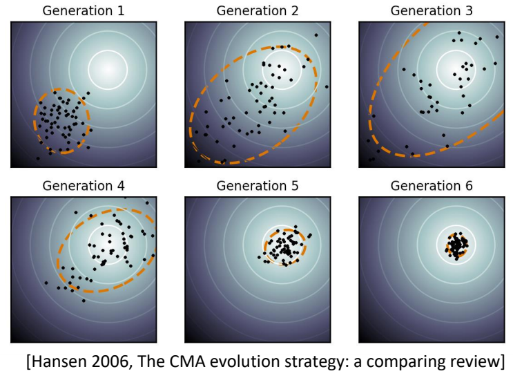

# CMA-ES（协方差矩阵自适应进化策略）

> &#x2705; **本章定位**：理解 **无梯度优化方法** 在轨迹优化中的应用，掌握 CMA-ES 的核心思想、算法流程和在角色动画中的实际应用。

---

## 一、为什么需要无梯度优化？

### 基于梯度方法的局限

在轨迹优化中，基于梯度的方法（如 iLQR、DDP）需要：

| 要求 | 问题 |
|------|------|
| 可微的动力学模型 | 接触、碰撞等不连续事件不可微 |
| 可微的目标函数 | 某些任务指标不可微 |
| 良好的梯度信息 | 非凸问题容易陷入局部最优 |

**现实问题**：
- 人形角色动画涉及**接触约束**（脚与地面接触/离开）
- 目标函数可能**高度非凸**（多峰、不连续）
- 仿真器通常是**黑盒系统**，无法提供解析梯度

---

### 无梯度方法的优势

| 优势 | 说明 |
|------|------|
| **无需梯度** | 适用于不可微、不连续问题 |
| **黑盒优化** | 只需输入输出，不关心内部机制 |
| **全局搜索** | 更有可能跳出局部最优 |
| **稳定可靠** | 对噪声和不确定性鲁棒 |

**代表方法**：
- CMA-ES（协方差矩阵自适应进化策略）
- 贝叶斯优化
- 序列蒙特卡洛方法

---

## 二、CMA-ES 核心思想

### 基本概念

**CMA-ES** (Covariance Matrix Adaptation Evolution Strategy) 是一种**进化策略**，属于进化计算的分支。

**核心思想**：
> 将优化变量建模为**高斯分布**，通过迭代采样和选择，自适应地更新分布的**均值**和**协方差矩阵**，使分布逐渐收敛到最优解。

---

### 算法框架

```
目标：找到变量 x 使目标函数 f(x) 最小

1. 初始化高斯分布：x ~ N(μ, Σ)
   - μ: 均值（当前最优估计）
   - Σ: 协方差矩阵（搜索方向和步长）

2. Repeat until convergence:
   (a) 采样：生成候选解 {x₁, x₂, ..., x_λ} ~ N(μ, Σ)
   (b) 评估：计算每个候选解的目标值 {f(x₁), f(x₂), ..., f(x_λ)}
   (c) 选择：保留前 N 个最优样本（精英样本）
   (d) 更新：根据精英样本更新 μ 和 Σ

3. 输出：最优均值 μ*
```

---

### 可视化理解

```
迭代 1: 初始分布（大方差，探索阶段）
        o
      o o o
    o  *  o      * = 均值 μ
      o o o        o = 采样点
        o

        ↓ 评估 + 选择 + 更新

迭代 2: 分布向最优方向移动（协方差开始适应）
            o
          o o
        o  * →
          o o
            o

        ↓ 继续迭代

迭代 N: 收敛到最优解（小方差，开发阶段）
          ***
         *****
        *******   * = 密集的最优解区域
```

---

## 三、CMA-ES 算法详解

### 3.1 初始化

**均值向量** \\(\mu _0\\)：
- 可以随机初始化
- 或使用启发式方法（如参考轨迹）

**协方差矩阵** \\(\Sigma _0\\)：
- 通常初始化为单位矩阵：\\(\Sigma _0 = I\\)
- 或根据问题先验知识设置

**超参数**：
- \\(\lambda\\)：每代采样数量（通常 \\(\lambda = 4 + \lfloor 3 \ln n \rfloor\\)）
- \\(\mu\\)：精英样本数量（通常 \\(\mu = \lfloor \lambda/2 \rfloor\\)）
- \\(w _i\\)：样本权重（通常对数权重）

---

### 3.2 采样过程

从多元高斯分布中采样：

$$
x_i ^{(g+1)} \sim \mathcal{N}(\mu ^{(g)}, \Sigma ^{(g)}), \quad i = 1, \dots, \lambda
$$

**高效实现**：
$$
x_i ^{(g+1)} = \mu ^{(g)} + \sigma ^{(g)} \cdot B ^{(g)} \cdot z_i
$$

其中：
- \\(\sigma\\)：全局步长（控制采样范围）
- \\(B\\)：协方差矩阵的平方根（\\(B \cdot B ^T = \Sigma\\)）
- \\(z_i \sim \mathcal{N}(0, I)\\)：标准正态采样

---

### 3.3 评估与选择

**评估**：
$$
f_i = f(x_i ^{(g+1)}), \quad i = 1, \dots, \lambda
$$

**选择**：
- 对 \\(\{f_1, \dots, f_\lambda\}\\) 排序
- 选择前 \\(\mu\\) 个最优样本（精英样本）

**权重分配**：
$$
w_i = \ln(\mu + 1) - \ln(i), \quad i = 1, \dots, \mu
$$

$$
\sum _{i=1}^{\mu} w_i = 1
$$

---

### 3.4 更新规则

#### 均值更新

$$
\mu ^{(g+1)} = \sum _{i=1}^{\mu} w_i \cdot x _{i:\lambda}^{(g+1)}
$$

其中 \\(x _{i:\lambda}\\) 表示第 \\(i\\) 好的样本。

**解释**：新均值是精英样本的加权平均。

---

#### 协方差矩阵更新（核心）

CMA-ES 的关键创新：**协方差矩阵自适应**

$$
\Sigma ^{(g+1)} = (1-c_1-c_\mu)\Sigma ^{(g)} + c_1 \cdot p_c p_c ^T + c_\mu \sum _{i=1}^{\mu} w_i \cdot \frac{(x _{i:\lambda} - \mu)}{\sigma} \frac{(x _{i:\lambda} - \mu)^T}{\sigma}
$$

其中：
- \\(c_1\\)：累积学习率（通常 \\(c_1 \approx 2/n^2\\)）
- \\(c_\mu\\)：精英学习率（通常 \\(c_\mu \approx \mu/n^2\\)）
- \\(p_c\\)：进化路径（累积历史信息）

---

#### 进化路径（Evolution Path）

**共轭进化路径** \\(p_\sigma\\)：
$$
p_\sigma ^{(g+1)} = (1-c_\sigma)p_\sigma^{(g)} + \sqrt{c_\sigma(2-c_\sigma)}\sqrt{\sum w_i^2} \cdot B^{-1} \frac{\mu ^{(g+1)} - \mu ^{(g)}}{\sigma}
$$

**协方差进化路径** \\(p_c\\)：
$$
p_c ^{(g+1)} = (1-c_c)p_c^{(g)} + \sqrt{c_c(2-c_c)} \sum _{i=1}^{\mu} w_i \cdot \frac{x _{i:\lambda} - \mu}{\sigma}
$$

**作用**：累积历史更新方向，加速收敛。

---

#### 步长更新

$$
\sigma ^{(g+1)} = \sigma ^{(g)} \cdot \exp\left(\frac{c_\sigma}{d_\sigma}\left(\frac{\|p_\sigma^{(g+1)}\|}{E[\|N(0,I)\|]} - 1\right)\right)
$$

**解释**：
- 如果 \\(\|p_\sigma\|\\) 太大 → 步长增加（探索）
- 如果 \\(\|p_\sigma\|\\) 太小 → 步长减小（开发）

---

### 3.5 完整算法伪代码

```
算法：CMA-ES

输入：
    - 目标函数 f(x)
    - 初始均值 μ₀ ∈ ℝⁿ
    - 初始步长 σ₀ > 0
    - 种群大小 λ
    - 精英数量 μ

输出：
    - 最优解 x*

1. 初始化：
   μ ← μ₀, σ ← σ₀, Σ ← I, p_c ← 0, p_σ ← 0
   计算权重 w₁, ..., w_μ

2. Repeat until convergence or max iterations:
   
   (a) 采样阶段
       对 i = 1 到 λ:
           z_i ~ N(0, I)
           x_i = μ + σ · B · z_i
   
   (b) 评估阶段
       对 i = 1 到 λ:
           f_i = f(x_i)
   
   (c) 选择阶段
       按 f_i 排序，选择前 μ 个精英样本
       记录精英样本索引 {1:λ, ..., μ:λ}
   
   (d) 更新均值
       μ ← Σᵢ₌₁^μ w_i · x_{i:λ}
   
   (e) 更新进化路径
       p_σ ← (1-c_σ)p_σ + √(c_σ(2-c_σ))√(Σwᵢ²) · B⁻¹(μ_new - μ)/σ
       
       如果 ∥p_σ∥ 较小：
           p_c ← (1-c_c)p_c + √(c_c(2-c_c)) · Σᵢ₌₁^μ w_i · (x_{i:λ} - μ)/σ
           
           更新协方差：
           Σ ← (1-c₁-c_μ)Σ + c₁·p_c·p_cᵀ + c_μ·Σᵢ₌₁^μ w_i·y_i·y_iᵀ
           其中 y_i = (x_{i:λ} - μ)/σ
   
   (f) 更新步长
       σ ← σ · exp((c_σ/d_σ)(∥p_σ∥/E[∥N(0,I)∥] - 1))

3. 返回 μ（最优均值）
```

---

## 四、CMA-ES 在角色动画中的应用

### 4.1 轨迹优化问题

**优化变量**：
- 目标轨迹 \\(\tilde{x}(t)\\)
- 或控制轨迹 \\(u(t)\\)

**目标函数**：
$$
\min _{\theta} J(\theta) = w_{\text{track}} \cdot E_{\text{track}} + w_{\text{control}} \cdot E_{\text{control}} + w_{\text{stable}} \cdot E_{\text{stable}}
$$

| 项 | 说明 |
|------|------|
| \\(E_{\text{track}}\\) | 跟踪误差（与参考轨迹的距离） |
| \\(E_{\text{control}}\\) | 控制代价（力矩大小） |
| \\(E_{\text{stable}}\\) | 稳定性（质心高度、不摔倒） |

---

### 4.2 参数化表示

**直接参数化**：
- 优化每一帧的状态/控制
- 参数数量大（高维）

**曲线参数化**（推荐）：
$$
x(t) = \text{Spline}(\theta_1, \dots, \theta_k)
$$

- 优化样条曲线的控制点
- 参数数量少（低维）
- 自动平滑

---

### 4.3 应用实例

#### 实例 1：动物步态优化 [Wampler and Popović 2009]



**问题**：
- 优化虚拟动物的步态
- 目标：行走速度最快

**方法**：
- 使用 CMA-ES 优化步态参数
- 参数：脚部落点、摆动轨迹、关节角度

**结果**：
- 自动发现高效的行走模式
- 与真实动物步态相似

---

#### 实例 2：角色全身轨迹优化 [Al Borno et al. 2013]

**问题**：
- 优化角色在复杂接触下的轨迹
- 接触序列未知

**方法**：
- CMA-ES 优化目标轨迹
- 物理仿真评估可行性

**优势**：
- 无需梯度，处理接触不连续性
- 自动发现合适的接触序列

---

### 4.4 与 SAMCON 的关系

**CMA-ES 的缺点**：
1. 每次都从头到尾做仿真，计算量大
2. 如果仿真轨迹长，则难收敛

**SAMCON 改进**：
- 将轨迹分段
- 每段用序列蒙特卡洛方法优化
- 保留多个假设（粒子），避免局部最优

```
CMA-ES: 整条轨迹 → 一次仿真 → 评估
            ↓
SAMCON: 分段轨迹 → 逐帧仿真 → 粒子滤波
```

---

## 五、CMA-ES 与其他方法对比

### 5.1 与基于梯度方法对比

| 维度 | CMA-ES | iLQR/DDP |
|------|--------|----------|
| **梯度需求** | 无需 | 需要（一阶/二阶） |
| **适用问题** | 不可微、非凸 | 平滑、可微 |
| **收敛速度** | 慢（线性） | 快（iLQR 线性，DDP 二阶） |
| **样本效率** | 低（需要大量采样） | 高 |
| **全局性** | 较好（不易陷入局部最优） | 较差（依赖初始猜测） |
| **并行性** | 好（采样可并行） | 较差 |
| **计算成本** | 高（仿真次数多） | 中（需要计算梯度） |

---

### 5.2 与其他无梯度方法对比

| 方法 | 适用维度 | 样本效率 | 全局搜索 |
|------|---------|---------|---------|
| **CMA-ES** | 低~中维 (<100) | 中 | 好 |
| **贝叶斯优化** | 低维 (<20) | 高 | 好 |
| **随机搜索** | 任意 | 低 | 差 |
| **粒子群优化** | 任意 | 中 | 中 |

---

### 5.3 方法选择建议

更多方法对比请参见：[方法对比与分类](MethodComparison.md)。

```
问题特点 → 推荐方法
─────────────────────────
线性、可微 → LQR
平滑非线性 → iLQR/DDP
接触频繁、不可微 → CMA-ES
样本昂贵 → 贝叶斯优化
高维 (>100) → 考虑基于梯度方法
实时控制 → MPC/SAMCON
需要泛化 → 强化学习 (DeepMimic)
```

---

### 5.4 应用：用 CMA-ES 学习线性反馈策略

除了优化轨迹，CMA-ES 还可以用于**学习参数化的策略函数**。

**问题设定**：
- 目标：学习一个反馈策略 \\(\pi(s)\\)，将状态映射到动作
- 参数化：线性策略 \\(\delta a = M \cdot \delta s + \hat{a}\\)
- 优化变量：反馈矩阵 \\(M\\) 和前馈项 \\(\hat{a}\\)

**优化流程**：
```
1. 用 SAMCON 优化开环轨迹，得到参考控制 â
2. 参数化线性反馈策略：a = M·δs + â
3. 用 CMA-ES 优化参数 (M, â)
   - 采样候选参数 {θᵢ}
   - 仿真评估每个候选策略
   - 更新高斯分布的均值和方差
4. 输出最优策略参数 θ*
```

**工程实践（Liu et al. 2012 - Terrain Runner）**：

| 技巧 | 说明 | 效果 |
|------|------|------|
| **手动选择状态** | 仅选择关键状态（根结点旋转、质心位置/速度、支撑脚位置） | 12 维 → 减少无关信息 |
| **手动选择控制** | 仅对少数关键关节加反馈 | 9 维 → 减少优化变量 |
| **矩阵分解** | \\(M_{12×9} = M_{12×3} · M_{3×9}\\) | 108 参数 → 63 参数 |

**优化成本**：
- 优化变量：63 维
- 计算时间：12 分钟（24 核并行）

**与轨迹优化的对比**：

| | **轨迹优化** | **策略优化** |
|---|------------|-------------|
| **输出** | 一条轨迹 \\((x,u)\\) | 一个策略函数 \\(\pi(s)\\) |
| **优化对象** | 有限维向量 | 函数参数 \\(\theta\\) |
| **泛化能力** | ❌ 仅适用于该轨迹 | ✅ 可处理新状态 |
| **计算成本** | 中（秒级） | 高（分钟级） |

> ✅ **注意**：这里的策略优化仍然是**离线优化**，不同于强化学习的在线学习。

---

## 六、工程实践

### 6.1 调参建议

| 参数 | 推荐值 | 说明 |
|------|-------|------|
| \\(\lambda\\) | \\(4 + \lfloor 3 \ln n \rfloor\\) | 种群大小 |
| \\(\mu\\) | \\(\lfloor \lambda/2 \rfloor\\) | 精英数量 |
| \\(\sigma_0\\) | 根据问题尺度设置 | 初始步长 |
| \\(c_1\\) | \\(2/n^2\\) | 累积学习率 |
| \\(c_\mu\\) | \\(\mu/n^2\\) | 精英学习率 |

---

### 6.2 实用技巧

**1. 参数缩放**
- 将参数归一化到 [0, 1] 范围
- 避免某些参数主导搜索

**2. 约束处理**
- 使用罚函数：\\(J' = J + \lambda \cdot \text{constraint}\\)
- 或在采样时截断

**3. 早停策略**
- 如果连续 N 代没有改进，则停止
- 节省计算资源

**4. 多起点**
- 从多个初始点运行 CMA-ES
- 选择最优结果

---

### 6.3 并行化

CMA-ES 的主要计算成本在**评估阶段**，可以并行：

```python
# 串行（慢）
for i in range(λ):
    f[i] = f(x[i])

# 并行（快）
from joblib import Parallel, delayed
f = Parallel(n_jobs=-1)(delayed(f)(x[i]) for i in range(λ))
```

---

## 七、关键要点总结

### 核心思想

1. **高斯分布建模**：将优化变量视为随机变量，用高斯分布表示
2. **自适应协方差**：根据精英样本更新协方差矩阵，学习搜索方向
3. **进化路径**：累积历史信息，加速收敛

### 算法流程

```
初始化 → 采样 → 评估 → 选择 → 更新 → 检查收敛
   ↑                                        ↓
   └────────────────────────────────────────┘
```

### 优缺点

| 优点 | 缺点 |
|------|------|
| 无需梯度，适用于黑盒问题 | 样本效率低，收敛慢 |
| 能处理不可微、非凸问题 | 高维问题效果差 |
| 全局搜索能力强 | 计算成本高 |
| 采样可并行 | 需要调参 |

### 适用场景

- ✅ 接触频繁的轨迹优化
- ✅ 不可微目标函数
- ✅ 黑盒仿真系统
- ✅ 低~中维优化问题 (<100 维)
- ❌ 实时控制（计算太慢）
- ❌ 高维问题（收敛太慢）

---

## 八、深入学习

### 前置知识
- [轨迹优化的数学描述](MathematicalFormulation.md)
- [基于梯度的方法](iLQR.md)

### 相关方法
- [SAMCON](SAMCON.md) - CMA-ES 的改进版本
- [iLQR](iLQR.md) - 基于梯度的替代方案
- [DDP](iLQR.md#四ilqr-与-ddp-的对比) - 二阶方法

### 参考资料
- [Hansen 2006 - The CMA Evolution Strategy: A Comparing Review](https://www.bionics.seas.ucla.edu/education/MAE_263D/CMA-ES_original_paper.pdf)
- [Wampler and Popović 2009 - Optimal Gait and Form for Animal Locomotion](https://www.cc.gatech.edu/~jylee/publications/wampler-popovic-2009.pdf)
- [Al Borno et al. 2013 - Trajectory Optimization for Full-Body Movements with Complex Contacts](https://www.cs.ubc.ca/~van/papers/2013-CGMN-1/trajopt.pdf)

### 代码资源
- [pycma - Python CMA-ES 实现](https://github.com/CMA-ES/pycma)
- [cma - 另一个 Python 实现](https://pypi.org/project/cma/)

---

> 本文出自 CaterpillarStudyGroup，转载请注明出处。
> https://caterpillarstudygroup.github.io/GAMES105_mdbook/
