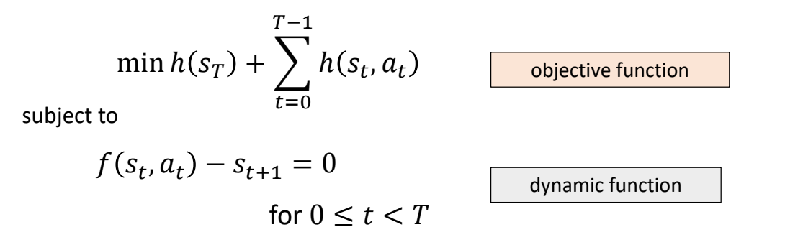
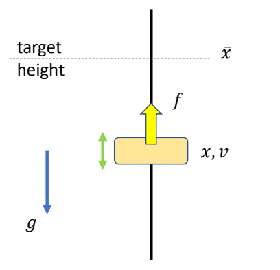
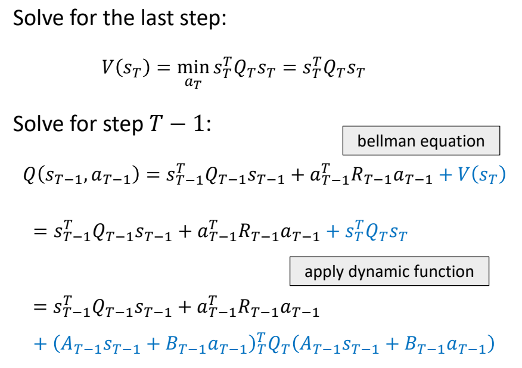
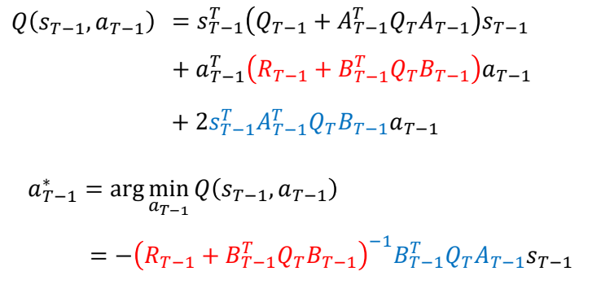
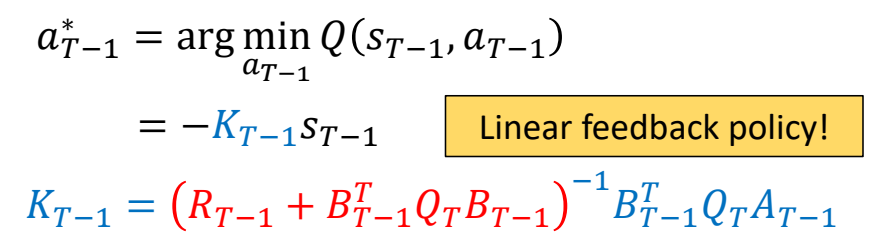
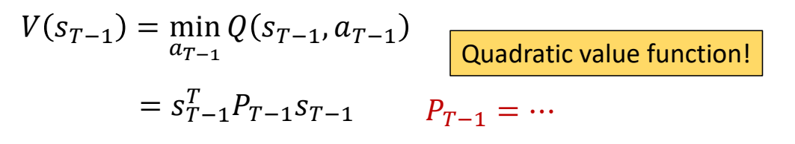
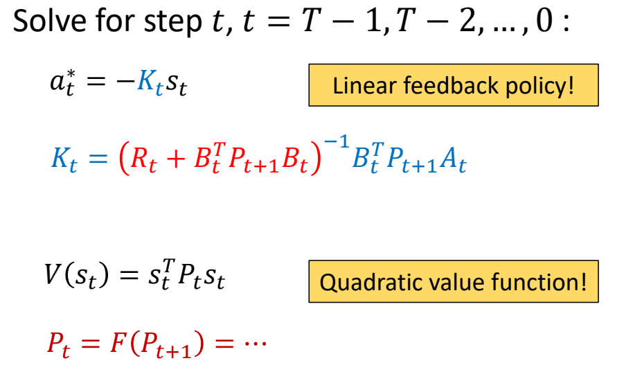
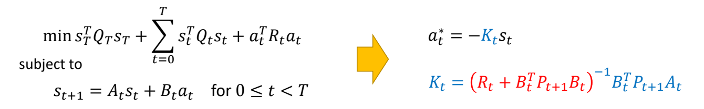

P52   
# Linear Quadratic Regulator (LQR)   

 

 - LQR is a special class of optimal control problems with   
    - **Linear** dynamic function   
    - **Quadratic** objective function   

> &#x2705; LQR 是控制领域一类经典问题，它对原控制问题做了一些特定的约束。因为简化了问题，可以得到有特定公式的 \\(Q\\) 和 \\(V\\).    

P53   
## A very simple example   

### 问题描述

 

Compute a target trajectory \\(\tilde{x}(t)\\) such that the simulated trajectory \\(x(t)\\) is a sine curve.   

 

> &#x2705; 目标函数是关于优化对象 \\(x_n\\) 的二次函数。   

$$
\min _{(x_n,v_n,\tilde{x} _n)} \sum _{n=0}^{N} (\sin (t_n)-x_n)^2+\sum _{n=0}^{N}\tilde{x}^2_n 
$$

> &#x2705; 运动学方程中的 \\(x_{n+1}\\)、\\(v_{n+1}\\) 与上一帧状态 \\(x_n\\)、\\(v_n\\) 是线性关系。   

$$
\begin{align*}
 s.t. \quad \quad v _ {n+1} & = v _ n + h(k _p ( \tilde{x} _ n - x _ n) - k _ dv _ n ) \\\\
 v _ {x+1} & = x _ n + hv _ {n+1}
\end{align*}
$$

> &#x2705; 这是一个典型的 LQR 问题。  

P54  
objective function   

$$
\min s^T_TQ_Ts_T+\sum_{t=0}^{T} s^T_tQ_ts_t+a^T_tR_ta_t
$$

subject to dynamic function     

$$
s_{t+1}=A_ts_t+B_ta_t   \quad \quad \text{for }   0\le t <T 
$$

P58   
### 推导一步

> &#x2705; 由于存在optimal substructure，每次只需要考虑下一个状态的最优解。  
> &#x2705; 每一个状态基于下一个状态来计算，不断往下迭代，直到最后一个状态。  
> &#x2705; 最后一个状态的V的计算与a无关。  
> &#x2705; 计算完最后一个，再计算倒数第二个，依次往前推。  

 

P60   
公式整理得：  

 

P61 
 

> &#x2705; 结论：最优策略与当前状态的关系是矩阵K的关系。\\(K\\) 是线性反馈系数。      

P62   
当a取最小值时，求出V：

  

> &#x2705; \\(V(S_{T-1})\\)和\\(V(S_{T})\\)的形式基本一致，只是P的表示不同。 

P63  
### 推导每一步

 

P64   
### Solution

 - LQR is a special class of optimal control problems with   
    - Linear dynamic function   
    - Quadratic objective function   
 - Solution of LQR is a linear feedback policy  

 

P65   
## 更复杂的情况

 - How to deal with   
    - Nonlinear dynamic function?   
    - Non-quadratic objective function?   

> &#x2705; 人体运动涉及到角度旋转，因此是非线性的。  

---------------------------------------
> 本文出自CaterpillarStudyGroup，转载请注明出处。
>
> https://caterpillarstudygroup.github.io/GAMES105_mdbook/
