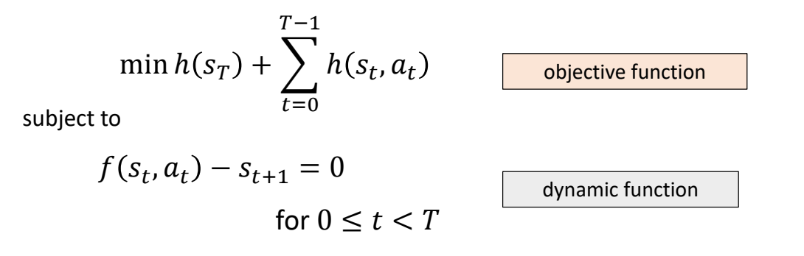
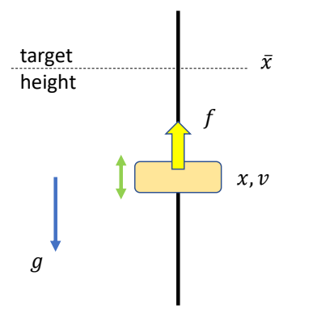
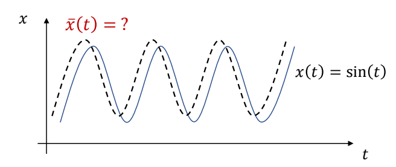
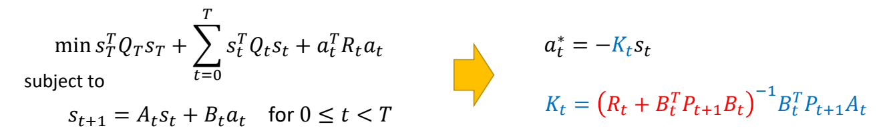

# Linear Quadratic Regulator (LQR)



 - LQR is a special class of optimal control problems with
    - **Linear** dynamic function
    - **Quadratic** objective function


> &#x2705; LQR 是控制领域一类经典问题，它对原控制问题做了一些特定的约束。因为简化了问题，可以得到有特定公式的 \\(Q\\) 和 \\(V\\).

---

## 从轨迹优化到 LQR

### 一般轨迹优化问题

$$
\min _{\mathbf{x} _{0:T}, \mathbf{u} _{0:T-1}} J(\mathbf{x}, \mathbf{u}) \quad \text{s.t.} \quad \mathbf{x} _{t+1} = f(\mathbf{x} _t, \mathbf{u} _t)
$$

| 特点 | 说明 |
|------|------|
| **动力学** | 非线性：\\(f(x,u)\\) 是任意非线性函数 |
| **目标函数** | 任意形式：\\(J(x,u)\\) 可能非凸、非二次 |
| **求解难度** | 很难直接求解，需要数值方法 |

---

### LQR 的简化假设

LQR 对一般问题做了两个关键假设：

| 假设 | 数学形式 | 效果 |
|------|---------|------|
| **线性动力学** | \\(x _{t+1} = A _t x _t + B _t u _t\\) | 状态转移是线性的 |
| **二次目标函数** | \\(J = x _T^T Q _T x _T + \sum (x _t^T Q _t x _t + u _t^T R _t u _t)\\) | 代价是状态和控制的二次函数 |

**好处**：问题有**闭式解**（解析解），无需数值迭代！

---

### 如何从一般问题得到 LQR 形式

**核心思想**：在当前轨迹附近**局部近似**

```
一般轨迹优化问题
    ↓
在当前轨迹 (x̄, ū) 附近线性化
    ↓
δx_{t+1} = A·δx_t + B·δu_t  （线性化动力学）
    ↓
J ≈ δx^T Q δx + δu^T R δu  （二次近似）
    ↓
LQR 问题（有闭式解）
```

---

### 1. 动力学线性化

在标称轨迹 \\((\bar{x}, \bar{u})\\) 附近做一阶泰勒展开：

$$
f(x,u) \approx f(\bar{x},\bar{u}) + \underbrace{\frac{\partial f}{\partial x}}\ _{A}(x-\bar{x}) + \underbrace{\frac{\partial f}{\partial u}}\ _{B}(u-\bar{u})
$$

定义偏差变量：\\(\delta x = x - \bar{x}, \quad \delta u = u - \bar{u}\\)

得到线性化动力学：

$$
\delta x _{t+1} = A _t \delta x _t + B _t \delta u _t
$$

其中 \\(A _t = \frac{\partial f}{\partial x}| _{(\bar{x} _t,\bar{u} _t)}, \quad B _t = \frac{\partial f}{\partial u}| _{(\bar{x} _t,\bar{u} _t)}\\)

---

### 2. 目标函数二次化

对目标函数做二阶泰勒展开（忽略常数项和一阶项）：

$$
J \approx \frac{1}{2}\delta x ^T Q \delta x + \frac{1}{2}\delta u ^T R \delta u
$$

其中 \\(Q = \frac{\partial ^2 J}{\partial x ^2}, \quad R = \frac{\partial ^2 J}{\partial u ^2}\\)

---

### 3. 求解 LQR

得到标准 LQR 问题：

$$
\min _{\delta u} \frac{1}{2}\delta x ^T Q \delta x + \frac{1}{2}\delta u ^T R \delta u \quad \text{s.t.} \quad \delta x _{t+1} = A \delta x + B \delta u
$$

**最优解**：

$$
\delta u ^* = -K \delta x
$$

其中 \\(K\\) 通过 Riccati 方程求解。

---

### 4. 迭代直到收敛（iLQR 思想）

| 步骤 | 操作 |
|------|------|
| 1 | 猜测初始轨迹 \\((\bar{x}, \bar{u})\\) |
| 2 | 线性化动力学：计算 \\(A, B\\) |
| 3 | 二次化目标：计算 \\(Q, R\\) |
| 4 | 求解 LQR：得到 \\(\delta u ^* = -K \delta x\\) |
| 5 | 更新轨迹：\\(x \leftarrow \bar{x} + \delta x, u \leftarrow \bar{u} + \delta u\\) |
| 6 | 重复 2-5 直到收敛 |

**这就是 iLQR（Iterative LQR）的核心思想！**

---

### 总结：LQR 在轨迹优化中的定位

| | 一般轨迹优化 | LQR |
|---|-------------|-----|
| **动力学** | 非线性 | 线性（近似） |
| **目标函数** | 任意形式 | 二次（近似） |
| **求解方法** | 数值迭代 | 闭式解 |
| **适用范围** | 全局 | 局部（轨迹附近） |
| **与 iLQR 关系** | 原始问题 | iLQR 每轮迭代的子问题 |

**关键理解**：
- LQR 本身只适用于线性系统
- 但通过**迭代线性化**，可以用 LQR 求解非线性问题（iLQR）
- 因此 LQR 是理解 iLQR、DDP 等高级方法的基础

---

## 简单例子：方块跟踪正弦曲线

### 问题描述



计算一条目标轨迹 \\(\tilde{x}(t)\\)，使得仿真轨迹 \\(x(t)\\) 是正弦曲线。



> &#x2705; 目标函数是关于优化对象 \\(x _n\\) 的二次函数。

$$
\min _{(x _n,v _n,\tilde{x} _n)} \sum _{n=0}^{N} (\sin (t _n)-x _n)^2+\sum _{n=0}^{N}\tilde{x} ^2 _n
$$

> &#x2705; 运动学方程中的 \\(x _{n+1}\\)、\\(v _{n+1}\\) 与上一帧状态 \\(x _n\\)、\\(v _n\\) 是线性关系。

$$
\begin{aligned}
 s.t. \quad \quad v _ {n+1} & = v _ n + h(k _p ( \tilde{x} _ n - x _ n) - k _ dv _ n ) \\\\
 x _ {n+1} & = x _ n + hv _ {n+1}
\end{aligned}
$$

> &#x2705; 这是一个典型的 LQR 问题。

---

## LQR 的标准形式

**目标函数**：

$$
\min s ^T _T Q _T s _T+\sum _{t=0}^{T} s ^T _t Q _t s _t + a ^T _t R _t a _t
$$

**约束条件**（动力学方程）：

$$
s _{t+1}=A _t s _t+B _t a _t \quad \text{for } 0\le t <T
$$

其中：
- \\(s _t\\)：状态向量（state）
- \\(a _t\\)：控制输入（action/control）
- \\(A _t, B _t\\)：线性化后的系统矩阵
- \\(Q _t, R _t\\)：代价权重矩阵

---

## 动态规划推导（逆向归纳法）

> &#x2705; 由于存在**最优子结构**（optimal substructure），可以从最后一步往前推导：
> - 每一步只需要考虑从当前状态到终点的最优解
> - 最后一个状态的 Value 计算与 \\(a\\) 无关
> - 计算完最后一步，再计算倒数第二步，依次往前推

### Value Function 的形式

假设从时刻 \\(t\\) 到终点的最优代价（Value Function）具有二次形式：

$$
V _t(s) = s ^T P _t s
$$

其中 \\(P _t\\) 是对称矩阵。

---

### 最后一步的推导

考虑最后一步（从 \\(T-1\\) 到 \\(T\\)）：

$$
V _{T-1}(s _{T-1}) = \min _{a _{T-1}} \left[ s _{T-1}^T Q _{T-1} s _{T-1} + a _{T-1}^T R _{T-1} a _{T-1} + V _T(s _T) \right]
$$

代入 \\(s _T = A _{T-1} s _{T-1} + B _{T-1} a _{T-1}\\) 和 \\(V _T(s _T) = s _T^T P _T s _T\\)：

$$
V _{T-1}(s _{T-1}) = \min _{a _{T-1}} \left[ s _{T-1}^T Q _{T-1} s _{T-1} + a _{T-1}^T R _{T-1} a _{T-1} + (A _{T-1} s _{T-1} + B _{T-1} a _{T-1})^T P _T (A _{T-1} s _{T-1} + B _{T-1} a _{T-1}) \right]
$$

---

### 求解最优控制

对 \\(a _{T-1}\\) 求导并令导数为零：

$$
\frac{\partial V _{T-1}}{\partial a _{T-1}} = 2 R _{T-1} a _{T-1} + 2 B _{T-1}^T P _T (A _{T-1} s _{T-1} + B _{T-1} a _{T-1}) = 0
$$

整理得：

$$
(R _{T-1} + B _{T-1}^T P _T B _{T-1}) a _{T-1} = -B _{T-1}^T P _T A _{T-1} s _{T-1}
$$

解得最优控制：

$$
a _{T-1}^* = -(R _{T-1} + B _{T-1}^T P _T B _{T-1})^{-1} B _{T-1}^T P _T A _{T-1} s _{T-1}
$$

---

### 最优控制律的一般形式

$$
a _t^* = -K _t s _t
$$

其中反馈增益矩阵 \\(K _t\\) 为：

$$
K _t = (R _t + B _t^T P _{t+1} B _t)^{-1} B _t^T P _{t+1} A _t
$$

> &#x2705; **结论**：最优策略是当前状态的线性函数，\\(K\\) 是线性反馈系数。

---

### 求解 Value Function

将最优控制 \\(a _t^* = -K _t s _t\\) 代回 Value Function：

$$
V _{t}(s _t) = s _t^T (Q _t + K _t^T R _t K _t + (A _t - B _t K _t)^T P _{t+1} (A _t - B _t K _t)) s _t
$$

因此：

$$
P _t = Q _t + K _t^T R _t K _t + (A _t - B _t K _t)^T P _{t+1} (A _t - B _t K _t)
$$

或者展开为更常见的形式（离散代数 Riccati 方程）：

$$
P _t = Q _t + A _t^T P _{t+1} A _t - A _t^T P _{t+1} B _t (R _t + B _t^T P _{t+1} B _t)^{-1} B _t^T P _{t+1} A _t
$$

> &#x2705; \\(V(s _{T-1})\\) 和 \\(V(s _T)\\) 的形式基本一致，只是 \\(P\\) 的表示不同。

---

## 逆向递推算法

从终点往起点递推计算 \\(P _t\\) 和 \\(K _t\\)：

| 步骤 | 计算 |
|------|------|
| **初始化** | \\(P _T = Q _T\\)（终端代价） |
| **对 \\(t = T-1, T-2, \dots, 0\\)** | |
| 1. 计算反馈增益 | \\(K _t = (R _t + B _t^T P _{t+1} B _t)^{-1} B _t^T P _{t+1} A _t\\) |
| 2. 更新 P 矩阵 | \\(P _t = Q _t + K _t^T R _t K _t + (A _t - B _t K _t)^T P _{t+1} (A _t - B _t K _t)\\) |
| 3. 存储 | \\(K _t, P _t\\) |

---

## Solution 总结

 - LQR is a special class of optimal control problems with
    - **Linear** dynamic function
    - **Quadratic** objective function
 - Solution of LQR is a **linear feedback policy**

$$
a _t^* = -K _t s _t
$$



**离线计算**：从 \\(T\\) 到 \\(0\\) 逆向递推，计算所有 \\(K _t\\)

**在线执行**：对每个时间步，应用 \\(a _t = -K _t s _t\\)

---

## 更复杂的情况

### 如何处理非线性问题？

 - How to deal with
    - **Nonlinear** dynamic function?
    - **Non-quadratic** objective function?

> &#x2705; 人体运动涉及到角度旋转，因此是非线性的。

**解决方案**：

| 方法 | 核心思想 |
|------|---------|
| **iLQR** | 迭代线性化 + LQR 求解 |
| **DDP** | 二阶泰勒展开 + 动态规划 |
| **CMA-ES** | 无导数优化（不需要线性化） |

这些方法将在后续章节介绍。

---

---------------------------------------
> 本文出自 CaterpillarStudyGroup，转载请注明出处。
>
> https://caterpillarstudygroup.github.io/GAMES105_mdbook/
