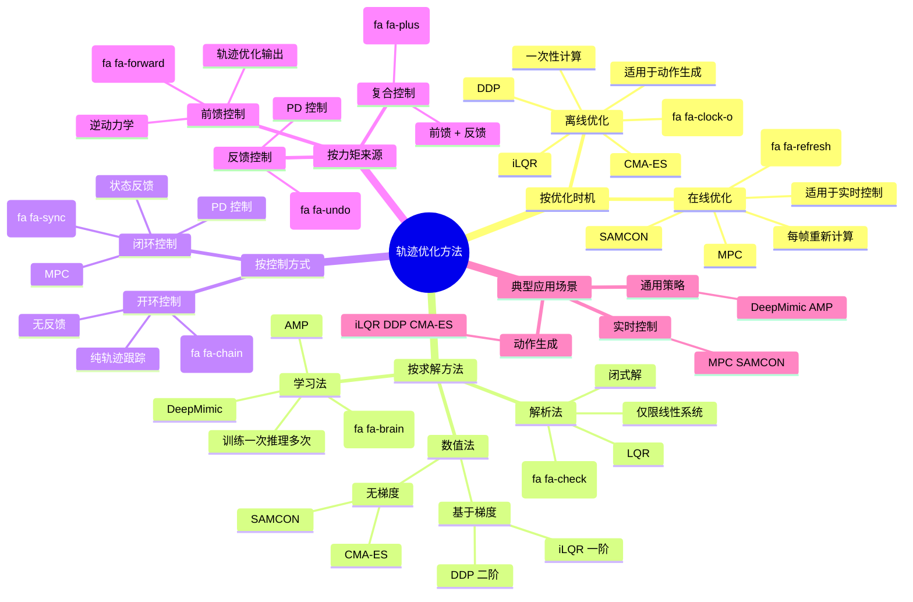
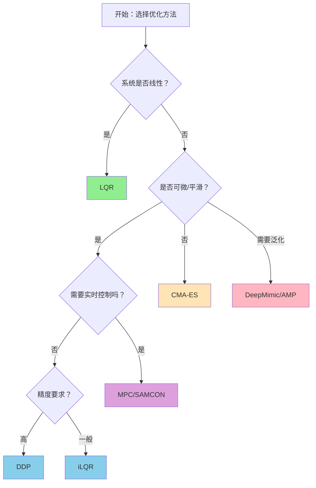

# 轨迹优化方法对比与分类

> ✅ **本章定位**：全面梳理轨迹优化领域的知识体系，通过多维度分类、方法对比和关系图谱，建立对各种优化方法的整体认知。

---

## 一、方法全景图（Mind Map）



---

## 二、三组核心分类概念

轨迹优化领域有三组分类概念，它们经常被混用，但实际上是**三个不同维度**的分类：

| 维度 | 分类 | 核心问题 |
|------|------|---------|
| **维度 1：优化时机** | 离线 vs. 在线 | 什么时候计算控制策略？ |
| **维度 2：控制方式** | 开环 vs. 闭环 | 是否使用当前状态反馈？ |
| **维度 3：力矩来源** | 前馈 vs. 反馈 | 力矩从哪里来？ |

---

### 维度 1：离线优化 vs. 在线优化（Optimization Timing）

| | **离线优化** | **在线优化** |
|---|------------|------------|
| **计算时机** | 任务执行前预先计算 | 任务执行中实时计算 |
| **计算频率** | 一次（或偶尔重新计算） | 每帧/每隔几帧 |
| **输出** | 完整的轨迹/策略 | 当前步的轨迹/策略 |
| **计算时间** | 可以很长（秒/分钟级） | 必须很短（毫秒级） |

**代表方法**：

| | **离线优化** | **在线优化** |
|---|------------|------------|
| **轨迹优化** | CMA-ES、iLQR、DDP | MPC、SAMCON |
| **学习方法** | DeepMimic（训练阶段） | DeepMimic（推理阶段） |

**优缺点对比**：

| 维度 | 离线优化 | 在线优化 |
|------|---------|---------|
| **计算成本** | 低（只做一次） | 高（持续计算） |
| **抗扰动能力** | ❌ 弱（无法应对意外） | ✅ 强（可实时调整） |
| **适用场景** | 预先制作动作库 | 实时交互控制 |

**直观类比**：

| | **离线优化** | **在线优化** |
|---|------------|------------|
| **开车** | 出门前查好导航路线 | 根据实时路况调整路线 |
| **做饭** | 按菜谱步骤执行 | 根据食材状态调整火候 |

---

### 维度 2：开环控制 vs. 闭环控制（Control Architecture）

| | **开环控制** | **闭环控制** |
|---|------------|------------|
| **是否使用反馈** | ❌ 不使用当前状态 | ✅ 使用当前状态 |
| **输入** | 仅初始状态 + 预设指令 | 初始状态 + 实时状态反馈 |
| **抗扰动能力** | ❌ 弱（扰动后无法恢复） | ✅ 强（可纠正偏差） |
| **输出** | 预设动作序列 | 根据状态调整的动作 |

**框图对比**：

**开环控制**：
```
初始状态 → 控制器 → 动作序列 → 执行 → 结果
```

**闭环控制**：
```
              ┌──────────────┐
              │              │
              ▼              │
目标状态 → (+) → 控制器 → 执行 → 当前状态
              ▲              │
              │              │
              └─────传感器───┘
                （状态反馈）
```

**优缺点对比**：

| 维度 | 开环控制 | 闭环控制 |
|------|---------|---------|
| **结构简单** | ✅ 简单 | ❌ 需要传感器/反馈 |
| **抗扰动** | ❌ 无 | ✅ 强 |
| **精度** | ❌ 依赖模型精度 | ✅ 可纠正误差 |
| **稳定性** | ❌ 可能发散 | ✅ 通常稳定 |

---

### 维度 3：前馈控制 vs. 反馈控制（Torque Source）

| | **前馈控制** | **反馈控制** |
|---|------------|------------|
| **力矩来源** | 预先计算的力矩 $\tau^*$ | 根据误差计算的力矩 |
| **计算公式** | $\tau = f(\text{模型}, \text{目标})$ | $\tau = k_p e + k_d \dot{e}$ |
| **是否需要模型** | ✅ 需要（逆动力学） | ⚠️ 需要较少 |
| **响应速度** | 快（无需等待误差） | 慢（需要误差出现） |

**公式对比**：

**前馈控制**：
$$
\tau_{\text{feedforward}} = \text{InverseDynamics}(q^*, \dot{q}^*, \ddot{q}^*)
$$

**反馈控制（PD）**：
$$
\tau_{\text{feedback}} = k_p (q^* - q) + k_d (\dot{q}^* - \dot{q})
$$

**复合控制（前馈 + 反馈）**：
$$
\tau = \underbrace{\tau_{\text{feedforward}}}_{\text{前馈}} + \underbrace{k_p (q^* - q) + k_d (\dot{q}^* - \dot{q})}_{\text{反馈}}
$$

**优缺点对比**：

| 维度 | 前馈控制 | 反馈控制 |
|------|---------|---------|
| **响应速度** | ✅ 快（预先计算） | ❌ 慢（需误差出现） |
| **模型依赖** | ❌ 高（需要精确模型） | ✅ 低 |
| **抗扰动** | ❌ 弱 | ✅ 强 |
| **稳态误差** | ✅ 无 | ❌ 有（需要误差才能输出力矩） |

---

## 三、四种维度分类法

轨迹优化方法可以从**四个维度**进行分类：

---

### 维度 1：按优化时机（输入信息）

| | **离线优化** | **在线优化** |
|------|------------|------------|
| **输入** | 仅参考轨迹 | 参考轨迹 + 当前状态 |
| **优化频率** | 一次（整条轨迹） | 每帧/实时（滚动优化） |
| **代表方法** | CMA-ES、iLQR、DDP、DeepMimic（训练） | MPC、SAMCON、DeepMimic（推理） |
| **优点** | 可预先计算、推理快 | 可应对扰动、鲁棒性强 |
| **缺点** | 无法应对扰动 | 计算成本高 |

---

### 维度 2：按求解方法

| | **解析法（闭式解）** | **数值法（迭代）** | **学习法（数据驱动）** |
|------|-------------------|-------------------|----------------------|
| **核心思想** | 公式直接求解 | 迭代优化逼近最优 | 学习策略生成轨迹 |
| **代表方法** | LQR | iLQR、DDP、CMA-ES、SQP | DeepMimic、AMP、SAC |
| **梯度需求** | N/A | 需要（一阶/二阶/零阶） | 需要/不需要 |
| **收敛速度** | 瞬时 | 慢→快（取决于方法） | 训练慢、推理快 |
| **适用系统** | 线性 | 非线性 | 任意 |
| **泛化能力** | N/A | 无（每任务一次） | 有（可处理新情况） |

---

### 维度 3：按是否需要梯度

| | **基于梯度** | **无梯度（零阶）** |
|------|------------|------------------|
| **特点** | 收敛快、需要可微模型 | 收敛慢、适用于任意问题 |
| **代表方法** | iLQR、DDP、SQP、IPOPT | CMA-ES、SAMCON |
| **适用场景** | 平滑问题、精确跟踪 | 非凸问题、接触频繁 |

---

### 维度 4：按优化变量

| | **状态优化** | **控制优化** | **同时优化** |
|------|------------|------------|------------|
| **优化变量** | 仅状态轨迹 \\((q, \dot{q})\\) | 仅控制轨迹 \\((\tau)\\) | 两者都优化 |
| **代表方法** | 运动规划 | 逆动力学 | 大多数轨迹优化方法 |
| **特点** | 简单但可能不可行 | 保证物理可行 | 最完整但计算复杂 |

---

## 四、完整方法对比表

| 方法 | 时机 | 求解类型 | 梯度 | 闭式解 | 适用场景 |
|------|------|---------|------|-------|---------|
| **LQR** | 离线/在线 | 解析法 | N/A | ✅ | 线性系统 |
| **iLQR** | 离线/在线 | 数值法 | 一阶 | ⚠️ 每轮闭式 | 平滑非线性问题 |
| **DDP** | 离线/在线 | 数值法 | 二阶 | ⚠️ 每轮闭式 | 高精度需求 |
| **CMA-ES** | 离线 | 数值法 | 零阶 | ❌ | 非凸/不可微问题 |
| **SAMCON** | 在线 | 数值法 | 零阶 | ❌ | 角色实时控制 |
| **MPC** | 在线 | 数值法 | 取决于求解器 | ⚠️ | 实时控制 + 约束 |
| **DeepMimic** | 离线训练 + 在线推理 | 学习法 | 一阶 | ❌ | 通用策略学习 |
| **AMP** | 离线训练 + 在线推理 | 学习法 | 一阶 | ❌ | 无标注模仿学习 |

---

### 数值优化方法详细对比

| 方法 | 梯度需求 | 适用维度 | 收敛速度 | 适用于角色 |
|------|---------|---------|---------|-----------|
| **CMA-ES** | 无需 | 低维 | 慢 | ✅ 简单动作 |
| **SAMCON** | 无需 | 中维 | 中 | ✅ 常用 |
| **iLQR** | 一阶 | 高维 | 快 | ✅ 常用 |
| **DDP** | 二阶 | 高维 | 很快 | ⚠️ 计算复杂 |
| **MPC** | 取决于求解器 | 中 - 高维 | 快（热启动） | ✅ 实时控制 |

---

## 五、方法详解

### 1. [LQR](LQR.md) - Linear Quadratic Regulator

**核心思想**：线性系统 + 二次代价 → 闭式解

| 特点 | 说明 |
|------|------|
| **假设** | 线性动力学 + 二次目标函数 |
| **优点** | 闭式解、计算瞬时 |
| **缺点** | 仅适用于线性系统 |
| **适用** | 线性系统或局部近似 |

---

### 2. [iLQR](iLQR.md) - Iterative LQR

**核心思想**：迭代线性化 + LQR 求解

| 特点 | 说明 |
|------|------|
| **优点** | 收敛快、适用于平滑问题 |
| **缺点** | 需要可微模型、可能陷入局部最优 |
| **适用** | 轨迹优化、局部修正 |

---

### 3. [DDP](DDP.md) - Differential Dynamic Programming

**核心思想**：基于二阶泰勒展开的动态规划

| 特点 | 说明 |
|------|------|
| **优点** | 二阶收敛、精度高 |
| **缺点** | 计算复杂、需要二阶导数 |
| **适用** | 高精度轨迹优化 |

---

### 4. [CMA-ES](CMA-ES.md)

**核心思想**：进化策略，通过采样和选择迭代优化

| 特点 | 说明 |
|------|------|
| **优点** | 无需梯度、适用于非凸问题 |
| **缺点** | 样本效率低、收敛慢 |
| **适用** | 低维问题、目标函数不平滑 |

---

### 5. [SAMCON](SAMCON.md)

**核心思想**：采样模型预测控制，结合 CMA-ES 和 MPC

| 特点 | 说明 |
|------|------|
| **优点** | 适用于角色控制、可处理复杂约束 |
| **缺点** | 需要大量采样 |
| **适用** | 轨迹跟踪、平衡控制 |

---

### 6. [MPC](MPC.md) - Model Predictive Control

**核心思想**：滚动时域优化，每帧基于当前状态重新规划未来 N 步，只执行第一步

| 特点 | 说明 |
|------|------|
| **优点** | 闭环最优、显式处理约束、应对扰动 |
| **缺点** | 计算成本高、模型依赖 |
| **适用** | 实时控制、复杂约束场景 |

---

### 7. [DeepMimic/AMP](../cont.md)

**核心思想**：学习策略生成轨迹

| 特点 | 说明 |
|------|------|
| **优点** | 泛化能力强、推理快速 |
| **缺点** | 需要大量训练、可解释性低 |
| **适用** | 通用角色控制、游戏 AI |

---

## 六、常见组合方案

### 方案 1：离线优化 + 前馈 + 反馈（最常用）

```
离线轨迹优化 → 目标轨迹 (q*, q̇*) + 控制轨迹 (τ*)
                        ↓
              在线 PD 控制：τ = τ* + k_p·e + k_d·ė
                        ↓
              闭环控制（前馈 + 反馈）
```

| 维度 | 选择 | 说明 |
|------|------|------|
| 优化时机 | 离线 | 预先计算轨迹和控制 |
| 控制方式 | 闭环 | 使用 PD 反馈 |
| 力矩来源 | 前馈 + 反馈 | $\tau = \tau^* + \text{PD}$ |

**优点**：
- 前馈提供主要驱动力（60-80%）
- 反馈负责抗扰动和纠偏（20-40%）
- 计算成本低（离线优化一次）

**适用场景**：动捕跟踪、预先制作的动作

---

### 方案 2：在线优化 + 前馈 + 反馈（MPC）

```
每帧：
  1. 测量当前状态 x
  2. 在线优化 → 新目标轨迹 + 新控制轨迹 (τ*)
  3. PD 控制：τ = τ* + k_p·e + k_d·ė
```

| 维度 | 选择 | 说明 |
|------|------|------|
| 优化时机 | 在线 | 每帧重新优化 |
| 控制方式 | 闭环 | 使用当前状态反馈 |
| 力矩来源 | 前馈 + 反馈 | $\tau = \tau^* + \text{PD}$ |

**优点**：
- 可应对动态变化的环境
- 可处理突发扰动

**缺点**：
- 计算成本高
- 需要高效求解器

**适用场景**：实时交互、复杂地形行走

---

### 方案 3：纯反馈（DeepMimic）

```
RL 策略 → 目标轨迹 (q*, q̇*)
              ↓
PD 控制：τ = k_p·e + k_d·ė（无前馈）
```

| 维度 | 选择 | 说明 |
|------|------|------|
| 优化时机 | 离线（训练） | 训练一次，推理多次 |
| 控制方式 | 闭环 | 使用 PD 反馈 |
| 力矩来源 | 纯反馈 | $\tau = \text{PD}$ only |

**优点**：
- 无需轨迹优化
- 策略可泛化

**缺点**：
- 需要大量训练
- 稳态误差较大

**适用场景**：通用角色控制、游戏 AI

---

### 完整对比表

| 方案 | 优化时机 | 控制方式 | 力矩来源 | 抗扰动 | 计算成本 | 代表方法 |
|------|---------|---------|---------|-------|---------|---------|
| **方案 1** | 离线 | 闭环 | 前馈 + 反馈 | ✅ | 低 | 轨迹优化 + PD |
| **方案 2** | 在线 | 闭环 | 前馈 + 反馈 | ✅✅ | 高 | MPC |
| **方案 3** | 离线 | 闭环 | 纯反馈 | ✅ | 中 | DeepMimic |
| **方案 4** | 离线 | 开环 | 纯前馈 | ❌ | 最低 | 纯轨迹跟踪 |

---

## 七、轨迹优化 vs. 强化学习

| 维度 | 轨迹优化 | DeepMimic/AMP |
|------|---------|---------------|
| **输出** | 单一轨迹 \\(\mathbf{x}_{0:T}\\) | 策略 \\(\pi(\mathbf{a}|\mathbf{s})\\) |
| **计算时机** | 离线优化（每任务一次） | 训练一次，在线推理 |
| **泛化能力** | 无（仅适用于该轨迹） | 有（可处理新情况） |
| **计算成本** | 高（分钟级） | 低（毫秒级推理） |
| **适用场景** | 特定动作生成 | 通用角色控制 |

**关系**：
- 轨迹优化结果可作为 RL 的参考轨迹
- RL 可学习模仿轨迹优化的行为

---

## 八、方法选择建议

```
问题类型 → 推荐方法
─────────────────────────
线性系统 → LQR
平滑非线性 → iLQR/DDP
接触频繁/不可微 → CMA-ES
实时控制 → MPC/SAMCON
需要泛化 → DeepMimic/AMP
离线制作动作 → iLQR/DDP/CMA-ES
```

### 选择流程图



---

## 九、关键要点总结

### 三组概念是不同维度的分类
- **离线/在线**：什么时候计算
- **开环/闭环**：是否用反馈
- **前馈/反馈**：力矩从哪里来

### 四种分类维度
- **按优化时机**：离线优化 vs. 在线优化
- **按求解方法**：解析法 (LQR) vs. 数值法 (iLQR/DDP/CMA-ES) vs. 学习法 (DeepMimic/AMP)
- **按梯度需求**：基于梯度 (iLQR/DDP) vs. 无梯度 (CMA-ES/SAMCON)
- **按优化变量**：状态优化 vs. 控制优化 vs. 同时优化

### 常见组合方案
- **最佳实践**：离线优化 + 闭环控制 + 前馈 + 反馈
- **实时应用**：在线优化（MPC）+ 闭环控制
- **学习方法**：离线训练 + 闭环控制 + 纯反馈

### 概念关系
- 离线/在线优化 → 输出前馈力矩
- 开环/闭环 → 决定是否使用反馈
- 前馈/反馈 → 力矩的两个来源，可以组合使用

### 选择建议
- 需要抗扰动 → 闭环 + 反馈
- 需要精确跟踪 → 加前馈
- 计算资源有限 → 离线优化
- 环境动态变化 → 在线优化（MPC）

---

> 📚 **深入学习**：
> - [轨迹优化主页面](Tracking.md) - 轨迹优化的整体介绍
> - [数学形式化描述](MathematicalFormulation.md) - 轨迹优化的数学描述
> - [LQR](LQR.md) - 线性二次调节器
> - [iLQR](iLQR.md) - 迭代 LQR
> - [DDP](DDP.md) - 微分动态规划
> - [CMA-ES](CMA-ES.md) - 协方差矩阵自适应进化策略
> - [SAMCON](SAMCON.md) - 采样模型预测控制
> - [MPC](MPC.md) - 模型预测控制
> - [最优控制与强化学习](Optimal.md) - 最优控制理论基础

---

> 本文出自 CaterpillarStudyGroup，转载请注明出处。
> https://caterpillarstudygroup.github.io/GAMES105_mdbook/
