P2
# Outline

 - Optimal Control
 - Model-based Approaches vs. Model-free Approaches
 - Sampling-based Optimization
 - Reinforcement Learning

 - Conclusion

P3
## Recap

|feedforward|feedback|
|---|---|
|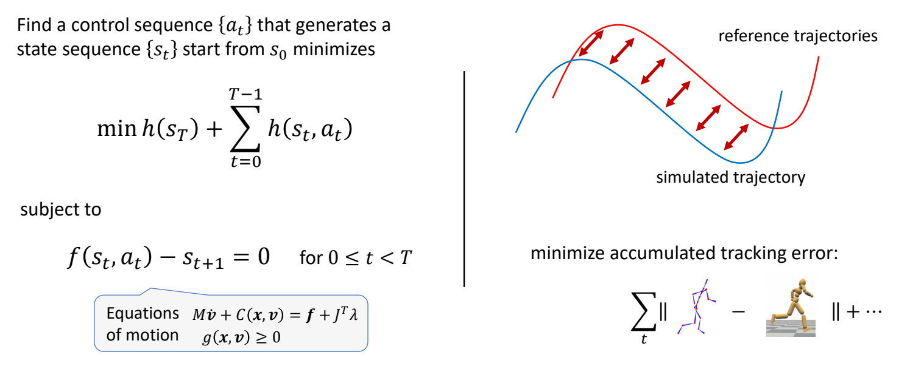|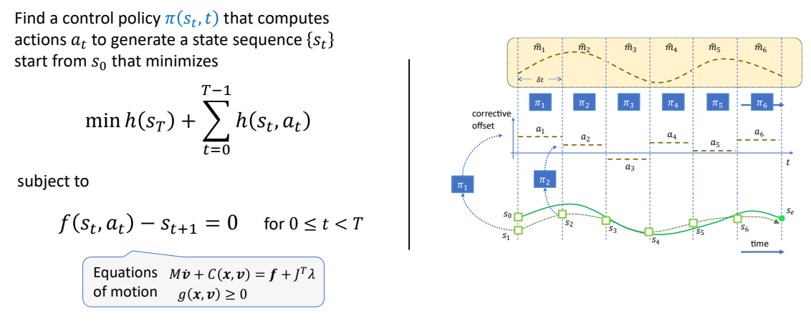  |
|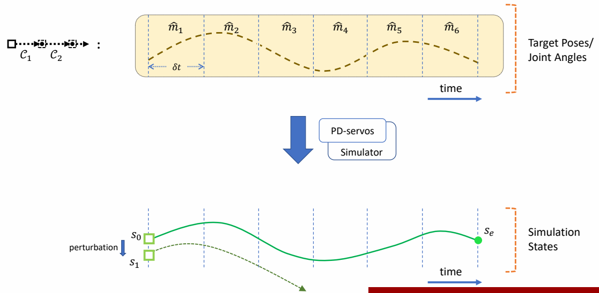|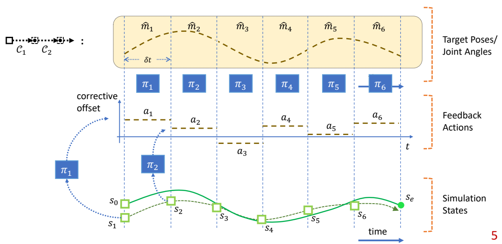 |

> &#x2705; 开环控制：只考虑初始状态。
> &#x2705; 前馈控制：考虑初始状态和干挠。
> &#x2705; 前馈控制优化的是轨迹。
> &#x2705; 反馈控制优化的是控制策略，控制策略是一个函数，根据当前状态优化轨迹。

P9

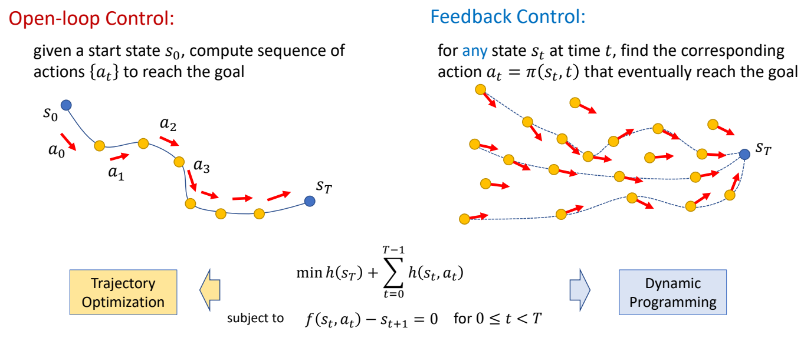

> &#x2705; Feedback 类似构造一个场，把任何状态推到目标状态。

P10
# 开环控制

## 问题描述

$$
\begin{matrix}
 \min_{x}  f(x)\\
𝑠.𝑡. g(x)=0
\end{matrix}
$$

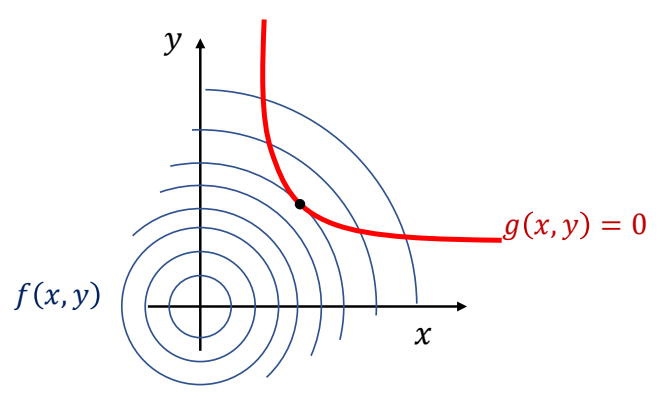

P12
## 把硬约束转化为软约束

$$
\min_{x}  f(x)+ wg(x)
$$

\(^*\) The solution \(x^\ast\)  may not satisfy the constraint

P16
## Lagrange Multiplier - 把约束条件转化为优化

> &#x2705; 拉格朗日乘子法。

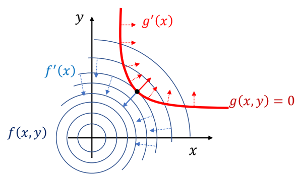

> &#x2705; 通过观察可知，极值点位于\({f}'(x)\) 与 \(g\) 的切线垂直，即 \({f}' (x)\) 与 \({g}' (x)\) 平行。（充分非必要条件。）

因此：

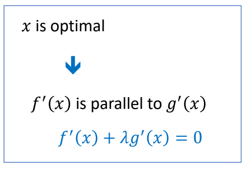

Lagrange function

$$
L(x,\lambda )=f(x)+\lambda ^Tg(x)
$$

> &#x2705; 把约束条件转化为优化。

P18
## Lagrange Multiplier

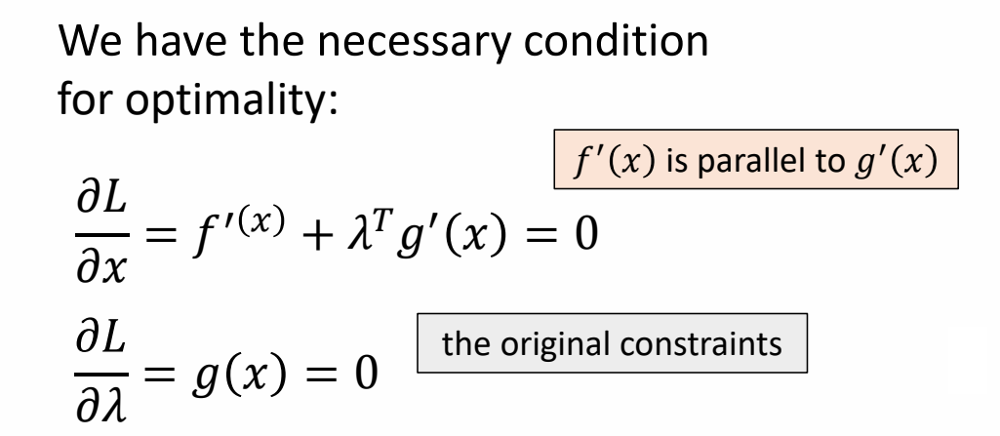

> &#x2705; 这是一个优化问题，通过梯度下降找到极值点。

P20
## Solving Trajectory Optimization Problem

### 定义带约束的优化问题

Find a control sequence {\(a_t\)} that generates a state sequence {\(s_t\)} start from \(s_o\) minimizes

$$
\min h (s_r)+\sum _{t=0}^{T-1} h(s_t,a_t)
$$

> &#x2705; 因为把时间离散化，此处用求和不用积分。

subject to

$$
\begin{matrix}
 f(s_t,a_t)-s_{t+1}=0\\
\text{ for } 0 \le t < T
\end{matrix}
$$

> &#x2705; 运动学方程，作为约束

### 转化为优化问题

The Lagrange function

$$
L(s,a,\lambda ) = h(s _ T)+ \sum _ {t=0} ^ {T-1} h(s _t,a _t) + \lambda _ {t+1}^T(f(s _t,a _t) - s _ {t+1})
$$

P27
### 求解拉格朗日方程

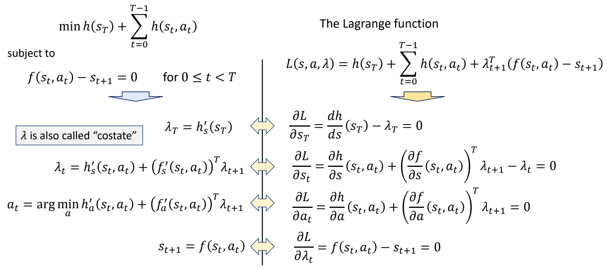

> &#x2705; 拉格朗日方程，对每个变量求导，并令导数为零。因此得到右边方程组。
> &#x2705; 右边方程组进一步整理，得到左边。
> &#x2705; \(\lambda \) 类似于逆向仿真。
> &#x2705; 公式 3：通过转为优化问题求 \(a\)．

P30
### Pontryagin's Maximum Principle for discrete systems

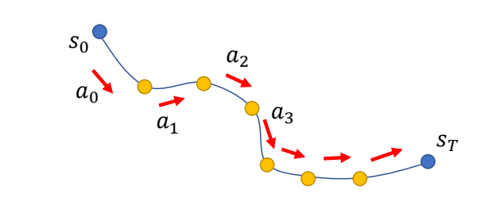

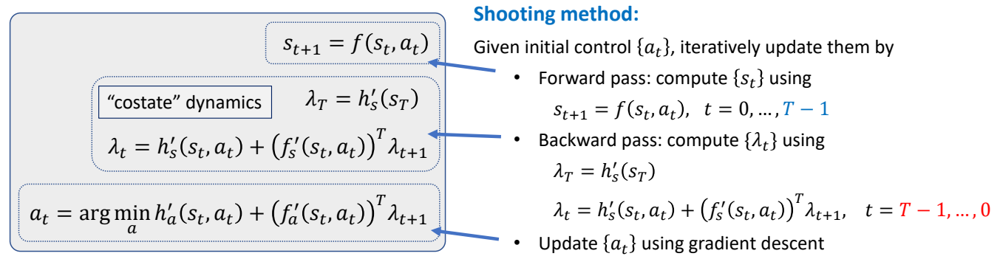

> &#x2705; 方程组整理得到左边，称为 PMP 条件。是开环控制最优的必要条件。

P32
## Optimal Control

**Open-loop Control**:
given a start state \(s_0\), compute sequence of actions {\(a_t\)} to reach the goal

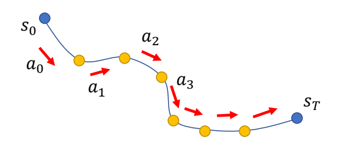

>  **Shooting method** directly applies PMP. However, it does not scale well to complicated problems such as motion control…
\( \)
Need to be combined with collocation method, multiple shooting, etc. for those problems.
\( \)
Or use derivative-free approaches.

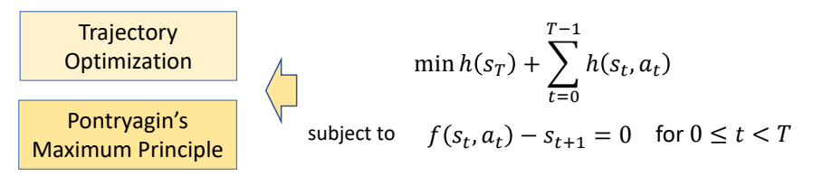

> &#x2705; 对于复杂函数，表现比较差，还需要借助其它方法。

# 闭环控制

P34
## Dynamic Programming

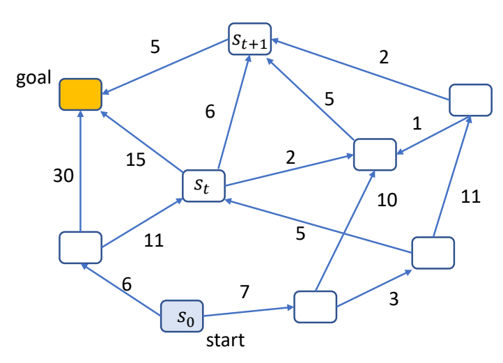

希望找到一条最短路径到达另一个点，对这个问题用不同的方式建模，会得到不同的方法：

||||
|---|---|---|
|动态规划问题|Find a path {\(s_t\)} that minimizes |\(J(s_0)=\sum _ {t=0}^{ } h(s_t,s_{t+1})\)|
|轨迹问题|Find a sequence of action {\(a_t\)} that minimizes |  \(J(s_0)=\sum _ {t=0}^{ } h(s_t,a_t)\)  subject to   \( s_{t+1}=f(s_t,a_t)\)|
|控制策略问题|Find a policy \( a_t=\pi (s_t,t)\)或 \( a_t=\pi (s_t)\)that minimizes|\(J(s_0)=\sum _ {t=0}^{ } h(s_t,a_t)\) subject to   \(s_{t+1}=f(s_t,a_t)\)

P39
## Bellman's Principle of Optimality

> &#x2705; 针对控制策略问题，什么样的策略是最优策略？

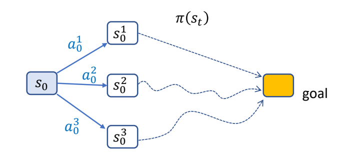

An optimal policy has the property that whatever the initial
state and initial decision are, the remaining decisions must
constitute an optimal policy with regard to the state resulting
from the first decision.

\(^*\) The problem is said to have **optimal substructure**

P40
## Value Function

Value of a state \(V(s)\) :

 - the minimal total cost for finishing the task starting from \(s\)
 - the total cost for finishing the task starting from \(s\) using the optimal policy

> &#x2705; Value Funcron，计算从某个结点到 gool 的最小代价。
> &#x2705; 后面动态规划原理跳过。

P49
## The Bellman Equation

Mathematically, an optimal **value function** \(V(s)\) can be defined recursively as:

$$
V(s)=\min_{a} (h(s,a)+V(f(s,a)))
$$

> &#x2705; h 代表 s 状态下执行一步 a 的代价。f 代表 s 状态下执行一步 a 之后的状态。

If we know this value function, the optimal **policy** can be computed as

$$
\pi (s)=\arg \min_{a} (h(s,a)+V(f(s,a)))
$$

> &#x2705; pi 代表一种策略，根据当前状态 s 找到最优的下一步 a。
> &#x2705; This arg max can be easily computed for discrete control problems.
But there are not always closed-forms solution for continuous control problems.

or

$$
\begin{matrix}
 \pi (s)=\arg \min_{a} Q(s,a)\\
\text{where} \quad \quad  Q(s,a)=h(s,a)+V(f(s,a))
\end{matrix}
$$

Q-function 称为 State-action value function
Learning \(V(s)\) and/or \(Q(s,a)\) is the core of optimal control / reinforcement learning methods
> &#x2705; 强化学习最主要的目的是学习 \(V\) 函数和 \(Q\) 函数，如果 \(a\) 是有限状态，遍历即可。但在角色动画里，\(a\) 是连续状态。

---------------------------------------
> 本文出自 CaterpillarStudyGroup，转载请注明出处。
>
> https://caterpillarstudygroup.github.io/GAMES105_mdbook/
