## 六、优化方法分类

轨迹优化方法可以从**四个维度**进行分类：

---

### 维度 1：按优化时机（输入信息）

| | **离线优化** | **在线优化** |
|------|------------|------------|
| **输入** | 仅参考轨迹 | 参考轨迹 + 当前状态 |
| **优化频率** | 一次（整条轨迹） | 每帧/实时（滚动优化） |
| **代表方法** | CMA-ES、iLQR、DDP、DeepMimic（训练） | MPC、SAMCON、DeepMimic（推理） |
| **优点** | 可预先计算、推理快 | 可应对扰动、鲁棒性强 |
| **缺点** | 无法应对扰动 | 计算成本高 |

---

### 维度 2：按求解方法

| | **解析法（闭式解）** | **数值法（迭代）** | **学习法（数据驱动）** |
|------|-------------------|-------------------|----------------------|
| **核心思想** | 公式直接求解 | 迭代优化逼近最优 | 学习策略生成轨迹 |
| **代表方法** | LQR | iLQR、DDP、CMA-ES、SQP | DeepMimic、AMP、SAC |
| **梯度需求** | N/A | 需要（一阶/二阶/零阶） | 需要/不需要 |
| **收敛速度** | 瞬时 | 慢→快（取决于方法） | 训练慢、推理快 |
| **适用系统** | 线性 | 非线性 | 任意 |
| **泛化能力** | N/A | 无（每任务一次） | 有（可处理新情况） |

---

### 维度 3：按是否需要梯度

| | **基于梯度** | **无梯度（零阶）** |
|------|------------|------------------|
| **特点** | 收敛快、需要可微模型 | 收敛慢、适用于任意问题 |
| **代表方法** | iLQR、DDP、SQP、IPOPT | CMA-ES、SAMCON |
| **适用场景** | 平滑问题、精确跟踪 | 非凸问题、接触频繁 |

---

### 维度 4：按优化变量

| | **状态优化** | **控制优化** | **同时优化** |
|------|------------|------------|------------|
| **优化变量** | 仅状态轨迹 \\((q, \dot{q})\\) | 仅控制轨迹 \\((\tau)\\) | 两者都优化 |
| **代表方法** | 运动规划 | 逆动力学 | 大多数轨迹优化方法 |
| **特点** | 简单但可能不可行 | 保证物理可行 | 最完整但计算复杂 |

---

### 完整方法对比表

| 方法 | 时机 | 求解类型 | 梯度 | 闭式解 | 适用场景 |
|------|------|---------|------|-------|---------|
| **LQR** | 离线/在线 | 解析法 | N/A | ✅ | 线性系统 |
| **iLQR** | 离线/在线 | 数值法 | 一阶 | ⚠️ 每轮闭式 | 平滑非线性问题 |
| **DDP** | 离线/在线 | 数值法 | 二阶 | ⚠️ 每轮闭式 | 高精度需求 |
| **CMA-ES** | 离线 | 数值法 | 零阶 | ❌ | 非凸/不可微问题 |
| **SAMCON** | 在线 | 数值法 | 零阶 | ❌ | 角色实时控制 |
| **MPC** | 在线 | 数值法 | 取决于求解器 | ⚠️ | 实时控制 + 约束 |
| **DeepMimic** | 离线训练 + 在线推理 | 学习法 | 一阶 | ❌ | 通用策略学习 |
| **AMP** | 离线训练 + 在线推理 | 学习法 | 一阶 | ❌ | 无标注模仿学习 |

---

### 方法选择建议

```
问题类型 → 推荐方法
─────────────────────────
线性系统 → LQR
平滑非线性 → iLQR/DDP
接触频繁/不可微 → CMA-ES
实时控制 → MPC/SAMCON
需要泛化 → DeepMimic/AMP
离线制作动作 → iLQR/DDP/CMA-ES
```

---

## 七、常用优化方法详解

### 1. CMA-ES（Covariance Matrix Adaptation Evolution Strategy）

**核心思想**：进化策略，通过采样和选择迭代优化。

| 特点 | 说明 |
|------|------|
| **优点** | 无需梯度、适用于非凸问题 |
| **缺点** | 样本效率低、收敛慢 |
| **适用** | 低维问题、目标函数不平滑 |

---

### 2. SAMCON（Sampled Model Predictive Control）

**核心思想**：采样模型预测控制，结合 CMA-ES 和 MPC。

| 特点 | 说明 |
|------|------|
| **优点** | 适用于角色控制、可处理复杂约束 |
| **缺点** | 需要大量采样 |
| **适用** | 轨迹跟踪、平衡控制 |

---

### 3. iLQR（Iterative Linear Quadratic Regulator）

**核心思想**：迭代线性化 + LQR 求解。

| 特点 | 说明 |
|------|------|
| **优点** | 收敛快、适用于平滑问题 |
| **缺点** | 需要可微模型、可能陷入局部最优 |
| **适用** | 轨迹优化、局部修正 |

---

### 4. DDP（Differential Dynamic Programming）

**核心思想**：基于二阶泰勒展开的动态规划。

| 特点 | 说明 |
|------|------|
| **优点** | 二阶收敛、精度高 |
| **缺点** | 计算复杂、需要二阶导数 |
| **适用** | 高精度轨迹优化 |

---

### 5. 数值优化方法对比

| 方法 | 梯度需求 | 适用维度 | 收敛速度 | 适用于角色 |
|------|---------|---------|---------|-----------|
| **CMA-ES** | 无需 | 低维 | 慢 | ✅ 简单动作 |
| **SAMCON** | 无需 | 中维 | 中 | ✅ 常用 |
| **iLQR** | 一阶 | 高维 | 快 | ✅ 常用 |
| **DDP** | 二阶 | 高维 | 很快 | ⚠️ 计算复杂 |

---

## 八、与 DeepMimic/AMP 的关系

| 维度 | 轨迹优化 | DeepMimic/AMP |
|------|---------|---------------|
| **输出** | 单一轨迹 \\(\mathbf{x}_{0:T}\\) | 策略 \\(\pi(\mathbf{a}|\mathbf{s})\\) |
| **计算时机** | 离线优化（每任务一次） | 训练一次，在线推理 |
| **泛化能力** | 无（仅适用于该轨迹） | 有（可处理新情况） |
| **计算成本** | 高（分钟级） | 低（毫秒级推理） |
| **适用场景** | 特定动作生成 | 通用角色控制 |

**关系**：
- 轨迹优化结果可作为 RL 的参考轨迹
- RL 可学习模仿轨迹优化的行为

---

## 九、关键要点总结

1. **优化变量**：状态轨迹 \\(\mathbf{x}_{0:T}\\) + 控制轨迹 \\(\mathbf{u}_{0:T-1}\\)

2. **目标函数**：
   - 终端代价 \\(J_T(\mathbf{x}_T)\\)
   - 运行代价 \\(\sum J_t(\mathbf{x}_t, \mathbf{u}_t)\\)
   - 常见项：跟踪误差、控制 effort、平滑项

3. **约束条件**：
   - 动力学约束（运动方程）
   - 接触约束（不穿透、摩擦锥）
   - 控制/状态限制

4. **优化方法分类**：
   - 按优化时机：离线优化 vs. 在线优化
   - 按求解方法：解析法 (LQR) vs. 数值法 (iLQR/DDP/CMA-ES) vs. 学习法 (DeepMimic/AMP)
   - 按梯度需求：基于梯度 (iLQR/DDP) vs. 无梯度 (CMA-ES/SAMCON)
   - 按优化变量：状态优化 vs. 控制优化 vs. 同时优化

5. **方法选择建议**：
   - 线性系统 → LQR
   - 平滑非线性 → iLQR/DDP
   - 接触频繁/不可微 → CMA-ES
   - 实时控制 → MPC/SAMCON
   - 需要泛化 → DeepMimic/AMP

---

> 📚 **深入学习**：
> - [轨迹优化主页面](Tracking.md) - 轨迹优化的整体介绍
> - [简单例子](SimpleCase.md) - 轨迹优化的实际应用
> - [欠驱动系统问题](../PDControl/UnderactuatedSystem.md) - 轨迹优化要解决的问题之一
> - [稳态误差问题](../PDControl/SteadyStateError.md) - 轨迹优化的动机之一


P3
## Recap

|feedforward|feedback|
|---|---|
|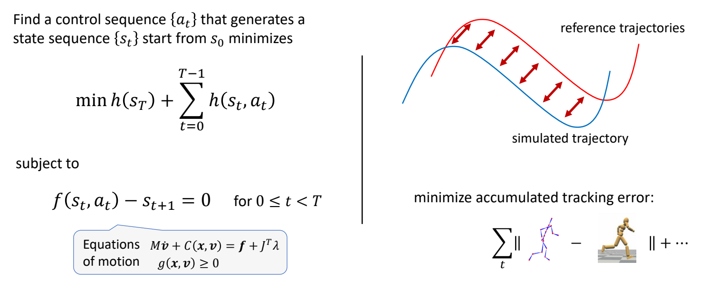|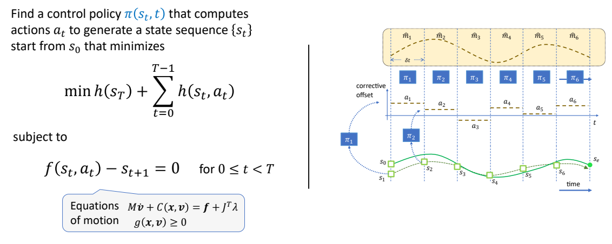  |
|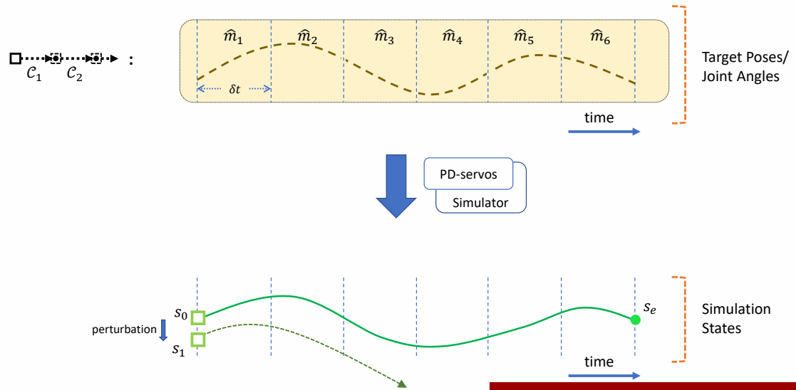|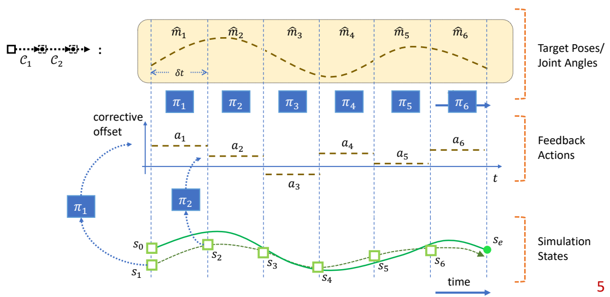 |

> &#x2705; 开环控制：只考虑初始状态。
> &#x2705; 前馈控制：考虑初始状态和干挠。
> &#x2705; 前馈控制优化的是轨迹。
> &#x2705; 反馈控制优化的是控制策略，控制策略是一个函数，根据当前状态优化轨迹。

P9

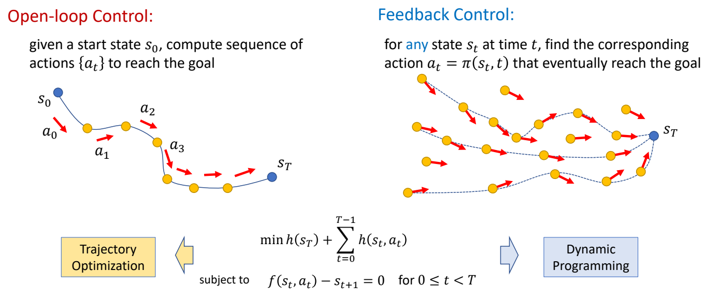

> &#x2705; Feedback 类似构造一个场，把任何状态推到目标状态。


P10
# 开环控制

## 问题描述

$$
\begin{matrix}
 \min_{x}  f(x)\\
𝑠.𝑡. g(x)=0
\end{matrix}
$$

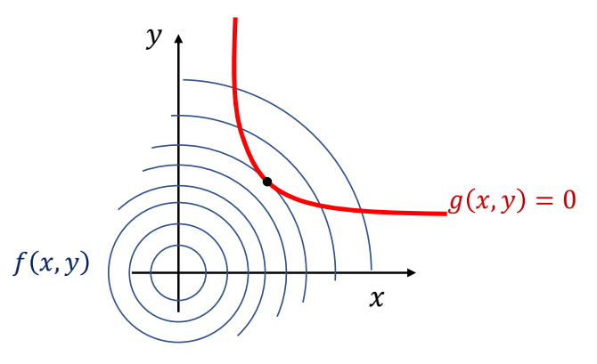


P12
## 把硬约束转化为软约束

$$
\min_{x}  f(x)+ wg(x)
$$

\(^*\) The solution \(x^\ast\)  may not satisfy the constraint


P16
## Lagrange Multiplier - 把约束条件转化为优化

> &#x2705; 拉格朗日乘子法。

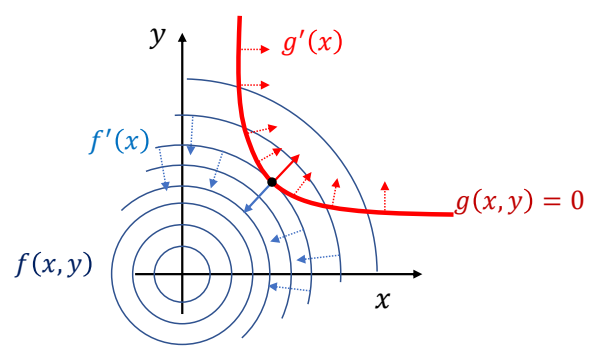

> &#x2705; 通过观察可知，极值点位于\({f}'(x)\) 与 \(g\) 的切线垂直，即 \({f}' (x)\) 与 \({g}' (x)\) 平行。（充分非必要条件。）

因此：

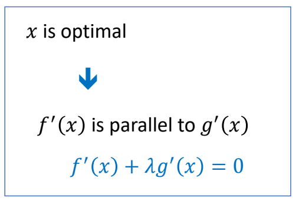

Lagrange function

$$
L(x,\lambda )=f(x)+\lambda ^Tg(x)
$$

> &#x2705; 把约束条件转化为优化。

P18
## Lagrange Multiplier

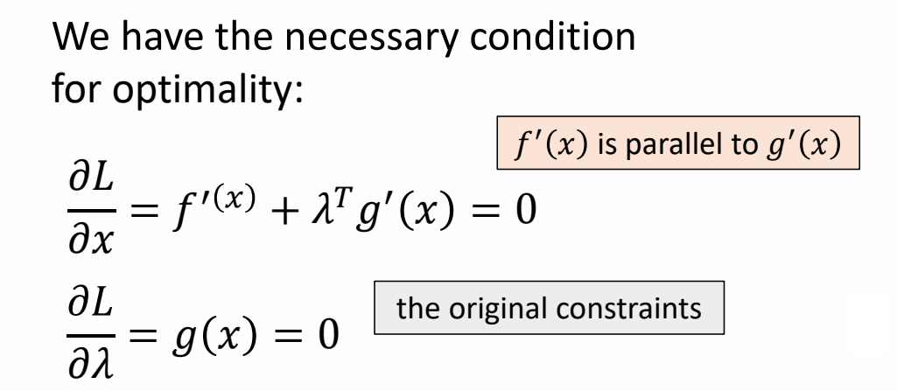

> &#x2705; 这是一个优化问题，通过梯度下降找到极值点。


P20
## Solving Trajectory Optimization Problem

### 定义带约束的优化问题

Find a control sequence {\(a_t\)} that generates a state sequence {\(s_t\)} start from \(s_o\) minimizes

$$
\min h (s_r)+\sum _{t=0}^{T-1} h(s_t,a_t)
$$

> &#x2705; 因为把时间离散化，此处用求和不用积分。

subject to

$$
\begin{matrix}
 f(s_t,a_t)-s_{t+1}=0\\
\text{ for } 0 \le t < T
\end{matrix}
$$

> &#x2705; 运动学方程，作为约束

### 转化为优化问题

The Lagrange function

$$
L(s,a,\lambda ) = h(s _ T)+ \sum _ {t=0} ^ {T-1} h(s _t,a _t) + \lambda _ {t+1}^T(f(s _t,a _t) - s _ {t+1})
$$


P27
### 求解拉格朗日方程


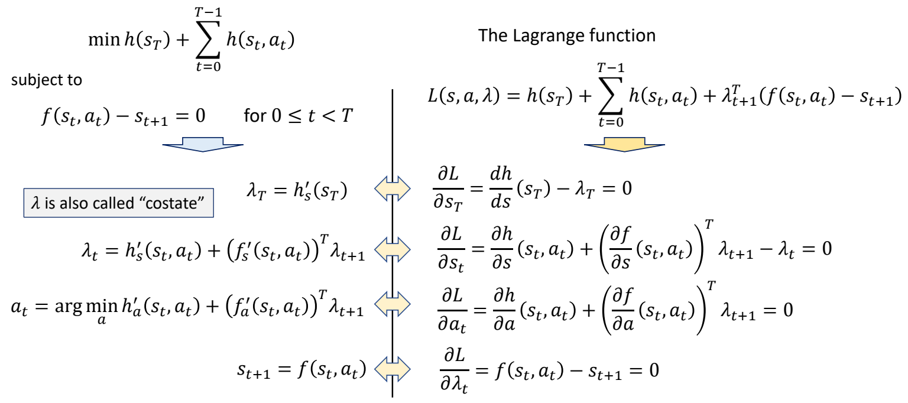


> &#x2705; 拉格朗日方程，对每个变量求导，并令导数为零。因此得到右边方程组。
> &#x2705; 右边方程组进一步整理，得到左边。
> &#x2705; \(\lambda \) 类似于逆向仿真。
> &#x2705; 公式 3：通过转为优化问题求 \(a\)．

P30
### Pontryagin's Maximum Principle for discrete systems


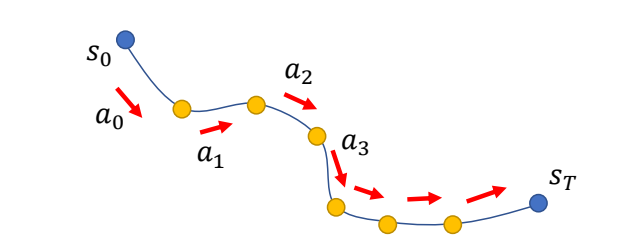

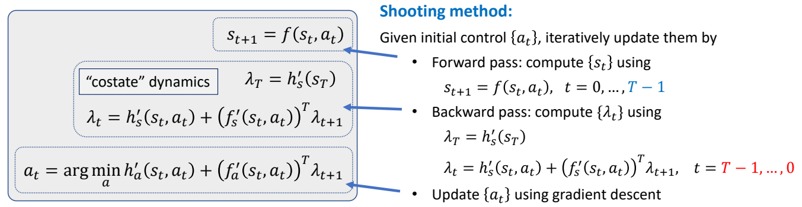


> &#x2705; 方程组整理得到左边，称为 PMP 条件。是开环控制最优的必要条件。


P32
## Optimal Control

**Open-loop Control**:
given a start state \(s_0\), compute sequence of actions {\(a_t\)} to reach the goal


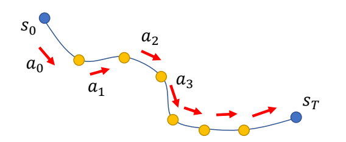

>  **Shooting method** directly applies PMP. However, it does not scale well to complicated problems such as motion control…
\(<br>\)
Need to be combined with collocation method, multiple shooting, etc. for those problems.
\(<br>\)
Or use derivative-free approaches.

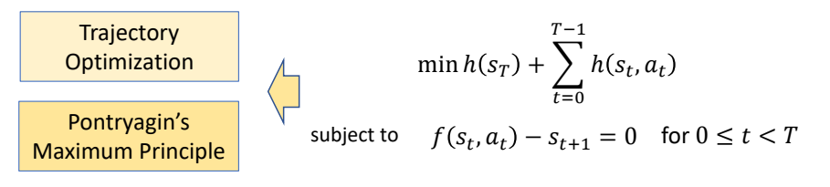


> &#x2705; 对于复杂函数，表现比较差，还需要借助其它方法。

# 闭环控制


P34
## Dynamic Programming

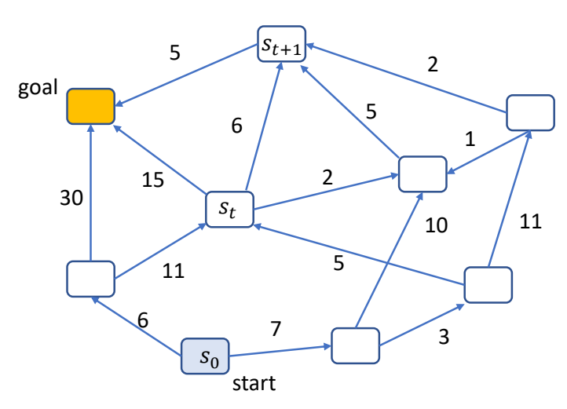

希望找到一条最短路径到达另一个点，

P39
## Bellman's Principle of Optimality

> &#x2705; 针对控制策略问题，什么样的策略是最优策略？

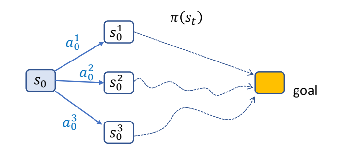

An optimal policy has the property that whatever the initial
state and initial decision are, the remaining decisions must
constitute an optimal policy with regard to the state resulting
from the first decision.

\(^*\) The problem is said to have **optimal substructure**


P40
## Value Function

Value of a state \(V(s)\) :

 - the minimal total cost for finishing the task starting from \(s\)
 - the total cost for finishing the task starting from \(s\) using the optimal policy


> &#x2705; Value Funcron，计算从某个结点到 gool 的最小代价。
> &#x2705; 后面动态规划原理跳过。


P49
## The Bellman Equation

Mathematically, an optimal **value function** \(V(s)\) can be defined recursively as:

$$
V(s)=\min_{a} (h(s,a)+V(f(s,a)))
$$

> &#x2705; h 代表 s 状态下执行一步 a 的代价。f 代表 s 状态下执行一步 a 之后的状态。

If we know this value function, the optimal **policy** can be computed as

$$
\pi (s)=\arg \min_{a} (h(s,a)+V(f(s,a)))
$$

> &#x2705; pi 代表一种策略，根据当前状态 s 找到最优的下一步 a。
> &#x2705; This arg max can be easily computed for discrete control problems.
But there are not always closed-forms solution for continuous control problems.

or

$$
\begin{matrix}
 \pi (s)=\arg \min_{a} Q(s,a)\\
\text{where} \quad \quad  Q(s,a)=h(s,a)+V(f(s,a))
\end{matrix}
$$


Q-function 称为 State-action value function
Learning \(V(s)\) and/or \(Q(s,a)\) is the core of optimal control / reinforcement learning methods
> &#x2705; 强化学习最主要的目的是学习 \(V\) 函数和 \(Q\) 函数，如果 \(a\) 是有限状态，遍历即可。但在角色动画里，\(a\) 是连续状态。


---------------------------------------
> 本文出自 CaterpillarStudyGroup，转载请注明出处。
>
> https://caterpillarstudygroup.github.io/GAMES105_mdbook/
