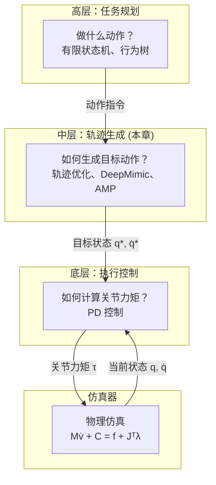
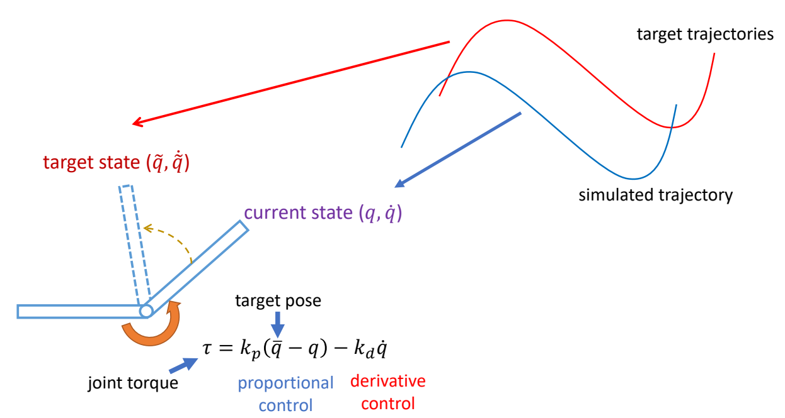

# 轨迹优化

> &#x2705; **本章定位**：理解如何通过优化方法生成**物理可行的目标轨迹**，供 PD 控制器跟踪。

---

## 在控制系统中的位置

**轨迹优化的输入输出**：
- **输入**：参考动作（如动捕数据）+ 当前状态
- **输出**：修正后的目标轨迹 \\(q^*, \dot{q}^*\\) → 送入 PD 控制器

**与 PD 控制的关系**：
- 轨迹优化输出"修正后的目标轨迹" \\(q^*\\)
- PD 控制跟踪这个目标轨迹

---

## 轨迹优化的输入来源

轨迹优化需要**参考轨迹**作为输入，参考轨迹主要有三类来源：

| 输入来源 | 说明 | 特点 |
|---------|------|------|
| **动作捕捉（Mocap）** | 从真实演员捕捉的运动数据 | 真实自然，但可能物理不可行 |
| **运动学方法生成** | Motion Matching、PFNN、扩散模型等 | 数据驱动、实时生成，但无物理约束 |
| **动画师制作** | 手工关键帧动画 | 艺术可控，但耗时、可能不符合物理 |

**轨迹优化的作用**：
- 对上述输入进行**物理修正**
- 使其满足动力学约束（运动方程、接触约束等）
- 输出**物理可行的目标轨迹**供 PD 控制跟踪

> &#x2705; **本章聚焦轨迹优化**：理解如何通过优化方法对参考轨迹进行物理修正。

## 为什么需要轨迹优化

直接用 PD 控制跟踪动捕数据会有很大问题：

| 问题 | 原因 | 表现 |
|------|------|------|
| **稳态误差** | PD 控制需要误差才能产生力矩 | 动作滞后于参考轨迹 |
| **相位漂移** | 运动轨迹与原轨迹之间存在相位差 | 动作节奏不匹配 |
| **欠驱动问题** | 人形角色缺少对根节点的直接控制 | 质心位置无法直接控制 |

> &#x2705; **深入学习**：[欠驱动系统问题](../PDControl/UnderactuatedSystem.md) - 详细讲解欠驱动系统的挑战和解决方案。

**轨迹优化的作用**：
- 在 mocap 基础上添加修正量，使其物理可行
- 引入轨迹优化之后，控制本质上变成了设计 target state

P30
## 轨迹优化的问题描述

> &#x1F50E; [Witkin and Kass 1988 – Spacetime constraints]   

> &#x2705; 轨迹优化的问题描述：   

Find the trajectories:   

$$
\begin{align*}
 \text{Simulation trajectory } & : S_0,S_1,\dots ,S_T \\\\
 \text{Control trajectory } & : a_0,a_1,\dots ,a_{T-1}
\end{align*}
$$

> &#x2705; \\(S\\)：每一个时刻，角色的状态，包括位置、速度、朝向等。   
> &#x2705; \\(a\\)：目标轨迹。   
> &#x2705; 优化出 \\(S\\) 和 \\(a\\)，根据 \\(S\\) 和 \\(a\\) 得到关节力矩，关节力矩再控制角色。   

that minimize the objective function   

$$
\min_{(S_t,a_t)} f(S_T)+\sum_{t=0}^{T-1} f(S_t,a_t)
$$

> &#x2705; 目标函数第一项：关于轨迹结束时刻的状态。   
> &#x2705; 第二项：关于每一时刻的状态。    

and satisfy the constraints:   

$$
\begin{align*}
M\dot{v}+C(x,v)   & =f+J^T\lambda & \text{Equations of motion} \\\\
 g(x,v) & \ge 0 & \text{constraints } \quad \quad\quad
\end{align*}
$$

> &#x2705; 约束第一项：运动学方程。   
> &#x2705; 第二项：根据场景特殊定义的约束。  

 
