P2   
# Outline  

 - Learning-based Character Animation (cont.)   
    - Motion Models   
    - Autoregressive models: PFNN   
    - Generative models   

P4   
# Learning Motion Models  

## 问题的数学建模

\\(p(x)\\): probability that 𝒙 is a natural motion     

由于 \\(p(x)\\) 无法由计算得出，所以从数据去学。数据即 a set of example motions {\\(x_i\\)}∼ \\(p(x)\\) 

P5   
### 数学模型1

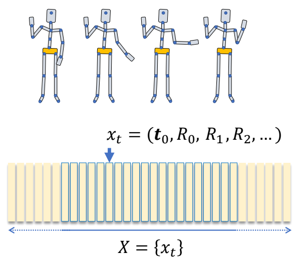   

> &#x2705; 一个pose可以用每个关节的位置表示，也可以用每个关节的旋转表示。如果用位置约束，最后需要通过IK变成旋转的约束。如果用旋转约束，就难以做到需要约束位置的效果。    
> &#x2705; P(X)判断整个序列所有pose的联合分布是否合理。  

P7   
### 数学模型2

$$
p(X\mid z)=p(x_1,\dots ,x_T\mid z)
$$

$$
\begin{align*}
 𝑧: & \text{ control parameters} \\\\
  & \text{ latent variables} \\\\
  & …… 
\end{align*}
$$

> &#x2705; 对动作序列的要求，除了动作合理，还要符合用户期待，用户要求可以是显式的，例如往左走；也可以是隐式的，例如以老人的风格走。\\(z\\) 代表用户条件。   
> &#x2705; P(X|z)判断在条件z下整个序列所有pose的联合分布是否合理。  

P8   

$$
(x_1,\dots ,x_T)=f(z)
$$

$$
\begin{align*}
 𝑧: & \text{ control parameters} \\\\
  & \text{ latent variables} \\\\
  & …… 
\end{align*}
$$

> &#x2705; 如果概率分布是正确的，基于这个分布采样能得到一个合理的动作，且满足前提条件。   

P14   
### 数学模型3

$$
p(X\mid z)=p(x_1,\dots ,x_T\mid z)
$$

$$
=p(x_1)\prod_{t}^{} p(x_t\mid x_{t-1},\dots ,x_1;z)
$$

\\(^\ast \\) The chain rule of conditional probabilities:   

$$
\begin{align*}
 p(x_1,x_2,x_3) & = p(x_2,x_3 \mid x_1)p(x_1) \\\\
   & = p(x_3 \mid x_2, x_1)p( x_2 \mid x_1)p(x_1)
\end{align*}
$$

> &#x2705; 序列合理 ＝ 已知序列中的前 \\(t-1\\) 帧时第 \\(t\\) 帧应当合理。  

P15  
采样过程为：

$$
x_t=f(x_{t-1},x_{t-2},\dots x_1;z)
$$

P17   
### 数学模型4

> &#x2705; 假设动作具有Markov 性（无记忆性） 

$$
x_t=f(x_{t-1};z)
$$

Markov Property   

 
> &#x2705; \\(x_t\\) 只受 \\(x_{t-1}\\) 影响，与 \\(t-1\\) 之前的动作无关。    

P18   
### Two Perspectives on a Motion Sequence

|数学模型3|数学模型4|
|---|---|
|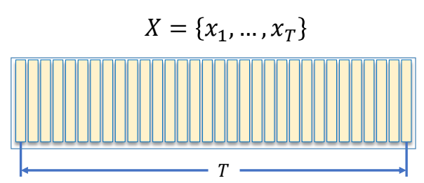 |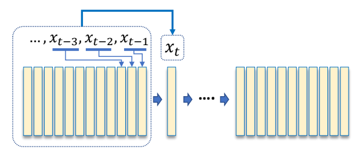 |
|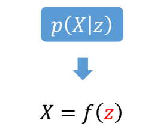 |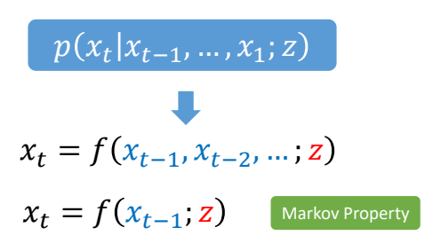 |
|&#x2705; 无交互无实时通常用前者|&#x2705; 游戏里面通常用后者|
|&#x2705; 左：直接生成所有动作。|&#x2705; 右：一帧一帧地生成。   |
||&#x2705; 右无法考虑未来，不能根据将要发生的事情调整当前的动作。（自回归）| 

P25   

## 数学模型

$$
x_t=f(x_{t-1})
$$

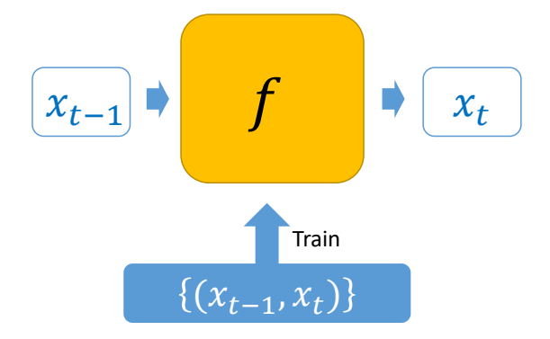   

> &#x2705; 由于只和上一帧相关，二元组 \\(（x_{t-1}，x_t）\\) 构成了一个数据，希望从里面学到一些信息。   
> &#x2705; Neural Network 相关部分跳过。  
> &#x2705; 当前先不考虑 \\(z\\)    
> &#x2705; 可以把它当作优化问题来解。  

P40   
## Ambiguity Issue   

$$
x_t=f(x_{t-1})
$$

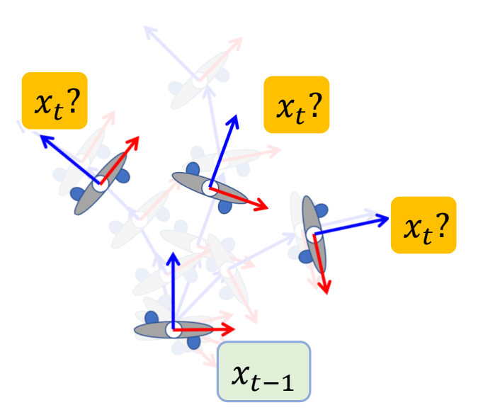   

> &#x2705; 但是 \\(x_t\\) 和 \\(x_{t-1}\\) 的关系是有歧义性的，最后学到一个平均的 \\(x_t\\).   
> &#x2705; 因为\\(x_{t-1}\\)与\\(x_t\\)不是一对一的mapping关系。  

P41   
## Hidden Variables

$$
x_t=f(x_{t-1};z)
$$

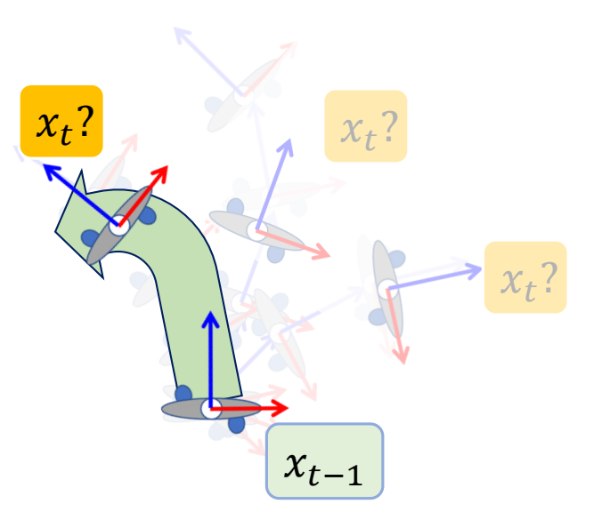    

> &#x2705; 需要加入一个额外的变量，可以来自用户输入或先验信息。关键是怎么找到 \\(z\\)，使学习比较有效。   

|ID|Year|Name|Note|Tags|Link|
|---|---|---|---|---|---|
|113|2017| Phasefunctioned neural networks for character control|PFNN||[link](https://caterpillarstudygroup.github.io/ReadPapers/113.html)|

P55   
### 相关工作

|||
|---|---|
|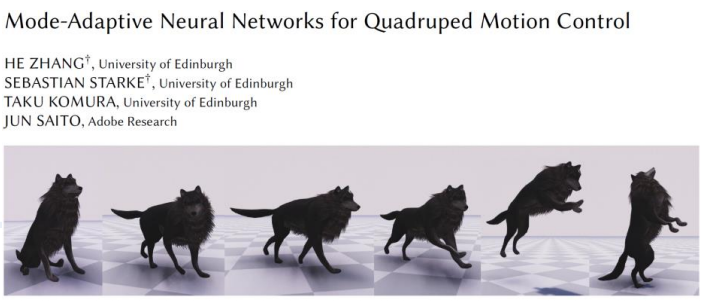  | *SIGGRAPH 2018   &#x2705; 论文一：除角色姿态，还考虑脚的速度。|
| 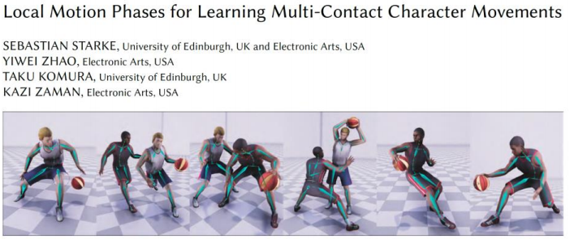  | *SIGGRAPH 2020   &#x2705; 论文二：把两个脚拆开，并考虑手，分别定义相位函数。|
| 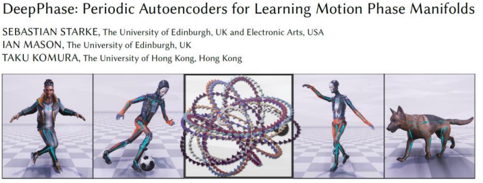  | *SIGGRAPH 2022   &#x2705; 论文三：从数据中自动学到相位函数的组合。|

P57  
# Generative Models

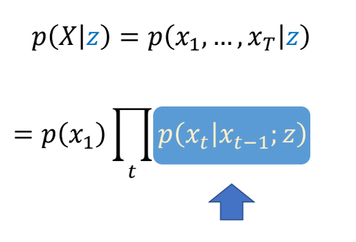   

> &#x2705; 不学两帧关系，而是直接学概率密度函数。   
> &#x2705; 难点：(1) 真实 PDF 可能非常复杂 (2) 从一个 PDF 中采样也很难。   
> &#x2705; PDF 的作用是判断动作是不是真的。   

P60   
## 常见套路

||||
|--|--|---|
|Generative Models|&#x2705; 一般生成式模型是这样的形式：从一个简单的 PDF，通过 \\(f(z)\\)，映射到 \\(p(x)\\).   &#x2705; 关键是 \\(f(z)\\) 要学好。|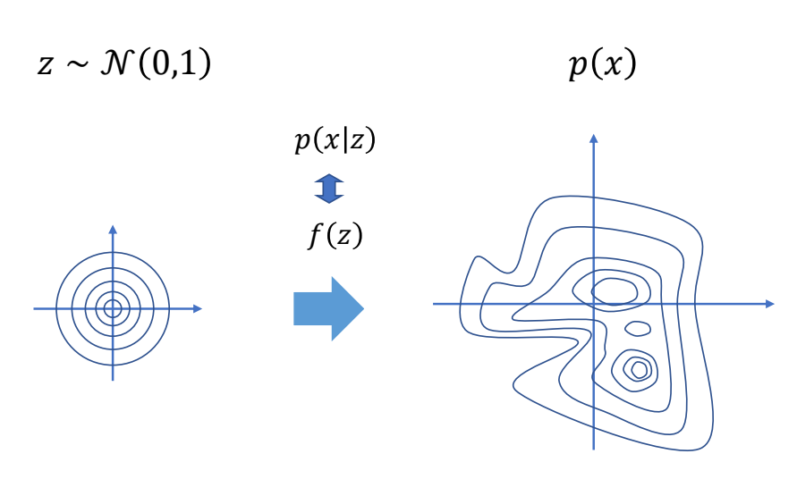   |
| Variational Autoencoders |&#x2705; VAE：已知一些真实数据采样，用 Encoder 编码到简单分布上的点，再用Decoder 变回原分布上的点。  &#x2705; control VAE 是 VAE＋控制＋物理仿真 |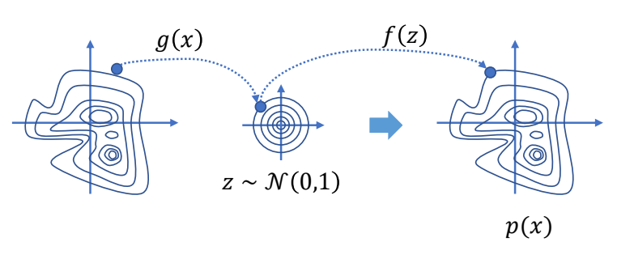   |
| Generative Adversarial Network |&#x2705; GAN：无 Encoder，增加一个判别器。   &#x2705; ASE、AMP 是 GAN 的控制版本。   &#x2705; RL 不结合物理难以 work，因为难以定义 reward.     |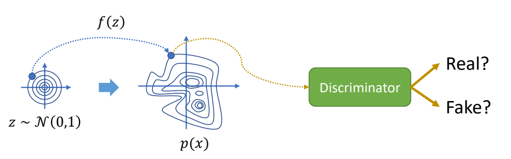 |
| Normalizing Flows |&#x2705; 标准化流：类似 VAE，使用一个可逆函数。   |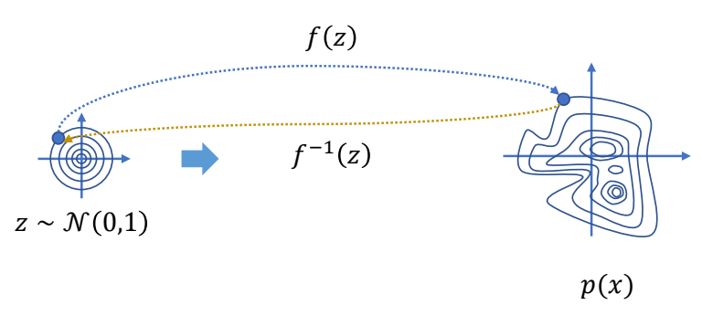   |
| Diffusion Models  |&#x2705; 扩散模型：多次编码与解码。    &#x2705; 一个动作序列相当于隐空间里的一条轨迹。 |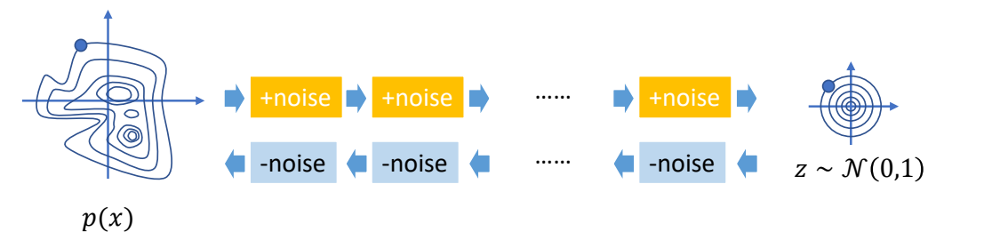   |

P62  
## 相关工作

见https://caterpillarstudygroup.github.io/ImportantArticles/index.html

|||
|---|---|
|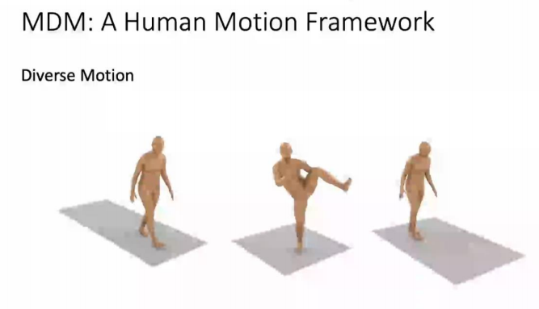|[Tevet et al. 2022, **arXiv**, MDM: Human Motion **Diffusion Model**]| 

---------------------------------------
> 本文出自CaterpillarStudyGroup，转载请注明出处。
>
> https://caterpillarstudygroup.github.io/GAMES105_mdbook/